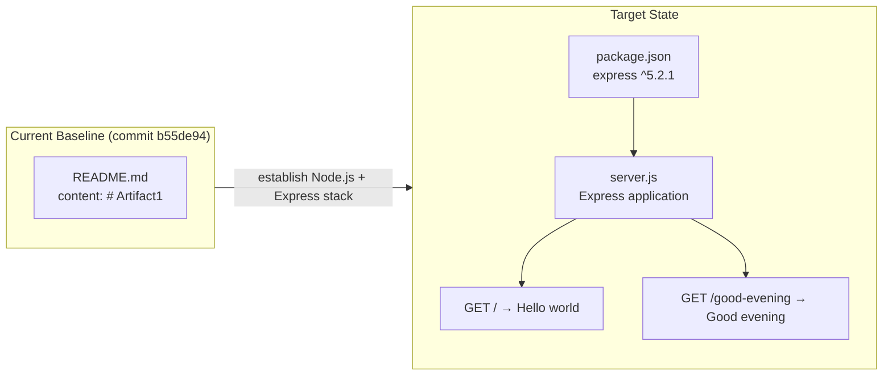
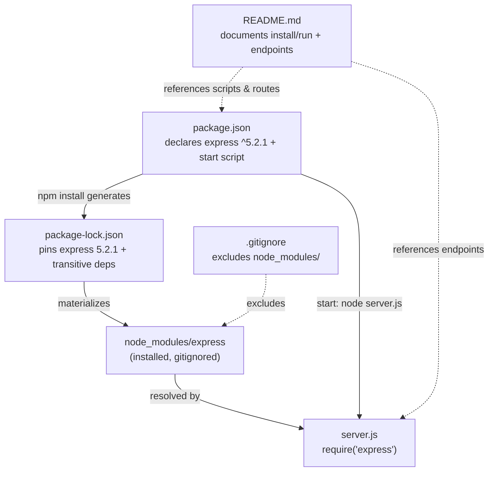

# Technical Specification

# 0. Agent Action Plan

## 0.1 Intent Clarification

This subsection captures the user's request in precise technical terms and reconciles it with the verified state of the repository. The original request is preserved verbatim below:

> **User Request:** "add feature to a existing product\
> this is a tutorial of node js server hosting one endpoint that returns the response 'Hello world'. Could you add expressjs into the project and add another endpoint that return the reponse of 'Good evening'?"

### 0.1.1 Core Refactoring Objective

Based on the prompt, the Blitzy platform understands that the refactoring objective is to **introduce the Express.js web framework into the project and add a second HTTP endpoint that returns the plain-text response `Good evening`**, extending a tutorial-style Node.js server that the user describes as already serving a single `Hello world` endpoint.

A decisive reconciliation is required before implementation. The repository does **not** contain the "existing" Node.js server the prompt presumes. Exhaustive inspection confirms a greenfield baseline: the repository root contains only `README.md`, whose entire content is the single line `# Artifact1` [README.md:L1]. No package manifest, no source files, and no web framework are present — corroborated by Technical Specification Section 1.4 (Repository Baseline State) and Section 3.4, which records that "No application frameworks have been committed to the repository at commit `b55de94`." Consequently, the objective resolves to **creating, from scratch, a minimal Express.js Node.js server that hosts both endpoints** — the `Hello world` route (the baseline the user described, now implemented on Express) and the new `Good evening` route.

| Attribute | Determination |
|-----------|---------------|
| Refactoring type | Tech-stack establishment / framework adoption (Express.js). The pattern the user envisions — native Node `http` → Express — collapses into a from-scratch Express implementation because no prior server exists. |
| Target repository | Same repository (`Artifact1`); not a new-repository migration. |
| Source baseline | Greenfield — a single `README.md` containing `# Artifact1` [README.md:L1]. |
| Net file operations | 4 × CREATE, 1 × UPDATE (detailed in Section 0.4). |

The objective decomposes into the following goals, each stated with implementation-level clarity:

- Scaffold the Node.js project by introducing a `package.json` manifest, a generated `package-lock.json` lockfile, and a `.gitignore`.
- Add Express.js (`^5.2.1`) as the project's sole direct runtime dependency.
- Implement an Express application that serves `GET /` returning the exact response `Hello world`.
- Add a second route, `GET /good-evening`, returning the exact response `Good evening`.
- Bootstrap an HTTP listener bound to `process.env.PORT || 3000`.
- Replace the `README.md` placeholder [README.md:L1] with installation, run, and endpoint-usage documentation.

The following implicit requirements and assumptions are surfaced because they are necessary for a correct, runnable result even though the prompt does not state them explicitly:

- The exact response strings `Hello world` and `Good evening` must be preserved verbatim and served as plain text.
- The `Hello world` endpoint is mapped to the root path `GET /`, the conventional tutorial default.
- **Ambiguity flagged for confirmation:** the prompt specifies the new response text but not its route path. This plan assumes `GET /good-evening`; reasonable alternatives include `/goodevening`, `/evening`, or `/greeting/evening`.
- The listening port is configurable via `process.env.PORT`, defaulting to `3000`.
- No persistence, authentication, or user interface is implied or in scope.

Acceptance criteria that define a complete implementation:

- `npm install` succeeds and installs `express@^5.2.1`.
- `npm start` boots the server and logs the active port.
- `GET /` returns HTTP 200 with body `Hello world`.
- `GET /good-evening` returns HTTP 200 with body `Good evening`.
- `package.json` declares the `express` dependency and a `start` script; `README.md` documents both endpoints and the run procedure.

### 0.1.2 Technical Interpretation

This refactoring translates to the following technical transformation strategy: move the project from an empty, framework-less placeholder to a minimal but idiomatic Express.js HTTP service. Because there is no native `http`-module server to rewrite, the "migration" is realized as a clean Express implementation that nonetheless honors the user's mental model — a tutorial server that answers `Hello world`, now extended with `Good evening`.



The transformation is governed by these rules:

- Establish the dependency manifest (`package.json`) before authoring runtime code so that `express` resolves deterministically through `package-lock.json`.
- Compose the server around a single Express application instance (`const app = express()`), registering one route handler per endpoint.
- Return responses with `res.send('...')`; where strict `text/plain` typing is desired, pair it with `res.type('text/plain')`.
- Centralize the listening port behind `process.env.PORT || 3000`.
- Keep the canonical implementation in a single `server.js` to match the tutorial's simplicity, while documenting an optional modular layout (Section 0.3) as the future-growth path.

## 0.2 Scope Boundaries

This subsection draws an exhaustive boundary around the work. Because the baseline is greenfield [README.md:L1], the file set is small and fully enumerable; explicit paths are used in preference to wildcards.

### 0.2.1 Exhaustively In Scope

Every authored artifact is a `CREATE` operation except `README.md`, which is an `UPDATE` of the existing placeholder.

| In-Scope Path | Operation | Purpose |
|---------------|-----------|---------|
| `package.json` | CREATE | Project manifest: name, version, description, `main` = `server.js`, `scripts.start` = `node server.js`, `dependencies.express` = `^5.2.1`, `engines.node` = `>=18`. |
| `package-lock.json` | CREATE | npm lockfile generated by `npm install`; pins `express@5.2.1` and its transitive dependency tree. |
| `.gitignore` | CREATE | Excludes `node_modules/`, `*.log`, and `.env` from version control. |
| `server.js` | CREATE | Express entry point: `require('express')`, instantiate `app`, register `GET /` → `Hello world` and `GET /good-evening` → `Good evening`, and call `app.listen(process.env.PORT || 3000)`. |
| `README.md` | UPDATE | Replace the `# Artifact1` stub [README.md:L1] with project title, description, prerequisites, install/run instructions, and an endpoint reference table. |

Source-transformation, test, configuration, documentation, and import-correction categories from the standard refactoring template resolve as follows for this project:

- **Source transformations** — `server.js` (the only application source file).
- **Configuration** — `package.json`, `package-lock.json`, `.gitignore`.
- **Documentation** — `README.md`.
- **Test updates** — none (no tests requested; see Out of Scope).
- **Import corrections** — none (no pre-existing source contains import statements to rewrite; the single `require('express')` is net-new).
- **Rule-mandated files** — none. The Rules Analysis returned an empty rule set, so no migration scripts, configuration files, or fixtures are mandated by coding guidelines.

A generated artifact that is explicitly **not authored** by hand:

- `node_modules/**` — materialized by `npm install`, version-controlled via `package-lock.json`, and excluded by `.gitignore`. It is never hand-edited.

### 0.2.2 Explicitly Out of Scope

The user requested no exclusions explicitly; the following are out of scope by virtue of the minimal tutorial objective and the empty rule set. Each is listed to prevent scope creep.

- `node_modules/**` — generated dependency tree (installed, not authored).
- Test suites and frameworks (e.g., Jest, Mocha, Supertest) — no tests were requested.
- Persistence / database layer and ORM — no data domain in the request.
- Authentication and authorization — not implied by either endpoint.
- User interface, templating, static assets, and CSS — backend HTTP service only.
- CI/CD pipelines (`.github/workflows/*`), `Dockerfile`, and container/orchestration manifests.
- TypeScript migration, transpilation, and bundler tooling — the deliverable is plain JavaScript.
- `.env` files, external configuration services, and logging frameworks.
- Deployment and hosting configuration.
- Any HTTP route beyond the two specified (`GET /` → `Hello world`, `GET /good-evening` → `Good evening`).

## 0.3 Target Design

This subsection defines the concrete target structure, the research that grounds it, the design patterns applied, and the (non-)applicability of UI design.

### 0.3.1 Refactored Structure Planning

The canonical target is intentionally minimal to match the tutorial framing while remaining idiomatic Express. Every file required for standalone operation is listed explicitly.

```text
Artifact1/                     (repository root)
├── .gitignore                 (CREATE)  node_modules/, *.log, .env
├── README.md                  (UPDATE)  title, description, prerequisites, install, run, endpoint table
├── package.json               (CREATE)  manifest; express ^5.2.1; start script; engines node >=18
├── package-lock.json          (CREATE)  generated lockfile pinning express 5.2.1 + transitive deps
├── server.js                  (CREATE)  Express app: GET / and GET /good-evening; app.listen(PORT)
└── node_modules/              (GENERATED, gitignored — not authored)
```

An **optional modular variant** is documented as the scalability path. It is *not* required for the tutorial and is offered only to clarify how the single file decomposes cleanly when the route count grows:

```text
Artifact1/
├── .gitignore
├── README.md
├── package.json
├── package-lock.json
└── src/
    ├── server.js              bootstraps the HTTP listener (requires ./app)
    ├── app.js                 creates and configures the Express app; exports it (testable)
    └── routes/
        └── index.js           express.Router(): GET / and GET /good-evening
```

The canonical single-file `server.js` layout is selected for the deliverable; the modular variant is a forward-looking recommendation, not part of the in-scope file set in Section 0.2.

### 0.3.2 Web Search Research Conducted

Version facts were verified directly against the authoritative npm registry; structural conventions are grounded in established Express.js documentation patterns. The following research informed this plan:

- **Express stable version** — the npm registry `dist-tags` resolve `express` `latest` to `5.2.1` and `latest-4` to `4.22.2`. A fresh `npm install express` therefore installs Express 5.2.1.
- **Runtime compatibility** — `express@5.2.1` declares `engines.node` of `>= 18`; Node.js 22 LTS is recommended (verified available locally as v22.22.2).
- **Project structure conventions** — single-instance Express applications and the optional `app.js`/`server.js` separation pattern for testability.
- **Safe-introduction technique** — author `package.json` first, then generate `package-lock.json` via `npm install` to pin the dependency tree deterministically.

### 0.3.3 Design Pattern Applications

- **Express Application instance** — `const app = express()` serves as the central composition root for all routes and middleware.
- **Route handler pattern** — one `app.get(path, (req, res) => res.send(text))` per endpoint, keeping handlers small and declarative.
- **Plain-text response** — `res.send('Hello world')` is the canonical tutorial form; for strict `text/plain` typing, `res.type('text/plain').send(...)` may be used.
- **App/Server separation (optional)** — exporting a configured `app` from `app.js` and calling `listen` from `server.js` enables in-process testing (e.g., Supertest) without binding a port.
- **Router modularization (optional)** — `express.Router()` groups related routes for future growth.
- **Environment-based configuration** — the listening port reads from `process.env.PORT` with a sensible `3000` default.

### 0.3.4 User Interface Design

Not applicable. The deliverable is a backend HTTP service that returns plain-text responses. No front-end framework, templating engine, static assets, component library, or design system is implied by the request, so the Design System Alignment Protocol does not apply to this plan.

## 0.4 Transformation Mapping

This subsection maps every target file to its source (where one exists) and documents the cross-file wiring. Because the baseline is greenfield, only `README.md` has a pre-existing source; all other targets are net-new with no equivalent source file.

### 0.4.1 File-by-File Transformation Plan

| Target File | Transformation | Source File | Key Changes |
|-------------|----------------|-------------|-------------|
| `package.json` | CREATE | — (greenfield, no source) | New manifest: `name`, `version`, `description`, `main` = `server.js`, `scripts.start` = `node server.js`, `dependencies.express` = `^5.2.1`, `engines.node` = `>=18`. |
| `package-lock.json` | CREATE | — (generated by `npm install`) | Pins `express@5.2.1` and its transitive dependency graph for deterministic installs. |
| `.gitignore` | CREATE | — (greenfield, no source) | Ignore `node_modules/`, `*.log`, `.env`. |
| `server.js` | CREATE | — (greenfield, no source) | Express application: `const express = require('express')`; `app.get('/', ...)` → `Hello world`; `app.get('/good-evening', ...)` → `Good evening`; `app.listen(process.env.PORT || 3000)`. |
| `README.md` | UPDATE | `README.md` [README.md:L1] (content `# Artifact1`) | Replace the placeholder with project title, description, prerequisites (Node `>=18`), install (`npm install`), run (`npm start`), and an endpoint reference table. |

No `REFERENCE`-mode rows exist: the repository contains no in-repo exemplar (style guide, pattern file, or template) to mirror, so all conventions derive from standard Express.js practice rather than existing code.

### 0.4.2 Cross-File Dependencies

The created files form a small, well-defined dependency chain:



Import / `require` statements (CommonJS; Express 5 supports both CommonJS and ESM, and this tutorial uses CommonJS):

- **New in `server.js`:** `const express = require('express');`
- **No legacy rewrite:** there is no pre-existing `from big_module import *`-style statement to transform, because no prior source exists. The single `require` is net-new rather than a migration of an old import.
- **Optional modular variant only:** `server.js` → `require('./app')`; `app.js` → `require('./routes')`; `routes/index.js` → `require('express')`.

Configuration and documentation wiring:

- `package.json` declares the `express` dependency and the `start` script that launches `server.js`.
- `README.md` run/usage instructions reference the `package.json` scripts and the two `server.js` endpoints.

### 0.4.3 Wildcard Patterns

No wildcard patterns are required. The complete deliverable is an explicit five-file set (`package.json`, `package-lock.json`, `.gitignore`, `server.js`, `README.md`), so precise paths are used throughout. Should the optional modular variant in Section 0.3 be adopted, the only additional in-scope pattern would be the trailing form `src/**/*.js`; it is documented here for completeness but is not part of the canonical plan.

### 0.4.4 One-Phase Execution

The entire transformation executes in a single Blitzy phase. All four `CREATE` operations and the one `README.md` `UPDATE` are produced together — there is no multi-phase split, no staged rollout, and no temporal sequencing. The dependency manifest, lockfile, ignore rules, server implementation, and documentation are delivered as one coherent unit.

## 0.5 Dependency Inventory

This subsection records the exact packages and runtime introduced by this work. All versions were verified against the npm registry; no placeholder versions are used.

### 0.5.1 Key Packages

| Registry | Package | Version | Purpose |
|----------|---------|---------|---------|
| npm (registry.npmjs.org) | `express` | `^5.2.1` (resolves to 5.2.1, current `latest`) | Web framework providing the HTTP server, routing (`app.get`), request/response handling, and the middleware pipeline. |
| Node.js runtime | `node` | `engines` `>=18`; Node 22 LTS recommended (v22.22.2 verified locally) | JavaScript runtime that executes the Express server. |

Additional notes:

- `express@5.2.1` is MIT-licensed (author TJ Holowaychuk; maintained by the Express technical committee) and declares `engines.node` of `>= 18`.
- Express's transitive dependencies (for example `router`, `accepts`, `body-parser`, `finalhandler`) are resolved automatically by npm and pinned in `package-lock.json`; they are not hand-enumerated here.
- **Legacy alternative:** the Express 4.x line resolves to `4.22.2` (npm `dist-tag` `latest-4`). It is documented as an option only if the user prefers Express 4 semantics; the plan targets Express 5.2.1.

### 0.5.2 Dependency and Import Refactoring

Dependency changes (this section focuses on changes only, per the greenfield baseline):

- **Add (direct runtime):** `express` `^5.2.1` — the project's only direct dependency.
- **Updates:** none — there are no pre-existing dependencies to upgrade.
- **Removals:** none — greenfield baseline.
- **devDependencies:** none required for the canonical tutorial. `nodemon` (dev auto-reload) and `jest`/`supertest` (tests) are possible future additions but are explicitly out of scope.

Import / `require` refactoring rules:

- No legacy import rewrite is needed — there is nothing to transform in a greenfield repository.
- The single new statement is `const express = require('express');` in `server.js`.
- Module system: CommonJS by default (the `package.json` omits `"type": "module"`). Express 5 supports both CommonJS and ESM; the tutorial uses CommonJS for simplicity.

External reference updates:

- `package.json` declares the `express` dependency and the `start` script.
- `README.md` documents the dependency, `npm install`, `npm start`, and the two endpoints.
- No CI/CD workflows, `Dockerfile`, or build manifests require updating — none exist, and all are out of scope.

## 0.6 Special Analysis

The user issued no directive requiring a separate deep-dive, so this subsection is limited to the cross-cutting concerns that materially affect a correct implementation. No temporal estimates or execution phases are included.

- **Greenfield-versus-premise reconciliation.** The single most important analytical finding is that the prompt's premise (an existing `Hello world` server) is not satisfied by the repository, which holds only `README.md` containing `# Artifact1` [README.md:L1]. The practical consequence is that the `Hello world` endpoint is *not* a preserved legacy behavior to migrate; it must be authored alongside the new `Good evening` endpoint. This is why every code/config artifact is a `CREATE` in Section 0.4 and why no import-rewrite work appears anywhere in this plan.

- **Express 5 versus Express 4 routing semantics.** Targeting Express 5.2.1 (current `latest`) rather than the 4.x line (`4.22.2`) carries breaking-change considerations around path matching, since Express 5 upgrades the underlying path-matching layer. For the two literal routes in scope — `/` and `/good-evening` — there is **no** practical impact, because neither uses wildcard, optional, or regex path syntax. The version choice is therefore safe for this deliverable; the note is recorded so future, more complex routes account for Express 5 path syntax.

- **Response Content-Type behavior.** `res.send('Hello world')` and `res.send('Good evening')` will return the exact bodies required, but Express assigns a default `Content-Type` of `text/html` for string payloads. If the intent is strictly plain text, the handlers should pair the call with `res.type('text/plain')`. This is flagged as a low-risk formatting decision rather than a defect, since the response *bodies* match the user's requirement either way.

- **Open clarification — new route path.** The prompt fixes the response text (`Good evening`) but not the path. The plan assumes `GET /good-evening`. This is the single open decision that, if the user prefers a different path, requires only a one-line change in `server.js`; it does not affect any other file or the dependency set.

## 0.7 Refactoring Rules & Constraints

The Rules Analysis returned an empty rule set — the user supplied no explicit implementation rules, coding guidelines, or rule-mandated files. The constraints below are therefore the *implicit* rules necessary to honor the request faithfully, plus the user's own wording preserved for downstream fidelity.

Implicit refactoring rules (derived from the request):

- **Preserve exact response payloads.** The endpoints must return the strings `Hello world` and `Good evening` verbatim — exact casing and spacing — as the response bodies.
- **Establish, then extend.** Because no server pre-exists, the `Hello world` endpoint must be created (the user's baseline) before/with the new `Good evening` endpoint; both must be functional in the delivered server.
- **Single, runnable Express service.** Express must be the actual framework powering the routes (not merely listed as a dependency), and the server must start via a documented command (`npm start`).
- **Deterministic dependencies.** Pin the dependency tree via `package-lock.json` so installs are reproducible.
- **Configurable, defaulted port.** Bind to `process.env.PORT || 3000` rather than a hard-coded port.

Special instructions and constraints:

- No new-repository migration is requested; all work stays in the `Artifact1` repository.
- No public API contract, backward-compatibility guarantee, or performance target was specified (and none can pre-exist, given the greenfield baseline).
- No web-search research beyond version verification was mandated by the user.

Preserved user inputs (verbatim, for implementation fidelity):

- **User Example (request):** "this is a tutorial of node js server hosting one endpoint that returns the response 'Hello world'. Could you add expressjs into the project and add another endpoint that return the reponse of 'Good evening'?"
- **User Example (existing endpoint response):** `Hello world`
- **User Example (new endpoint response):** `Good evening`

Any other user-provided rules: none.

## 0.8 Attachments

No attachments were provided with this request.

- **File attachments:** none. The `review_attachments` check returned "No attachments found for this project," so there are no PDFs, images, or document files to summarize.
- **Figma screens:** none. No Figma frames or URLs were supplied; consequently there is no design-to-component mapping and the Design System Compliance analysis is not applicable to this plan.
- **Referenced URLs:** none were provided in the prompt. The only external source consulted during planning was the public npm registry, used to verify the exact `express` version (`5.2.1`) and its Node.js engine requirement (`>=18`).

