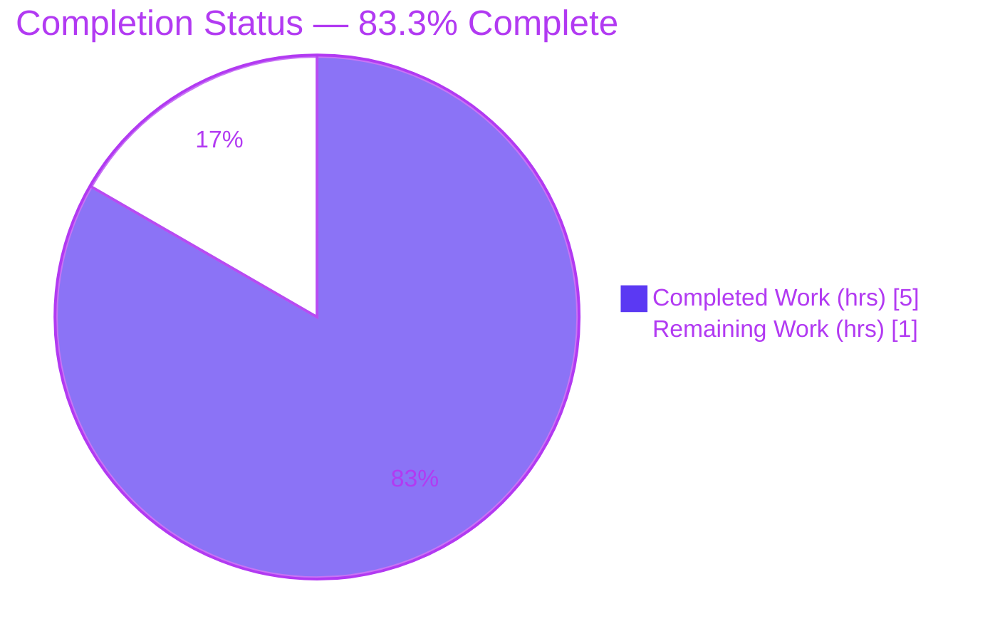
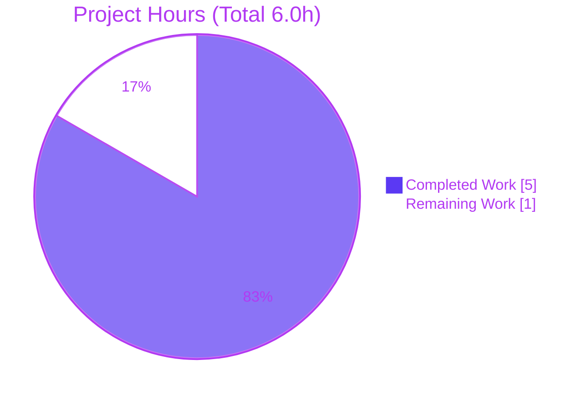
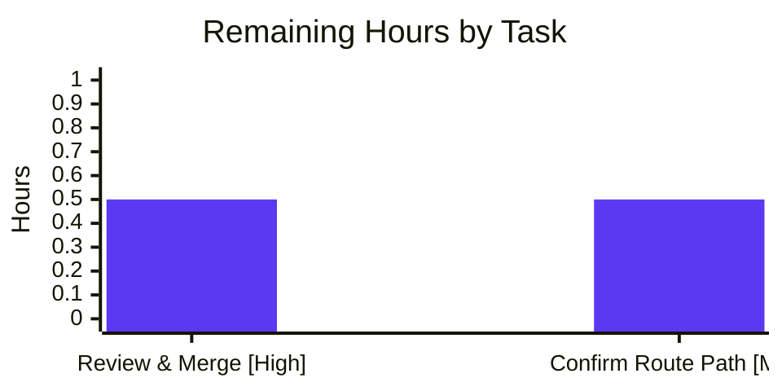

# Blitzy Project Guide — Artifact1 (Express.js Server)

> **Brand legend:** 🟦 Completed / AI Work = Dark Blue `#5B39F3` · ⬜ Remaining / Not Completed = White `#FFFFFF` · Headings/Accents = Violet-Black `#B23AF2` · Highlight = Mint `#A8FDD9`

---

## 1. Executive Summary

### 1.1 Project Overview

Artifact1 is a minimal, tutorial-style **Node.js HTTP service built on the Express.js framework**. It targets developers learning Express and serves as a runnable reference. The user requested adding Express to an existing server plus a second greeting endpoint; because the repository was greenfield (only a `README.md` stub), the deliverable was realized as a clean from-scratch Express application. Technical scope is two plain-text `GET` routes — `/` returning `Hello world` and `/good-evening` returning `Good evening` — bootstrapped on a configurable port. Business impact is educational/foundational: it establishes the Node.js + Express tech stack and a clean, documented baseline that future routes and middleware can extend.

### 1.2 Completion Status



<div align="center"><strong>🟦 83.3% Complete</strong></div>

| Metric | Hours |
|--------|-------|
| **Total Hours** | **6.0** |
| **Completed Hours (AI + Manual)** | **5.0** (AI: 5.0 · Manual: 0.0) |
| **Remaining Hours** | **1.0** |

**Calculation:** Completion % = Completed ÷ Total = 5.0 ÷ 6.0 × 100 = **83.3%**.

### 1.3 Key Accomplishments

- ✅ Node.js project scaffolded from a greenfield baseline (`package.json`, `package-lock.json`, `.gitignore`).
- ✅ Express.js `^5.2.1` adopted as the sole direct runtime dependency and pinned deterministically (`lockfileVersion 3`).
- ✅ `GET /` implemented — returns `Hello world` (HTTP 200), verified via `curl`.
- ✅ `GET /good-evening` implemented — returns `Good evening` (HTTP 200), verified via `curl`.
- ✅ Configurable HTTP listener on `process.env.PORT || 3000` (PORT override verified on 8080/8090).
- ✅ `README.md` authored with prerequisites, install/run steps, PORT override, and an endpoint reference table.
- ✅ Production-quality `server.js` with `'use strict'` and comprehensive JSDoc/inline documentation — zero placeholders or stubs.
- ✅ Clean dependency posture: `npm install` exit 0, `npm audit` **0 vulnerabilities**, `npm ls` clean (`express@5.2.1`).
- ✅ All 5 AAP acceptance criteria pass; Final Validator required **zero fixes**.

### 1.4 Critical Unresolved Issues

| Issue | Impact | Owner | ETA |
|-------|--------|-------|-----|
| _None — no blocking issues._ All AAP acceptance criteria pass, code compiles and runs, dependencies are clean (0 vulnerabilities), and both endpoints return the exact required responses. | None | — | — |

> The only open item is a non-blocking product decision (route-path confirmation), tracked in Sections 1.6, 2.2, and 6 rather than as a critical issue.

### 1.5 Access Issues

| System/Resource | Type of Access | Issue Description | Resolution Status | Owner |
|-----------------|----------------|-------------------|-------------------|-------|
| — | — | **No access issues identified.** The build is fully self-contained: dependencies resolve from the public npm registry, no credentials/API keys/external services are required, and the repository, branch, and commits are all accessible. | N/A | — |

### 1.6 Recommended Next Steps

1. **[High]** Perform final human code review and approve/merge the branch `blitzy-49dd96aa-7ff6-463b-a33d-1715a1e140d4` (HEAD `d1df70f`). _(~0.5h)_
2. **[Medium]** Confirm the assumed `/good-evening` route path with the requester; apply a one-line change in `server.js` only if a different path (e.g., `/goodevening`, `/evening`) is preferred. _(~0.5h)_
3. **[Low]** _(Optional, out of AAP scope)_ If strict plain-text typing is desired, add `res.type('text/plain')` to both handlers (current `text/html` is AAP-sanctioned).
4. **[Low]** _(Optional, out of AAP scope)_ Add automated tests (Jest + Supertest) if the project graduates beyond a tutorial.
5. **[Low]** _(Optional, out of AAP scope)_ Add production hardening — TLS/reverse proxy, process manager (PM2/systemd) or container, and CI/CD — when moving to a hosted environment.

---

## 2. Project Hours Breakdown

### 2.1 Completed Work Detail

| Component | Hours | Description |
|-----------|-------|-------------|
| Project scaffolding (`package.json` + `.gitignore`) | 1.0 | Manifest with `express ^5.2.1`, `start` script, `engines.node >=18`, `main` = `server.js`, MIT license; `.gitignore` excluding `node_modules/`, `*.log`, `.env`. |
| Dependency resolution & lockfile (`package-lock.json`) | 0.5 | Express version verification (5.2.1 = current `latest`) and `npm install` generating `lockfileVersion 3` pinning `express@5.2.1` + transitive tree. |
| Express server implementation (`server.js`) | 1.5 | Express app instance, `GET /` → `Hello world`, `GET /good-evening` → `Good evening`, `process.env.PORT || 3000` listener, `'use strict'`, comprehensive JSDoc. |
| Documentation (`README.md`) | 1.0 | Title, description, prerequisites, install/run instructions, PORT override, endpoint reference table, `curl` examples. |
| Functional validation & QA | 1.0 | `npm install` (0 vulns), `node --check`, runtime boot, `curl` of both endpoints + 404 behavior, PORT override verification. |
| **Total Completed** | **5.0** | |

> ✅ Sum of Hours column = **5.0** = Completed Hours in Section 1.2.

### 2.2 Remaining Work Detail

| Category | Hours | Priority |
|----------|-------|----------|
| Final human code review, PR approval & merge (path-to-production sign-off) | 0.5 | High |
| Confirm assumed `/good-evening` route path with requester (AAP-flagged open decision; ≤1-line change if different) | 0.5 | Medium |
| **Total Remaining** | **1.0** | |

> ✅ Sum of Hours column = **1.0** = Remaining Hours in Section 1.2 = Section 7 pie "Remaining Work".
> ✅ Section 2.1 (5.0) + Section 2.2 (1.0) = **6.0** Total Project Hours (Section 1.2).

---

## 3. Test Results

> **Integrity note:** All entries below originate exclusively from Blitzy's autonomous validation logs for this project. No unit-test framework is in scope (AAP Section 0.2.2 explicitly excludes test suites), so testing took the form of functional/runtime, behavioral, static-analysis, and dependency-audit checks executed during autonomous validation. `npm test` correctly returns "Missing script: test" by design.

| Test Category | Framework / Tool | Total Tests | Passed | Failed | Coverage % | Notes |
|---------------|------------------|-------------|--------|--------|-----------|-------|
| Functional — Endpoints | `curl` (manual functional) | 2 | 2 | 0 | 100% of in-scope endpoints | `GET /` → 200 `Hello world`; `GET /good-evening` → 200 `Good evening` (exact-body match). |
| Behavioral — Negative & Config | `curl` (manual functional) | 2 | 2 | 0 | n/a | `GET /nonexistent` → 404 (Express default); `PORT=8080` override → 200 `Hello world`. |
| Static Analysis | `node --check`; JSON parse | 3 | 3 | 0 | n/a | `server.js` syntax OK; `package.json` & `package-lock.json` valid JSON. |
| Dependency Audit | `npm audit` / `npm ls` | 1 | 1 | 0 | n/a | **0 vulnerabilities**; clean tree `artifact1@1.0.0 └── express@5.2.1`. |
| **Totals** | — | **8** | **8** | **0** | **100% endpoints** | 100% pass rate across all autonomously executed checks. |

> **Code-coverage instrumentation:** none (no test framework in scope). "Coverage %" reflects functional endpoint coverage (2/2 in-scope routes exercised). Adding instrumented coverage would require Jest/Supertest, which is out of AAP scope.

---

## 4. Runtime Validation & UI Verification

**Runtime health**

- ✅ **Operational** — Server boots via `npm start`, logging `Server listening on port 3000`.
- ✅ **Operational** — PORT override: `PORT=8080 npm start` → `Server listening on port 8080`; serves correctly.
- ✅ **Operational** — Clean startup/shutdown; no lingering errors; binds IPv6 dual-stack (`:::3000`).

**API / Endpoint verification** (via `curl`)

- ✅ **Operational** — `GET /` → HTTP 200, body `Hello world` (length 11, exact match).
- ✅ **Operational** — `GET /good-evening` → HTTP 200, body `Good evening` (length 12, exact match).
- ✅ **Operational** — `GET /nonexistent` → HTTP 404 (correct Express default behavior).
- ✅ **Operational** — Response header `Content-Type: text/html; charset=utf-8` (AAP Section 0.6 sanctioned canonical `res.send()` form — not a defect; bodies match verbatim).

**UI verification**

- ⚪ **Not Applicable** — The deliverable is a backend HTTP service returning plain-text responses. No front-end, templating engine, static assets, or design system is in scope (AAP Section 0.3.4), so no UI verification is required.

---

## 5. Compliance & Quality Review

Cross-mapping of AAP deliverables and quality benchmarks to autonomous validation outcomes.

| Benchmark / AAP Deliverable | Status | Progress | Notes |
|-----------------------------|--------|----------|-------|
| `package.json` manifest (express ^5.2.1, start script, engines>=18, MIT) | ✅ Pass | 100% | Valid JSON; all required fields present. |
| `package-lock.json` deterministic pinning | ✅ Pass | 100% | `lockfileVersion 3`; `express@5.2.1` + transitive tree pinned. |
| `.gitignore` (`node_modules/`, `*.log`, `.env`) | ✅ Pass | 100% | All three patterns present. |
| `server.js` — `GET /` → `Hello world` | ✅ Pass | 100% | Exact-body match, HTTP 200. |
| `server.js` — `GET /good-evening` → `Good evening` | ✅ Pass | 100% | Exact-body match, HTTP 200. |
| Configurable port (`process.env.PORT || 3000`) | ✅ Pass | 100% | Override verified. |
| `README.md` documentation | ✅ Pass | 100% | Prerequisites, install/run, PORT, endpoint table. |
| Code compiles / syntax valid | ✅ Pass | 100% | `node --check` clean. |
| Dependency security (`npm audit`) | ✅ Pass | 100% | **0 vulnerabilities**. |
| Zero placeholders / stubs / TODOs | ✅ Pass | 100% | Complete production-ready implementation. |
| Code documentation quality | ✅ Pass | 100% | `'use strict'` + comprehensive JSDoc. |
| Route-path confirmation (`/good-evening`) | ⚪ Pending | 0% | Human decision (AAP Section 0.6) — non-blocking; see Sections 1.6 & 2.2. |

**Fixes applied during autonomous validation:** None required — prior agents implemented the AAP correctly on the first pass; the Final Validator confirmed all gates with zero changes.

**Outstanding compliance items:** One non-blocking product decision (route-path confirmation). All out-of-scope items (tests, CI/CD, containerization, TLS) are intentionally excluded per AAP Section 0.2.2.

---

## 6. Risk Assessment

> **Overall risk posture: LOW.** No high or critical risks. Most items are AAP-excluded production-hardening concerns or choices accepted by design.

| Risk | Category | Severity | Probability | Mitigation | Status |
|------|----------|----------|-------------|------------|--------|
| Route path `/good-evening` was assumed (user gave response text, not path) | Technical / Product | Low | Medium | Confirm with requester; ≤1-line change if different (AAP Section 0.6) | ⚪ Open (tracked as remaining work) |
| `Content-Type: text/html` rather than `text/plain` | Technical | Low | Low | Optional `res.type('text/plain')`; bodies match either way | 🟦 Accepted (AAP-sanctioned) |
| No automated test suite (AAP-excluded) | Technical | Low | Low | Functional validation performed; add Jest/Supertest if scope grows | 🟦 Accepted (out of scope) |
| Express 5 path-matching breaking changes | Technical | Low | Very Low | Two literal routes use no wildcard/regex → no impact | 🟦 Mitigated |
| No process manager / graceful shutdown | Operational | Low | Low | PM2/systemd/container in production | ⚪ Open (out of AAP scope) |
| Dependency vulnerabilities over time | Security | Low | Low | `npm audit` currently 0 vulns; periodic audit / Dependabot | 🟦 Mitigated |
| No authentication/authorization | Security | Low | N/A | Endpoints serve only static greetings; no sensitive data | 🟦 Accepted (out of scope by design) |
| No HTTPS/TLS (plain HTTP) | Security | Low (local) | Low | TLS via reverse proxy in production | ⚪ Open (out of AAP scope) |
| No structured logging / monitoring | Operational | Low | Low | `console.log` startup; add pino/winston + APM in prod | 🟦 Accepted (out of scope) |
| Port conflict on default 3000 | Integration | Low | Low | `PORT` env override (implemented & verified) | 🟦 Mitigated |
| Node version drift | Integration | Low | Low | `engines.node >=18` declared; tested on v20.20.2 | 🟦 Mitigated |
| No external integrations exist | Integration | None | None | N/A — no DB/APIs/credentials/webhooks | 🟦 No risk |

---

## 7. Visual Project Status

**Project Hours Breakdown**



> 🟦 Completed Work = **5.0h** · ⬜ Remaining Work = **1.0h** · Total = **6.0h** · **83.3% complete**.
> Integrity: "Remaining Work" (1.0h) equals Section 1.2 Remaining Hours and the Section 2.2 Hours total.

**Remaining Hours by Priority (Section 2.2)**



> Remaining total = 0.5 + 0.5 = **1.0h** (consistent with Sections 1.2 and 2.2).

---

## 8. Summary & Recommendations

**Achievements.** The project successfully establishes a Node.js + Express.js tech stack from a greenfield baseline. All nine AAP deliverables and all five acceptance criteria are complete and independently verified: `npm install` is clean with **0 vulnerabilities**, the server boots and logs its port, and both endpoints (`GET /` → `Hello world`, `GET /good-evening` → `Good evening`) return exact-match responses with HTTP 200. Code quality is production-grade — `'use strict'`, comprehensive JSDoc, deterministic dependency pinning, and zero placeholders or stubs.

**Completion.** Measured strictly against AAP-scoped and path-to-production work, the project is **83.3% complete** (5.0 of 6.0 hours). Crucially, the remaining 1.0h contains **no defect rework** — it consists entirely of two inherent human gates.

**Remaining gaps & critical path to production.**
1. **[High]** Human code review and PR merge — the standard sign-off gate (0.5h).
2. **[Medium]** Confirm the assumed `/good-evening` route path with the requester (0.5h) — the single open product decision the AAP flagged (Section 0.6).

Completing these two items moves the project to a mergeable, runnable state. No build, configuration, or integration work remains within AAP scope.

**Success metrics.** All AAP acceptance criteria: ✅ met. Security vulnerabilities: 0. Functional checks: 8/8 passed. Defects requiring rework: 0.

**Production-readiness assessment.** The AAP-scoped deliverable is **functionally complete and production-ready for its tutorial purpose.** For a public, hosted deployment, the optional out-of-scope hardening (automated tests, TLS, process manager/containerization, CI/CD, structured logging) should be considered — but none of these are required by the AAP, and all are listed in Section 1.6 for awareness only.

---

## 9. Development Guide

> All commands below were executed and verified during autonomous validation (Node v20.20.2, npm 11.1.0).

### 9.1 System Prerequisites

- **Node.js** `>= 18` (Node 22 LTS recommended) — satisfies `engines.node`.
- **npm** (bundled with Node.js).
- **OS:** any platform supporting Node.js (Linux/macOS/Windows). No additional system packages required.

```bash
node --version   # expect v18+ (validated on v20.20.2)
npm --version    # validated on 11.1.0
```

### 9.2 Environment Setup

No `.env` file is required. The only configurable value is the listening port:

| Variable | Required | Default | Purpose |
|----------|----------|---------|---------|
| `PORT` | No | `3000` | TCP port the HTTP server binds to. |

```bash
# Optional: run on a custom port
export PORT=8080
```

### 9.3 Dependency Installation

```bash
# From the repository root
npm install
```

**Expected output (abridged):**

```text
added 66 packages, and audited 67 packages in <time>
found 0 vulnerabilities
```

Verify the dependency tree:

```bash
npm ls
# artifact1@1.0.0 <path>
# └── express@5.2.1
```

### 9.4 Application Startup

```bash
npm start            # alias for: node server.js
```

**Expected output:**

```text
> artifact1@1.0.0 start
> node server.js

Server listening on port 3000
```

Custom port:

```bash
PORT=8080 npm start
# Server listening on port 8080
```

### 9.5 Verification Steps

```bash
# Root endpoint
curl http://localhost:3000/
# -> Hello world          (HTTP 200)

# Good-evening endpoint
curl http://localhost:3000/good-evening
# -> Good evening         (HTTP 200)

# Unknown route (Express default)
curl -o /dev/null -w "%{http_code}\n" http://localhost:3000/nonexistent
# -> 404

# Inspect headers
curl -i http://localhost:3000/
# HTTP/1.1 200 OK
# Content-Type: text/html; charset=utf-8
# ...
# Hello world
```

### 9.6 Example Usage

```bash
$ curl http://localhost:3000/
Hello world

$ curl http://localhost:3000/good-evening
Good evening
```

### 9.7 Troubleshooting

| Symptom | Cause | Resolution |
|---------|-------|------------|
| `Error: listen EADDRINUSE: address already in use :::3000` | Port 3000 already in use | Free the port (`lsof -iTCP:3000 -sTCP:LISTEN` or `ss -ltnp`, then stop that process) **or** run on another port: `PORT=8081 npm start`. |
| `Error: Cannot find module 'express'` | Dependencies not installed | Run `npm install` (Express resolves from `node_modules/`, which is gitignored). |
| `npm error Missing script: "test"` | No test script defined | **Expected** — tests are out of AAP scope; not an error. |
| `curl http://localhost:3000/` returns nothing | Server not running | Start it with `npm start` and confirm the `Server listening on port …` log. |
| `lsof -iTCP:3000` shows no listener but `curl` works | Server binds IPv6 dual-stack (`:::3000`) | Not a defect — verify with `curl`, or use `ss -ltnp` which shows the dual-stack socket. |

---

## 10. Appendices

### A. Command Reference

| Command | Purpose |
|---------|---------|
| `npm install` | Install dependencies (Express + transitive tree) from the lockfile. |
| `npm start` | Start the server (`node server.js`). |
| `node server.js` | Start the server directly. |
| `PORT=8080 npm start` | Start on a custom port. |
| `node --check server.js` | Validate JS syntax without executing. |
| `npm ls` | Print the resolved dependency tree. |
| `npm audit` | Report dependency vulnerabilities (currently 0). |
| `curl http://localhost:3000/` | Exercise the root endpoint. |
| `curl http://localhost:3000/good-evening` | Exercise the good-evening endpoint. |

### B. Port Reference

| Port | Role | How to change |
|------|------|---------------|
| `3000` | Default HTTP listener | Set `PORT` env var (e.g., `PORT=8080 npm start`). |

### C. Key File Locations

| Path | Role |
|------|------|
| `server.js` | Express application entry point (routes + listener). |
| `package.json` | Manifest: dependencies, `start` script, engines, license. |
| `package-lock.json` | Deterministic dependency lockfile (`express@5.2.1`). |
| `.gitignore` | Excludes `node_modules/`, `*.log`, `.env`. |
| `README.md` | Project documentation (install, run, endpoints). |
| `node_modules/` | Installed dependencies (generated; gitignored — not authored). |

### D. Technology Versions

| Technology | Version | Notes |
|------------|---------|-------|
| Node.js | `>= 18` (tested v20.20.2; 22 LTS recommended) | JavaScript runtime. |
| npm | 11.1.0 (tested) | Package manager. |
| Express.js | `^5.2.1` (resolves to 5.2.1) | Sole direct dependency; MIT-licensed. |
| Lockfile | `lockfileVersion 3` | npm deterministic install format. |
| Module system | CommonJS | `require(...)`; `package.json` omits `"type":"module"`. |

### E. Environment Variable Reference

| Variable | Required | Default | Description |
|----------|----------|---------|-------------|
| `PORT` | No | `3000` | TCP port for the HTTP listener (`process.env.PORT || 3000`). |

### F. Developer Tools Guide

| Tool | Command | When to use |
|------|---------|-------------|
| Syntax check | `node --check server.js` | Before committing JS changes. |
| Dependency audit | `npm audit` | Periodically and before release. |
| Dependency tree | `npm ls` | Verify resolved versions. |
| Port inspection | `ss -ltnp` / `lsof -iTCP:<port> -sTCP:LISTEN` | Diagnose port conflicts (use `ss` for dual-stack visibility). |
| Endpoint probe | `curl -i http://localhost:3000/` | Inspect status + headers + body. |

### G. Glossary

| Term | Definition |
|------|------------|
| **Express.js** | Minimal, unopinionated Node.js web framework providing routing, middleware, and request/response helpers. |
| **Endpoint / Route** | A URL path + HTTP method pair (e.g., `GET /good-evening`) mapped to a handler. |
| **CommonJS** | Node's default module system using `require()` / `module.exports`. |
| **Lockfile** | `package-lock.json` — pins exact dependency versions for reproducible installs. |
| **Greenfield** | A project started from scratch with no pre-existing source code. |
| **Middleware** | A function in the Express request/response pipeline (none custom here beyond Express defaults). |
| **EADDRINUSE** | OS error indicating the chosen port is already bound by another process. |
| **AAP** | Agent Action Plan — the authoritative specification of project scope used to assess completion. |

---

> **Cross-section integrity (validated):** Remaining hours = **1.0h** identically in Sections 1.2, 2.2, and 7. · Section 2.1 (5.0) + Section 2.2 (1.0) = **6.0h** Total. · All test entries originate from Blitzy autonomous validation logs. · No access issues. · Colors: Completed = `#5B39F3`, Remaining = `#FFFFFF`. · Completion **83.3%** consistent across Sections 1.2, 7, and 8.