# Technical Specification

# 1. Introduction

## 1.1 EXECUTIVE SUMMARY

### 1.1.1 Project Overview

The **Artifact1** repository represents the initial commit state of a software project that has been instantiated but has not yet entered active implementation. As of the documented baseline, the repository contains a single file — `README.md` — whose entire content is the H1 markdown heading `# Artifact1`. There is no implementation source code, no dependency declarations, no configuration, no build tooling, and no architectural artifacts present within the repository.

This Technical Specification documents the **baseline state** of the Artifact1 project as observed at commit `b55de94`. The specification is intentionally constrained to evidence drawn from the repository itself and is expected to evolve materially as functional capabilities, technology selections, and architectural decisions are introduced through subsequent commits.

| Attribute | Value |
|-----------|-------|
| Project Identifier | Artifact1 |
| Repository State | Initial / Placeholder |
| Initial Commit Hash | b55de94 |
| Initialization Date | May 28, 2026 |
| Primary Branch | main |
| Implementation Status | Not Started |

### 1.1.2 Core Business Problem

The repository in its current state does not contain evidence of a specific business problem under solution. No domain models, user stories, requirements artifacts, feature flags, business logic modules, or product documentation are present in the codebase. Accordingly, the business problem statement and associated solution hypothesis are deferred to subsequent project phases when corresponding artifacts are committed to the repository.

This Technical Specification therefore documents the project's existence and identity rather than its business intent, in order to avoid fabricating context not supported by the available evidence.

### 1.1.3 Key Stakeholders and Users

Only one stakeholder is verifiable from the repository's metadata at this stage of the project lifecycle. No user-facing components, role-based access constructs, persona documentation, or audience targeting artifacts exist in the repository to support further stakeholder identification.

| Stakeholder Role | Identity | Evidence Source |
|------------------|----------|-----------------|
| Repository Initializer | Shalini (shalini@blitzy.com) | Git commit author metadata for `b55de94` |
| End Users | Not yet identified | No user-facing artifacts present |
| Administrators | Not yet identified | No administrative interfaces present |
| Integrators | Not yet identified | No integration contracts present |

Additional stakeholders — including end users, business owners, operations personnel, and integration partners — will be identified as the project matures and corresponding artifacts are introduced.

### 1.1.4 Expected Business Impact and Value Proposition

The repository contains no artifacts that would permit measurement or estimation of business impact. There are no value proposition statements, target market analyses, cost-benefit projections, return-on-investment models, or commercial documentation present. The business impact and value proposition statements are deferred to a future revision of this Technical Specification, to be produced when the requisite business documentation is committed.

---

## 1.2 SYSTEM OVERVIEW

### 1.2.1 Project Context

#### Business Context and Market Positioning

The repository does not currently contain documentation, marketing copy, domain models, competitive analysis, or strategic positioning materials. Consequently, business context and market positioning cannot be derived from the available evidence and are not documented in this revision of the specification.

#### Current System Limitations

There is no pre-existing system represented in or referenced from the repository. There are no migration scripts, legacy adapter modules, deprecated API surfaces, or compatibility shims that would indicate a system being replaced or upgraded. The project begins from a **greenfield baseline** with no inherited technical debt observable from the codebase.

#### Integration with Existing Enterprise Landscape

No integration points exist in the repository. The following categories of integration artifacts have been searched for and confirmed absent:

| Integration Category | Present? | Evidence |
|----------------------|----------|----------|
| API Contracts | No | No OpenAPI, GraphQL, or Protobuf schemas detected |
| Message Schemas | No | No event-driven or message-broker definitions |
| Service Bindings | No | No service registry or discovery configuration |
| External Connectors | No | No SDK initializations or client libraries |

The enterprise integration topology is therefore undefined at this stage, and any future integration design will require corresponding artifacts to be committed before documentation can reflect those linkages.

### 1.2.2 High-Level Description

#### Primary System Capabilities

No system capabilities are currently implemented in the repository. The only content present — the `README.md` file — declares the project name as a markdown heading and supplies no functional behavior, interface, or capability. The capability catalogue is therefore empty at this baseline.

#### Major System Components

The repository contains no architectural components. There are no source directories, services, modules, libraries, packages, or layered architecture artifacts. The component inventory derived from exhaustive repository inspection is summarized below.

| Component Category | Present? | Evidence |
|--------------------|----------|----------|
| Application Source Code | No | No `.py`, `.js`, `.ts`, `.java`, `.go`, or equivalent files |
| Service / Module Directories | No | No `/src`, `/app`, `/services`, `/lib`, `/api` folders |
| Configuration | No | No `.env`, `.yml`, `.yaml`, `.json`, `.toml` files |
| Package Manifests | No | No `package.json`, `requirements.txt`, `pom.xml`, `go.mod`, `Cargo.toml`, `pyproject.toml` |
| Build Artifacts | No | No `Dockerfile`, `Makefile`, CI/CD configurations |
| Test Suites | No | No test directories or test files |
| Supplementary Documentation | No | No `/docs`, `CONTRIBUTING.md`, `CHANGELOG.md`, `LICENSE` |

#### Core Technical Approach

No technology stack, framework, programming language, database technology, runtime platform, or architectural pattern has been selected and committed to the repository. The technical approach is **undefined** at this baseline and will be established as the project transitions out of its current placeholder state. The diagram in Section 1.4 visually summarizes this state.

### 1.2.3 Success Criteria

#### Measurable Objectives

The repository contains no measurable objectives, acceptance criteria, definition-of-done documentation, sprint goals, or test cases that would enable objective measurement of success. Measurable objectives will be established when product and engineering requirements are introduced into the repository.

#### Critical Success Factors

No critical success factors are documented in the repository. The current state does not permit derivation of dependencies, risks, assumptions, or organizational prerequisites required for project success.

#### Key Performance Indicators (KPIs)

No KPIs, SLAs, performance budgets, observability constructs, or monitoring instrumentation are present in the codebase. There are no metric definitions, telemetry hooks, or measurement modules that would suggest target performance characteristics. KPI definitions are deferred to subsequent project phases. In keeping with the documentation principle that "assumed SLAs or KPIs not found in code" must not be invented, this section is intentionally devoid of fabricated targets.

---

## 1.3 SCOPE

### 1.3.1 In-Scope Elements

#### Core Features and Functionalities

The only verifiable in-scope element at the current baseline is the establishment of the repository as a named artifact. No primary user workflows, essential integrations, must-have capabilities, or technical requirements are encoded in the repository at this time.

| Capability | Status | Evidence |
|------------|--------|----------|
| Repository Identity Declaration | In Scope | `README.md` declares `# Artifact1` |
| Version Control Initialization | In Scope | Git commit `b55de94` on branch `main` |
| Functional Features | Undefined | No implementation present |
| User Workflows | Undefined | No application logic present |
| Third-Party Integrations | Undefined | No integration contracts present |

#### Implementation Boundaries

The implementation boundaries cannot be evidenced from the current repository contents. Stating boundaries that are not supported by committed artifacts would constitute fabrication; the boundaries are therefore acknowledged as undefined and deferred.

| Boundary Dimension | Defined State |
|--------------------|---------------|
| System Boundaries | Not yet defined |
| User Groups Covered | Not yet defined |
| Geographic / Market Coverage | Not yet defined |
| Data Domains Included | Not yet defined |

### 1.3.2 Out-of-Scope Elements

Because no explicit scope decisions have been committed to the repository, definitive out-of-scope statements cannot be derived from positive evidence. However, by virtue of the repository's empty state, the following categories of work are **demonstrably absent** from the current commit and should be considered outside the scope of any analysis based solely on the present repository state.

| Excluded Category | Rationale for Exclusion |
|-------------------|-------------------------|
| Functional Feature Implementation | No source code committed |
| Third-Party Integrations | No integration code or contracts present |
| Persistence Layer | No database schemas, migrations, or ORM definitions |
| User Interface | No UI assets, templates, or front-end frameworks |
| Authentication & Authorization | No identity or access management constructs |
| CI/CD Pipelines | No automation configuration files present |
| Operational Tooling | No monitoring, logging, or alerting configuration |
| Containerization | No `Dockerfile` or orchestration manifests present |
| Localization | No internationalization assets present |

Future-phase considerations, unsupported use cases, and explicitly excluded integration points cannot be enumerated until baseline scope is established through committed requirements documentation.

### 1.3.3 Scope Determination Methodology

Because the repository contains only a `README.md` placeholder, the scope of this Technical Specification revision is constrained to documenting verifiable facts about the repository's current state. The methodology applied is:

1. **Identity Verification** — The repository's name (`Artifact1`) is captured from the only content present in `README.md`.
2. **Metadata Verification** — Initialization details (commit hash, author, timestamp, branch) are captured from Git metadata.
3. **Absence Verification** — The non-presence of typical project artifacts is captured through exhaustive directory traversal and semantic search.
4. **Deferral of Unverifiable Elements** — Any item that cannot be substantiated from these three sources is explicitly deferred rather than fabricated.

Any expansion of scope in future revisions will require corresponding additions to the repository in the form of code, configuration, documentation, or other tracked artifacts that provide an evidentiary basis for documentation.

---

## 1.4 REPOSITORY BASELINE STATE

### 1.4.1 Baseline State Diagram

The following diagram visualizes the complete current state of the Artifact1 repository as observed during specification authoring. It shows the single present artifact, the verifiable Git metadata, and the categories of artifacts that are confirmed absent.

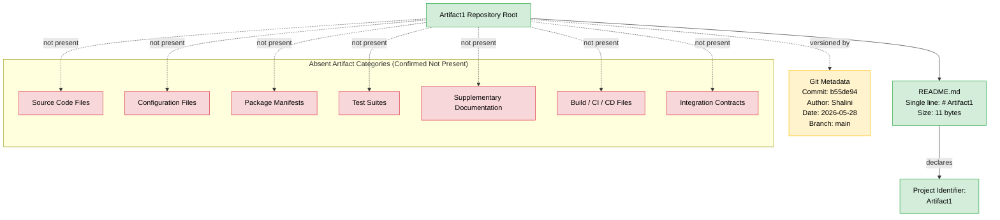

### 1.4.2 Diagram Legend

| Visual Element | Meaning |
|----------------|---------|
| Green node | Artifact verified present in the repository |
| Red node | Artifact category verified absent from the repository |
| Yellow node | Repository metadata (not a file artifact) |
| Solid arrow | Direct containment or declaration relationship |
| Dashed arrow | Metadata relationship or asserted non-presence |

### 1.4.3 Evolution Expectations

This diagram is expected to expand substantially in future revisions of the Technical Specification. As implementation artifacts are committed, the "Absent Artifact Categories" subgraph will shrink and corresponding "present" nodes will be added to the main graph. The Introduction section should be reviewed and re-authored whenever significant changes to the repository's content are committed.

---

## 1.5 REFERENCES

### 1.5.1 Files Examined

- `README.md` — The sole file present in the repository; contains a single H1 markdown heading (`# Artifact1`) with no additional body content. Provides the only verifiable project identifier evidenced in the codebase.

### 1.5.2 Folders Explored

- `/` (repository root, depth 0) — Inspected via folder contents retrieval; confirmed to contain only `README.md` as a direct child with no subdirectories. Deeper traversal was not possible because no subdirectories exist.

### 1.5.3 Repository Metadata Sources

- Git commit history — Single commit `b55de94` dated May 28, 2026, authored by Shalini (shalini@blitzy.com), with commit message "Initial commit"
- Git branch state — Single branch `main` confirmed
- Code Graph schema — Empty (`{}`), consistent with the absence of analyzable code artifacts

### 1.5.4 Verification Searches Performed

- Semantic search for "application source code main entry point" — returned no results
- Semantic search for "configuration package manifest dependencies" — returned no results
- Semantic search for "project documentation introduction readme" — returned no results other than the `README.md` already enumerated
- Semantic search for "application modules services business logic" — returned no results
- Direct filesystem inspection — confirmed no hidden files exist outside the visible tree
- Git log inspection — confirmed a single commit history adding only `README.md`

### 1.5.5 Technical Specification Cross-References

No prior Technical Specification sections were available for cross-reference at the time of authoring this Introduction section; the list of relevant sections supplied to the authoring agent was empty (`[]`).

# 2. Product Requirements

## 2.1 DOCUMENTATION APPROACH AND CONSTRAINTS

### 2.1.1 Baseline State Acknowledgement

The Artifact1 repository is documented at commit `b55de94` in an explicitly declared **initial / placeholder state**. As established in Section 1.1.1 (Project Overview), the repository contains a single file — `README.md` — whose entire content is the H1 markdown heading `# Artifact1`, with no implementation source code, no dependency declarations, no configuration, no build tooling, and no architectural artifacts present.

Consequently, this Product Requirements section documents **only those features and requirements that are evidenced by committed artifacts**. In keeping with the documentation principle articulated in Section 1.2.3 — that assumed SLAs, KPIs, or capabilities not found in code must not be invented — this section refrains from cataloguing hypothetical features, fabricated acceptance criteria, or speculative integration requirements. All categories of product requirements not substantiated by repository content are **explicitly deferred** to future revisions (see Section 2.7).

### 2.1.2 Methodology Applied

The methodology employed to derive this section's content is consistent with the Scope Determination Methodology defined in Section 1.3.3:

1. **Identity Verification** — Features and requirements derived from the literal content of `README.md` (the only present artifact).
2. **Metadata Verification** — Status and provenance attributes derived from Git commit metadata (`b55de94`).
3. **Absence Verification** — Categories of features confirmed absent (per Section 1.2.2) are explicitly listed as deferred rather than fabricated.
4. **Traceability Anchoring** — Every documented item is mapped to its evidentiary source via the traceability matrix in Section 2.6.

### 2.1.3 Constraints on This Revision

| Constraint | Source | Effect on This Section |
|------------|--------|------------------------|
| No business problem committed to repository | Section 1.1.2 | Business value statements minimized to verifiable facts |
| No end users identified | Section 1.1.3 | User benefit statements marked Not Applicable |
| No integrations present | Section 1.2.1 | Integration requirements catalogued as none |
| No KPIs/SLAs declared | Section 1.2.3 | Performance criteria marked Not Applicable |
| No out-of-scope decisions committed | Section 1.3.2 | Out-of-scope features deferred, not enumerated |

---

## 2.2 FEATURE CATALOG

### 2.2.1 Feature Inventory Summary

Exhaustive inspection of the repository (per Section 1.5.4) yields exactly one declared product feature evidenced by committed content. The Version Control Initialization element listed as in-scope in Section 1.3.1 is treated here as **infrastructure context** rather than a product feature, because it represents a tooling action (the Git commit itself) rather than a behavior delivered to a user or consumer of the Artifact1 project.

| Feature ID | Feature Name | Category | Status |
|------------|--------------|----------|--------|
| F-001 | Repository Identity Declaration | Project Initialization / Metadata | Completed |

No additional features are evidenced by the repository at commit `b55de94`. The Feature Catalog will be expanded in subsequent revisions as implementation artifacts are committed.

### 2.2.2 F-001: Repository Identity Declaration

#### 2.2.2.1 Feature Metadata

| Attribute | Value |
|-----------|-------|
| Unique ID | F-001 |
| Feature Name | Repository Identity Declaration |
| Feature Category | Project Initialization / Metadata |
| Priority Level | Critical |
| Status | Completed |

**Rationale for Priority Level**: This feature is classified as Critical because it constitutes the only feature presently delivered by the repository and therefore represents the foundational identifier upon which all subsequent product work will be built. Without this declaration, the repository would lack any verifiable project identity.

**Rationale for Status**: The status is classified as Completed because the feature is fully realized within the scope it defines (a project name declaration). It was committed in the initial commit `b55de94` dated May 28, 2026, and requires no further work to satisfy its acceptance criterion in its current form (see Section 2.3.2).

#### 2.2.2.2 Description

| Aspect | Description |
|--------|-------------|
| Overview | Establishes the project's name as "Artifact1" via a single H1 markdown heading in the repository's `README.md` file. |
| Business Value | Provides the only verifiable project identifier evidenced in the codebase; enables repository discovery, naming, and reference by humans and tooling. |
| User Benefits | Not Applicable — no end users, administrators, or integrators have been identified per Section 1.1.3. |
| Technical Context | Implemented as plain Markdown content with no executable behavior. No runtime, build, or deployment dependencies are introduced by this feature. |

#### 2.2.2.3 Dependencies

| Dependency Type | Description |
|-----------------|-------------|
| Prerequisite Features | None — F-001 is the foundational feature of the repository. |
| System Dependencies | A Git-compatible version control system (evidenced by commit `b55de94` and branch `main`). |
| External Dependencies | A Markdown renderer is required to visually render the H1 heading; no specific library or vendor dependency is declared in the repository. |
| Integration Requirements | None — no integration contracts, API schemas, or service bindings are present per Section 1.2.1. |

---

## 2.3 FUNCTIONAL REQUIREMENTS TABLE

### 2.3.1 Requirements Inventory Summary

A single atomic functional requirement is evidenced by the present content of the repository. Additional requirements cannot be derived without fabricating capabilities not substantiated by committed artifacts.

| Requirement ID | Feature | Priority | Complexity |
|----------------|---------|----------|------------|
| F-001-RQ-001 | F-001 Repository Identity Declaration | Must-Have | Low |

### 2.3.2 F-001-RQ-001: Project Identifier Declaration

#### 2.3.2.1 Requirement Details

| Attribute | Value |
|-----------|-------|
| Requirement ID | F-001-RQ-001 |
| Description | The repository SHALL contain a `README.md` file at the repository root that declares the project identifier as a top-level Markdown heading. |
| Acceptance Criteria | (1) A file named `README.md` exists at the repository root. (2) The file contains the exact string `# Artifact1`. (3) The file is tracked by Git on the `main` branch. |
| Priority | Must-Have |
| Complexity | Low |

#### 2.3.2.2 Technical Specifications

| Aspect | Specification |
|--------|---------------|
| Input Parameters | None — the requirement is satisfied by static file content. |
| Output / Response | Rendered H1 heading "Artifact1" when `README.md` is processed by any standards-compliant Markdown renderer. |
| Performance Criteria | Not Applicable — no runtime behavior, no throughput or latency profile is associated with a static text file. |
| Data Requirements | A single UTF-8 text file at the repository root, ~11 bytes in size, containing one Markdown H1 directive. |

#### 2.3.2.3 Validation Rules

| Validation Category | Rule |
|---------------------|------|
| Business Rules | Not Applicable — no business logic is present in the repository per Section 1.2.2. |
| Data Validation | The `README.md` file must contain at minimum the exact string `# Artifact1` to satisfy acceptance. |
| Security Requirements | None observed — no authentication, authorization, input handling, or executable code is present per Section 1.3.2. |
| Compliance Requirements | None observed — no regulatory, licensing, or compliance artifacts are present in the repository. |

#### 2.3.2.4 Verification Method

The acceptance criteria for F-001-RQ-001 can be verified deterministically by the following actions, none of which require execution of any code:

1. Confirm the presence of `README.md` at the repository root using `git ls-files`.
2. Read the file contents and confirm equivalence to the string `# Artifact1`.
3. Confirm the file is tracked on the `main` branch via Git metadata inspection.

This verification methodology was applied during the authoring of this specification and yielded a positive result, supporting the Completed status of F-001.

---

## 2.4 FEATURE RELATIONSHIPS

### 2.4.1 Feature Dependency Map

With only one feature presently catalogued (F-001), no inter-feature dependency relationships exist. The dependency map is intentionally minimal and reflects only the verifiable infrastructure relationship to the underlying version control system.

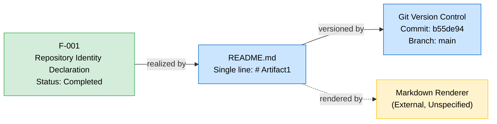

### 2.4.2 Integration Points

| Integration Point | Status | Evidence |
|-------------------|--------|----------|
| Internal Service Integrations | None | No services exist per Section 1.2.2 |
| External API Integrations | None | No API contracts present per Section 1.2.1 |
| Message Broker Integrations | None | No message schemas present per Section 1.2.1 |
| Database Integrations | None | No persistence layer present per Section 1.3.2 |

### 2.4.3 Shared Components

No shared components exist between features because only one feature is presently catalogued. The single feature relies on no application-level shared libraries, utilities, or frameworks. Future revisions of this section will document shared components as multi-feature dependencies emerge.

### 2.4.4 Common Services

No common services (logging, configuration, telemetry, authentication, caching, or messaging infrastructure) are presently catalogued. This is consistent with the empty component inventory established in Section 1.2.2.

---

## 2.5 IMPLEMENTATION CONSIDERATIONS

### 2.5.1 F-001 Implementation Considerations

#### 2.5.1.1 Technical Constraints

| Constraint | Description |
|------------|-------------|
| File Format | The implementation is bound by Markdown syntax conventions; the H1 directive (`#`) must appear at the start of a line followed by a space and the project name. |
| Filename | The file must be named `README.md` to align with platform conventions for repository introduction documents. |
| Encoding | UTF-8 text encoding is assumed; no explicit encoding declaration exists in the file. |
| Version Control | Changes to the declaration require a new Git commit on the `main` branch to take effect in the canonical project history. |

#### 2.5.1.2 Performance Requirements

Not Applicable. F-001 is realized by a static text artifact of approximately 11 bytes with no runtime, execution path, or measurable performance profile. Section 1.2.3 explicitly defers performance criteria pending the introduction of executable artifacts.

#### 2.5.1.3 Scalability Considerations

Not Applicable. A static project identifier does not scale with users, load, data volume, or geographic distribution. No scaling dimensions are present in the baseline repository state.

#### 2.5.1.4 Security Implications

| Security Dimension | Assessment |
|--------------------|------------|
| Authentication Surface | None — no executable code, no user-facing interface, no authenticated operation exists. |
| Authorization Surface | None — no protected resources, no access control constructs present. |
| Input Handling | Not Applicable — the feature accepts no inputs. |
| Output Handling | The literal string `# Artifact1` is the only output; no dynamic content or injection surface exists. |
| Secret Management | Not Applicable — no secrets, credentials, or sensitive data are committed or referenced. |
| Dependency Vulnerability | Not Applicable — no third-party dependencies are declared in the repository. |

#### 2.5.1.5 Maintenance Requirements

| Maintenance Aspect | Description |
|--------------------|-------------|
| Update Mechanism | Modifications require editing `README.md` and committing the change via Git. |
| Review Cadence | Recommended review when the project identifier or scope materially changes. |
| Deprecation Strategy | Not Applicable at baseline — the feature has no consumers presently identified. |
| Documentation Currency | This Product Requirements section should be re-authored whenever the repository transitions out of the placeholder state. |

---

## 2.6 TRACEABILITY MATRIX

### 2.6.1 Requirement-to-Evidence Traceability

The following matrix links each documented requirement to its evidentiary source within the repository and the corresponding cross-referenced sections of this Technical Specification.

| Requirement | Evidence Artifact | Cross-Referenced Section |
|-------------|-------------------|--------------------------|
| F-001 | `README.md` (root) | Section 1.1.1 — Project Overview |
| F-001 | Git commit `b55de94` | Section 1.1.3 — Key Stakeholders |
| F-001-RQ-001 | `README.md` literal content `# Artifact1` | Section 1.3.1 — In-Scope Elements |
| F-001-RQ-001 | Baseline State Diagram | Section 1.4.1 — Baseline State Diagram |

### 2.6.2 Feature-to-Section Traceability

| Feature ID | Defining Section | Supporting Sections |
|------------|------------------|---------------------|
| F-001 | Section 2.2.2 | Sections 1.1.1, 1.3.1, 1.4.1 |

### 2.6.3 Status Traceability

| Item | Status | Date Established | Source |
|------|--------|------------------|--------|
| F-001 | Completed | May 28, 2026 | Git commit `b55de94` |
| F-001-RQ-001 | Verified | At specification authoring time | Direct inspection of `README.md` |

### 2.6.4 Related Process Flowcharts

Because the repository contains no application logic, no behavioral process flowcharts exist beyond the structural baseline. The relevant referenced flowcharts are:

- **Section 1.4.1 Baseline State Diagram** — Visualizes the present `README.md` artifact, the verifiable Git metadata, and the confirmed-absent artifact categories. This diagram serves as the canonical reference flow for understanding the present state of the product as it pertains to F-001.
- **Section 2.4.1 Feature Dependency Map** — Visualizes the relationship between F-001, its realizing artifact, and supporting external systems (Git, Markdown renderer).

---

## 2.7 DEFERRED REQUIREMENTS

### 2.7.1 Rationale for Deferral

The categories listed below are commonly expected in a complete Product Requirements specification but cannot be authored against the current repository state without fabricating content. Per the documentation principles applied throughout this Technical Specification (Sections 1.1.2, 1.2.3, 1.3.1), these elements are explicitly deferred pending committed evidence in future revisions of the repository.

### 2.7.2 Deferred Feature Categories

| Deferred Category | Reason for Deferral | Triggering Evidence Required |
|-------------------|---------------------|------------------------------|
| Functional Feature Implementation | No source code present | Committed source files in any application language |
| User Authentication & Authorization | No identity constructs present | Auth modules, identity provider configuration |
| Data Persistence Features | No persistence layer present | Database schema, ORM definitions, migration scripts |
| User Interface Features | No UI assets present | Front-end framework setup, templates, UI components |
| API / Integration Features | No integration contracts present | OpenAPI / GraphQL / Protobuf schemas, SDK bindings |
| Operational & Telemetry Features | No observability constructs present | Logging, metrics, tracing instrumentation |
| Configurability Features | No configuration files present | `.env`, `.yml`, `.toml`, or equivalent configuration |
| CI/CD & Build Features | No automation configuration present | Pipeline definitions, build scripts, container manifests |
| Localization Features | No i18n assets present | Locale files, translation infrastructure |

### 2.7.3 Deferred Specification Elements

| Deferred Element | Reason | Re-Evaluation Trigger |
|------------------|--------|----------------------|
| User Personas | No users identified (Section 1.1.3) | Stakeholder documentation committed |
| Business Value Quantification | No value proposition committed (Section 1.1.4) | Business documentation committed |
| KPIs and SLAs | No metrics defined (Section 1.2.3) | Performance objectives committed |
| Out-of-Scope Feature Enumeration | No scope decisions committed (Section 1.3.2) | Product scope documentation committed |
| Acceptance Test Suite | No tests present (Section 1.2.2) | Test directory and cases committed |
| Architectural Constraints | No architecture committed (Section 1.2.2) | Architectural decision records or design artifacts committed |

### 2.7.4 Revision Expectations

This Product Requirements section will be re-authored in subsequent revisions of the Technical Specification when committed artifacts provide an evidentiary basis for additional features and requirements. The expected pattern of growth is described in Section 1.4.3, which anticipates that the "Absent Artifact Categories" listed above will progressively shrink as the project transitions out of its placeholder state.

---

## 2.8 ASSUMPTIONS AND CONSTRAINTS

### 2.8.1 Documented Assumptions

| Assumption | Basis |
|------------|-------|
| The project name is "Artifact1" as declared in `README.md` | Direct evidence in committed file content |
| The repository is in an initial, intentional placeholder state | Single initial commit dated May 28, 2026 |
| Git is the version control technology | Confirmed via Git metadata at commit `b55de94` |
| The `main` branch is the canonical branch | Single branch confirmed in repository metadata |

### 2.8.2 Documented Constraints

| Constraint | Effect |
|------------|--------|
| Documentation must be grounded in committed evidence | Limits the Feature Catalog to a single entry |
| Fabrication of features, users, or metrics is prohibited | All speculative elements are deferred, not invented |
| Section structure must follow the prompt's prescribed format | Empty categories are explicitly marked rather than omitted |

### 2.8.3 Requirement Version Tracking

| Item | Version | Established At | Notes |
|------|---------|----------------|-------|
| F-001 | 1.0 | Commit `b55de94` | Initial declaration of project identifier |
| F-001-RQ-001 | 1.0 | This specification revision | First formal capture of the requirement |

---

## 2.9 REFERENCES

### 2.9.1 Files Examined

- `README.md` — The sole file present in the repository at commit `b55de94`; contains the single H1 markdown heading `# Artifact1`. Sole evidentiary source for feature F-001 and requirement F-001-RQ-001.

### 2.9.2 Folders Explored

- `/` (repository root, depth 0) — Confirmed to contain only `README.md` as a direct child with no subdirectories. Deeper traversal was not possible because no subdirectories exist (consistent with Section 1.5.2).

### 2.9.3 Technical Specification Cross-References

- **Section 1.1.1** (Project Overview) — Establishes the baseline state from which F-001 is derived.
- **Section 1.1.2** (Core Business Problem) — Supports deferral of business value statements.
- **Section 1.1.3** (Key Stakeholders and Users) — Supports the Not Applicable designation for user benefits.
- **Section 1.1.4** (Expected Business Impact and Value Proposition) — Supports deferral of value quantification.
- **Section 1.2.1** (Project Context) — Supports the absence of integration requirements.
- **Section 1.2.2** (High-Level Description) — Confirms the empty component inventory underpinning F-001's standalone status.
- **Section 1.2.3** (Success Criteria) — Supports the Not Applicable designation for performance criteria and KPIs.
- **Section 1.3.1** (In-Scope Elements) — Confirms Repository Identity Declaration as the sole in-scope feature.
- **Section 1.3.2** (Out-of-Scope Elements) — Supports the deferred feature categories enumerated in Section 2.7.2.
- **Section 1.3.3** (Scope Determination Methodology) — Provides the methodological basis applied in Section 2.1.2.
- **Section 1.4.1** (Baseline State Diagram) — Provides the canonical process flowchart referenced by F-001.
- **Section 1.4.3** (Evolution Expectations) — Provides the basis for the revision expectations in Section 2.7.4.
- **Section 1.5** (References) — Provides the verification trail underlying the evidence-based claims in this section.

### 2.9.4 Repository Metadata Sources

- Git commit `b55de94` — Initial commit dated May 28, 2026, authored by Shalini (shalini@blitzy.com) with message "Initial commit". Establishes the Completed status for F-001.
- Git branch `main` — Single branch confirmed in repository metadata.

# 3. Technology Stack

## 3.1 BASELINE STATE ACKNOWLEDGEMENT

### 3.1.1 Repository Technology Context

The Artifact1 repository is documented at commit `b55de94` in an explicitly declared initial / placeholder state. As established in Section 1.1.1 (Project Overview) and Section 1.2.2 (High-Level Description), the repository contains a single file — `README.md` — whose entire content is the H1 markdown heading `# Artifact1`. Per Section 1.2.2: *"No technology stack, framework, programming language, database technology, runtime platform, or architectural pattern has been selected and committed to the repository. The technical approach is undefined at this baseline."*

Consequently, this Technology Stack section documents **only those technologies that are evidenced by committed artifacts** at commit `b55de94`. Exhaustive repository inspection (per Section 1.5.4) and the absence-verification methodology defined in Section 1.3.3 establish that the substantive technology stack — programming languages, frameworks, libraries, services, databases, and deployment tooling — has not been selected. These categories are therefore catalogued as **deferred pending committed evidence**, consistent with the deferral pattern established in Section 2.7.

### 3.1.2 Default Technology Stack Reconciliation

A "Default Technology Stack" suggestion list (Python / Flask, React / TypeScript, AWS, Docker, Auth0, MongoDB, Terraform, GitHub Actions, LangChain, and related defaults) is offered as a hypothetical starting point for greenfield projects. **None of these defaults have been adopted, declared, or committed to the Artifact1 repository at commit `b55de94`.** Per the documentation constraint articulated in Section 2.8.2 — *"Fabrication of features, users, or metrics is prohibited"* — and the corresponding principle in Section 2.1.1 that *"All categories of product requirements not substantiated by repository content are explicitly deferred"* — this section does not adopt the default stack as if it were committed.

The default suggestions are referenced in Section 3.10 as candidate options that the project may evaluate when transitioning out of its placeholder state. Until corresponding evidence (e.g., dependency manifests, source files, configuration files) is committed, the default stack remains a planning input rather than a documented technology selection.

### 3.1.3 Documentation Methodology

The methodology employed for this section is consistent with the Scope Determination Methodology defined in Section 1.3.3 and the documentation approach established in Section 2.1.2:

1. **Identity Verification** — Technologies are documented only when their use is directly evidenced by repository contents (file extensions, file content syntax, or Git metadata).
2. **Metadata Verification** — Version control technology is identified from Git commit metadata at commit `b55de94`.
3. **Absence Verification** — Categories of technology confirmed absent through directory traversal and semantic search are explicitly listed as deferred rather than fabricated.
4. **Traceability Anchoring** — Every documented item is cross-referenced to its evidentiary source in this specification.

---

## 3.2 TECHNOLOGY INVENTORY SUMMARY

### 3.2.1 Verified Technologies

Exhaustive inspection of the repository yields exactly two technologies with positive evidence at commit `b55de94`. Both are infrastructure-level technologies that support the realization of feature F-001 (Repository Identity Declaration) as catalogued in Section 2.2.2.

| Technology | Category | Role | Evidence Source | Status |
|------------|----------|------|-----------------|--------|
| Git | Distributed Version Control System | System dependency for F-001 (per Section 2.2.2.3) | Commit hash `b55de94`, branch `main`, author metadata | Present |
| Markdown | Lightweight Markup Language / File Format | File format for the only artifact (`README.md`) | `.md` extension; H1 directive (`#`) used in content per Section 2.5.1.1 | Present |

No other technologies are evidenced by the repository at commit `b55de94`. The Technology Inventory will be expanded in subsequent revisions as implementation artifacts are committed.

### 3.2.2 Categories Confirmed Absent

The following technology categories have been confirmed absent through directory traversal, file enumeration, and semantic search of the repository. This table consolidates the absence evidence already established in Sections 1.2.1, 1.2.2, 1.3.2, 2.4.2, and 2.5.1.4.

| Technology Category | Present? | Evidence of Absence |
|---------------------|----------|---------------------|
| Application Source Code | No | No `.py`, `.js`, `.ts`, `.java`, `.go`, or equivalent files (Section 1.2.2) |
| Configuration Files | No | No `.env`, `.yml`, `.yaml`, `.json`, `.toml` files (Section 1.2.2) |
| Package Manifests | No | No `package.json`, `requirements.txt`, `pom.xml`, `go.mod`, `Cargo.toml`, `pyproject.toml` (Section 1.2.2) |
| Build Artifacts | No | No `Dockerfile`, `Makefile`, CI/CD configurations (Section 1.2.2) |
| API Contracts | No | No OpenAPI, GraphQL, or Protobuf schemas detected (Section 1.2.1) |
| Message Schemas | No | No event-driven or message-broker definitions (Section 1.2.1) |
| Service Bindings | No | No service registry or discovery configuration (Section 1.2.1) |
| External Connectors | No | No SDK initializations or client libraries (Section 1.2.1) |
| Persistence Layer | No | No database schemas, migrations, or ORM definitions (Section 1.3.2) |
| Identity & Access Management | No | No identity or access management constructs (Section 1.3.2) |
| UI Frameworks | No | No UI assets, templates, or front-end frameworks (Section 1.3.2) |
| Operational Tooling | No | No monitoring, logging, or alerting configuration (Section 1.3.2) |
| Containerization | No | No `Dockerfile` or orchestration manifests present (Section 1.3.2) |
| CI/CD Pipelines | No | No automation configuration files present (Section 1.3.2) |

---

## 3.3 PROGRAMMING LANGUAGES

### 3.3.1 Languages by Platform / Component

No general-purpose programming languages have been committed to the Artifact1 repository at commit `b55de94`. Per Section 1.2.2 (Major System Components), there are no `.py`, `.js`, `.ts`, `.java`, `.go`, or equivalent source files present. No backend platform, frontend platform, mobile platform, or native application platform is evidenced by the repository contents.

| Platform / Component | Language Selected | Version | Evidence | Status |
|----------------------|-------------------|---------|----------|--------|
| Backend Application | None Committed | N/A | No source files present | Deferred |
| Web Frontend | None Committed | N/A | No source files present | Deferred |
| Mobile / Cross-Platform | None Committed | N/A | No source files present | Deferred |
| Native iOS | None Committed | N/A | No source files present | Deferred |
| Native Android | None Committed | N/A | No source files present | Deferred |
| Native macOS | None Committed | N/A | No source files present | Deferred |
| Desktop Application | None Committed | N/A | No source files present | Deferred |
| Infrastructure-as-Code | None Committed | N/A | No IaC files present | Deferred |
| Scripting / Automation | None Committed | N/A | No script files present | Deferred |

### 3.3.2 Markup Languages Present

The only formal language whose use is directly evidenced by the repository is **Markdown**, which is a lightweight markup language rather than a programming language. It is used to express the single artifact `README.md` whose syntax is constrained per Section 2.5.1.1.

| Language | Variant | Version Constraint | Usage | Evidence |
|----------|---------|--------------------|----|----------|
| Markdown | Unspecified (assumed CommonMark / GitHub-Flavored Markdown compatible) | None declared | Project identifier declaration via H1 heading | `.md` file extension; `#` directive on first line (Section 2.5.1.1) |

The Markdown variant is not formally constrained in the repository — no `.markdownlint`, `.editorconfig`, or rendering configuration file is present that would pin a specific dialect. The renderer that interprets this Markdown is external and unspecified, as documented in the feature dependency map in Section 2.4.1.

### 3.3.3 Selection Criteria and Constraints

#### 3.3.3.1 Selection Criteria

Because no programming language has been selected, no formal selection criteria are documented in the repository. When language selection occurs in future revisions, the criteria should be captured as architectural decision records committed to the repository. Typical criteria expected for evaluation include:

- Alignment with team expertise and hiring pool
- Runtime performance and resource characteristics required by future workloads
- Ecosystem maturity for the intended feature set
- Long-term support and security maintenance posture
- Integration compatibility with selected frameworks, libraries, and services

These criteria are not asserted as adopted by the project; they are listed only as conventional considerations to inform future language-selection commits.

#### 3.3.3.2 Constraints and Dependencies on Future Selections

The only present constraint on future language selection is compatibility with the existing repository conventions:

| Constraint | Source | Effect on Future Language Selection |
|------------|--------|--------------------------------------|
| Repository hosted under Git | Section 2.8.1 | Selected language toolchains must be representable in a Git-tracked working tree |
| UTF-8 text encoding assumed | Section 2.5.1.1 | Source files should adopt UTF-8 encoding for consistency with the existing `README.md` |
| `main` branch is canonical | Section 2.8.1 | Initial language-bearing commits must target `main` or use branch policies introduced thereafter |

---

## 3.4 FRAMEWORKS AND LIBRARIES

### 3.4.1 Core Frameworks

No application frameworks have been committed to the repository at commit `b55de94`. Per Section 2.4.3 (Shared Components): *"The single feature relies on no application-level shared libraries, utilities, or frameworks."*

| Framework Category | Framework Selected | Version | Evidence | Status |
|--------------------|--------------------|--------|---------|--------|
| Backend Web Framework | None Committed | N/A | No source code or manifest present | Deferred |
| Frontend Web Framework | None Committed | N/A | No source code or manifest present | Deferred |
| Mobile Application Framework | None Committed | N/A | No source code or manifest present | Deferred |
| Desktop Application Framework | None Committed | N/A | No source code or manifest present | Deferred |
| AI / ML Framework | None Committed | N/A | No source code or manifest present | Deferred |
| Testing Framework | None Committed | N/A | No test directory or test files present (Section 1.2.2) | Deferred |
| CSS / Styling Framework | None Committed | N/A | No UI assets present (Section 1.3.2) | Deferred |
| ORM / Data Access Framework | None Committed | N/A | No persistence layer present (Section 2.4.2) | Deferred |

### 3.4.2 Supporting Libraries

No supporting libraries are declared in the repository. Section 2.5.1.4 explicitly states: *"Dependency Vulnerability: Not Applicable — no third-party dependencies are declared in the repository."*

| Library Category | Examples Typically Expected | Status in Repository |
|------------------|-----------------------------|----------------------|
| HTTP Client Libraries | requests, axios, fetch wrappers | None declared |
| Logging Libraries | log4j, winston, loguru, slog | None declared |
| Validation Libraries | pydantic, joi, zod, yup | None declared |
| Serialization Libraries | jackson, json, msgpack | None declared |
| Cryptography Libraries | bcrypt, cryptography, openssl | None declared |
| Date / Time Libraries | moment, dayjs, arrow | None declared |
| Templating Libraries | jinja, handlebars, ejs | None declared |
| Utility Libraries | lodash, underscore, ramda | None declared |

### 3.4.3 Compatibility Requirements

Because no frameworks or libraries are committed, there are no compatibility requirements declared in the repository. No engine constraints (`engines` field in `package.json`, `python_requires` in `setup.py`, `rustc-version` in `Cargo.toml`, etc.) are present. No runtime version pins, no platform-specific bindings, and no peer-dependency declarations exist.

Future framework selection will need to establish:

| Compatibility Dimension | Required Artifact |
|--------------------------|--------------------|
| Runtime Version Compatibility | Engine pin or runtime declaration in package manifest |
| Inter-Framework Compatibility | Lock file or dependency resolver output |
| Operating System Compatibility | Build manifest or container base image specification |
| Browser / Device Compatibility | Browser-list or device-matrix configuration |

### 3.4.4 Selection Justification

No major framework choices have been made; therefore no justification can be documented against committed evidence. When framework decisions are committed, justification should accompany them in the form of architectural decision records (ADRs) or design documentation.

---

## 3.5 OPEN SOURCE DEPENDENCIES

### 3.5.1 Declared Third-Party Dependencies

No third-party dependencies are declared in the Artifact1 repository at commit `b55de94`. This is established directly by Section 2.5.1.4 in the security assessment for F-001: *"Dependency Vulnerability: Not Applicable — no third-party dependencies are declared in the repository."*

| Dependency Manifest | Path | Present? | Implication |
|---------------------|------|----------|-------------|
| `package.json` (Node.js / npm) | `/package.json` | No | No JavaScript / TypeScript dependencies declared |
| `package-lock.json` / `yarn.lock` | `/package-lock.json` | No | No npm lock file present |
| `requirements.txt` (Python / pip) | `/requirements.txt` | No | No Python dependencies declared |
| `pyproject.toml` (Python / Poetry / PEP 518) | `/pyproject.toml` | No | No Python project manifest present |
| `Pipfile` / `Pipfile.lock` | `/Pipfile` | No | No pipenv configuration present |
| `pom.xml` (Java / Maven) | `/pom.xml` | No | No Maven dependencies declared |
| `build.gradle` / `build.gradle.kts` | `/build.gradle` | No | No Gradle dependencies declared |
| `go.mod` / `go.sum` (Go modules) | `/go.mod` | No | No Go modules declared |
| `Cargo.toml` / `Cargo.lock` (Rust) | `/Cargo.toml` | No | No Rust crates declared |
| `Gemfile` / `Gemfile.lock` (Ruby) | `/Gemfile` | No | No Ruby gems declared |
| `composer.json` (PHP) | `/composer.json` | No | No PHP packages declared |
| `*.csproj` / `packages.config` (.NET) | N/A | No | No .NET packages declared |

### 3.5.2 Package Registries Referenced

No package registries are referenced from the repository. The following registries that would typically appear in dependency manifests are confirmed absent from the codebase:

| Registry | Typical Reference Pattern | Present in Repository? |
|----------|--------------------------|------------------------|
| npm Registry (npmjs.com) | `package.json` dependency entries | No |
| PyPI (pypi.org) | `requirements.txt` / `pyproject.toml` entries | No |
| Maven Central | `pom.xml` / `build.gradle` coordinates | No |
| RubyGems | `Gemfile` entries | No |
| NuGet | `*.csproj` references | No |
| crates.io | `Cargo.toml` entries | No |
| Go Module Proxy | `go.mod` directives | No |
| GitHub Packages | Custom registry URLs | No |

### 3.5.3 Lock Files and Reproducibility

No lock files of any kind are present in the repository. As a result, the repository at commit `b55de94` carries no dependency-reproducibility guarantees because there are no dependencies to reproduce. When dependencies are introduced in future commits, corresponding lock files should be committed to ensure deterministic, reproducible builds.

---

## 3.6 THIRD-PARTY SERVICES

### 3.6.1 External APIs and Integrations

No external API integrations are present in the repository. Per Section 1.2.1 (Integration with Existing Enterprise Landscape) and Section 2.4.2 (Integration Points), the following integration categories are all confirmed absent:

| Integration Category | Status | Evidence |
|----------------------|--------|----------|
| Internal Service Integrations | None | No services exist per Section 1.2.2 |
| External API Integrations | None | No API contracts present per Section 1.2.1 |
| Message Broker Integrations | None | No message schemas present per Section 1.2.1 |
| Database Integrations | None | No persistence layer present per Section 1.3.2 |
| Webhook Endpoints | None | No HTTP handler code present |
| Third-Party SDK Initializations | None | No SDK or client library code present per Section 1.2.1 |

### 3.6.2 Authentication Services

No authentication or authorization services are integrated. Section 2.5.1.4 explicitly assesses the security surface of F-001:

| Security Dimension | Assessment from Section 2.5.1.4 |
|--------------------|----------------------------------|
| Authentication Surface | None — no executable code, no user-facing interface, no authenticated operation exists |
| Authorization Surface | None — no protected resources, no access control constructs present |
| Secret Management | Not Applicable — no secrets, credentials, or sensitive data are committed or referenced |

No identity provider (Auth0, AWS Cognito, Okta, Azure AD, Google Identity, Keycloak, or equivalent) is configured. No OAuth/OIDC, SAML, or session-management constructs exist.

### 3.6.3 Monitoring and Observability Tools

No monitoring or observability tooling is configured in the repository. Section 1.3.2 lists "Operational Tooling" among the demonstrably absent categories: *"No monitoring, logging, or alerting configuration."* Section 1.2.3 reinforces this for KPIs and SLAs: *"No KPIs, SLAs, performance budgets, observability constructs, or monitoring instrumentation are present in the codebase."*

| Observability Pillar | Tool Configured | Status |
|----------------------|-----------------|--------|
| Application Performance Monitoring (APM) | None | Deferred |
| Distributed Tracing | None | Deferred |
| Metrics Collection | None | Deferred |
| Log Aggregation | None | Deferred |
| Error Tracking | None | Deferred |
| Uptime Monitoring | None | Deferred |
| Real-User Monitoring | None | Deferred |

### 3.6.4 Cloud Services

No cloud platform or cloud-service integration is configured. No AWS, Azure, GCP, Oracle Cloud, IBM Cloud, or other public-cloud configuration files (e.g., CloudFormation templates, ARM templates, Deployment Manager manifests, Terraform configurations) are present in the repository.

| Cloud Service Category | Configured Provider | Status |
|------------------------|---------------------|--------|
| Compute (VMs / Containers / Serverless) | None | Deferred |
| Object Storage (S3 / Blob / GCS) | None | Deferred |
| Managed Databases | None | Deferred |
| Managed Caching | None | Deferred |
| Content Delivery Network | None | Deferred |
| Domain Name System | None | Deferred |
| Secrets Management | None | Deferred |
| Identity-as-a-Service | None | Deferred |
| Messaging / Queueing | None | Deferred |

---

## 3.7 DATABASES AND STORAGE

### 3.7.1 Primary and Secondary Databases

No databases are present, configured, or referenced in the repository. Per Section 2.4.2: *"Database Integrations: None — No persistence layer present per Section 1.3.2."* Per Section 2.7.2, Data Persistence Features are deferred with the following triggering evidence required:

| Database Category | Selected Technology | Version | Status |
|-------------------|---------------------|---------|--------|
| Relational Database (Primary) | None Committed | N/A | Deferred |
| Document Database | None Committed | N/A | Deferred |
| Key-Value Store | None Committed | N/A | Deferred |
| Graph Database | None Committed | N/A | Deferred |
| Time-Series Database | None Committed | N/A | Deferred |
| Search Index | None Committed | N/A | Deferred |
| Wide-Column Store | None Committed | N/A | Deferred |
| Vector Database | None Committed | N/A | Deferred |

### 3.7.2 Data Persistence Strategy

No data-persistence strategy is documented in the repository. The following persistence-related artifacts are all confirmed absent:

| Persistence Artifact | Present? | Evidence |
|----------------------|----------|----------|
| ORM Definitions | No | No data-model classes or schema modules present per Section 1.3.2 |
| Database Migration Scripts | No | No migration directory or version-controlled schema-change files |
| Connection Pool Configuration | No | No `.env`, `.yml`, or configuration files present per Section 1.2.2 |
| Data Access Layer Code | No | No source code present per Section 1.2.2 |
| Backup and Recovery Procedures | No | No operational tooling present per Section 1.3.2 |

### 3.7.3 Caching Solutions

No caching layer is configured. No Redis, Memcached, Hazelcast, in-process cache, or HTTP-cache configuration is present in the repository. No content-delivery-network configuration exists. Caching strategies are deferred to subsequent revisions.

### 3.7.4 Object and File Storage Services

No object-storage or blob-storage services are configured. No bucket configurations, no storage-client SDK initializations, and no file-upload handlers are present. The repository does not declare any local-filesystem persistence beyond the Git-tracked working tree itself.

---

## 3.8 DEVELOPMENT AND DEPLOYMENT

### 3.8.1 Version Control

Version control is the **only development-and-deployment technology with positive evidence** in the repository.

| Attribute | Value | Source |
|-----------|-------|--------|
| Version Control System | Git | Section 2.8.1; confirmed via Git metadata at commit `b55de94` |
| Repository Identifier | Artifact1 | Section 1.1.1 |
| Initial Commit Hash | `b55de94` | Section 1.1.1 |
| Initialization Date | May 28, 2026 | Section 1.1.1 |
| Canonical Branch | `main` | Section 1.1.1; confirmed as single branch per Section 2.8.1 |
| Author Metadata | Shalini (shalini@blitzy.com) | Section 1.1.3 |

Git is also identified as a **system dependency for feature F-001** in Section 2.2.2.3: *"A Git-compatible version control system (evidenced by commit `b55de94` and branch `main`)."*

#### 3.8.1.1 Version Control Constraints

| Constraint | Description |
|------------|-------------|
| Branching Strategy | Not documented; only `main` branch exists at baseline |
| Commit Signing | No signing policy declared or enforced via committed configuration |
| Protected Branches | No branch-protection rules declared in the repository |
| Hook Configuration | No `.githooks/` directory or hook scripts present |
| Repository Hosting | Not declared in the repository contents; inferred external |

### 3.8.2 Build System

No build system is configured in the repository. Section 1.2.2 confirms: *"No `Dockerfile`, `Makefile`, CI/CD configurations."*

| Build Artifact | Present? | Implication |
|----------------|----------|-------------|
| `Makefile` | No | No make-based build defined |
| `Dockerfile` | No | No container build defined |
| `docker-compose.yml` | No | No multi-container orchestration defined |
| `build.gradle` / `pom.xml` | No | No JVM build defined |
| `webpack.config.js` / `vite.config.ts` | No | No JavaScript bundler configured |
| `tsconfig.json` | No | No TypeScript compilation configured |
| `setup.py` / `pyproject.toml` | No | No Python build defined |
| Bazel / Buck / Pants configuration | No | No polyglot build system configured |

### 3.8.3 Containerization

No containerization configuration is present. Per Section 1.3.2, Containerization is listed among the categories *"demonstrably absent from the current commit"*: *"No `Dockerfile` or orchestration manifests present."*

| Containerization Artifact | Present? |
|---------------------------|----------|
| `Dockerfile` | No |
| `.dockerignore` | No |
| `docker-compose.yml` | No |
| Kubernetes manifests (`*.yaml` in `k8s/` or `manifests/`) | No |
| Helm chart (`Chart.yaml`, `values.yaml`) | No |
| Container registry references | No |
| Build-time image declarations | No |

### 3.8.4 Continuous Integration and Continuous Deployment

No CI/CD configuration is present. Per Section 1.3.2: *"CI/CD Pipelines: No automation configuration files present."*

| CI/CD Platform | Configuration File Path | Present? |
|----------------|--------------------------|----------|
| GitHub Actions | `.github/workflows/*.yml` | No |
| GitLab CI | `.gitlab-ci.yml` | No |
| Jenkins | `Jenkinsfile` | No |
| CircleCI | `.circleci/config.yml` | No |
| Azure Pipelines | `azure-pipelines.yml` | No |
| Travis CI | `.travis.yml` | No |
| Bitbucket Pipelines | `bitbucket-pipelines.yml` | No |
| AWS CodeBuild | `buildspec.yml` | No |
| Drone CI | `.drone.yml` | No |

### 3.8.5 Development Tooling

No development-tooling configuration is committed to the repository. The following developer-experience artifacts are all confirmed absent:

| Tooling Category | Configuration File | Present? |
|------------------|--------------------|----------|
| Linter Configuration | `.eslintrc`, `.pylintrc`, `.rubocop.yml`, etc. | No |
| Formatter Configuration | `.prettierrc`, `.editorconfig`, `pyproject.toml` `[tool.black]` | No |
| Type Checker Configuration | `tsconfig.json`, `mypy.ini`, `pyrightconfig.json` | No |
| IDE Settings | `.vscode/`, `.idea/` (with shared settings) | No |
| Pre-commit Hooks | `.pre-commit-config.yaml`, `lefthook.yml` | No |
| Documentation Generators | `mkdocs.yml`, `sphinx/conf.py`, `docusaurus.config.js` | No |
| License Declaration | `LICENSE`, `LICENSE.md` | No (per Section 1.2.2 — no supplementary documentation) |
| Contribution Guidelines | `CONTRIBUTING.md` | No (per Section 1.2.2) |
| Code of Conduct | `CODE_OF_CONDUCT.md` | No (per Section 1.2.2) |

---

## 3.9 TECHNOLOGY STACK DIAGRAM

### 3.9.1 Current State Diagram

The following Mermaid diagram visualizes the complete technology stack of the Artifact1 repository at commit `b55de94`. It follows the visual conventions established in Section 1.4.1 and the feature-dependency conventions established in Section 2.4.1. Verified technologies are shown in green, externally provided unspecified components in yellow, repository metadata in yellow, and confirmed-absent categories in red.

```mermaid
flowchart TD
    Root["Artifact1 Repository<br/>Commit: b55de94<br/>Branch: main"]
    Readme["README.md<br/>Single line: # Artifact1<br/>Size: 11 bytes"]
    MD["Markdown<br/>File Format<br/>Variant: Unspecified"]
    GitVCS["Git<br/>Distributed Version Control<br/>System Dependency for F-001"]
    Renderer["Markdown Renderer<br/>External, Unspecified"]

    Root -->|"contains"| Readme
    Readme -->|"expressed in"| MD
    Root -.->|"versioned by"| GitVCS
    Readme -.->|"rendered by"| Renderer

    subgraph AbsentTech["Technology Categories Confirmed Absent"]
        Languages["Programming Languages<br/>None committed"]
        Frameworks["Frameworks and Libraries<br/>None committed"]
        Deps["Open Source Dependencies<br/>None declared"]
        Services["Third-Party Services<br/>None integrated"]
        Auth["Authentication Services<br/>None configured"]
        Monitor["Monitoring and Observability<br/>None configured"]
        Cloud["Cloud Services<br/>None configured"]
        Databases["Databases and Storage<br/>None present"]
        Caching["Caching Solutions<br/>None present"]
        Build["Build System<br/>None configured"]
        Containers["Containerization<br/>None configured"]
        CICD["CI/CD Pipelines<br/>None configured"]
        DevTools["Development Tooling<br/>None configured"]
    end

    Root -.->|"deferred"| Languages
    Root -.->|"deferred"| Frameworks
    Root -.->|"deferred"| Deps
    Root -.->|"deferred"| Services
    Root -.->|"deferred"| Auth
    Root -.->|"deferred"| Monitor
    Root -.->|"deferred"| Cloud
    Root -.->|"deferred"| Databases
    Root -.->|"deferred"| Caching
    Root -.->|"deferred"| Build
    Root -.->|"deferred"| Containers
    Root -.->|"deferred"| CICD
    Root -.->|"deferred"| DevTools

    classDef present fill:#d4edda,stroke:#28a745,color:#000
    classDef absent fill:#f8d7da,stroke:#dc3545,color:#000
    classDef meta fill:#fff3cd,stroke:#ffc107,color:#000
    classDef external fill:#fff3cd,stroke:#ffc107,color:#000

    class Root,Readme,MD present
    class Languages,Frameworks,Deps,Services,Auth,Monitor,Cloud,Databases,Caching,Build,Containers,CICD,DevTools absent
    class GitVCS meta
    class Renderer external
```

### 3.9.2 Diagram Legend

| Visual Element | Meaning |
|----------------|---------|
| Green node | Technology verified present in the repository |
| Yellow node | Repository metadata or external unspecified component |
| Red node | Technology category verified absent from the repository |
| Solid arrow | Direct containment or expression relationship |
| Dashed arrow | Metadata, external-rendering, or deferral relationship |

### 3.9.3 Diagram Evolution Expectations

This diagram is expected to expand substantially in future revisions of the Technical Specification, mirroring the evolution expectations articulated in Section 1.4.3. As implementation artifacts are committed, the "Technology Categories Confirmed Absent" subgraph will shrink and corresponding green "present" nodes will be added to the main graph. The Technology Stack section should be re-authored whenever significant technology-bearing artifacts (e.g., dependency manifests, source files, configuration files, Dockerfile, CI/CD pipelines) are committed to the repository.

---

## 3.10 DEFERRED TECHNOLOGY SELECTIONS

### 3.10.1 Rationale for Deferral

The technology categories listed below are commonly expected in a complete Technology Stack specification but cannot be authored against the current repository state without fabricating content. Per the documentation principles applied throughout this Technical Specification (Sections 1.1.2, 1.2.3, 1.3.1, 2.1.1, 2.8.2), these elements are explicitly deferred pending committed evidence in future revisions of the repository.

### 3.10.2 Deferred Categories with Triggering Evidence

This table follows the deferral template established in Section 2.7.2, identifying for each technology category the specific committed artifact that would trigger its inclusion in a future revision of this section.

| Deferred Technology Category | Reason for Deferral | Triggering Evidence Required |
|-------------------------------|---------------------|------------------------------|
| Backend Programming Language | No source files present | Committed `.py`, `.js`, `.ts`, `.java`, `.go`, or equivalent source files in a service directory |
| Frontend Programming Language | No source files present | Committed `.js`, `.ts`, `.jsx`, `.tsx`, `.html`, `.css` files in a UI directory |
| Mobile Programming Language | No source files present | Committed `.swift`, `.kt`, `.m`, `.dart`, or React Native source files |
| Desktop Programming Language | No source files present | Committed Electron, Qt, or native desktop source files |
| Backend Framework | No source code or manifest | Framework-specific dependency entry in a committed package manifest |
| Frontend Framework | No source code or manifest | UI-framework dependency entry in a committed package manifest |
| CSS / Styling Framework | No UI assets present | CSS framework dependency or configuration file |
| AI / ML Framework | No source code or manifest | AI/ML library dependency entry in a committed package manifest |
| Open Source Dependencies | No manifests present | Any committed `package.json`, `requirements.txt`, `pyproject.toml`, `pom.xml`, `go.mod`, `Cargo.toml`, or equivalent |
| External API Integrations | No integration code present | OpenAPI / GraphQL / Protobuf schemas, SDK initializations, HTTP-client code |
| Authentication Service | No identity constructs present | Identity-provider configuration, auth middleware, OAuth/OIDC client setup |
| Monitoring Tools | No observability constructs present | Logging, metrics, tracing instrumentation; APM SDK initializations |
| Cloud Services | No cloud configuration present | Cloud SDK initializations, IaC templates, cloud-resource manifests |
| Primary Database | No persistence layer present | Database schema, ORM definitions, migration scripts, connection configuration |
| Caching Solutions | No caching configuration present | Cache-client SDK initialization, cache configuration files |
| Object / File Storage | No storage configuration present | Storage-client SDK initialization, bucket configuration |
| Build System | No build artifacts present | `Makefile`, `Dockerfile`, build-tool configuration files |
| Containerization | No container artifacts present | `Dockerfile`, container-orchestration manifests, Helm charts |
| CI/CD Pipeline | No automation files present | Pipeline definitions in `.github/workflows/`, `.gitlab-ci.yml`, `Jenkinsfile`, or equivalent |
| Infrastructure-as-Code | No IaC files present | Terraform, CloudFormation, Pulumi, Ansible, or equivalent IaC files |
| Development Tooling | No tooling configuration present | Linter, formatter, type-checker, or pre-commit configuration files |

### 3.10.3 Reference Defaults for Future Evaluation

The hypothetical "Default Technology Stack" mentioned in the section prompt is presented here strictly as a **reference list of candidate options** that future revisions of the project may evaluate. It is not asserted as adopted, committed, or selected.

| Category | Default Suggestion | Adopted in Repository? | Status |
|----------|--------------------|------------------------|--------|
| Cloud Platform | AWS | No | Candidate option |
| Containerization | Docker | No | Candidate option |
| Infrastructure as Code | Terraform | No | Candidate option |
| CI/CD | GitHub Actions | No | Candidate option |
| Backend Language | Python | No | Candidate option |
| Backend Framework | Flask | No | Candidate option |
| Authentication | Auth0 | No | Candidate option |
| Database | MongoDB | No | Candidate option |
| AI Framework | LangChain | No | Candidate option |
| Web Frontend | React with TypeScript | No | Candidate option |
| CSS Framework | TailwindCSS | No | Candidate option |
| Mobile / Cross-Platform | React Native with TypeScript | No | Candidate option |
| Native iOS | Swift | No | Candidate option |
| Native Android | Kotlin | No | Candidate option |
| Native macOS | Objective-C | No | Candidate option |
| Desktop | ElectronJS | No | Candidate option |

Each candidate will require a corresponding committed artifact (such as a package manifest entry, configuration file, source file, or infrastructure-as-code definition) before it can be documented as the adopted technology for the respective category.

### 3.10.4 Revision Expectations

This Technology Stack section will be re-authored in subsequent revisions of the Technical Specification when committed artifacts provide an evidentiary basis for technology choices. The expected pattern of growth is consistent with Section 1.4.3 and Section 2.7.4: the deferred categories enumerated above will progressively become populated as the project transitions out of its placeholder state. Each new technology selection introduced into the repository should be accompanied by:

1. **Committed artifact evidence** — manifest entry, configuration file, or source-code import that demonstrates the technology is in use
2. **Version pinning** — explicit version declaration in the appropriate lock file or manifest
3. **Justification record** — architectural decision record (ADR) explaining the selection criteria and trade-offs evaluated
4. **Compatibility declaration** — runtime, platform, or peer-dependency compatibility constraints recorded alongside the selection

---

## 3.11 TECHNOLOGY SELECTION METHODOLOGY

### 3.11.1 Evidence-Based Documentation Principle

All technology documentation in this section is derived exclusively from evidence committed to the repository at commit `b55de94`. This approach honors the documentation principles established across the Technical Specification:

| Principle | Source | Application to Section 3 |
|-----------|--------|---------------------------|
| Documentation must be grounded in committed evidence | Section 2.8.2 | Only Git and Markdown are documented as present technologies |
| Fabrication of features, users, or metrics is prohibited | Section 2.8.2 | Default technology stack is not adopted; reference-only enumeration |
| All unsupported categories are explicitly deferred | Section 2.1.1 | Section 3.10 enumerates deferred categories with triggering evidence |
| Section structure must follow the prompt's prescribed format | Section 2.8.2 | Empty categories are marked rather than omitted from the table of contents |
| Assumed SLAs or KPIs not found in code must not be invented | Section 1.2.3 | No performance budgets or capacity targets are documented for absent technologies |

### 3.11.2 Future Selection Workflow

When the project transitions out of its placeholder state, future revisions of this Technology Stack section should be authored against the following workflow:

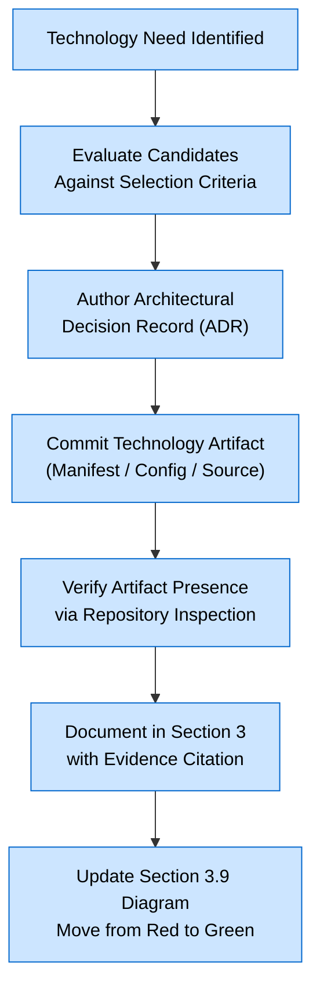

This workflow ensures that every technology selection is traceable from its evaluation rationale through its committed evidence to its documentation entry, preserving the evidence-based integrity that this baseline specification establishes.

### 3.11.3 Cross-Section Traceability

The Technology Stack section is anchored to the following cross-references for traceability:

| Cross-Reference | Purpose |
|-----------------|---------|
| Section 1.1.1 | Project identifier and commit hash establishing the baseline |
| Section 1.2.2 | Confirmation that no technology stack has been committed |
| Section 1.3.2 | Enumeration of demonstrably absent technology categories |
| Section 1.4.1 | Visual convention pattern for present/absent/metadata nodes |
| Section 2.2.2.3 | Git as system dependency; Markdown renderer as external dependency |
| Section 2.4.1 | Feature dependency map showing Git and Markdown renderer |
| Section 2.4.2 | Integration points confirming absence of external services |
| Section 2.5.1.4 | Security assessment confirming absence of third-party dependencies |
| Section 2.7.2 | Deferral template with triggering evidence requirements |
| Section 2.8.2 | Anti-fabrication constraint governing all documentation |

---

## 3.12 REFERENCES

### 3.12.1 Files Examined

- `README.md` — The single 11-byte file containing only the H1 markdown heading `# Artifact1`. This file is the sole content artifact in the repository and provides the entire evidentiary basis for the "Markdown" entry in Section 3.2.1 and the Markdown file-format constraints in Section 3.3.2.

### 3.12.2 Folders Examined

- `/` (repository root, depth 0) — Confirmed to contain only `README.md` as the sole tracked child file with no subdirectories. This folder inspection provides the evidentiary basis for all "None Committed" / "None Present" / "No" entries throughout Sections 3.3 through 3.8.

### 3.12.3 Repository Metadata Sources

- Git commit `b55de94` — Source of the version-control technology identification documented in Section 3.8.1; author metadata (Shalini, shalini@blitzy.com), initialization date (May 28, 2026), and canonical branch (`main`) are all derived from this commit's metadata.

### 3.12.4 Technical Specification Cross-References

- **Section 1.1.1 (Project Overview)** — Source of project identifier, commit hash, initialization date, and primary branch
- **Section 1.2.1 (Project Context)** — Source of integration-category absence evidence (API contracts, message schemas, service bindings, external connectors)
- **Section 1.2.2 (High-Level Description)** — Source of component-inventory absence evidence (source code, configuration, package manifests, build artifacts, tests, documentation) and the "undefined technical approach" baseline statement
- **Section 1.2.3 (Success Criteria)** — Source of KPI / SLA / observability absence evidence and the anti-fabrication principle for assumed metrics
- **Section 1.3.1 (In-Scope Elements)** — Source of in-scope element enumeration (Repository Identity Declaration, Version Control Initialization)
- **Section 1.3.2 (Out-of-Scope Elements)** — Source of demonstrably-absent category list (persistence, UI, auth, CI/CD, containerization, operational tooling, localization)
- **Section 1.3.3 (Scope Determination Methodology)** — Source of the four-step evidence-based methodology applied in Section 3.1.3
- **Section 1.4.1 (Baseline State Diagram)** — Source of visual convention pattern (green / red / yellow color coding) applied in Section 3.9.1
- **Section 1.4.2 (Diagram Legend)** — Source of legend conventions reused in Section 3.9.2
- **Section 1.4.3 (Evolution Expectations)** — Source of diagram-evolution expectations reused in Section 3.9.3
- **Section 2.1.1 (Baseline State Acknowledgement)** — Source of the explicit-deferral principle applied throughout Section 3
- **Section 2.1.2 (Methodology Applied)** — Source of methodology reused in Section 3.1.3
- **Section 2.2.2.3 (F-001 Dependencies)** — Source of Git system dependency and external Markdown renderer documentation
- **Section 2.4.1 (Feature Dependency Map)** — Source of the Git / Markdown / Renderer relationship pattern reused in Section 3.9.1
- **Section 2.4.2 (Integration Points)** — Source of absence evidence for all integration categories (internal services, external APIs, message brokers, databases)
- **Section 2.4.3 (Shared Components)** — Source of "no application-level shared libraries, utilities, or frameworks" statement
- **Section 2.5.1.1 (Technical Constraints for F-001)** — Source of Markdown file format constraints (H1 directive, UTF-8 encoding assumption, filename convention)
- **Section 2.5.1.4 (Security Implications for F-001)** — Source of "no third-party dependencies are declared" statement and authentication/authorization/secret-management absence evidence
- **Section 2.7.1 (Rationale for Deferral)** — Source of the deferral rationale pattern reused in Section 3.10.1
- **Section 2.7.2 (Deferred Feature Categories)** — Source of the "Triggering Evidence Required" deferral template applied in Section 3.10.2
- **Section 2.7.4 (Revision Expectations)** — Source of revision-expectation language reused in Section 3.10.4
- **Section 2.8.1 (Documented Assumptions)** — Source of Git-as-version-control-technology assumption and `main`-branch canonical assumption
- **Section 2.8.2 (Documented Constraints)** — Source of the anti-fabrication constraint governing all of Section 3

### 3.12.5 Search Operations Confirming Absence

The following search operations are documented in Section 1.5.4 and reaffirmed here as evidentiary basis for the absence assertions throughout Section 3:

- File-system inspection confirming only `README.md` and `.git/` exist in the repository
- Semantic search "package manifest dependencies requirements pyproject Cargo" — returned empty results
- Semantic search "Dockerfile container build configuration CI CD pipeline" — returned empty results
- Semantic search "programming language source code Python JavaScript TypeScript" — returned empty results
- Semantic search "database schema migration ORM persistence" — returned empty results
- Semantic search "framework library web server API" — returned empty results

# 4. Process Flowchart

## 4.1 BASELINE STATE ACKNOWLEDGEMENT

### 4.1.1 Repository Process Context

The Artifact1 repository is documented at commit `b55de94` in an explicitly declared initial / placeholder state, mirroring the technology-stack baseline acknowledgement established in Section 3.1.1. As established in Sections 1.1.1 (Project Overview), 1.2.2 (High-Level Description), and 2.2.1 (Feature Inventory Summary), the repository contains a single committed artifact — `README.md` — whose entire content is the H1 markdown heading `# Artifact1`. Section 2.6.4 (Related Process Flowcharts) records the consequence of this state directly:

> *"Because the repository contains no application logic, no behavioral process flowcharts exist beyond the structural baseline."*

Consequently, this Process Flowchart section documents **only those workflows that are evidenced by committed artifacts** at commit `b55de94`. The substantive process categories ordinarily catalogued in this section — core business processes, integration workflows, event processing flows, batch processing sequences, state machines, transaction boundaries, retry logic, and error handling — have no corresponding evidence in the repository. These categories are therefore catalogued as **deferred pending committed evidence**, consistent with the deferral pattern established in Section 2.7 and Section 3.10.

### 4.1.2 Documentation Methodology for Process Flowcharts

The methodology employed for this section is consistent with the Scope Determination Methodology defined in Section 1.3.3 and the documentation approach established in Section 3.1.3:

1. **Identity Verification** — Process steps are documented only when directly evidenced by committed repository contents or by the deterministic verification method defined in Section 2.3.2.4.
2. **Metadata Verification** — Workflow actors and system boundaries are identified from Git commit metadata at commit `b55de94` and from the dependency declarations in Section 2.2.2.3.
3. **Absence Verification** — Categories of workflow confirmed absent through directory traversal and semantic search (per Section 1.5.4) are explicitly listed as deferred with a "Triggering Evidence Required" table, rather than fabricated.
4. **Traceability Anchoring** — Every documented process element is cross-referenced to its evidentiary source within this Technical Specification.

### 4.1.3 Anti-Fabrication Constraints

The constraints articulated in Section 2.8.2 govern this section's authoring with particular force:

| Constraint | Application to Section 4 |
|------------|--------------------------|
| Documentation must be grounded in committed evidence | Only the F-001 verification workflow may be documented as a present process |
| Fabrication of features, users, or metrics is prohibited | No SLAs, retry counts, timeout values, or KPIs are invented; per Section 2.3.2.2, performance criteria for F-001-RQ-001 are formally Not Applicable |
| Section structure must follow the prompt's prescribed format | Empty process categories are explicitly marked as deferred rather than omitted |

Section 1.2.3 reinforces this constraint by explicitly excluding "*assumed SLAs or KPIs not found in code*" from the documentation.

### 4.1.4 Canonical Reference Diagrams Already Established

Per Section 2.6.4, the following previously authored Mermaid diagrams already serve as the canonical structural flow representations for the project's present state. They are referenced here rather than re-rendered to preserve a single source of truth:

| Diagram | Source Section | Role for Section 4 |
|---------|----------------|---------------------|
| Baseline State Diagram | Section 1.4.1 | Canonical structural baseline of the repository |
| Feature Dependency Map | Section 2.4.1 | Canonical realization-relationship view for F-001 |
| Technology Stack Diagram | Section 3.9.1 | Canonical technology-context view for the workflow actors |

Section 4 introduces additional Mermaid representations that focus specifically on the behavioral verification sequence for F-001-RQ-001 and on the deferred process landscape, while inheriting the visual conventions defined in Sections 1.4.2 and 3.9.2.

---

## 4.2 VERIFIABLE WORKFLOW — F-001 REPOSITORY IDENTITY DECLARATION

### 4.2.1 Sole Documentable Workflow

The only behavioral sequence with evidentiary support in the repository is the **F-001 Repository Identity Declaration verification process**, derived from Section 2.3.2.4. This is a deterministic, three-step verification methodology that operates over the static `README.md` artifact, the Git metadata, and the asserted external Markdown renderer documented in Section 2.2.2.3. It does not involve runtime code execution, user interaction, or persistent state mutation, because — per Section 2.3.2.2 — *"the requirement is satisfied by static file content"* and *"no runtime behavior, no throughput or latency profile is associated with a static text file."*

### 4.2.2 F-001 Verification Process Flowchart

The verification workflow contains three sequential decision points, each corresponding to one of the three acceptance criteria enumerated in Section 2.3.2.1. The diagram below visualizes the complete decision path, including all failure terminations.

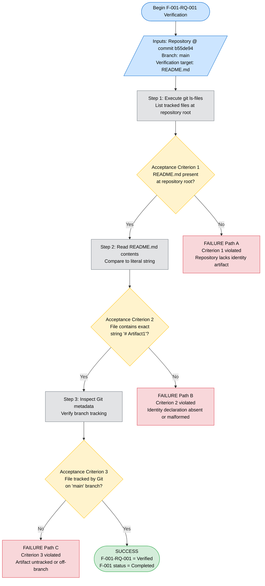

### 4.2.3 Decision Point Detail

Each decision point in the workflow is grounded in a specific acceptance criterion documented in Section 2.3.2.1. The mapping is provided below.

| Decision Point | Acceptance Criterion | Verification Action (per Section 2.3.2.4) | Outcome When True | Outcome When False |
|----------------|----------------------|--------------------------------------------|--------------------|---------------------|
| Check 1 | A file named `README.md` exists at the repository root | Execute `git ls-files`; confirm presence | Continue to Check 2 | Terminate — Failure Path A |
| Check 2 | The file contains the exact string `# Artifact1` | Read file contents; compare for equivalence | Continue to Check 3 | Terminate — Failure Path B |
| Check 3 | The file is tracked by Git on the `main` branch | Inspect Git metadata for branch tracking | Terminate — Success | Terminate — Failure Path C |

Section 2.3.2.4 records that *"this verification methodology was applied during the authoring of this specification and yielded a positive result, supporting the Completed status of F-001."* Section 2.6.3 corroborates the verified status at the specification authoring time.

### 4.2.4 Actors and System Boundaries

The workflow involves a minimal set of actors and system boundaries, all of which are evidenced in the repository or its Git metadata. The actor inventory below is derived from Section 2.2.2.3 (Dependencies) and Section 2.4.1 (Feature Dependency Map).

| Actor / System | Type | Evidentiary Source | Role in Workflow |
|----------------|------|--------------------|-------------------|
| Verifier (Specification Author) | Human actor | Section 1.1.3; Git commit author metadata | Executes verification steps |
| Artifact1 Repository | Subject system | Section 1.1.1; commit `b55de94` | Provides the artifact under verification |
| `README.md` artifact | Verification target | Section 2.3.2.1 evidence row | Contains the identity declaration |
| Git Version Control System | System dependency | Section 2.2.2.3; commit `b55de94` | Provides file tracking and branch metadata |
| Markdown Renderer | External, unspecified | Sections 2.2.2.3, 2.4.1, 3.9.1 | Asserted downstream consumer (not invoked during verification) |

Per Section 1.1.3, **no end users, administrators, or integrators have been identified** because no user-facing artifacts, administrative interfaces, or integration contracts are present. The "Verifier" role denotes the human or automated agent executing the deterministic verification methodology rather than any application user.

### 4.2.5 Integration Sequence — Asserted External Rendering Touchpoint

A single integration touchpoint is referenced in the repository's dependency declarations: the asserted external Markdown rendering of `README.md` documented in Sections 2.2.2.3, 2.4.1, and 3.9.1. The repository does not declare a specific renderer, ship rendering code, or define any rendering contract; the touchpoint is therefore catalogued as **external and unspecified**. The sequence diagram below visualizes the verification interactions and the asserted external rendering touchpoint, with the latter shown as a dashed (non-evidenced) interaction.

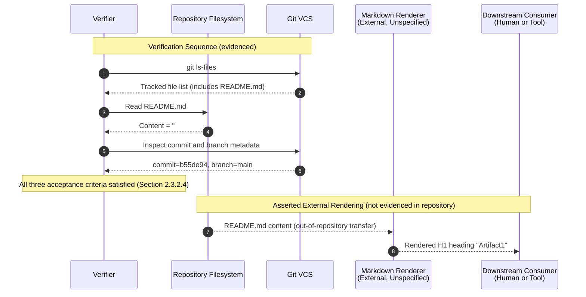

The rendering touchpoint is included for completeness because Section 2.2.2.3 declares it as an external dependency for the feature's intended downstream behavior. It does not represent code, configuration, or contracts within the repository.

### 4.2.6 Validation Rules

The validation rules applicable to the F-001 verification workflow are reproduced from Section 2.3.2.3 without modification. They constitute the complete set of validation rules evidenced in the repository.

| Validation Category | Rule | Source |
|---------------------|------|--------|
| Business Rules | Not Applicable — no business logic is present in the repository | Section 2.3.2.3, Section 1.2.2 |
| Data Validation | `README.md` must contain at minimum the exact string `# Artifact1` to satisfy acceptance | Section 2.3.2.3 |
| Authorization Checkpoints | None — no authentication, authorization, or input handling is present | Section 2.3.2.3, Section 1.3.2 |
| Regulatory Compliance Checks | None — no regulatory, licensing, or compliance artifacts are present | Section 2.3.2.3 |

### 4.2.7 Timing, SLA, and Performance Considerations

Per Section 2.3.2.2 and Section 1.2.3, no timing constraints, SLAs, performance budgets, or observability constructs are evidenced in the repository. The performance criteria for F-001-RQ-001 are formally documented as *"Not Applicable — no runtime behavior, no throughput or latency profile is associated with a static text file."* Consequently:

- **No SLA values** are asserted in this section.
- **No timing constraints** (timeouts, deadlines, retry intervals) are asserted in this section.
- **No KPIs or success metrics** beyond the boolean satisfaction of the three acceptance criteria are asserted in this section.

This treatment is consistent with the anti-fabrication constraint in Section 2.8.2 and the explicit deferral of KPIs and SLAs in Section 2.7.3.

---

## 4.3 SYSTEM WORKFLOWS

### 4.3.1 Core Business Processes

No core business processes are evidenced by the repository at commit `b55de94`. Section 2.3.2.3 records that *"Business Rules — Not Applicable — no business logic is present in the repository per Section 1.2.2."* The Feature Catalog in Section 2.2.1 enumerates exactly one feature (F-001), which is classified as *"Project Initialization / Metadata"* rather than a business process, and which is fully realized by the static content of `README.md`.

Consequently, the following business-process subcategories listed in the section prompt cannot be authored without fabricating content and are explicitly deferred:

| Deferred Subcategory | Reason | Evidentiary Source for Absence |
|----------------------|--------|--------------------------------|
| End-to-end user journeys | No users identified; no user-facing artifacts present | Section 1.1.3, Section 2.7.3 |
| System interactions | No services exist between which interactions could flow | Section 1.2.2, Section 2.4.2 |
| Decision points (business) | No business logic present in repository | Section 2.3.2.3, Section 1.2.2 |
| Error handling paths (business) | No executable code → no runtime errors → no recovery paths | Section 1.3.2, Section 2.5.1.4 |

### 4.3.2 Integration Workflows

No integration workflows are evidenced by the repository. Section 2.4.2 records that all integration-point categories are confirmed absent:

| Integration Point Category | Status (per Section 2.4.2) |
|----------------------------|----------------------------|
| Internal Service Integrations | None |
| External API Integrations | None |
| Message Broker Integrations | None |
| Database Integrations | None |

The corresponding integration-workflow subcategories listed in the section prompt are therefore deferred:

| Deferred Subcategory | Reason | Evidentiary Source for Absence |
|----------------------|--------|--------------------------------|
| Data flow between systems | No services and no persistence layer present | Section 1.2.2, Section 2.4.2 |
| API interactions | No API contracts (OpenAPI, GraphQL, Protobuf) present | Section 1.2.1, Section 3.6 |
| Event processing flows | No event schemas, brokers, or handlers present | Section 1.2.1, Section 2.4.2 |
| Batch processing sequences | No batch scripts, schedulers, or job definitions present | Section 1.2.1, Section 3.8 |

### 4.3.3 Triggering Evidence Required for System Workflows

Following the deferral template established in Section 2.7.2 and Section 3.10.2, the table below identifies the specific committed artifact that would trigger inclusion of each currently deferred system-workflow category in a future revision of this section.

| Deferred Workflow Category | Triggering Evidence Required |
|----------------------------|------------------------------|
| End-to-end user journey flowcharts | Committed UI components, user stories, or session-handling code |
| System-to-system interaction diagrams | Committed service definitions, RPC stubs, or inter-service messaging code |
| API interaction sequences | Committed OpenAPI / GraphQL / Protobuf schemas or HTTP client/server code |
| Event processing flows | Committed event schemas, broker bindings, or event handler implementations |
| Batch processing sequences | Committed scheduler configuration, job manifests, or batch processing scripts |
| Business decision logic | Committed rules engines, decision tables, or business-logic modules |

---

## 4.4 TECHNICAL IMPLEMENTATION

### 4.4.1 State Management

No state management constructs are evidenced by the repository. The only "state" in the system is the static byte content of `README.md` itself, which does not transition during any documentable workflow. The subcategories listed in the section prompt are deferred as follows:

| Deferred Subcategory | Reason | Evidentiary Source for Absence |
|----------------------|--------|--------------------------------|
| State transitions | No state machines, workflow engines, or stateful entities present | Section 1.2.2, Section 2.5 |
| Data persistence points | No persistence layer present | Section 2.4.2, Section 3.7 |
| Caching requirements | No caching configuration present | Section 3.9.1 (AbsentTech subgraph), Section 3.10.2 |
| Transaction boundaries | No transaction coordinators or data mutation code present | Section 2.5, Section 3.7 |

### 4.4.2 Error Handling

No error handling constructs are evidenced by the repository. Section 1.3.2 records that no executable code is present, which entails that there are no runtime errors to handle, no inputs to validate, and no integration failures to recover from. The subcategories listed in the section prompt are deferred as follows:

| Deferred Subcategory | Reason | Evidentiary Source for Absence |
|----------------------|--------|--------------------------------|
| Retry mechanisms | No code paths exist that could be retried | Section 1.2.2, Section 1.3.2 |
| Fallback processes | No primary processes exist for which fallbacks could be defined | Section 1.2.2, Section 2.4.2 |
| Error notification flows | No notification, logging, or alerting instrumentation present | Section 1.2.3, Section 3.9.1 |
| Recovery procedures | No persistent state exists requiring recovery | Section 2.4.2, Section 3.7 |

### 4.4.3 Triggering Evidence Required for Technical Implementation

| Deferred Technical Implementation Category | Triggering Evidence Required |
|--------------------------------------------|------------------------------|
| State transitions | Committed state-machine definitions, workflow engine configurations, or stateful domain entities |
| Data persistence | Committed schemas, ORM models, migration scripts, or database connection code |
| Caching | Committed cache-client initialization, cache configuration files, or in-memory cache abstractions |
| Transaction management | Committed transaction-manager wiring, unit-of-work patterns, or saga orchestration code |
| Retry / circuit breaker logic | Committed retry-policy declarations, circuit-breaker libraries, or resilience middleware |
| Error notification | Committed logging, metrics, tracing, alerting, or APM SDK initializations |
| Recovery procedures | Committed disaster-recovery runbooks, backup scripts, or compensation handlers |

---

## 4.5 REQUIRED DIAGRAMS RECONCILIATION

This subsection reconciles each diagram type explicitly required by the section prompt against the evidentiary state of the repository.

### 4.5.1 High-Level System Workflow Diagram

The high-level system workflow at commit `b55de94` is consequently minimal because the repository contains only the verification-target artifact and its Git metadata. The diagram below depicts the complete system context for the only verifiable workflow, integrating actors from Section 2.4.1 and inheriting the color conventions from Sections 1.4.2 and 3.9.2.

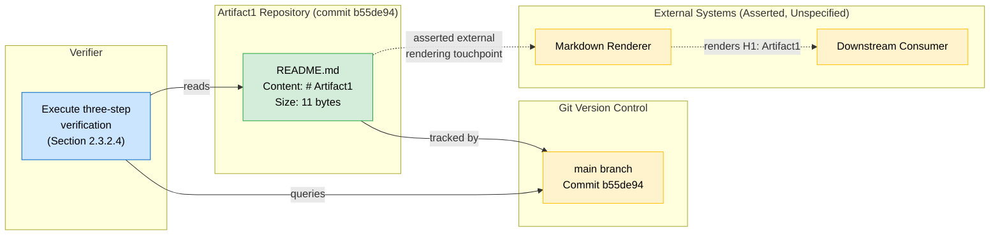

Each `subgraph` in the diagram represents a swim lane corresponding to a distinct actor or system boundary, satisfying the prompt's swim-lane requirement.

### 4.5.2 Detailed Process Flow for Each Core Feature

The Feature Catalog in Section 2.2.1 contains exactly one feature, F-001. The detailed process flow for this single core feature is the F-001 verification flowchart rendered in Section 4.2.2. No additional detailed process flows exist because no additional features exist.

| Feature ID | Feature Name | Detailed Process Flow Location |
|------------|--------------|--------------------------------|
| F-001 | Repository Identity Declaration | Section 4.2.2 |

### 4.5.3 Error Handling Flowcharts

Error handling flowcharts are **deferred**. No executable code, input handling, integration code, or persistent state is present in the repository, and therefore no error conditions or recovery paths can be documented without fabrication. Per Section 4.4.2, this category is reactivated when committed code introduces runtime behavior. The triggering evidence required is enumerated in Section 4.4.3.

### 4.5.4 Integration Sequence Diagrams

The only integration touchpoint asserted in the repository is the external, unspecified Markdown rendering relationship documented in Sections 2.2.2.3 and 2.4.1. This single asserted touchpoint is depicted in the sequence diagram in Section 4.2.5. **All other integration sequence diagrams are deferred** because no internal services, external APIs, message brokers, or databases are present (Section 2.4.2). The triggering evidence required is enumerated in Section 4.3.3.

### 4.5.5 State Transition Diagrams

State transition diagrams are **deferred** because no state machines, workflow engines, or stateful entities are present in the repository (Section 4.4.1). For completeness, the diagram below depicts the only "state" verifiable at commit `b55de94` — a single static placeholder state with no transitions — together with a note explicitly recording that transition modeling is deferred.

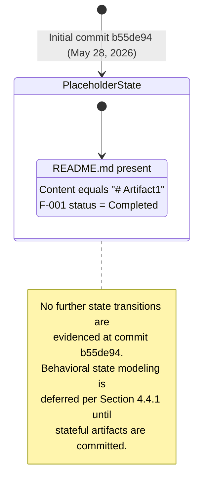

The triggering evidence required to introduce genuine state transition modeling is enumerated in Section 4.4.3.

---

## 4.6 EVOLUTION EXPECTATIONS

### 4.6.1 Triggering Conditions for Section Re-Authoring

This Process Flowchart section will be re-authored in subsequent revisions of the Technical Specification when committed artifacts provide an evidentiary basis for additional workflows. The expected pattern of growth mirrors the evolution expectations articulated in Section 1.4.3, Section 2.7.4, and Section 3.10.4. The following sequence of committed artifacts is anticipated to trigger expansion of the corresponding subsections:

| Committed Artifact (Future) | Triggers Expansion Of |
|------------------------------|------------------------|
| First source-code file in any language | Section 4.3.1 (Core Business Processes — initial process diagrams) |
| First API contract (OpenAPI / GraphQL / Protobuf) | Section 4.3.2 and Section 4.5.4 (API interaction sequence diagrams) |
| First message schema or event broker binding | Section 4.3.2 (event processing flows) |
| First scheduler or batch job definition | Section 4.3.2 (batch processing sequences) |
| First state machine, workflow engine, or stateful entity | Section 4.4.1 and Section 4.5.5 (state transition diagrams) |
| First persistence-layer artifact (schema, ORM, migration) | Section 4.4.1 (data persistence points and transaction boundaries) |
| First caching configuration | Section 4.4.1 (caching requirements) |
| First retry, circuit-breaker, or resilience-pattern artifact | Section 4.4.2 (retry mechanisms and fallback processes) |
| First logging, metrics, tracing, or alerting instrumentation | Section 4.4.2 (error notification flows) |
| First identity-provider or auth-middleware configuration | Section 4.2.6 (authorization checkpoints) |

### 4.6.2 Expected Sequence of Documentation Growth

Per Section 1.4.3, *"As implementation artifacts are committed, the 'Absent Artifact Categories' subgraph will shrink and corresponding 'present' nodes will be added to the main graph."* For Section 4, this translates to the following expected sequence:

1. **Phase A — Placeholder (current)** — Only the F-001 verification workflow is documented. All other subsections are deferred with Triggering Evidence Required tables.
2. **Phase B — Initial Implementation** — As source code, configuration, and dependency manifests are committed, the deferred subsections in Sections 4.3 and 4.4 progressively become populated. The high-level system workflow diagram in Section 4.5.1 expands to include the newly committed actors and components.
3. **Phase C — Operationalization** — As observability, retry/resilience, and persistence artifacts are committed, the error handling and state management subsections become substantive, and Sections 4.5.3 and 4.5.5 are re-authored with concrete flowcharts and state machines.
4. **Phase D — Steady State** — All sections of the prompt are populated with evidence-grounded content, and the deferral tables are retired.

Each new workflow documented in a future revision should be accompanied by:

1. **Committed artifact evidence** — source files, configuration, or contracts that demonstrate the workflow exists.
2. **Cross-reference traceability** — links to the requirement and feature catalog entries that the workflow realizes.
3. **Validation rule mapping** — explicit mapping of business rules, data validation, authorization checkpoints, and compliance checks to specific workflow steps.
4. **Timing and SLA declaration** — explicit timing constraints (where applicable) backed by evidence such as performance budgets, contractual SLAs, or instrumented thresholds.

---

## 4.7 REFERENCES

### 4.7.1 Files Examined

- `README.md` — Sole content artifact in the repository (11 bytes, single line `# Artifact1`). Provides the verification target for the F-001 workflow documented in Section 4.2.

### 4.7.2 Folders Explored

- `/` (repository root, depth 0) — Confirmed via directory traversal and `git ls-files` to contain only `README.md` and the `.git/` metadata directory; no subdirectories containing source code, configuration, or build artifacts exist.

### 4.7.3 Search Operations Confirming Workflow Absence

- Semantic search: "workflow business process flow user journey state machine" — empty result set
- Semantic search: "API endpoint handler controller route integration" — empty result set
- Semantic search: "error handling retry transaction state management" — empty result set
- Folder search: "application source code business logic services modules" — empty result set

Each empty result set corroborates the deferral classifications used throughout Sections 4.3, 4.4, and 4.5.

### 4.7.4 Technical Specification Sections Referenced

- **Section 1.1 EXECUTIVE SUMMARY** — Repository identity, stakeholder identification (Section 1.1.3), and project overview supporting the actor inventory in Section 4.2.4
- **Section 1.2 SYSTEM OVERVIEW** — Absence baselines for system capabilities, components, and integrations (Sections 1.2.1, 1.2.2, 1.2.3) underpinning the deferrals in Sections 4.3 and 4.4
- **Section 1.3 SCOPE** — In-scope element scoping (Section 1.3.1) and demonstrable-absence treatment (Section 1.3.2) supporting validation rule documentation in Section 4.2.6
- **Section 1.4 REPOSITORY BASELINE STATE** — Baseline state diagram (Section 1.4.1), visual conventions (Section 1.4.2), and evolution expectations (Section 1.4.3) inherited by Section 4
- **Section 1.5 REFERENCES** — Search operations (Section 1.5.4) verifying absence claims used in Sections 4.3, 4.4, and 4.7.3
- **Section 2.1 DOCUMENTATION APPROACH AND CONSTRAINTS** — Evidence-grounding constraints (Section 2.1.1) informing Section 4.1.3
- **Section 2.2 FEATURE CATALOG** — F-001 feature definition (Section 2.2.2) and dependency catalog (Section 2.2.2.3) supporting the actor inventory in Section 4.2.4
- **Section 2.3 FUNCTIONAL REQUIREMENTS TABLE** — F-001-RQ-001 requirement details (Section 2.3.2.1), technical specifications (Section 2.3.2.2), validation rules (Section 2.3.2.3), and verification method (Section 2.3.2.4) supporting Sections 4.2.2, 4.2.3, 4.2.6, and 4.2.7
- **Section 2.4 FEATURE RELATIONSHIPS** — Feature Dependency Map (Section 2.4.1) and integration point inventory (Section 2.4.2) supporting Sections 4.2.4, 4.2.5, and 4.3.2
- **Section 2.5 IMPLEMENTATION CONSIDERATIONS** — Technical constraint baselines supporting Sections 4.4.1 and 4.4.2
- **Section 2.6 TRACEABILITY MATRIX** — Related Process Flowcharts (Section 2.6.4) explicitly designating Sections 1.4.1 and 2.4.1 as canonical reference diagrams for Section 4
- **Section 2.7 DEFERRED REQUIREMENTS** — Deferral template (Section 2.7.2) and revision expectations (Section 2.7.4) reused in Sections 4.3.3, 4.4.3, and 4.6
- **Section 2.8 ASSUMPTIONS AND CONSTRAINTS** — Anti-fabrication constraint (Section 2.8.2) governing Section 4.1.3
- **Section 3.1 BASELINE STATE ACKNOWLEDGEMENT** — Baseline acknowledgement and documentation methodology (Sections 3.1.1, 3.1.3) mirrored in Sections 4.1.1 and 4.1.2
- **Section 3.6 THIRD-PARTY SERVICES** — Confirmation of absent third-party integrations supporting Section 4.3.2
- **Section 3.7 DATABASES AND STORAGE** — Confirmation of absent persistence layer supporting Section 4.4.1
- **Section 3.9 TECHNOLOGY STACK DIAGRAM** — Visual conventions (Section 3.9.2) and external actor identification (Section 3.9.1) inherited by Section 4
- **Section 3.10 DEFERRED TECHNOLOGY SELECTIONS** — Deferral structure (Section 3.10.2) mirrored in Sections 4.3.3 and 4.4.3
- **Section 3.12 REFERENCES** — Search-operation evidence trail supporting Section 4.7.3

# 5. System Architecture

This section documents the system architecture of the **Artifact1** repository at commit `b55de94`. Consistent with the evidence-based documentation methodology applied throughout Sections 1 through 4 — and the anti-fabrication constraint formally recorded in Section 2.8.2 — the architecture described here is grounded exclusively in committed repository content. Every architectural concern for which no committed evidence exists is explicitly deferred using the *Triggering Evidence Required* template established in Section 2.7.2 and reused in Sections 3.10.2, 4.3.3, and 4.4.3.

## 5.1 HIGH-LEVEL ARCHITECTURE

### 5.1.1 System Overview

#### 5.1.1.1 Overall Architectural Style and Rationale

The Artifact1 repository does not commit any executable architecture. Per Section 1.2.2, *"No technology stack, framework, programming language, database technology, runtime platform, or architectural pattern has been selected and committed to the repository. The technical approach is undefined at this baseline."* Consequently, **no architectural style** (monolithic, microservices, serverless, client-server, event-driven, hexagonal, layered, or otherwise) is currently in force.

The system, as it exists at commit `b55de94`, is most accurately characterized as a **static identity artifact under distributed version control**:

- The sole content artifact is `README.md`, an 11-byte UTF-8 text file containing the literal H1 declaration `# Artifact1` (verified in Section 1.1.1 and Section 1.4.1).
- The sole versioning mechanism is Git, evidenced by the initial commit `b55de94` on branch `main` (Section 2.8.1).
- The sole asserted external touchpoint is an unspecified Markdown renderer (Sections 2.2.2.3, 2.4.1, 3.9.1).

This minimal topology — one content file, one version-control dependency, one asserted external rendering relationship — is the entire architecture currently substantiated by committed evidence. The "architectural style" question is therefore deferred until the first source file, dependency manifest, configuration file, or architectural decision record is committed (see Section 5.3.2 deferral table).

#### 5.1.1.2 Key Architectural Principles and Patterns

The only architectural principles presently in force are documentation principles inherited from the broader specification:

- **Evidence-grounded documentation** — Per Section 2.8.2, every documented element must be substantiated by a committed artifact; speculative architecture is prohibited.
- **Explicit deferral over silent omission** — Per Section 2.1.1, categories lacking evidence are retained in the document structure and marked as deferred with triggering evidence requirements.
- **Conventional file placement** — Per Section 2.5.1.1, the identity artifact follows platform conventions (`README.md` at the repository root, H1 directive on the first line).
- **Single canonical branch** — Per Section 2.8.1, the `main` branch is the canonical project history; deviations require a new commit on `main`.

No runtime patterns (e.g., CQRS, event sourcing, saga orchestration, circuit-breaker, retry-with-backoff) are present, because no executable code exists for such patterns to govern (Section 4.4.2).

#### 5.1.1.3 System Boundaries and Major Interfaces

The system boundary is drawn around the repository root. The table below enumerates each boundary component and its evidentiary basis.

| Boundary Component | Status | Evidence Source |
|--------------------|--------|-----------------|
| In-Repository Content | `README.md` only (11 bytes) | Section 1.1.1, Section 1.4.1 |
| Repository Metadata | Git commit `b55de94`, branch `main` | Section 2.8.1, Section 1.1.1 |
| External Dependency (Asserted) | Markdown Renderer — unspecified vendor or library | Section 2.2.2.3, Section 3.9.1 |
| End-User Boundary | No users identified | Section 1.1.3 |

The major interfaces in this minimal topology are summarized below. Only one interface (`README.md` ↔ Git VCS) is verifiable from committed artifacts; the rendering interface is asserted but unspecified.

| Interface | Direction | Evidentiary Status |
|-----------|-----------|--------------------|
| `README.md` ↔ Git VCS | Tracked-by | Verified — commit `b55de94` |
| `README.md` ↔ Markdown Renderer | Rendered-by | Asserted, not evidenced in repository |
| Application APIs / RPC / Messaging | Inbound or outbound | None present (Section 2.4.2) |
| Database / Cache / Queue interfaces | Outbound | None present (Sections 3.7, 3.6.1) |

### 5.1.2 Core Components

#### 5.1.2.1 Core Components Table

Exhaustive repository inspection yields exactly one documentable component — the `README.md` identity artifact. Every other architectural component category enumerated in conventional software architectures is confirmed absent per Section 1.2.2.

| Component Name | Primary Responsibility | Key Dependencies | Integration Points |
|----------------|------------------------|------------------|--------------------|
| `README.md` Identity Artifact | Declares the project identifier `Artifact1` via an H1 markdown heading; realizes feature F-001 | Git VCS (system dependency, Section 2.2.2.3); Markdown Renderer (external, unspecified) | Tracked by Git on the `main` branch; asserted external rendering touchpoint |

#### 5.1.2.2 Critical Considerations per Component

For the single documentable component, the following critical considerations apply (derived from Sections 2.2.2.2, 2.5.1, and 2.8.1):

| Consideration | Description |
|---------------|-------------|
| Content Immutability Path | Modifications require a new Git commit on the `main` branch (Section 2.5.1.1) |
| Encoding Assumption | UTF-8 is assumed; no explicit encoding declaration is committed (Section 2.5.1.1) |
| Failure Modes | Three deterministic failure paths exist in the verification workflow (Section 4.2.2 Paths A, B, C); no runtime failure modes apply |
| Foundational Status | F-001 is foundational and has no prerequisite features (Section 2.2.2.3) |

#### 5.1.2.3 Confirmed-Absent Component Categories

The following component categories are confirmed absent and are deferred to future revisions of this section (see Section 5.3.2 for triggering evidence):

- Application services, modules, packages, or libraries (Section 1.2.2)
- HTTP / RPC / gRPC servers or clients (Section 2.4.2, Section 3.6.1)
- Message brokers, queues, or event handlers (Section 2.4.2, Section 4.3.2)
- Databases, caches, or object stores (Section 3.7)
- Authentication, authorization, or identity components (Section 3.6.2, Section 2.5.1.4)
- Observability components — logging, metrics, tracing, alerting (Section 3.6.3)
- Front-end, mobile, or desktop UI components (Section 1.3.2)
- Build, packaging, containerization, or deployment components (Section 3.8 referenced via Section 3.9.1)

### 5.1.3 Data Flow Description

#### 5.1.3.1 Primary Data Flows

The only documentable data flow is the **F-001 Verification Sequence**, depicted as a sequence diagram in Section 4.2.5 and as a flowchart in Section 4.2.2. The flow consists of three deterministic, read-only interactions executed by the Verifier:

1. **Tracked-file enumeration** — The Verifier issues `git ls-files`; the Git VCS returns the tracked file list, which must include `README.md` to satisfy Acceptance Criterion 1.
2. **Content read** — The Verifier reads `README.md` from the filesystem; the file content must equal the exact string `# Artifact1` to satisfy Acceptance Criterion 2.
3. **Branch verification** — The Verifier inspects Git metadata; the file must be tracked on branch `main` at commit `b55de94` to satisfy Acceptance Criterion 3.

No write paths, mutation paths, or stateful transitions exist in the repository. Section 4.4.1 records that *"the only 'state' in the system is the static byte content of `README.md` itself, which does not transition during any documentable workflow."*

#### 5.1.3.2 Integration Patterns and Protocols

Only two protocols are evidenced or asserted:

| Protocol | Use | Evidentiary Status |
|----------|-----|--------------------|
| Git protocol (local working-tree operations) | File tracking, branch metadata inspection | Verified — commit `b55de94` |
| Markdown (CommonMark / GFM-compatible, variant unspecified) | Text format expressing the H1 directive | Verified — file content `# Artifact1` |

All other integration patterns — REST, GraphQL, gRPC, AMQP, MQTT, Kafka, WebSocket, JDBC/ODBC, SQL — are confirmed absent (Section 2.4.2, Section 3.6.1).

#### 5.1.3.3 Data Transformation Points

There are **no in-repository data transformation points**. The only transformation associated with the system — converting the Markdown source `# Artifact1` into a rendered H1 heading — occurs **outside** the repository within the unspecified external Markdown renderer asserted in Section 2.2.2.3. The transformation is not implemented, configured, or contracted within the repository.

#### 5.1.3.4 Key Data Stores and Caches

There are **no application data stores or caches** in the repository. Per Section 3.7, no relational, document, key-value, graph, time-series, search, wide-column, or vector databases are present. Per Section 3.7.3, no Redis, Memcached, Hazelcast, in-process, or HTTP-cache configurations exist. The only "store" verifiable at commit `b55de94` is the Git-tracked working tree itself, which holds the single `README.md` artifact (Section 3.7.4).

### 5.1.4 External Integration Points

Per Section 2.4.2 and Section 3.6.1, every conventional category of external integration is confirmed absent. The table below catalogs the only two external-facing touchpoints — one verified (Git VCS metadata) and one asserted (Markdown renderer) — together with the integration categories that are confirmed absent and therefore have no SLA to assert.

| System Name | Integration Type | Data Exchange Pattern | Protocol / Format |
|-------------|------------------|------------------------|-------------------|
| Git Version Control System | Versioning metadata | Local repository operations | Git protocol |
| Markdown Renderer (External, Unspecified) | One-way content consumption (asserted, not evidenced) | Static content read | Markdown text (variant unspecified) |
| Internal Service Integrations | — | — | None present (Section 2.4.2) |
| External API Integrations | — | — | None present (Section 3.6.1) |
| Message Broker Integrations | — | — | None present (Section 2.4.2) |
| Database Integrations | — | — | None present (Section 3.7.1) |
| Webhook Endpoints / Third-Party SDKs | — | — | None present (Section 3.6.1) |

**SLA Requirements**: Per Section 1.2.3, *"No KPIs, SLAs, performance budgets, observability constructs, or monitoring instrumentation are present in the codebase."* Section 2.7.3 explicitly defers KPIs and SLAs. Section 4.2.7 reinforces that for the only documentable workflow, *"No SLA values are asserted in this section. No timing constraints (timeouts, deadlines, retry intervals) are asserted in this section."* Consequently, no SLA values are asserted for any external integration in this revision. Each future integration must be accompanied by explicit SLA declarations backed by evidence, as enumerated in Section 4.6.2.

---

## 5.2 COMPONENT DETAILS

### 5.2.1 README.md Identity Artifact

#### 5.2.1.1 Purpose and Responsibilities

The `README.md` artifact realizes feature **F-001 (Repository Identity Declaration)** as catalogued in Section 2.2.1. Its sole responsibility is to declare the project identifier `Artifact1` via a single top-level Markdown H1 heading. Per Section 2.2.2.2, the business value provided is that the artifact *"provides the only verifiable project identifier evidenced in the codebase; enables repository discovery, naming, and reference by humans and tooling."*

The artifact has no executable behavior, accepts no inputs, mutates no state, and emits no events. Section 2.5.1.2 records that the artifact has *"no runtime, execution path, or measurable performance profile."*

#### 5.2.1.2 Technologies and Frameworks Used

The component is expressed using exactly two technologies, both documented in Section 3.9.1:

| Technology | Role | Evidence |
|------------|------|----------|
| Markdown (variant unspecified) | File format expressing the H1 directive | `.md` extension; H1 marker `#` at file start |
| Git (distributed version control) | Versioning and tracking of the artifact | Commit `b55de94`, branch `main` |

No programming languages, frameworks, libraries, or runtime dependencies are present (Sections 3.3, 3.4, 3.5).

#### 5.2.1.3 Key Interfaces and APIs

The artifact exposes **no programmatic interfaces or APIs**. It is a static file with two relational interfaces:

| Interface | Counterparty | Direction | Evidentiary Status |
|-----------|--------------|-----------|--------------------|
| File-tracking interface | Git VCS | Bidirectional (Git tracks; Verifier queries) | Verified at commit `b55de94` |
| Rendering interface | Markdown Renderer (external, unspecified) | Outbound (file content is consumed by renderer) | Asserted only; no contract in repository |

No HTTP endpoints, RPC contracts, GraphQL schemas, Protobuf definitions, or SDK bindings are present (Section 3.6.1, Section 2.4.2).

#### 5.2.1.4 Data Persistence Requirements

The component persists as a single UTF-8 text file of approximately 11 bytes stored in the Git-tracked working tree (Sections 1.1.1, 2.5.1.1, 3.7.4). It requires **no database**, **no cache**, **no object store**, and **no managed persistence service** (Section 3.7). Modifications require a new Git commit on the `main` branch to take effect in the canonical project history (Section 2.5.1.1).

#### 5.2.1.5 Scaling Considerations

Per Section 2.5.1.3, scalability is **Not Applicable**: *"A static project identifier does not scale with users, load, data volume, or geographic distribution. No scaling dimensions are present in the baseline repository state."* Horizontal scaling, vertical scaling, sharding, partitioning, replication, and load-balancing concerns are all deferred pending committed evidence of a runtime workload.

### 5.2.2 Component Interaction Diagram

The diagram below visualizes the complete component interaction graph at commit `b55de94`. It inherits the color conventions established in Sections 1.4.2 and 3.9.2 (green = present and verified; yellow = repository metadata or external unspecified component; red = confirmed absent) and is consistent with the Feature Dependency Map in Section 2.4.1 and the Technology Stack Diagram in Section 3.9.1.

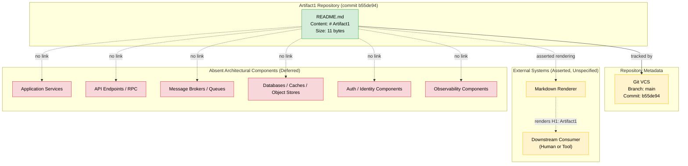

### 5.2.3 State Transition View

#### 5.2.3.1 Single-State Model

The component has exactly one verifiable state at commit `b55de94`: the `PlaceholderState` in which `README.md` is present with content equal to `# Artifact1` and F-001 status is `Completed`. No transitions are evidenced. The canonical state-transition placeholder is rendered in Section 4.5.5 and is referenced here without duplication. Per Section 4.4.1, *"the only 'state' in the system is the static byte content of `README.md` itself, which does not transition during any documentable workflow."*

#### 5.2.3.2 State Modeling Deferral

State machine modeling, lifecycle management, stateful entity design, and transaction boundary definition are all deferred until the triggering evidence enumerated in Section 4.4.3 is committed. The relevant triggers include committed state-machine definitions, workflow engine configurations, persistence schemas, or stateful domain entities.

### 5.2.4 Sequence View for Key Flows

#### 5.2.4.1 F-001 Verification Sequence

The only documentable interaction sequence is the F-001 Verification Sequence rendered in **Section 4.2.5** (sequence diagram) and **Section 4.2.2** (flowchart). It is the canonical interaction artifact for this revision of the Technical Specification and is referenced here without duplication.

The sequence comprises three evidenced interactions (Verifier ↔ Git, Verifier ↔ Filesystem, Verifier ↔ Git metadata) followed by one asserted-only interaction (Filesystem → External Markdown Renderer → Downstream Consumer). The asserted-only segment is rendered as a dashed-line touchpoint in Section 4.2.5 to mark its unverified status.

#### 5.2.4.2 Deferred Sequence Diagrams

Per Section 4.5.4, *"all other integration sequence diagrams are deferred because no internal services, external APIs, message brokers, or databases are present (Section 2.4.2)."* The triggering evidence for additional sequence documentation is enumerated in Section 4.3.3 (e.g., committed API contracts trigger API interaction sequences; committed event broker bindings trigger event processing flows).

---

## 5.3 TECHNICAL DECISIONS

### 5.3.1 Architectural Decision Status

#### 5.3.1.1 No Architectural Decision Records Are Committed

Exhaustive repository inspection (Section 1.5) confirms that **no architectural decision records (ADRs), design documents, architecture diagrams, or technology selection rationale artifacts are committed**. There is no `docs/adr/`, `architecture/`, or `design/` directory. No `.md`, `.rst`, or other document tracks an architecture-style decision. Per Section 2.7.3, *"Architectural Constraints"* are explicitly deferred with the triggering evidence *"Architectural decision records or design artifacts committed."*

#### 5.3.1.2 The Only Implicit Decisions Evidenced

The only "decisions" indirectly evidenced by the repository are foundational and conventional rather than deliberate architectural selections. These are catalogued for completeness but should not be construed as deliberate architectural choices:

| Implicit Decision | Evidence | Nature |
|-------------------|----------|--------|
| Use of Git for version control | Commit `b55de94` exists with branch `main` | Foundational tooling default |
| Use of Markdown for the identity artifact | `README.md` extension and `#` H1 directive | Platform convention for repository introductions |
| Placement of identity artifact at repository root | `README.md` is at the root, not a subdirectory | Platform convention for repository introductions |
| Use of `main` as the canonical branch | Sole branch confirmed in repository metadata | Foundational tooling default |

No additional decisions — for architecture style, communication pattern, storage technology, caching strategy, security mechanism, or deployment model — can be inferred from the present repository without fabricating content.

### 5.3.2 Deferred Architectural Decisions

#### 5.3.2.1 Deferral Table

The table below follows the *Triggering Evidence Required* template established in Section 2.7.2 and reused in Sections 3.10.2, 4.3.3, and 4.4.3. Each deferred architectural decision is paired with the specific committed artifact that would trigger its inclusion in a future revision of this section.

| Deferred Architectural Decision | Reason for Deferral | Triggering Evidence Required |
|----------------------------------|---------------------|------------------------------|
| Architecture Style (monolith / microservices / serverless / event-driven) | No architectural artifacts committed (Section 1.2.2) | First ADR, design document, or service-definition file |
| Communication Pattern (REST / RPC / GraphQL / messaging) | No inter-component communication present (Section 2.4.2) | First HTTP server/client, RPC stub, GraphQL schema, or messaging client |
| Data Storage Solution (RDBMS / NoSQL / object store) | No persistence layer present (Section 3.7.1) | First schema, ORM model, migration script, or DB connection configuration |
| Caching Strategy (in-process / distributed / CDN) | No caching configured (Section 3.7.3) | First cache-client SDK initialization or cache configuration file |
| Security Mechanism (authentication / authorization) | No identity or access-control constructs present (Section 3.6.2) | First identity-provider configuration, auth middleware, or OAuth/OIDC setup |
| Monitoring and Observability | No observability constructs present (Section 3.6.3) | First logging, metrics, tracing, or APM SDK initialization |
| Disaster Recovery Procedure | No persistent state to recover; no operational tooling (Section 3.7.2, Section 1.3.2) | First backup script, runbook, or recovery automation |
| Containerization and Deployment | No container or deployment artifacts (Section 3.9.1) | First `Dockerfile`, Helm chart, or deployment manifest |
| Build System and CI/CD | No automation configuration (Section 3.9.1) | First pipeline definition or build-tool configuration |

#### 5.3.2.2 Reference Defaults Are Not Adopted

Section 3.10.3 enumerates a reference list of candidate technology defaults (AWS, Docker, Terraform, GitHub Actions, Python, Flask, Auth0, MongoDB, LangChain, React/TypeScript, TailwindCSS, React Native, Swift, Kotlin, Objective-C, ElectronJS). Per Section 3.10.3, *"It is not asserted as adopted, committed, or selected."* Each candidate will require a corresponding committed artifact before it can be documented as an adopted architectural decision.

### 5.3.3 Decision Workflow

#### 5.3.3.1 Canonical Decision Workflow Reference

The canonical workflow for introducing future architectural decisions is the **Future Selection Workflow** rendered in **Section 3.11.2**. It depicts the progression `Start → Eval → ADR → Commit → Verify → Document → Update` and ensures that every technology and architectural decision is traceable from its evaluation rationale through its committed evidence to its documentation entry. This workflow is referenced here without duplication and serves as the canonical Architectural Decision Record lifecycle for the Artifact1 project.

#### 5.3.3.2 Per-Decision Documentation Requirements

Per Section 3.10.4 — applied analogously to architectural decisions — each future architectural decision committed to the repository should be accompanied by:

1. **Committed artifact evidence** — source files, configuration, infrastructure-as-code, or contract files demonstrating the decision is in force.
2. **Authored ADR** — an architectural decision record explaining the selection criteria, alternatives considered, and trade-offs evaluated.
3. **Cross-reference traceability** — explicit references to the feature catalog entries, requirements, or workflows that the decision realizes.
4. **Compatibility declaration** — runtime, platform, or peer-dependency constraints recorded alongside the decision.

### 5.3.4 Architectural Deferral Landscape

The diagram below visualizes the current architectural-decision landscape. It is patterned after the `AbsentTech` subgraph from Section 3.9.1 but is scoped specifically to architectural concerns (style, communication, storage, caching, security, observability, recovery) rather than to technology categories. The Decision Workflow node (referenced from Section 3.11.2) is the path by which any deferred decision transitions to a documented decision.

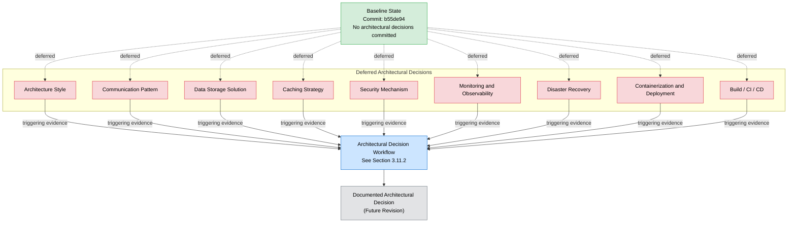

---

## 5.4 CROSS-CUTTING CONCERNS

This subsection addresses each cross-cutting concern category enumerated in the section prompt. Per the anti-fabrication constraint of Section 2.8.2 and the explicit deferral patterns in Sections 2.7.3, 3.10.2, 4.3.3, and 4.4.3, every concern lacking committed evidence is enumerated as **Not Applicable** at this baseline and deferred with triggering evidence requirements.

### 5.4.1 Monitoring and Observability Approach

#### 5.4.1.1 Current State

No monitoring or observability tooling is configured in the repository. Per Section 3.6.3, the following observability pillars are all deferred:

| Observability Pillar | Status | Source |
|----------------------|--------|--------|
| Application Performance Monitoring (APM) | Deferred — no APM SDK initialization | Section 3.6.3 |
| Distributed Tracing | Deferred — no tracing instrumentation | Section 3.6.3 |
| Metrics Collection | Deferred — no metrics emitter | Section 3.6.3 |
| Log Aggregation | Deferred — no log shipper or backend | Section 3.6.3 |
| Error Tracking | Deferred — no error-tracking SDK | Section 3.6.3 |
| Uptime Monitoring | Deferred — no health-check endpoint | Section 3.6.3 |
| Real-User Monitoring | Deferred — no client-side instrumentation | Section 3.6.3 |

#### 5.4.1.2 Triggering Evidence

Observability adoption is triggered by the evidence enumerated in Section 4.4.3: *"Committed logging, metrics, tracing, alerting, or APM SDK initializations."*

### 5.4.2 Logging and Tracing Strategy

#### 5.4.2.1 Current State

No logging or tracing strategy is present in the repository. Section 1.3.2 enumerates *"Operational Tooling — No monitoring, logging, or alerting configuration"* among the demonstrably-absent categories. Section 1.2.3 reinforces this: *"No KPIs, SLAs, performance budgets, observability constructs, or monitoring instrumentation are present in the codebase."*

#### 5.4.2.2 Deferral

Logging libraries (e.g., structured loggers, log4j, log4net, winston, pino, zap, slog), tracing libraries (e.g., OpenTelemetry, Jaeger, Zipkin), and correlation-id propagation patterns are all deferred until the first logging or tracing SDK initialization is committed (Section 4.4.3).

### 5.4.3 Error Handling Patterns

#### 5.4.3.1 Current State

No error handling patterns are evidenced by the repository. Per Section 4.4.2, *"no error handling constructs are evidenced by the repository… no executable code is present, which entails that there are no runtime errors to handle, no inputs to validate, and no integration failures to recover from."* The following subcategories are explicitly deferred:

| Deferred Error-Handling Subcategory | Source |
|-------------------------------------|--------|
| Retry mechanisms | Section 4.4.2 |
| Fallback processes | Section 4.4.2 |
| Error notification flows | Section 4.4.2 |
| Recovery procedures | Section 4.4.2 |
| Circuit-breaker / bulkhead patterns | Section 4.4.3 |

#### 5.4.3.2 Verification Workflow Failure Paths

For completeness, the only error-like paths documentable from committed evidence are the **three deterministic verification-failure paths** of the F-001 verification workflow rendered in Section 4.2.2 (Failure Paths A, B, C). These are not runtime errors but offline verification outcomes that signal divergence from the F-001 acceptance criteria. They are not subject to retry, fallback, or recovery semantics because no executing process is involved.

#### 5.4.3.3 Error Handling Flow (Deferred Placeholder)

Per Section 4.5.3, *"Error handling flowcharts are deferred."* The diagram below explicitly marks the deferral state of error-handling flow documentation and identifies the path by which a substantive error-handling flowchart will be introduced. It inherits the color conventions from Sections 1.4.2 and 3.9.2.

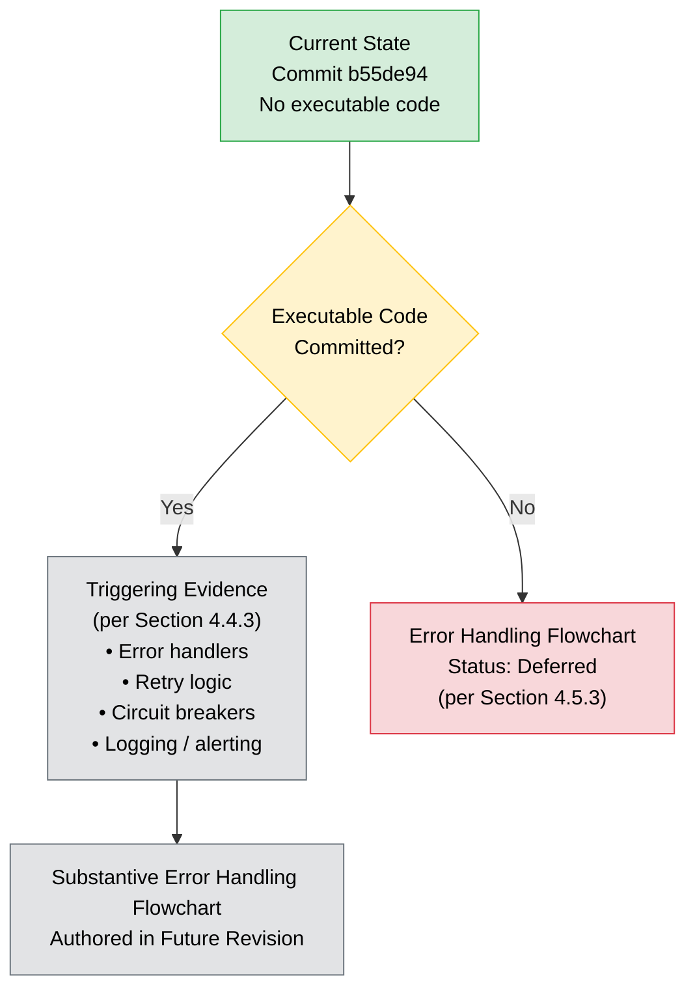

### 5.4.4 Authentication and Authorization Framework

#### 5.4.4.1 Current State

No authentication or authorization framework is present. Per Section 2.5.1.4 and Section 3.6.2, the security surface is empty:

| Security Dimension | Assessment | Source |
|--------------------|------------|--------|
| Authentication Surface | None — no executable code, no user-facing interface, no authenticated operation | Section 2.5.1.4 |
| Authorization Surface | None — no protected resources, no access control constructs | Section 2.5.1.4 |
| Input Handling | Not Applicable — the feature accepts no inputs | Section 2.5.1.4 |
| Secret Management | Not Applicable — no secrets, credentials, or sensitive data committed | Section 2.5.1.4 |
| Dependency Vulnerability | Not Applicable — no third-party dependencies are declared | Section 2.5.1.4 |

Per Section 3.6.2, *"No identity provider (Auth0, AWS Cognito, Okta, Azure AD, Google Identity, Keycloak, or equivalent) is configured. No OAuth/OIDC, SAML, or session-management constructs exist."*

#### 5.4.4.2 Deferral

The selection of an authentication framework, authorization model (RBAC / ABAC / ReBAC), identity provider, and session-management strategy is deferred until the triggering evidence enumerated in Section 3.10.2 is committed: *"Identity-provider configuration, auth middleware, OAuth/OIDC client setup."*

### 5.4.5 Performance Requirements and SLAs

#### 5.4.5.1 Current State

Per Section 2.5.1.2, performance requirements are **Not Applicable**: *"F-001 is realized by a static text artifact of approximately 11 bytes with no runtime, execution path, or measurable performance profile."* Per Section 1.2.3, *"No KPIs, SLAs, performance budgets, observability constructs, or monitoring instrumentation are present in the codebase."* Per Section 4.2.7, *"No SLA values are asserted in this section. No timing constraints (timeouts, deadlines, retry intervals) are asserted in this section. No KPIs or success metrics beyond the boolean satisfaction of the three acceptance criteria are asserted in this section."*

#### 5.4.5.2 Anti-Fabrication Constraint

Per Section 2.8.2, fabricated SLAs or KPIs are prohibited. Performance targets — including p50/p95/p99 latency budgets, throughput thresholds, availability targets (e.g., 99.9% / 99.99%), error-rate budgets, and capacity envelopes — must not be invented. All such targets are deferred until performance objectives are committed (per Section 2.7.3 trigger: *"Performance objectives committed"*).

### 5.4.6 Disaster Recovery Procedures

#### 5.4.6.1 Current State

No disaster recovery procedures are documented or implemented. Per Section 3.7.2, the following recovery-related artifacts are confirmed absent:

| Recovery Artifact | Present? | Source |
|-------------------|----------|--------|
| Backup Scripts | No | Section 3.7.2 |
| Recovery Runbooks | No | Section 3.7.2 |
| Connection Pool / Failover Configuration | No | Section 3.7.2 |
| Data Migration Scripts | No | Section 3.7.2 |

Because no persistent application state exists (Section 3.7), there is presently no data to recover. The Git history itself — which contains the 11-byte `README.md` — is fully replicable from any clone of the repository, but this is a property of Git rather than an engineered recovery procedure.

#### 5.4.6.2 Deferral

RTO (Recovery Time Objective), RPO (Recovery Point Objective), failover topology, multi-region replication strategy, and backup cadence are all deferred until the first backup script, runbook, or recovery automation is committed (Section 4.4.3).

### 5.4.7 Cross-Cutting Concerns Deferral Summary

The table below consolidates the deferral status of every cross-cutting concern category enumerated in the section prompt. It follows the *Triggering Evidence Required* template established in Section 2.7.2.

| Cross-Cutting Concern | Status | Triggering Evidence Required |
|-----------------------|--------|------------------------------|
| Monitoring and Observability | Deferred (Section 3.6.3) | First logging, metrics, tracing, or APM SDK initialization |
| Logging and Tracing Strategy | Deferred (Section 1.3.2, Section 3.6.3) | First structured-logging or tracing-library initialization |
| Error Handling Patterns | Deferred (Section 4.4.2, Section 4.5.3) | First executable code introducing runtime errors, retries, or recovery |
| Authentication Framework | Deferred (Section 3.6.2, Section 2.5.1.4) | First identity-provider configuration or auth middleware |
| Authorization Framework | Deferred (Section 2.5.1.4) | First access-control construct or protected-resource declaration |
| Performance Requirements and SLAs | Not Applicable (Section 2.5.1.2, Section 4.2.7) | First performance objective, capacity target, or SLA committed |
| Disaster Recovery Procedures | Deferred (Section 3.7.2) | First backup script, runbook, or recovery automation |
| Caching Strategy | Deferred (Section 3.7.3) | First cache-client SDK initialization or cache configuration |
| Secret Management | Not Applicable (Section 2.5.1.4) | First secret-management SDK or secret-store integration |

---

## 5.5 ARCHITECTURE EVOLUTION EXPECTATIONS

### 5.5.1 Phased Evolution Pattern

The expected evolution of this System Architecture section mirrors the phased growth pattern articulated in Section 4.6.2 (and aligned with Sections 1.4.3, 2.7.4, and 3.10.4). As implementation artifacts are committed, the deferred subsections enumerated in 5.3.2 and 5.4.7 progressively become substantive.

| Phase | Expected Repository State | Section 5 Impact |
|-------|---------------------------|-------------------|
| Phase A — Placeholder (current) | Only `README.md` + Git committed | Only the `README.md` Identity Artifact is documented; all other components, decisions, and concerns are deferred |
| Phase B — Initial Implementation | First source code and dependency manifests committed | Component inventory expands; architectural style and communication patterns become documentable |
| Phase C — Operationalization | Persistence, observability, resilience, and security artifacts committed | Cross-cutting concern subsections (5.4) populate with substantive content; deferral tables shrink |
| Phase D — Steady State | All architecture subsections grounded in committed evidence | Deferral tables retired; canonical reference diagrams replace placeholder diagrams |

### 5.5.2 Documentation Update Triggers

Per Section 4.6.1, the following committed-artifact events should trigger re-authoring of the relevant subsections of Section 5:

| Committed Artifact | Triggers Re-Authoring Of |
|---------------------|---------------------------|
| First source-code file in any language | Section 5.1.1 (Architectural Style); Section 5.2 (Component Details) |
| First API contract (OpenAPI / GraphQL / Protobuf) | Section 5.1.4 (External Integration Points); Section 5.2.4 (Sequence View) |
| First message schema or event broker binding | Section 5.1.3 (Data Flow); Section 5.1.4 (External Integration Points) |
| First state machine, workflow engine, or stateful entity | Section 5.2.3 (State Transition View) |
| First persistence-layer artifact (schema, ORM, migration) | Section 5.1.3.4 (Data Stores); Section 5.4.6 (Disaster Recovery) |
| First caching configuration | Section 5.1.3.4 (Caches); Section 5.4.7 (Caching Strategy) |
| First retry, circuit-breaker, or resilience-pattern artifact | Section 5.4.3 (Error Handling) |
| First logging, metrics, tracing, or alerting instrumentation | Section 5.4.1 (Monitoring); Section 5.4.2 (Logging and Tracing) |
| First identity-provider or auth-middleware configuration | Section 5.4.4 (AuthN/AuthZ) |
| First ADR or design document | Section 5.3 (Technical Decisions) |

### 5.5.3 Required Companion Artifacts for Future Decisions

Per Section 3.10.4 (applied to architectural decisions) and Section 4.6.2 (applied to workflows), each architectural addition committed in future revisions should be accompanied by:

1. **Committed artifact evidence** — manifest entry, configuration file, source-code import, infrastructure-as-code definition, or contract file demonstrating the architecture is in use.
2. **Authored ADR** — an architectural decision record explaining selection criteria, alternatives considered, and trade-offs evaluated.
3. **Cross-reference traceability** — explicit links to the feature catalog (Section 2.2), functional requirements (Section 2.3), feature relationships (Section 2.4), and workflows (Section 4) that the architecture realizes.
4. **Validation rule mapping** — explicit mapping of business rules, data validation, authorization checkpoints, and compliance checks to architectural components (per Section 4.6.2).
5. **Timing and SLA declaration** — explicit timing constraints, latency budgets, or availability targets backed by evidence such as performance budgets, contractual SLAs, or instrumented thresholds (per Section 4.6.2).

---

## 5.6 REFERENCES

### 5.6.1 Files Examined

- `README.md` — The sole committed file in the repository (11 bytes, content `# Artifact1`); examined to verify the single documentable component and its content (Section 5.1.2.1, Section 5.2.1).

### 5.6.2 Folders Explored

- `/` (repository root, depth 0) — Contains exactly `README.md` and `.git/` metadata; examined to confirm the absence of source, configuration, manifest, test, documentation, build, and integration directories (Section 5.1.2.3).

### 5.6.3 Technical Specification Sections Referenced

- **Section 1.1 — Executive Summary**: Project identifier (`Artifact1`), commit hash (`b55de94`), branch (`main`), repository initializer, and the explicit absence of business problem, end users, administrators, and integrators (informs Sections 5.1.1.3, 5.4.4.1).
- **Section 1.2 — System Overview**: Confirmation that no architecture, components, or integrations are committed; integration-category absence evidence (informs Sections 5.1.1.1, 5.1.4).
- **Section 1.3 — Scope**: In-scope vs. out-of-scope elements; demonstrably-absent categories (informs Sections 5.1.2.3, 5.4).
- **Section 1.4 — Repository Baseline State**: Canonical baseline-state diagram and visual conventions (color legend) inherited by the Section 5 diagrams.
- **Section 2.2 — Feature Catalog**: Feature F-001 (Repository Identity Declaration); foundational status; system and external dependencies (informs Section 5.2.1).
- **Section 2.4 — Feature Relationships**: Feature Dependency Map and confirmation that all integration-point categories are absent (informs Sections 5.1.2.1, 5.1.4).
- **Section 2.5 — Implementation Considerations**: Technical constraints, Not-Applicable performance/scalability, empty security surface (informs Sections 5.2.1.4, 5.2.1.5, 5.4.4, 5.4.5).
- **Section 2.7 — Deferred Requirements**: Triggering Evidence Required template and architectural-constraints deferral (informs Section 5.3.2).
- **Section 2.8 — Assumptions and Constraints**: Anti-fabrication constraint and documented assumptions (informs Section 5 throughout).
- **Section 3.6 — Third-Party Services**: Confirmed absence of external APIs, authentication services, monitoring tools, and cloud services (informs Sections 5.4.1, 5.4.4).
- **Section 3.7 — Databases and Storage**: Confirmed absence of databases, caches, and object storage (informs Sections 5.1.3.4, 5.4.6, 5.4.7).
- **Section 3.9 — Technology Stack Diagram**: Canonical technology-stack diagram and visual conventions referenced by Section 5.2.2 diagram.
- **Section 3.10 — Deferred Technology Selections**: Triggering-evidence template and reference-defaults non-adoption (informs Sections 5.3.2.1, 5.3.2.2).
- **Section 3.11 — Technology Selection Methodology**: Future Selection Workflow diagram referenced by Section 5.3.3.1.
- **Section 4.2 — Verifiable Workflow F-001**: F-001 verification flowchart and sequence diagram referenced by Sections 5.1.3.1, 5.2.4.1, 5.4.3.2.
- **Section 4.3 — System Workflows**: Triggering-evidence table for deferred workflow categories (informs Sections 5.1.3, 5.2.4.2).
- **Section 4.4 — Technical Implementation**: State management and error handling deferrals; triggering evidence (informs Sections 5.2.3, 5.4.3).
- **Section 4.5 — Required Diagrams Reconciliation**: Reconciles diagram requirements and provides the canonical state-transition placeholder and high-level workflow diagram referenced by Sections 5.2.3.1, 5.2.4.1.
- **Section 4.6 — Evolution Expectations**: Phased evolution pattern (Phase A → D) adopted by Section 5.5.1; documentation update triggers reused in Section 5.5.2.

# 6. SYSTEM COMPONENTS DESIGN

## 6.1 Core Services Architecture

**Core Services Architecture is not applicable for this system.**

The Artifact1 repository at commit `b55de94` is in a greenfield placeholder state and commits no executable architecture. Exhaustive repository inspection (Section 1.5) confirms that the repository contains exactly one content artifact — an 11-byte `README.md` file holding the literal string `# Artifact1` — together with Git version-control metadata. There are no application services, no inter-service communication channels, no service registries, no load balancers, no circuit breakers, no retry policies, no scaling configurations, no failover topologies, and no disaster-recovery automation. Per Section 5.1.1.1, *"no architectural style (monolithic, microservices, serverless, client-server, event-driven, hexagonal, layered, or otherwise) is currently in force"*, and per Section 5.1.1.2, *"no runtime patterns (e.g., CQRS, event sourcing, saga orchestration, circuit-breaker, retry-with-backoff) are present, because no executable code exists for such patterns to govern."*

Because services, scaling dimensions, and resilience patterns are all categorically absent, the conventional Core Services Architecture concerns enumerated in the section prompt — service components, scalability design, and resilience patterns — cannot be authored against the current repository state without fabricating content, which is prohibited by Section 2.8.2. This section is therefore retained in the document structure per the explicit-deferral principle of Section 2.1.1, with each sub-category marked **Not Applicable** or **Deferred** and paired with the specific committed artifact that would trigger its substantive authorship in a future revision.

### 6.1.1 Applicability Determination

#### 6.1.1.1 Determination Statement

The determination that Core Services Architecture is not applicable is grounded in committed evidence rather than inference. The single documentable component — the `README.md` identity artifact — is a static text file with no executable behavior. Per Section 5.2.1.1, the artifact *"has no executable behavior, accepts no inputs, mutates no state, and emits no events."* Consequently, the system at commit `b55de94` does not exhibit any of the architectural properties that the Core Services Architecture concern is designed to document.

The section prompt anticipates this determination with the directive: *"If the system does not require microservices, distributed architecture, or distinct service components, clearly state 'Core Services Architecture is not applicable for this system' and explain why."* The remainder of this section enumerates the evidentiary basis for the determination and catalogues each deferred sub-category with the triggering evidence required to retire the deferral.

#### 6.1.1.2 Direct Evidentiary Basis

The table below consolidates the direct evidentiary quotes that support the Not-Applicable determination. Each entry cites the originating Technical Specification section so that the determination is traceable to its source.

| Concern Area | Evidence | Source |
|--------------|----------|--------|
| Services and Architectural Style | "No technology stack, framework, programming language, database technology, runtime platform, or architectural pattern has been selected and committed to the repository." | Section 1.2.2 |
| Runtime Patterns | "No runtime patterns (e.g., CQRS, event sourcing, saga orchestration, circuit-breaker, retry-with-backoff) are present, because no executable code exists for such patterns to govern." | Section 5.1.1.2 |
| Scalability Dimensions | "A static project identifier does not scale with users, load, data volume, or geographic distribution. No scaling dimensions are present in the baseline repository state." | Section 2.5.1.3 |
| Error Handling and Resilience | "No error handling constructs are evidenced by the repository… no executable code is present, which entails that there are no runtime errors to handle, no inputs to validate, and no integration failures to recover from." | Section 4.4.2 |

#### 6.1.1.3 Confirmed-Absent Service Categories

Per Section 5.1.2.3, the following architectural component categories that would otherwise be the subject of a Core Services Architecture section are confirmed absent from the repository:

| Component Category | Status | Source |
|--------------------|--------|--------|
| Application services, modules, packages, or libraries | Absent | Section 1.2.2 |
| HTTP / RPC / gRPC servers or clients | Absent | Section 2.4.2, Section 3.6.1 |
| Message brokers, queues, or event handlers | Absent | Section 2.4.2, Section 4.3.2 |
| Databases, caches, or object stores | Absent | Section 3.7 |
| Authentication, authorization, or identity components | Absent | Section 3.6.2, Section 2.5.1.4 |
| Observability components (logging, metrics, tracing, alerting) | Absent | Section 3.6.3 |
| Build, packaging, containerization, or deployment components | Absent | Section 3.9.1 |

Per Section 2.4.2, every integration-point category — internal service integrations, external API integrations, message broker integrations, and database integrations — is also confirmed `None`. With no services and no integration points, the conventional Core Services Architecture topics have no substrate on which to operate.

### 6.1.2 Service Components — Deferral Status

#### 6.1.2.1 Current State of Service Components

No service components exist in the repository. There is no `/src`, `/app`, `/services`, `/lib`, or `/api` directory; no package manifest (`package.json`, `requirements.txt`, `pom.xml`, `go.mod`, `Cargo.toml`, `pyproject.toml`); no configuration file (`.env`, `.yml`, `.yaml`, `.json`, `.toml`); and no service-definition artifact. The single documentable component is the `README.md` identity artifact catalogued in Section 5.1.2.1, which is a static text file — not a service.

Because no services exist, the six sub-categories enumerated in the section prompt — service boundaries and responsibilities, inter-service communication patterns, service discovery mechanisms, load balancing strategy, circuit breaker patterns, and retry/fallback mechanisms — have no substantive content to document at this revision. Each is deferred until the corresponding triggering evidence is committed.

#### 6.1.2.2 Service Components Deferral Table

The deferral table below follows the *Triggering Evidence Required* template established in Sections 2.7.2, 3.10.2, 4.3.3, 4.4.3, 5.3.2, and 5.4.7. Each sub-category of the Service Components prompt is paired with the specific committed artifact that would trigger its inclusion in a future revision of this section.

| Service Components Sub-Category | Status | Triggering Evidence Required |
|----------------------------------|--------|------------------------------|
| Service boundaries and responsibilities | Deferred (Section 5.1.1.1) | First service-definition file, module boundary declaration, or microservice manifest |
| Inter-service communication patterns | Deferred (Section 2.4.2, Section 5.1.3.2) | First HTTP server/client, RPC stub, GraphQL schema, Protobuf definition, or messaging-client initialization |
| Service discovery mechanisms | Deferred (Section 5.1.2.3) | First service-registry configuration (e.g., Consul, Eureka, Kubernetes Service) or DNS-based discovery artifact |
| Load balancing strategy | Deferred (Section 5.1.2.3) | First load-balancer configuration, ingress definition, or reverse-proxy artifact |
| Circuit breaker patterns | Deferred (Section 5.1.1.2, Section 5.4.3.1) | First circuit-breaker library initialization (e.g., Hystrix, Resilience4j, Polly) |
| Retry and fallback mechanisms | Deferred (Section 4.4.2, Section 5.4.3.1) | First retry-policy declaration, resilience middleware, or fallback handler |

#### 6.1.2.3 Service Interaction Diagram (Baseline State)

The diagram below visualizes the complete service-interaction landscape at commit `b55de94`. It inherits the color conventions established in Sections 1.4.2, 3.9.2, and 5.2.2 (green = verified present; yellow = repository metadata or external unspecified; red = confirmed absent; blue = process; gray = future state). The diagram is consistent with the Component Interaction Diagram in Section 5.2.2 and the Architectural Deferral Landscape in Section 5.3.4.

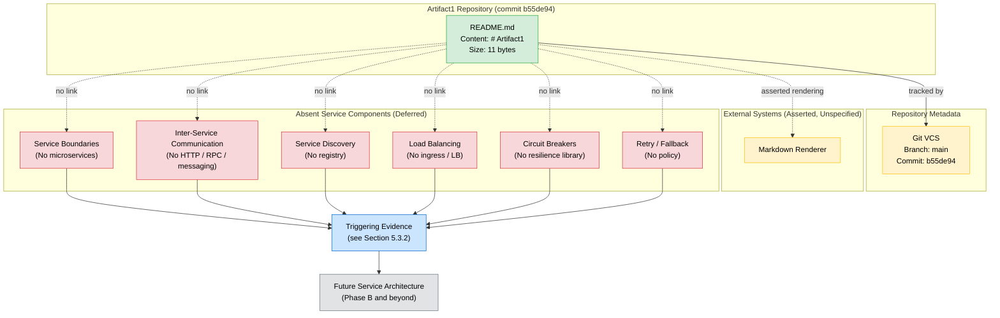

### 6.1.3 Scalability Design — Not-Applicable Status

#### 6.1.3.1 Current State of Scalability

Scalability is **Not Applicable** at the baseline. Per Section 2.5.1.3, *"A static project identifier does not scale with users, load, data volume, or geographic distribution. No scaling dimensions are present in the baseline repository state."* Per Section 5.2.1.5, *"Horizontal scaling, vertical scaling, sharding, partitioning, replication, and load-balancing concerns are all deferred pending committed evidence of a runtime workload."*

The five scalability sub-categories enumerated in the section prompt — horizontal/vertical scaling approach, auto-scaling triggers and rules, resource allocation strategy, performance optimization techniques, and capacity planning guidelines — cannot be authored at this revision because:

- There is no workload to scale (no executable code, per Section 4.4.2).
- There are no resources to allocate (no container manifest, no infrastructure-as-code, per Section 3.9.1).
- There are no performance characteristics to optimize (no runtime, no measurable performance profile, per Section 2.5.1.2).
- There are no capacity targets to plan against (no KPIs, SLAs, or performance budgets, per Section 1.2.3).

#### 6.1.3.2 Scalability Design Deferral Table

| Scalability Design Sub-Category | Status | Triggering Evidence Required |
|----------------------------------|--------|------------------------------|
| Horizontal / vertical scaling approach | Not Applicable (Section 2.5.1.3, Section 5.2.1.5) | First container orchestration manifest (Kubernetes Deployment, Docker Swarm service, ECS task) or replica-count configuration |
| Auto-scaling triggers and rules | Not Applicable (Section 2.5.1.3) | First HPA / VPA / Cluster Autoscaler configuration or cloud auto-scaling policy artifact |
| Resource allocation strategy | Not Applicable (Section 2.5.1.3) | First resource-request / resource-limit declaration, capacity plan, or budget document |
| Performance optimization techniques | Not Applicable (Section 2.5.1.2, Section 5.4.5.1) | First profiling configuration, performance-budget commit, or optimization-targeted change |
| Capacity planning guidelines | Not Applicable (Section 1.2.3, Section 5.4.5.2) | First load-testing artifact, capacity model, or throughput-target declaration |

#### 6.1.3.3 Scalability Architecture Diagram (Baseline State)

The diagram below visualizes the current "no scaling dimensions" state and the path by which each deferred sub-category will transition to documented scaling architecture in a future revision. The structure parallels the Architectural Deferral Landscape in Section 5.3.4 but is scoped to scalability concerns.

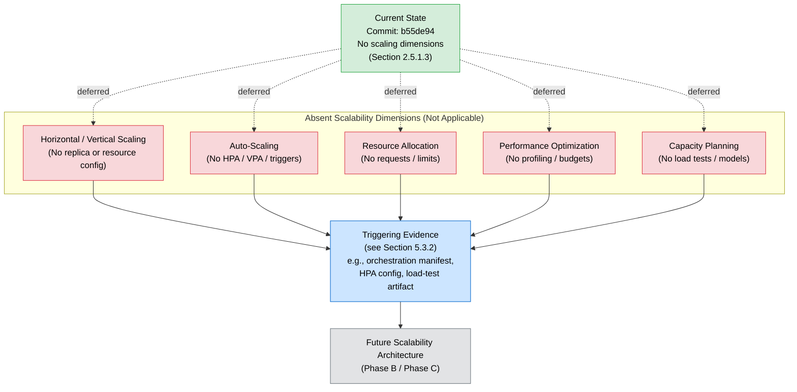

### 6.1.4 Resilience Patterns — Deferral Status

#### 6.1.4.1 Current State of Resilience Patterns

No resilience patterns are evidenced by the repository. Per Section 4.4.2, *"no error handling constructs are evidenced by the repository… no executable code is present, which entails that there are no runtime errors to handle, no inputs to validate, and no integration failures to recover from."* Per Section 5.4.3.1, the following resilience subcategories are explicitly enumerated as deferred: retry mechanisms, fallback processes, error notification flows, recovery procedures, and circuit-breaker / bulkhead patterns. Per Section 5.4.6.1, no disaster-recovery procedures are documented or implemented, and per Section 5.4.6.2, *"RTO (Recovery Time Objective), RPO (Recovery Point Objective), failover topology, multi-region replication strategy, and backup cadence are all deferred."*

The five resilience sub-categories enumerated in the section prompt — fault tolerance mechanisms, disaster recovery procedures, data redundancy approach, failover configurations, and service degradation policies — therefore have no implementation surface in the current repository. The only "failure paths" documentable from committed evidence are the three deterministic *verification-failure paths* of the F-001 verification workflow described in Section 5.4.3.2, which are offline outcomes signalling divergence from acceptance criteria, not runtime errors subject to resilience treatment.

#### 6.1.4.2 Resilience Patterns Deferral Table

| Resilience Patterns Sub-Category | Status | Triggering Evidence Required |
|-----------------------------------|--------|------------------------------|
| Fault tolerance mechanisms | Deferred (Section 4.4.2, Section 5.4.3.1) | First retry-policy, circuit-breaker, bulkhead, or timeout library initialization |
| Disaster recovery procedures | Deferred (Section 5.4.6) | First backup script, recovery runbook, or recovery automation artifact |
| Data redundancy approach | Deferred (Section 3.7.2, Section 5.4.6.1) | First replication configuration, multi-region setup, or replica-set declaration |
| Failover configurations | Deferred (Section 3.7.2, Section 5.4.6.2) | First failover topology declaration, DNS-based failover, or active-passive configuration |
| Service degradation policies | Deferred (Section 5.4.3.1) | First feature-flag configuration, graceful-degradation policy, or fallback-mode declaration |

#### 6.1.4.3 Resilience Pattern Implementations Diagram (Baseline State)

The diagram below visualizes the current "no resilience patterns" state, paralleling the Error Handling Flow placeholder in Section 5.4.3.3 but scoped to the resilience subcategories enumerated in this section. Each absent category is linked to the triggering evidence path that will retire its deferral.

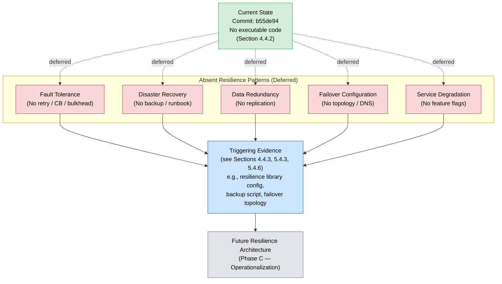

### 6.1.5 Anti-Fabrication Constraint

Per the anti-fabrication constraint of Section 2.8.2, *"Fabrication of features, users, or metrics is prohibited… All speculative elements are deferred, not invented."* Section 5.4.5.2 reinforces this for performance and SLA assertions: *"Performance targets — including p50/p95/p99 latency budgets, throughput thresholds, availability targets (e.g., 99.9% / 99.99%), error-rate budgets, and capacity envelopes — must not be invented."*

The following classes of values are therefore explicitly **not** asserted in this section and may only appear once supporting committed evidence is introduced:

| Forbidden-to-Fabricate Category | Rationale |
|----------------------------------|-----------|
| Service-level latency budgets (p50/p95/p99) | No measurable runtime exists (Section 5.4.5.1) |
| Throughput targets (RPS / TPS / QPS) | No workload exists (Section 2.5.1.2) |
| Availability targets (e.g., 99.9% / 99.99%) | No SLA contract committed (Section 1.2.3, Section 4.2.7) |
| Auto-scaling thresholds (CPU %, memory %, queue depth) | No scaling dimensions present (Section 2.5.1.3) |
| RTO / RPO targets | No persistent state and no DR procedures (Section 5.4.6) |
| Replica counts, shard counts, partition keys | No persistence or compute resources (Section 3.7, Section 5.2.1.5) |
| Retry counts, backoff intervals, timeout budgets | No retry mechanism implemented (Section 4.4.2) |
| Circuit-breaker thresholds (error rate, half-open interval) | No circuit-breaker library configured (Section 5.4.3.1) |

Future revisions of this section must derive each numeric assertion from an evidentiary source — a committed configuration file, an instrumented threshold, a contractual SLA, or an authored ADR — as required by Section 5.5.3.

### 6.1.6 Phased Evolution Expectations

The expected evolution of this Core Services Architecture section follows the phased growth pattern articulated in Section 5.5.1. As implementation artifacts are committed, the deferred sub-categories above progressively become substantive and the deferral tables shrink toward retirement.

| Phase | Expected Repository State | Section 6.1 Impact |
|-------|---------------------------|--------------------|
| Phase A — Placeholder (current) | Only `README.md` + Git committed | Entire section marked Not Applicable; deferral tables populated for all sub-categories |
| Phase B — Initial Implementation | First source code and dependency manifests committed | Service Components subsection (6.1.2) begins populating with substantive content (service boundaries, communication patterns) |
| Phase C — Operationalization | Persistence, observability, resilience, and security artifacts committed | Resilience Patterns subsection (6.1.4) and Scalability Design subsection (6.1.3) become substantive; deferral tables shrink |
| Phase D — Steady State | All architecture grounded in committed evidence | Deferral tables retired; canonical service interaction, scalability, and resilience diagrams replace placeholder diagrams |

Per Section 5.5.2, the specific committed-artifact events that should trigger re-authoring of subsections of 6.1 are summarized below:

| Committed Artifact | Triggers Re-Authoring Of |
|---------------------|--------------------------|
| First source-code file in any language | Subsection 6.1.2 (Service Components) — service boundaries and responsibilities |
| First API contract (OpenAPI / GraphQL / Protobuf) or messaging client | Subsection 6.1.2 — inter-service communication patterns |
| First load-balancer, ingress, or service-discovery configuration | Subsection 6.1.2 — service discovery and load balancing |
| First container orchestration manifest or HPA / VPA configuration | Subsection 6.1.3 (Scalability Design) — horizontal/vertical scaling, auto-scaling |
| First retry, circuit-breaker, or resilience-pattern artifact | Subsection 6.1.4 (Resilience Patterns) — fault tolerance and degradation |
| First backup script, runbook, or failover topology | Subsection 6.1.4 — disaster recovery, data redundancy, failover |

Per Section 5.5.3, each future architectural addition must be accompanied by committed artifact evidence, an authored ADR explaining selection criteria and trade-offs, cross-reference traceability to the feature catalog, explicit validation-rule mapping, and timing/SLA declarations backed by evidence.

### 6.1.7 Cross-Reference Summary

The table below consolidates the cross-references that ground this section's Not-Applicable determination. Readers seeking deeper context on any aspect of the deferral should consult the indicated section.

| Concern | Authoritative Cross-Reference |
|---------|-------------------------------|
| Overall architectural style and absence of services | Section 5.1.1 (High-Level Architecture — System Overview) |
| Component inventory and confirmed-absent component categories | Section 5.1.2 (Core Components); Section 1.2.2 (Major System Components) |
| Integration points (all `None`) | Section 2.4.2 (Integration Points); Section 5.1.4 (External Integration Points) |
| Scalability Not Applicable | Section 2.5.1.3; Section 5.2.1.5 |
| Error handling and runtime patterns absent | Section 4.4.2 (Technical Implementation); Section 5.1.1.2 |
| Deferred architectural decisions (architecture style, communication, security, observability) | Section 5.3.2 |
| Cross-cutting concerns deferral (monitoring, logging, error handling, performance, DR) | Section 5.4 (entire section); Section 5.4.7 (consolidated summary) |
| Phased evolution and re-authoring triggers | Section 5.5.1; Section 5.5.2 |
| Anti-fabrication constraint | Section 2.8.2; Section 5.4.5.2 |

#### References

**Files Examined**
- `README.md` — Sole content file in the repository; 11 bytes; literal content `# Artifact1`; confirms absence of all executable architecture relevant to Core Services Architecture.

**Folders Examined**
- `/` (repository root) — Confirmed `README.md` is the only first-order child; no `/src`, `/app`, `/services`, `/lib`, `/api`, `/config`, `/docs`, or build directories exist.

**Technical Specification Sections Consulted**
- Section 1.2 (System Overview) — Established greenfield baseline; confirmed every integration category as absent.
- Section 1.4 (Repository Baseline State) — Provided baseline-state diagram conventions and color scheme used throughout the placeholder diagrams in this section.
- Section 2.4 (Feature Relationships) — Confirmed all integration points (internal services, external APIs, message brokers, databases) are `None`.
- Section 2.5 (Implementation Considerations) — Direct source of *"Scalability Considerations: Not Applicable"*; basis for Subsection 6.1.3.
- Section 2.7 (Deferred Requirements) — Established the *Triggering Evidence Required* template reused throughout this section.
- Section 2.8 (Assumptions and Constraints) — Source of the anti-fabrication constraint cited in Subsection 6.1.5.
- Section 3.6 (Third-Party Services) — Confirmed absence of identity providers, observability platforms, and external APIs.
- Section 3.7 (Databases and Storage) — Confirmed absence of persistence, caching, and recovery artifacts.
- Section 3.9 (Technology Stack Diagram) — Provided diagram color conventions reused in this section.
- Section 4.4 (Technical Implementation) — Direct source for absence of error handling, state management, and retry mechanisms.
- Section 5.1 (High-Level Architecture) — Direct quotes establishing no architectural style and no runtime patterns; basis for Subsection 6.1.1.
- Section 5.2 (Component Details) — Single-component context and component interaction diagram conventions; direct source of *"scalability is Not Applicable"* in Subsection 5.2.1.5.
- Section 5.3 (Technical Decisions) — Deferred architectural decision template and Architectural Deferral Landscape diagram conventions.
- Section 5.4 (Cross-Cutting Concerns) — Deferral evidence for error handling, performance/SLAs, and disaster recovery; basis for the deferral structure in Subsections 6.1.4 and 6.1.5.
- Section 5.5 (Architecture Evolution Expectations) — Phased evolution pattern and re-authoring triggers reproduced in Subsection 6.1.6.

## 6.2 Database Design

**Database Design is not applicable to this system.**

The Artifact1 repository at commit `b55de94` contains no databases, no persistence layer, no caching, no object or blob storage, and no data-access code. Exhaustive repository inspection confirms a single 11-byte `README.md` content artifact and Git version-control metadata only. Per Section 3.7.1, *"No databases are present, configured, or referenced in the repository,"* and per Section 3.7.2, every persistence-related artifact category — ORM definitions, migration scripts, connection-pool configurations, data-access-layer code, and backup/recovery procedures — is confirmed absent. Per Section 1.2.2, *"No technology stack, framework, programming language, database technology, runtime platform, or architectural pattern has been selected and committed to the repository."*

Because no databases, schemas, queries, transactions, replication topologies, or storage services exist in the repository, the conventional Database Design concerns enumerated in the section prompt — schema design, data management, compliance considerations, and performance optimization — cannot be authored against the current repository state without fabricating content, which is prohibited by Section 2.8.2. Following the explicit-deferral principle of Section 2.1.1 and the section-structure pattern established by Section 6.1 (Core Services Architecture), this section is retained in the document structure with each sub-category marked **Not Applicable** or **Deferred** and paired with the specific committed artifact that would trigger its substantive authorship in a future revision.

### 6.2.1 Applicability Determination

#### 6.2.1.1 Determination Statement

The determination that Database Design is not applicable is grounded in committed evidence rather than inference. Per Section 5.2.1.4, the single documentable component *"persists as a single UTF-8 text file of approximately 11 bytes stored in the Git-tracked working tree. It requires no database, no cache, no object store, and no managed persistence service."* Per Section 5.1.3.4, *"There are no application data stores or caches in the repository… The only 'store' verifiable at commit b55de94 is the Git-tracked working tree itself."*

The section prompt anticipates this determination with the directive: *"If the system does not require or direct database or persistent storage interactions are not clearly evident, clearly state 'Database Design is not applicable to this system' and explain why."* The remainder of this section enumerates the evidentiary basis for the determination and catalogues each deferred sub-category with the triggering evidence required to retire the deferral.

#### 6.2.1.2 Direct Evidentiary Basis

The table below consolidates the direct evidentiary quotes that support the Not-Applicable determination. Each entry cites the originating Technical Specification section so that the determination is traceable to its source.

| Concern Area | Evidence | Source |
|--------------|----------|--------|
| Database Absence | "No databases are present, configured, or referenced in the repository." | Section 3.7.1 |
| Persistence Strategy | No ORM definitions, no migration scripts, no connection-pool configuration, no data-access-layer code, no backup procedures. | Section 3.7.2 |
| Caching Absence | "No caching layer is configured. No Redis, Memcached, Hazelcast, in-process cache, or HTTP-cache configuration is present in the repository." | Section 3.7.3 |
| Object / File Storage Absence | "No object-storage or blob-storage services are configured. No bucket configurations, no storage-client SDK initializations, and no file-upload handlers are present." | Section 3.7.4 |
| Out-of-Scope Persistence | "Persistence Layer — No database schemas, migrations, or ORM definitions." | Section 1.3.2 |
| Component Data Persistence | "It requires no database, no cache, no object store, and no managed persistence service." | Section 5.2.1.4 |
| Disaster Recovery Status | "No disaster recovery procedures are documented or implemented… Because no persistent application state exists, there is presently no data to recover." | Section 5.4.6.1 |

#### 6.2.1.3 Confirmed-Absent Persistence Categories

Per Section 3.7.1 and Section 3.7.2, every database and persistence category that would otherwise be the subject of a Database Design section is confirmed absent from the repository:

| Database / Persistence Category | Status | Source |
|---------------------------------|--------|--------|
| Relational Database (Primary) | Absent — None Committed | Section 3.7.1 |
| Document Database | Absent — None Committed | Section 3.7.1 |
| Key-Value Store | Absent — None Committed | Section 3.7.1 |
| Graph Database | Absent — None Committed | Section 3.7.1 |
| Time-Series Database | Absent — None Committed | Section 3.7.1 |
| Search Index | Absent — None Committed | Section 3.7.1 |
| Wide-Column Store | Absent — None Committed | Section 3.7.1 |
| Vector Database | Absent — None Committed | Section 3.7.1 |
| ORM Definitions | Absent | Section 3.7.2 |
| Migration Scripts | Absent | Section 3.7.2 |
| Connection Pool Configuration | Absent | Section 3.7.2 |
| Data Access Layer Code | Absent | Section 3.7.2 |
| Backup and Recovery Procedures | Absent | Section 3.7.2 |
| Caching Layer (Redis / Memcached / In-Process) | Absent | Section 3.7.3 |
| Content Delivery Network Configuration | Absent | Section 3.7.3 |
| Object / Blob Storage Services | Absent | Section 3.7.4 |
| File-Upload Handlers | Absent | Section 3.7.4 |

Per Section 2.4.2, *"Database Integrations: None — No persistence layer present per Section 1.3.2."* With no databases and no integration points, the conventional Database Design topics have no substrate on which to operate.

### 6.2.2 Schema Design — Not Applicable Status

#### 6.2.2.1 Current State of Schema Design

No schema design exists in the repository. There are no DDL files, no ORM model classes, no schema modules, no migration directories, no Entity-Relationship Diagrams, no index definitions, no partitioning declarations, and no replication topologies. Per Section 3.7.2, no data-model classes, schema modules, or migration directories are present. Per Section 1.3.2, *"Persistence Layer — No database schemas, migrations, or ORM definitions"* is enumerated among the demonstrably out-of-scope elements.

Because no schema artifacts exist, the six sub-categories enumerated in the section prompt — entity relationships, data models and structures, indexing strategy, partitioning approach, replication configuration, and backup architecture — have no substantive content to document at this revision. Each is marked Not Applicable and deferred until the corresponding triggering evidence is committed.

#### 6.2.2.2 Schema Design Deferral Table

The deferral table below follows the *Triggering Evidence Required* template established in Sections 2.7.2, 3.10.2, 4.3.3, 4.4.3, 5.3.2, and 5.4.7. Each sub-category of the Schema Design prompt is paired with the specific committed artifact that would trigger its inclusion in a future revision of this section.

| Schema Design Sub-Category | Status | Triggering Evidence Required |
|----------------------------|--------|------------------------------|
| Entity relationships | Not Applicable (Section 3.7.2) | First ORM model definition, entity class, or relationship declaration in a committed source file |
| Data models and structures | Not Applicable (Section 1.2.2, Section 3.7.2) | First schema module, DDL file, or data-class declaration |
| Indexing strategy | Not Applicable (Section 3.7.1) | First index declaration in a schema migration or ORM annotation |
| Partitioning approach | Not Applicable (Section 3.7.1) | First partition-key declaration, sharding configuration, or table-partitioning DDL |
| Replication configuration | Not Applicable (Section 5.4.6.1) | First replication configuration, replica-set declaration, or read-replica connection string |
| Backup architecture | Not Applicable (Section 3.7.2, Section 5.4.6.1) | First backup script, backup-policy file, or recovery automation artifact |

#### 6.2.2.3 Database Schema Diagram (Baseline State)

The diagram below visualizes the complete schema-design landscape at commit `b55de94`. It inherits the color conventions established in Sections 1.4.2, 3.9.2, 5.2.2, and 6.1 (green = verified present; yellow = repository metadata or external unspecified; red = confirmed absent; blue = process; gray = future state). The diagram is the Entity-Relationship Diagram placeholder required by the section prompt, rendered as an absent-state visualization because no entities exist in the repository.

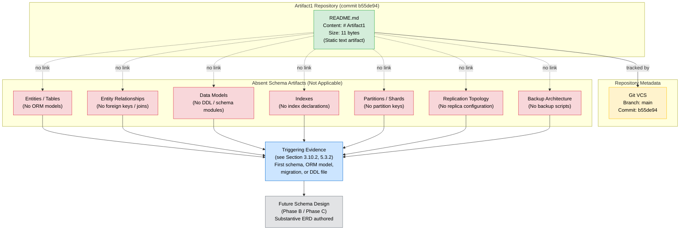

#### 6.2.2.4 Indexes and Constraints Inventory

Per the output-format requirement to document all indexes and constraints, the inventory below records the complete set verifiable at commit `b55de94`. The empty rows reflect the absent state — no indexes or constraints exist because no schema artifacts exist.

| Artifact Type | Identifier | Definition | Status |
|---------------|------------|------------|--------|
| Primary Key | — | — | None Committed (Section 3.7.1) |
| Foreign Key | — | — | None Committed (Section 3.7.1) |
| Unique Constraint | — | — | None Committed (Section 3.7.1) |
| Check Constraint | — | — | None Committed (Section 3.7.1) |
| Index (B-Tree / Hash / GIN / etc.) | — | — | None Committed (Section 3.7.1) |
| Composite Index | — | — | None Committed (Section 3.7.1) |
| Partial / Filtered Index | — | — | None Committed (Section 3.7.1) |
| Full-Text Search Index | — | — | None Committed (Section 3.7.1) |

### 6.2.3 Data Management — Deferral Status

#### 6.2.3.1 Current State of Data Management

No data management practices are evidenced by the repository. Per Section 3.7.2, no database migration scripts, no version-controlled schema-change files, no connection-pool configurations, and no data-access-layer code exist. Per Section 3.7.3, no caching configuration is present. Per Section 5.1.3.4, *"There are no application data stores or caches in the repository… The only 'store' verifiable at commit b55de94 is the Git-tracked working tree itself."*

The five sub-categories enumerated in the section prompt — migration procedures, versioning strategy, archival policies, data storage and retrieval mechanisms, and caching policies — therefore have no implementation surface in the current repository. Each is deferred until the corresponding triggering evidence is committed.

#### 6.2.3.2 Data Management Deferral Table

| Data Management Sub-Category | Status | Triggering Evidence Required |
|------------------------------|--------|------------------------------|
| Migration procedures | Deferred (Section 3.7.2) | First migration directory (e.g., `/migrations`, Flyway, Liquibase, Alembic, Knex) or version-controlled schema-change file |
| Versioning strategy | Deferred (Section 3.7.2) | First schema-version artifact, migration sequence, or schema-registry configuration |
| Archival policies | Deferred (Section 3.7) | First archival job, retention configuration, or data-lifecycle policy artifact |
| Data storage and retrieval mechanisms | Deferred (Section 3.7.1, Section 5.1.3.4) | First database client initialization, repository pattern implementation, or DAO class |
| Caching policies | Deferred (Section 3.7.3, Section 5.4.7) | First cache-client SDK initialization, TTL configuration, or cache-eviction policy artifact |

#### 6.2.3.3 Data Flow Diagram (Baseline State)

The diagram below renders the data-flow landscape at commit `b55de94`. It is the Data Flow Diagram placeholder required by the section prompt. Because no application data exists and no data-transformation processes are committed, the only "data flow" verifiable is the inert tracking relationship between the static `README.md` content artifact and the Git working tree. All conventional data-flow constructs are marked absent.

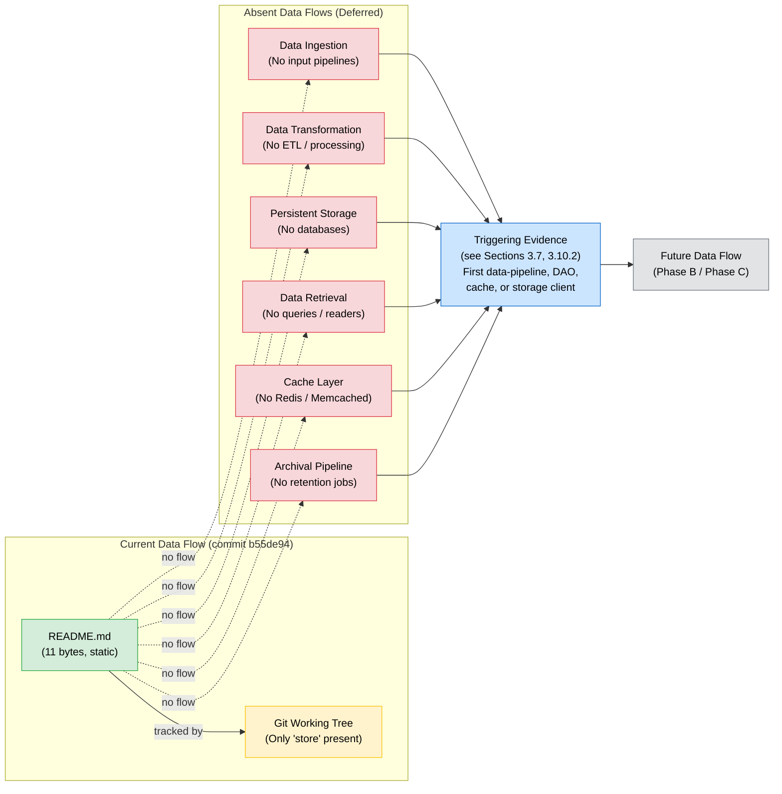

### 6.2.4 Compliance Considerations — Not Applicable Status

#### 6.2.4.1 Current State of Compliance Considerations

No data-related compliance controls are documented or implemented. Because no persistent data exists, no Personally Identifiable Information (PII), no payment information, no health records, no business-confidential records, and no user-generated content are stored, processed, or transmitted by the system. Per Section 5.4.4.1, the entire security surface is empty: *"Authentication Surface: None… Authorization Surface: None… Input Handling: Not Applicable — the feature accepts no inputs… Secret Management: Not Applicable — no secrets, credentials, or sensitive data committed."* Per Section 5.4.6.1, no backup, recovery, or fault-tolerance procedures are documented.

The five sub-categories enumerated in the section prompt — data retention rules, backup and fault tolerance policies, privacy controls, audit mechanisms, and access controls — therefore have no implementation surface in the current repository because the substrate they would govern (persistent data) is itself absent.

#### 6.2.4.2 Compliance Considerations Deferral Table

| Compliance Sub-Category | Status | Triggering Evidence Required |
|-------------------------|--------|------------------------------|
| Data retention rules | Not Applicable (Section 3.7) | First retention policy, lifecycle configuration, or regulatory-compliance artifact (e.g., GDPR, HIPAA, SOC 2 control mapping) |
| Backup and fault tolerance policies | Not Applicable (Section 3.7.2, Section 5.4.6) | First backup script, runbook, recovery automation, or fault-tolerance configuration |
| Privacy controls | Not Applicable (Section 5.4.4.1) | First PII handler, data-classification artifact, encryption-at-rest / in-transit configuration, or consent-management code |
| Audit mechanisms | Not Applicable (Section 5.4.1.1, Section 5.4.2.1) | First audit-log emitter, audit-trail schema, or compliance-reporting artifact |
| Access controls | Not Applicable (Section 5.4.4.1) | First database role/grant declaration, row-level security policy, IAM policy, or RBAC/ABAC artifact |

#### 6.2.4.3 Compliance Surface Inventory

| Compliance Domain | Applicable Data | Controls Present | Status |
|-------------------|-----------------|------------------|--------|
| PII / Privacy (e.g., GDPR, CCPA) | None — no user data committed | None | Not Applicable (Section 5.4.4.1) |
| Payment Data (e.g., PCI DSS) | None — no payment flows committed | None | Not Applicable (Section 5.4.4.1) |
| Health Data (e.g., HIPAA) | None — no health records committed | None | Not Applicable (Section 5.4.4.1) |
| Audit Logging | None — no executable code | None | Not Applicable (Section 5.4.1.1) |
| Encryption at Rest | None — no persistent store | None | Not Applicable (Section 3.7.1) |
| Encryption in Transit | None — no network endpoints | None | Not Applicable (Section 5.4.4.1) |

### 6.2.5 Performance Optimization — Not Applicable Status

#### 6.2.5.1 Current State of Performance Optimization

Database-related performance optimization is **Not Applicable** at the baseline. There are no queries to optimize, no caches to tune, no connection pools to configure, no read/write splits to balance, and no batch processes to schedule. Per Section 5.4.5.1, *"F-001 is realized by a static text artifact of approximately 11 bytes with no runtime, execution path, or measurable performance profile."* Per Section 1.2.3, *"No KPIs, SLAs, performance budgets, observability constructs, or monitoring instrumentation are present in the codebase."*

The five sub-categories enumerated in the section prompt — query optimization patterns, caching strategy, connection pooling, read/write splitting, and batch processing approach — therefore have no implementation surface in the current repository.

#### 6.2.5.2 Performance Optimization Deferral Table

| Performance Optimization Sub-Category | Status | Triggering Evidence Required |
|----------------------------------------|--------|------------------------------|
| Query optimization patterns | Not Applicable (Section 3.7.1, Section 5.4.5.1) | First query implementation, EXPLAIN-plan artifact, or query-tuning configuration |
| Caching strategy | Not Applicable (Section 3.7.3, Section 5.4.7) | First cache-client SDK initialization, cache-key strategy, or TTL configuration |
| Connection pooling | Not Applicable (Section 3.7.2) | First connection-pool library configuration (e.g., HikariCP, pgbouncer, SQLAlchemy pool) |
| Read/write splitting | Not Applicable (Section 3.7.1, Section 5.4.6.1) | First read-replica connection string, primary/replica routing configuration, or proxy artifact |
| Batch processing approach | Not Applicable (Section 1.2.2) | First batch-job definition, scheduler artifact (e.g., cron, Airflow DAG, Spring Batch), or bulk-operation handler |

#### 6.2.5.3 Replication Architecture Diagram (Baseline State)

The diagram below renders the replication-architecture landscape at commit `b55de94`. It is the Replication Architecture diagram required by the section prompt, depicted as an absent-state visualization because no databases, no replicas, no failover topology, and no read/write routing exist. The only replication-like property verifiable is Git's intrinsic property that any clone of the repository contains the complete history — a property of the version-control system rather than an engineered database replication strategy, as noted in Section 5.4.6.1.

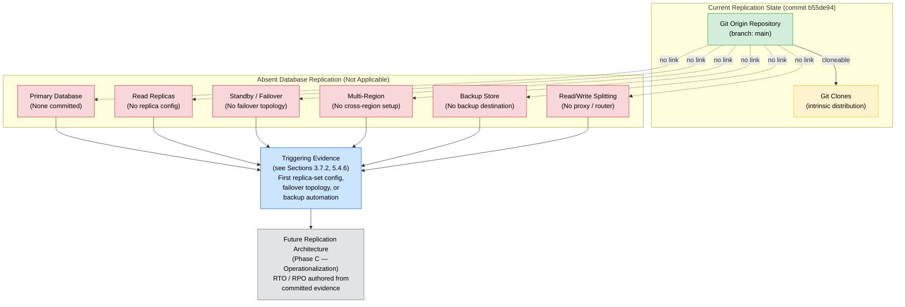

### 6.2.6 Anti-Fabrication Constraint

Per the anti-fabrication constraint of Section 2.8.2, *"Fabrication of features, users, or metrics is prohibited… All speculative elements are deferred, not invented."* Section 5.4.5.2 reinforces this for performance and SLA assertions: *"Performance targets — including p50/p95/p99 latency budgets, throughput thresholds, availability targets (e.g., 99.9% / 99.99%), error-rate budgets, and capacity envelopes — must not be invented."*

The following classes of database-design values are therefore explicitly **not** asserted in this section and may only appear once supporting committed evidence is introduced:

| Forbidden-to-Fabricate Category | Rationale |
|----------------------------------|-----------|
| Specific database technology selection (PostgreSQL, MySQL, MongoDB, Redis, DynamoDB, etc.) | No database manifest or client initialization committed (Section 3.7.1) |
| Entity, table, column, or attribute definitions | No ORM models or DDL files committed (Section 3.7.2) |
| Index definitions (B-tree, hash, GIN, GiST, composite, partial) | No schema declarations committed (Section 3.7.1) |
| Partition keys, shard keys, sharding strategies | No partitioning artifacts committed (Section 3.7.1) |
| Replica counts, replication factors, replication lag targets | No replication configuration committed (Section 5.4.6.1) |
| RTO / RPO targets | No DR procedures committed (Section 5.4.6.2) |
| Backup cadence, retention durations, archival schedules | No backup or retention artifacts committed (Section 3.7.2) |
| Connection-pool sizes (min/max connections, idle timeouts) | No connection-pool configuration committed (Section 3.7.2) |
| Cache TTLs, cache hit-rate targets, eviction policies | No cache configuration committed (Section 3.7.3) |
| Query latency budgets (p50/p95/p99) | No queries or performance instrumentation committed (Section 5.4.5.1) |
| Throughput targets (QPS / TPS / IOPS) | No workload committed (Section 5.4.5.2) |
| Storage capacity envelopes (GB / TB / IOPS provisioning) | No persistent store committed (Section 3.7.1) |

Future revisions of this section must derive each numeric assertion from an evidentiary source — a committed schema file, migration, configuration artifact, ADR, or instrumented threshold — as required by Section 5.5.3.

### 6.2.7 Phased Evolution Expectations

The expected evolution of this Database Design section follows the phased growth pattern articulated in Section 5.5.1, mirroring the trajectory established in Section 6.1.6 for Core Services Architecture. As persistence artifacts are committed, the deferred sub-categories above progressively become substantive and the deferral tables shrink toward retirement.

| Phase | Expected Repository State | Section 6.2 Impact |
|-------|---------------------------|--------------------|
| Phase A — Placeholder (current) | Only `README.md` + Git committed | Entire section marked Not Applicable; deferral tables populated for all sub-categories |
| Phase B — Initial Implementation | First source code, first ORM model, first schema migration committed | Schema Design subsection (6.2.2) begins populating; Data Management subsection (6.2.3) begins populating |
| Phase C — Operationalization | Backup, replication, caching, and access-control artifacts committed | Compliance Considerations (6.2.4) and Performance Optimization (6.2.5) become substantive; deferral tables shrink |
| Phase D — Steady State | All persistence design grounded in committed evidence | Deferral tables retired; canonical ERD, data-flow diagram, and replication-architecture diagram replace placeholder diagrams |

Per Section 5.5.2, the specific committed-artifact events that should trigger re-authoring of subsections of 6.2 are summarized below:

| Committed Artifact | Triggers Re-Authoring Of |
|---------------------|--------------------------|
| First database schema file, DDL script, or ORM model | Subsection 6.2.2 (Schema Design) — entity relationships and data models |
| First index, partition key, or constraint declaration | Subsection 6.2.2 — indexing strategy and partitioning approach |
| First migration directory or schema-change file | Subsection 6.2.3 (Data Management) — migration procedures and versioning strategy |
| First cache-client SDK initialization or cache configuration | Subsection 6.2.3 — caching policies; Subsection 6.2.5 — caching strategy |
| First retention policy, encryption configuration, or access-control declaration | Subsection 6.2.4 (Compliance Considerations) |
| First backup script, runbook, or recovery automation | Subsection 6.2.2 — backup architecture; Subsection 6.2.4 — backup and fault tolerance policies |
| First connection-pool configuration | Subsection 6.2.5 (Performance Optimization) — connection pooling |
| First replica-set configuration, read-replica connection string, or failover topology | Subsection 6.2.2 — replication configuration; Subsection 6.2.5 — read/write splitting |
| First batch-job definition or scheduler artifact | Subsection 6.2.5 — batch processing approach |

Per Section 5.5.3, each future persistence addition must be accompanied by committed artifact evidence, an authored ADR explaining technology selection criteria and trade-offs, cross-reference traceability to the feature catalog, explicit validation-rule mapping, and timing/SLA declarations backed by evidence.

### 6.2.8 Cross-Reference Summary

The table below consolidates the cross-references that ground this section's Not-Applicable determination. Readers seeking deeper context on any aspect of the deferral should consult the indicated section.

| Concern | Authoritative Cross-Reference |
|---------|-------------------------------|
| Database absence (primary source) | Section 3.7.1 (Primary and Secondary Databases) |
| Persistence strategy absence | Section 3.7.2 (Data Persistence Strategy) |
| Caching absence | Section 3.7.3 (Caching Solutions); Section 5.4.7 (Cross-Cutting Concerns Deferral Summary) |
| Object / file storage absence | Section 3.7.4 (Object and File Storage Services) |
| Out-of-scope persistence layer | Section 1.3.2 (Out-of-Scope Elements) |
| Database integration absence | Section 2.4.2 (Integration Points) |
| Data persistence feature deferral | Section 2.7.2 (Deferred Feature Categories) |
| Deferred database technology selection | Section 3.10.2 (Deferred Categories with Triggering Evidence) |
| Data storage decision deferral | Section 5.3.2 (Deferred Architectural Decisions) |
| Disaster recovery deferral | Section 5.4.6 (Disaster Recovery Procedures) |
| Data flow and data stores (absent) | Section 5.1.3.4 (Key Data Stores and Caches) |
| Component data persistence (absent) | Section 5.2.1.4 (Data Persistence Requirements) |
| Performance and SLA anti-fabrication | Section 2.8.2; Section 5.4.5.2 |
| Phased evolution and re-authoring triggers | Section 5.5.1; Section 5.5.2 |
| Reference template for Not-Applicable sections | Section 6.1 (Core Services Architecture) |

#### References

**Files Examined**
- `README.md` — Sole content file in the repository; 11 bytes; literal content `# Artifact1`; confirms absence of all database, persistence, caching, and storage artifacts relevant to Database Design.

**Folders Examined**
- `/` (repository root) — Confirmed `README.md` is the only first-order child. No `/db`, `/database`, `/migrations`, `/schemas`, `/models`, `/orm`, `/data`, `/cache`, `/storage`, `/config`, or any persistence-related directories exist.

**Technical Specification Sections Consulted**
- Section 1.2 (System Overview) — Established greenfield baseline; direct evidence: "no database technology… has been selected and committed."
- Section 1.3 (Scope) — Persistence Layer explicitly enumerated as out-of-scope.
- Section 1.4 (Repository Baseline State) — Provided baseline-state diagram conventions and color scheme reused throughout the placeholder diagrams in this section.
- Section 2.1 (Documentation Approach and Constraints) — Established the explicit-deferral documentation methodology applied throughout this section.
- Section 2.4 (Feature Relationships) — Confirmed Database Integrations are `None`.
- Section 2.5 (Implementation Considerations) — Established that performance, scalability, and security concerns are Not Applicable for the present artifact.
- Section 2.7 (Deferred Requirements) — Direct entry: "Data Persistence Features — No persistence layer present"; established the *Triggering Evidence Required* template reused throughout this section.
- Section 2.8 (Assumptions and Constraints) — Source of the anti-fabrication constraint cited in Subsection 6.2.6.
- Section 3.7 (Databases and Storage) — **Primary evidentiary source** for the comprehensive enumeration of all absent database, persistence, caching, and storage artifact categories.
- Section 3.10 (Deferred Technology Selections) — Provided triggering evidence requirements for Primary Database, Caching Solutions, and Object/File Storage.
- Section 4.4 (Technical Implementation) — Confirmed absence of state management, data persistence, caching, and transaction boundaries.
- Section 5.1 (High-Level Architecture) — Section 5.1.3.4 directly confirms no data stores or caches exist.
- Section 5.2 (Component Details) — Section 5.2.1.4 directly states the component requires no database, cache, object store, or managed persistence service.
- Section 5.3 (Technical Decisions) — Data Storage Solution deferral and Architectural Deferral Landscape diagram conventions reused in this section.
- Section 5.4 (Cross-Cutting Concerns) — Established disaster recovery deferral (Section 5.4.6), caching strategy deferral (Section 5.4.7), and performance/SLA anti-fabrication constraint (Section 5.4.5.2).
- Section 5.5 (Architecture Evolution Expectations) — Phased evolution pattern and re-authoring triggers reproduced in Subsection 6.2.7.
- Section 6.1 (Core Services Architecture) — **Reference template** for the "Not Applicable" section structure, color conventions, and deferral-table format that this section faithfully follows.

## 6.3 Integration Architecture

**Integration Architecture is not applicable for this system.**

The Artifact1 repository at commit `b55de94` is in a greenfield placeholder state and commits no integration architecture. Exhaustive repository inspection confirms a single 11-byte `README.md` content artifact and Git version-control metadata only. Per Section 1.2.1, *"No integration points exist in the repository,"* and the four canonical integration categories — API Contracts, Message Schemas, Service Bindings, and External Connectors — are each confirmed absent. Per Section 2.4.2, *"Internal Service Integrations: None… External API Integrations: None… Message Broker Integrations: None… Database Integrations: None."* Per Section 3.6.1, this is further amplified by the absence of Webhook Endpoints and Third-Party SDK Initializations. Per Section 5.1.3.2, *"All other integration patterns — REST, GraphQL, gRPC, AMQP, MQTT, Kafka, WebSocket, JDBC/ODBC, SQL — are confirmed absent."*

Because no APIs, message brokers, event handlers, batch processors, third-party SDKs, identity providers, gateways, or external service contracts exist in the repository, the conventional Integration Architecture concerns enumerated in the section prompt — API Design, Message Processing, and External Systems — cannot be authored against the current repository state without fabricating content, which is prohibited by Section 2.8.2. Following the explicit-deferral principle of Section 2.1.1 and the section-structure pattern established by Section 6.1 (Core Services Architecture) and Section 6.2 (Database Design), this section is retained in the document structure with each sub-category marked **Not Applicable** or **Deferred** and paired with the specific committed artifact that would trigger its substantive authorship in a future revision.

### 6.3.1 Applicability Determination

#### 6.3.1.1 Determination Statement

The determination that Integration Architecture is not applicable is grounded in committed evidence rather than inference. Per Section 5.1.4, *"Per Section 2.4.2 and Section 3.6.1, every conventional category of external integration is confirmed absent."* The only two external-facing touchpoints catalogued in Section 5.1.4 are the Git Version Control System (versioning metadata via the Git protocol, used for local repository operations) and an asserted-but-unspecified Markdown Renderer (one-way content consumption, not evidenced in the repository). Neither qualifies as an application integration in the conventional sense: the Git relationship is repository metadata, and the Markdown rendering relationship is asserted at the documentation level rather than evidenced by code, configuration, or contract.

The section prompt anticipates this determination with the directive: *"If the system does not require integration with external systems or services, clearly state 'Integration Architecture is not applicable for this system' and explain why."* The remainder of this section enumerates the evidentiary basis for the determination and catalogues each sub-category of the three integration concerns (API Design, Message Processing, External Systems) with the triggering evidence required to retire the deferral.

#### 6.3.1.2 Direct Evidentiary Basis

The table below consolidates the direct evidentiary quotes that support the Not-Applicable determination. Each entry cites the originating Technical Specification section so that the determination is traceable to its source.

| Concern Area | Evidence | Source |
|--------------|----------|--------|
| Repository-Wide Integration Absence | "No integration points exist in the repository." | Section 1.2.1 |
| All Integration Categories Empty | "Internal Service Integrations: None… External API Integrations: None… Message Broker Integrations: None… Database Integrations: None." | Section 2.4.2 |
| Webhooks and SDKs Absent | "Webhook Endpoints: None… Third-Party SDK Initializations: None." | Section 3.6.1 |
| Identity Providers Absent | "No identity provider (Auth0, AWS Cognito, Okta, Azure AD, Google Identity, Keycloak, or equivalent) is configured. No OAuth/OIDC, SAML, or session-management constructs exist." | Section 3.6.2 |
| Integration Workflows Deferred | "No integration workflows are evidenced by the repository." | Section 4.3.2 |
| Integration Protocols Absent | "All other integration patterns — REST, GraphQL, gRPC, AMQP, MQTT, Kafka, WebSocket, JDBC/ODBC, SQL — are confirmed absent." | Section 5.1.3.2 |
| Error Handling Absent | "No error handling constructs are evidenced by the repository… no executable code is present, which entails that there are no runtime errors to handle, no inputs to validate, and no integration failures to recover from." | Section 4.4.2 |
| SLA Anti-Fabrication | "No SLA values are asserted in this section. No timing constraints (timeouts, deadlines, retry intervals) are asserted in this section." | Section 4.2.7 |

#### 6.3.1.3 Confirmed-Absent Integration Categories

Per Section 2.4.2 and Section 3.6.1, every integration category that would otherwise be the subject of an Integration Architecture section is confirmed absent from the repository:

| Integration Category | Status | Source |
|----------------------|--------|--------|
| API Contracts (OpenAPI / GraphQL / Protobuf) | Absent — None Committed | Section 1.2.1 |
| Message Schemas (Avro / JSON Schema / Protobuf) | Absent — None Committed | Section 1.2.1 |
| Service Bindings (Registry / Discovery) | Absent — None Committed | Section 1.2.1 |
| External Connectors (SDKs / Client Libraries) | Absent — None Committed | Section 1.2.1 |
| Internal Service Integrations | Absent — None Committed | Section 2.4.2 |
| External API Integrations | Absent — None Committed | Section 2.4.2 |
| Message Broker Integrations | Absent — None Committed | Section 2.4.2 |
| Database Integrations | Absent — None Committed | Section 2.4.2 |
| Webhook Endpoints | Absent — None Committed | Section 3.6.1 |
| Third-Party SDK Initializations | Absent — None Committed | Section 3.6.1 |
| Identity Providers (OAuth / OIDC / SAML) | Absent — None Committed | Section 3.6.2 |
| Cloud Messaging / Queueing Services | Absent — None Committed | Section 3.6.4 |
| Stream Processing Frameworks | Absent — None Committed | Section 5.1.3.2 |
| Batch / Scheduling Systems | Absent — None Committed | Section 4.3.2 |

The only two external touchpoints that exist at all — the Git Version Control System and the asserted Markdown Renderer — are catalogued in Section 5.1.4. Neither is treated as an application integration in this section because (a) the Git relationship is repository metadata, not an integration the system itself orchestrates, and (b) the Markdown renderer is asserted but never evidenced by a specific library, vendor, configuration, or contract within the repository.

### 6.3.2 API Design — Not Applicable Status

#### 6.3.2.1 Current State of API Design

No API design exists in the repository. There are no HTTP servers or clients, no RPC stubs, no GraphQL schemas, no Protobuf definitions, no OpenAPI or Swagger specifications, no API gateway configurations, no rate-limit middleware, no authentication or authorization middleware, and no API-versioning artifacts. Per Section 5.2.1.3, *"No HTTP endpoints, RPC contracts, GraphQL schemas, Protobuf definitions, or SDK bindings are present."* Per Section 5.4.4.1, the Authorization Surface is *"None — no protected resources, no access control constructs."* Per Section 3.6.2, *"No identity provider… is configured. No OAuth/OIDC, SAML, or session-management constructs exist."*

Because no API surfaces exist, the six sub-categories enumerated in the section prompt — protocol specifications, authentication methods, authorization framework, rate limiting strategy, versioning approach, and documentation standards — have no substantive content to document at this revision. Each is marked Not Applicable and deferred until the corresponding triggering evidence is committed.

#### 6.3.2.2 API Design Deferral Table

The deferral table below follows the *Triggering Evidence Required* template established in Sections 2.7.2, 3.10.2, 4.3.3, 4.4.3, 5.3.2, and 5.4.7. Each sub-category of the API Design prompt is paired with the specific committed artifact that would trigger its inclusion in a future revision of this section.

| API Design Sub-Category | Status | Triggering Evidence Required |
|--------------------------|--------|------------------------------|
| Protocol specifications | Not Applicable (Section 5.1.3.2) | First HTTP server/client, RPC stub, GraphQL schema, Protobuf definition, or WebSocket endpoint |
| Authentication methods | Not Applicable (Section 3.6.2, Section 5.4.4.1) | First identity-provider configuration, auth middleware, or OAuth/OIDC client setup |
| Authorization framework | Not Applicable (Section 5.4.4.1) | First access-control construct, RBAC/ABAC policy, or protected-resource declaration |
| Rate limiting strategy | Not Applicable (Section 2.4.2) | First API gateway configuration, throttling middleware, or rate-limit policy artifact |
| Versioning approach | Not Applicable (Section 2.4.2) | First API contract with explicit versioning declaration (URI / header / semver) |
| Documentation standards | Not Applicable (Section 1.2.1) | First OpenAPI / GraphQL / AsyncAPI schema, or API-documentation tool configuration |

#### 6.3.2.3 API Specification Inventory

Per the output-format requirement to document API specifications with Markdown tables, the inventory below records the complete set of API artifacts verifiable at commit `b55de94`. The empty rows reflect the absent state — no APIs exist because no executable code is present.

| API Type | Endpoint / Operation | Protocol | Status |
|----------|----------------------|----------|--------|
| REST | — | HTTP | None Committed (Section 5.1.3.2) |
| GraphQL | — | HTTP | None Committed (Section 5.1.3.2) |
| gRPC / RPC | — | HTTP/2 | None Committed (Section 5.1.3.2) |
| WebSocket | — | WSS | None Committed (Section 5.1.3.2) |
| Webhook (Inbound) | — | HTTP | None Committed (Section 3.6.1) |
| Webhook (Outbound) | — | HTTP | None Committed (Section 3.6.1) |
| SDK Binding | — | Vendor-specific | None Committed (Section 3.6.1) |

#### 6.3.2.4 API Architecture Diagram (Baseline State)

The diagram below visualizes the complete API-design landscape at commit `b55de94`. It is the API Architecture Diagram required by the section prompt, rendered as an absent-state visualization because no API surfaces exist in the repository. It inherits the color conventions established in Sections 1.4.2, 3.9.2, 5.2.2, 6.1, and 6.2 (green = verified present; yellow = repository metadata or external unspecified; red = confirmed absent; blue = process; gray = future state).

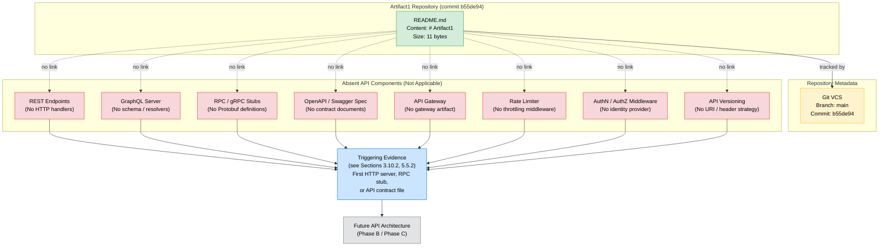

### 6.3.3 Message Processing — Not Applicable Status

#### 6.3.3.1 Current State of Message Processing

No message-processing constructs are evidenced by the repository. There are no message brokers, no event schemas, no event handlers, no subscribers or consumers, no stream processors, no batch jobs, no schedulers, no dead-letter queues, and no schema registries. Per Section 4.3.2, the integration-workflow subcategories *"data flow between systems, API interactions, event processing flows, [and] batch processing sequences"* are all deferred because no services, persistence, brokers, schedulers, or job definitions are present. Per Section 5.1.3.2, AMQP, MQTT, and Kafka are explicitly confirmed absent. Per Section 4.4.2, *"no error handling constructs are evidenced by the repository… no executable code is present, which entails that there are no runtime errors to handle, no inputs to validate, and no integration failures to recover from."*

Because no messaging substrate exists, the five sub-categories enumerated in the section prompt — event processing patterns, message queue architecture, stream processing design, batch processing flows, and error handling strategy — have no implementation surface in the current repository. Each is marked Not Applicable and deferred until the corresponding triggering evidence is committed.

#### 6.3.3.2 Message Processing Deferral Table

| Message Processing Sub-Category | Status | Triggering Evidence Required |
|----------------------------------|--------|------------------------------|
| Event processing patterns | Not Applicable (Section 4.3.2) | First event schema (Avro / JSON Schema / Protobuf), event-broker binding, or event handler implementation |
| Message queue architecture | Not Applicable (Section 2.4.2, Section 3.6.4) | First message-broker client initialization (Kafka, RabbitMQ, SQS, ActiveMQ, NATS) or queue declaration |
| Stream processing design | Not Applicable (Section 5.1.3.2) | First stream-processing framework artifact (Kafka Streams, Apache Flink, Spark Streaming, Beam) |
| Batch processing flows | Not Applicable (Section 4.3.2) | First scheduler artifact (cron, Airflow DAG, Spring Batch, Prefect), batch-job manifest, or bulk-operation handler |
| Error handling strategy | Not Applicable (Section 4.4.2, Section 5.4.3.1) | First retry-policy declaration, circuit-breaker library initialization, dead-letter queue configuration, or resilience middleware |

#### 6.3.3.3 Message Processing Inventory

The inventory below records the complete set of message-processing artifacts verifiable at commit `b55de94`. The empty rows reflect the absent state.

| Component Type | Identifier | Pattern | Status |
|----------------|------------|---------|--------|
| Message Broker | — | Pub/Sub or Queue | None Committed (Section 2.4.2) |
| Event Schema | — | Schema Format | None Committed (Section 1.2.1) |
| Event Producer | — | Synchronous or Async | None Committed (Section 4.3.2) |
| Event Consumer | — | Push or Pull | None Committed (Section 4.3.2) |
| Stream Processor | — | Stateful or Stateless | None Committed (Section 5.1.3.2) |
| Batch Job | — | Scheduled or On-Demand | None Committed (Section 4.3.2) |
| Dead-Letter Queue | — | DLQ Topology | None Committed (Section 4.4.2) |
| Retry / Backoff Policy | — | Exponential / Fixed | None Committed (Section 5.4.3.1) |

#### 6.3.3.4 Message Flow Diagram (Baseline State)

The diagram below visualizes the message-flow landscape at commit `b55de94`. It is the Message Flow Diagram required by the section prompt, rendered as an absent-state visualization because no messaging substrate exists in the repository.

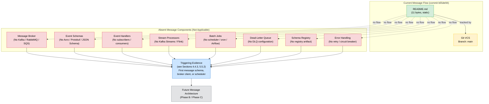

#### 6.3.3.5 Sequence Diagram Deferral

The section prompt requires *"sequence diagrams for key flows."* No integration sequence flows exist at commit `b55de94` because there are no API request/response cycles, no event publish/consume cycles, and no message queue interactions. Per Section 4.5.4 (Required Diagrams Reconciliation), integration sequence diagrams are explicitly deferred until the first integration artifact is committed. The diagram below documents the deferral state and the triggering evidence path. It is consistent with the Error Handling Flow placeholder in Section 5.4.3.3 but scoped to integration sequences.

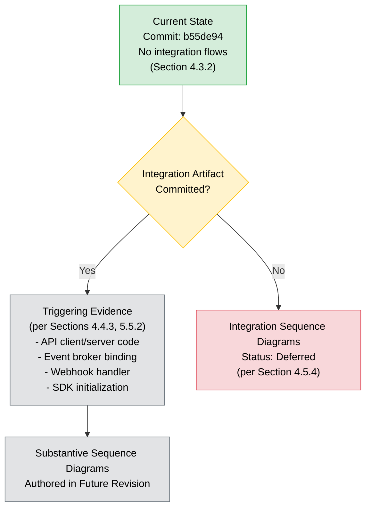

### 6.3.4 External Systems — Not Applicable Status

#### 6.3.4.1 Current State of External Systems

No external system integrations are evidenced by the repository. There are no third-party SDK initializations, no client library imports, no webhook receivers or emitters, no legacy adapter modules, no API gateway configurations, no service mesh artifacts (e.g., Istio, Linkerd, Consul Connect), and no external service contracts. Per Section 1.2.1, *"the project begins from a greenfield baseline with no inherited technical debt observable from the codebase,"* and the four enterprise-integration categories (API Contracts, Message Schemas, Service Bindings, External Connectors) are all confirmed absent. Per Section 3.6.4, no cloud-platform integration is configured: *"No AWS, Azure, GCP, Oracle Cloud, IBM Cloud, or other public-cloud configuration files… are present in the repository."*

The only external-facing relationships catalogued in Section 5.1.4 are the Git Version Control System (versioning metadata) and the asserted-but-unspecified Markdown Renderer (one-way content consumption). Per Section 5.1.1.3, the Markdown rendering interface is *"Asserted, not evidenced in repository,"* and per Section 5.1.3.3, *"the only transformation associated with the system — converting the Markdown source `# Artifact1` into a rendered H1 heading — occurs outside the repository within the unspecified external Markdown renderer asserted in Section 2.2.2.3. The transformation is not implemented, configured, or contracted within the repository."*

Because no external system integrations exist as application concerns, the four sub-categories enumerated in the section prompt — third-party integration patterns, legacy system interfaces, API gateway configuration, and external service contracts — have no implementation surface in the current repository. Each is marked Not Applicable and deferred until the corresponding triggering evidence is committed.

#### 6.3.4.2 External Systems Deferral Table

| External Systems Sub-Category | Status | Triggering Evidence Required |
|--------------------------------|--------|------------------------------|
| Third-party integration patterns | Not Applicable (Section 3.6.1) | First SDK initialization, client library import, or third-party HTTP-client wrapper |
| Legacy system interfaces | Not Applicable (Section 1.2.1) | First legacy-adapter module, compatibility shim, or anti-corruption layer artifact |
| API gateway configuration | Not Applicable (Section 2.4.2) | First API gateway configuration (Kong, Apigee, AWS API Gateway, Azure APIM, Tyk) or ingress definition |
| External service contracts | Not Applicable (Section 1.2.1) | First service contract (OpenAPI consumer, WSDL, GraphQL schema), webhook configuration, or contract-testing artifact |

#### 6.3.4.3 External Touchpoints Inventory

Per the output-format requirement to document all external dependencies, the inventory below records the complete set of external-facing touchpoints verifiable at commit `b55de94`. Only the Git VCS relationship is fully evidenced; the Markdown Renderer is asserted but not specified. All conventional external integration categories are absent.

| System Name | Integration Type | Data Exchange Pattern | Status |
|-------------|------------------|------------------------|--------|
| Git Version Control System | Versioning metadata | Local repository operations | Verified (Section 5.1.4) |
| Markdown Renderer (Unspecified) | One-way content consumption | Static content read | Asserted, not evidenced (Section 5.1.4) |
| Third-Party APIs (REST / GraphQL / RPC) | — | — | None Committed (Section 3.6.1) |
| Cloud Services (AWS / Azure / GCP) | — | — | None Committed (Section 3.6.4) |
| Webhook Receivers / Emitters | — | — | None Committed (Section 3.6.1) |
| Identity Providers (OAuth / OIDC / SAML) | — | — | None Committed (Section 3.6.2) |
| Monitoring / Observability Backends | — | — | None Committed (Section 3.6.3) |
| Service Mesh / Discovery (Istio / Consul) | — | — | None Committed (Section 5.1.2.3) |
| Legacy System Adapters | — | — | None Committed (Section 1.2.1) |
| API Gateway / Ingress | — | — | None Committed (Section 2.4.2) |

**SLA Declarations**: Per Section 4.2.7, *"No SLA values are asserted in this section. No timing constraints (timeouts, deadlines, retry intervals) are asserted in this section."* Per Section 5.1.4, *"no SLA values are asserted for any external integration in this revision. Each future integration must be accompanied by explicit SLA declarations backed by evidence."* No latency, availability, throughput, or error-budget targets are therefore asserted for the Git VCS or Markdown Renderer touchpoints, and none can be asserted for the absent categories.

#### 6.3.4.4 Integration Flow Diagram (Baseline State)

The diagram below visualizes the complete external-integration landscape at commit `b55de94`. It is the Integration Flow Diagram required by the section prompt. The two existing touchpoints (Git VCS — verified; Markdown Renderer — asserted) are depicted alongside the comprehensively absent categories of conventional external integration components.

```mermaid
flowchart TB
    subgraph RepoCurrent["Repository Boundary (commit b55de94)"]
        Readme["README.md<br/>Content: # Artifact1<br/>Size: 11 bytes"]
    end

    subgraph MetaCurrent["Repository Metadata"]
        GitVCSNode["Git VCS<br/>Branch: main<br/>Commit: b55de94"]
    end

    subgraph ExtCurrent["External Touchpoints (Asserted, Unspecified)"]
        Renderer["Markdown Renderer<br/>(External, Unspecified)"]
    end

    subgraph AbsentExt["Absent External Integration Components (Not Applicable)"]
        ThirdPartyAPI["Third-Party APIs<br/>(No SDK / HTTP client)"]
        Webhooks["Webhook Receivers / Emitters<br/>(No HTTP handlers)"]
        OAuthProv["OAuth / OIDC Providers<br/>(No identity provider)"]
        SDKClients["SDK Clients<br/>(No client libraries)"]
        APIGwExt["API Gateway<br/>(No gateway artifact)"]
        ServiceMesh["Service Mesh<br/>(No Istio / Linkerd)"]
        LegacyAdapter["Legacy Adapters<br/>(No compatibility shims)"]
        ServiceContract["External Service Contracts<br/>(No OpenAPI consumer / WSDL)"]
    end

    ExtTrigger["Triggering Evidence<br/>(see Sections 3.10.2, 5.5.2)<br/>First SDK initialization,<br/>webhook handler, or gateway config"]
    ExtFuture["Future Integration Architecture<br/>(Phase B / Phase C)"]

    Readme -->|"tracked by"| GitVCSNode
    Readme -.->|"asserted rendering"| Renderer

    Readme -.->|"no link"| ThirdPartyAPI
    Readme -.->|"no link"| Webhooks
    Readme -.->|"no link"| OAuthProv
    Readme -.->|"no link"| SDKClients
    Readme -.->|"no link"| APIGwExt
    Readme -.->|"no link"| ServiceMesh
    Readme -.->|"no link"| LegacyAdapter
    Readme -.->|"no link"| ServiceContract

    ThirdPartyAPI --> ExtTrigger
    Webhooks --> ExtTrigger
    OAuthProv --> ExtTrigger
    SDKClients --> ExtTrigger
    APIGwExt --> ExtTrigger
    ServiceMesh --> ExtTrigger
    LegacyAdapter --> ExtTrigger
    ServiceContract --> ExtTrigger
    ExtTrigger --> ExtFuture

    classDef present fill:#d4edda,stroke:#28a745,color:#000
    classDef meta fill:#fff3cd,stroke:#ffc107,color:#000
    classDef external fill:#fff3cd,stroke:#ffc107,color:#000
    classDef absent fill:#f8d7da,stroke:#dc3545,color:#000
    classDef process fill:#cce5ff,stroke:#0066cc,color:#000
    classDef future fill:#e2e3e5,stroke:#6c757d,color:#000

    class Readme present
    class GitVCSNode meta
    class Renderer external
    class ThirdPartyAPI,Webhooks,OAuthProv,SDKClients,APIGwExt,ServiceMesh,LegacyAdapter,ServiceContract absent
    class ExtTrigger process
    class ExtFuture future
```

### 6.3.5 Anti-Fabrication Constraint

Per the anti-fabrication constraint of Section 2.8.2, *"Fabrication of features, users, or metrics is prohibited… All speculative elements are deferred, not invented."* Section 5.4.5.2 reinforces this for performance and SLA assertions: *"Performance targets — including p50/p95/p99 latency budgets, throughput thresholds, availability targets (e.g., 99.9% / 99.99%), error-rate budgets, and capacity envelopes — must not be invented."* Section 3.10.3 lists candidate technology defaults (Cloud Platform = AWS, Authentication = Auth0, etc.) explicitly *"as a reference list of candidate options that future revisions of the project may evaluate. It is not asserted as adopted, committed, or selected."*

The following classes of integration-architecture values are therefore explicitly **not** asserted in this section and may only appear once supporting committed evidence is introduced:

| Forbidden-to-Fabricate Category | Rationale |
|----------------------------------|-----------|
| Specific API protocol selection (REST / GraphQL / gRPC / SOAP / WebSocket) | No HTTP server or client artifact committed (Section 5.1.3.2) |
| Specific message broker selection (Kafka / RabbitMQ / SQS / NATS / Pulsar) | No broker client initialization committed (Section 2.4.2) |
| Specific identity provider (Auth0 / Cognito / Okta / Azure AD / Keycloak) | No identity-provider configuration committed (Section 3.6.2) |
| Specific API gateway product (Kong / Apigee / AWS APIGW / Azure APIM / Tyk) | No gateway artifact committed (Section 2.4.2) |
| Authorization model selection (RBAC / ABAC / ReBAC / OAuth scopes) | No access-control construct committed (Section 5.4.4.1) |
| Rate-limit thresholds (RPS / TPS / QPS, burst, concurrency caps) | No workload or gateway artifact committed (Section 5.4.5.2) |
| API versioning scheme (URI / header / media-type / semver) | No API contracts committed (Section 2.4.2) |
| OpenAPI / Swagger / AsyncAPI documentation standards | No API documentation artifact committed (Section 1.2.1) |
| Retry counts, backoff intervals, timeout budgets | No retry mechanism implemented (Section 4.4.2) |
| Circuit-breaker thresholds (error rate, half-open interval) | No circuit-breaker library configured (Section 5.4.3.1) |
| Dead-letter queue retention or replay policies | No DLQ configuration committed (Section 4.4.2) |
| Batch-job schedules, SLAs, or completion windows | No scheduler artifact committed (Section 4.3.2) |
| Stream-processing parallelism / partition counts | No stream-processing framework committed (Section 5.1.3.2) |
| Webhook signing / verification schemes | No webhook handler committed (Section 3.6.1) |
| SLA values (latency p50/p95/p99, availability targets, error budgets) | No SLA contract committed (Section 4.2.7, Section 5.1.4) |
| Service-mesh / discovery configuration (Istio / Linkerd / Consul) | No service-mesh artifact committed (Section 5.1.2.3) |

Future revisions of this section must derive each numeric and technology assertion from an evidentiary source — a committed contract file, configuration artifact, source-code import, infrastructure-as-code definition, instrumented threshold, or authored ADR — as required by Section 5.5.3.

### 6.3.6 Phased Evolution Expectations

The expected evolution of this Integration Architecture section follows the phased growth pattern articulated in Section 5.5.1, mirroring the trajectory established in Section 6.1.6 (Core Services Architecture) and Section 6.2.7 (Database Design). As integration artifacts are committed, the deferred sub-categories above progressively become substantive and the deferral tables shrink toward retirement.

| Phase | Expected Repository State | Section 6.3 Impact |
|-------|---------------------------|--------------------|
| Phase A — Placeholder (current) | Only `README.md` + Git committed | Entire section marked Not Applicable; deferral tables populated for all sub-categories |
| Phase B — Initial Implementation | First source code, first API contract, first HTTP server/client committed | API Design subsection (6.3.2) begins populating with substantive protocol, versioning, and documentation content |
| Phase C — Operationalization | Persistence, observability, resilience, identity, and messaging artifacts committed | Message Processing (6.3.3) and External Systems (6.3.4) become substantive; auth / rate-limiting / gateway content authored |
| Phase D — Steady State | All integration architecture grounded in committed evidence | Deferral tables retired; canonical integration flow, API architecture, and message flow diagrams replace placeholder diagrams; sequence diagrams authored for every key integration flow |

Per Section 5.5.2, the specific committed-artifact events that should trigger re-authoring of subsections of 6.3 are summarized below:

| Committed Artifact | Triggers Re-Authoring Of |
|---------------------|--------------------------|
| First API contract (OpenAPI / GraphQL / AsyncAPI / Protobuf) | Subsection 6.3.2 (API Design) — protocol, versioning, documentation |
| First HTTP server, HTTP client, RPC stub, or WebSocket endpoint | Subsection 6.3.2 — protocol specifications |
| First identity-provider configuration or auth middleware | Subsection 6.3.2 — authentication methods, authorization framework |
| First API gateway or rate-limiting middleware configuration | Subsection 6.3.2 — rate limiting; Subsection 6.3.4 — API gateway configuration |
| First message schema or event-broker binding | Subsection 6.3.3 (Message Processing) — event processing patterns, message queue architecture |
| First stream-processing framework artifact | Subsection 6.3.3 — stream processing design |
| First scheduler artifact or batch-job definition | Subsection 6.3.3 — batch processing flows |
| First retry, circuit-breaker, DLQ, or resilience-pattern artifact | Subsection 6.3.3 — error handling strategy |
| First third-party SDK or client library initialization | Subsection 6.3.4 (External Systems) — third-party integration patterns |
| First legacy-adapter module or compatibility shim | Subsection 6.3.4 — legacy system interfaces |
| First webhook handler or external service contract | Subsection 6.3.4 — external service contracts |

Per Section 5.5.3, each future integration addition must be accompanied by committed artifact evidence, an authored ADR explaining selection criteria and trade-offs, cross-reference traceability to the feature catalog and feature relationships, explicit validation-rule mapping, and timing/SLA declarations backed by evidence.

### 6.3.7 Cross-Reference Summary

The table below consolidates the cross-references that ground this section's Not-Applicable determination. Readers seeking deeper context on any aspect of the deferral should consult the indicated section.

| Concern | Authoritative Cross-Reference |
|---------|-------------------------------|
| Integration points absence (primary source) | Section 2.4.2 (Integration Points); Section 1.2.1 (Integration with Existing Enterprise Landscape) |
| External APIs and SDK absence | Section 3.6.1 (External APIs and Integrations) |
| Identity provider absence | Section 3.6.2 (Authentication Services); Section 5.4.4 (AuthN / AuthZ Framework) |
| Cloud-service integration absence | Section 3.6.4 (Cloud Services) |
| Integration protocols absence | Section 5.1.3.2 (Integration Patterns and Protocols) |
| Single external touchpoint catalogue | Section 5.1.4 (External Integration Points) |
| Integration workflows deferred | Section 4.3.2 (Integration Workflows); Section 4.3.3 (Triggering Evidence) |
| Error handling and resilience absent | Section 4.4.2 (Technical Implementation); Section 5.4.3 (Error Handling Patterns) |
| Deferred technology selections (APIs, auth, messaging) | Section 3.10.2 (Deferred Categories with Triggering Evidence) |
| Component interface absence | Section 5.2.1.3 (Interface Surface) |
| Required diagrams reconciliation (sequence diagrams deferred) | Section 4.5.4 (Required Diagrams Reconciliation) |
| Anti-fabrication constraint | Section 2.8.2 (Documented Constraints); Section 5.4.5.2 (Performance Anti-Fabrication) |
| Phased evolution and re-authoring triggers | Section 5.5.1 (Phased Evolution Pattern); Section 5.5.2 (Documentation Update Triggers) |
| SLA non-assertion for external touchpoints | Section 4.2.7 (Performance and SLA Notes); Section 5.1.4 (External Integration SLAs) |
| Reference template for Not-Applicable sections | Section 6.1 (Core Services Architecture); Section 6.2 (Database Design) |

#### References

**Files Examined**
- `README.md` — Sole content file in the repository; 11 bytes; literal content `# Artifact1`; confirms absence of all API, message-processing, and external-system integration artifacts relevant to Integration Architecture.

**Folders Examined**
- `/` (repository root) — Confirmed `README.md` is the only first-order child. No `/src`, `/api`, `/services`, `/integrations`, `/messaging`, `/events`, `/handlers`, `/clients`, `/sdk`, `/gateway`, `/proto`, `/schemas`, `/config`, `/middleware`, or any integration-related directories exist.

**Technical Specification Sections Consulted**
- Section 1.2 (System Overview) — Direct evidence: *"No integration points exist in the repository,"* and the four-category integration absence table that anchors the Not-Applicable determination.
- Section 1.4 (Repository Baseline State) — Provided baseline-state diagram conventions and color scheme reused throughout the placeholder diagrams in this section.
- Section 2.1 (Documentation Approach and Constraints) — Established the explicit-deferral documentation methodology applied throughout this section.
- Section 2.4 (Feature Relationships) — Section 2.4.2 is the primary evidentiary source: *"Internal Service Integrations: None… External API Integrations: None… Message Broker Integrations: None… Database Integrations: None."*
- Section 2.7 (Deferred Requirements) — Established the *Triggering Evidence Required* template reused throughout this section.
- Section 2.8 (Assumptions and Constraints) — Source of the anti-fabrication constraint cited in Subsection 6.3.5.
- Section 3.6 (Third-Party Services) — **Primary evidentiary source** for the comprehensive enumeration of all absent External APIs, Authentication Services, Observability Tools, and Cloud Services.
- Section 3.10 (Deferred Technology Selections) — Provided triggering evidence requirements for External API Integrations, Authentication Service, Cloud Services, and Monitoring Tools; identified the reference-default candidates that are not adopted.
- Section 4.2 (Verifiable Workflow — F-001) — Source of the SLA non-assertion principle: *"No SLA values are asserted… No timing constraints (timeouts, deadlines, retry intervals) are asserted."*
- Section 4.3 (System Workflows) — Section 4.3.2 confirms all integration workflows (data flow, API interactions, event processing, batch processing) are deferred.
- Section 4.4 (Technical Implementation) — Confirmed absence of error handling, retry mechanisms, fallback processes, recovery procedures, and notification flows; Section 4.4.3 provided triggering evidence requirements for error-handling artifacts.
- Section 4.5 (Required Diagrams Reconciliation) — Section 4.5.4 deferred integration sequence diagrams; basis for the sequence-diagram deferral in Subsection 6.3.3.5.
- Section 5.1 (High-Level Architecture) — Section 5.1.3.2 enumerated all absent integration protocols; Section 5.1.4 catalogued the only two external touchpoints (Git VCS verified, Markdown Renderer asserted).
- Section 5.2 (Component Details) — Section 5.2.1.3 directly states no HTTP/RPC/GraphQL/Protobuf/SDK interfaces are present.
- Section 5.3 (Technical Decisions) — Deferred architectural decision template referenced for the triggering-evidence pattern.
- Section 5.4 (Cross-Cutting Concerns) — Section 5.4.3 established error-handling deferral; Section 5.4.4 established AuthN/AuthZ absence; Section 5.4.5.2 reinforced the performance/SLA anti-fabrication constraint.
- Section 5.5 (Architecture Evolution Expectations) — Phased evolution pattern (Phases A–D) and re-authoring triggers reproduced in Subsection 6.3.6.
- Section 6.1 (Core Services Architecture) — **Reference template** for the Not-Applicable section structure, color conventions, and deferral-table format that this section faithfully follows.
- Section 6.2 (Database Design) — **Reference template** confirming the established pattern (applicability determination → sub-category deferral tables → baseline diagrams → anti-fabrication constraint → phased evolution → cross-reference summary) used across all Section 6 deferrals.

## 6.4 Security Architecture

**Detailed Security Architecture is not applicable for this system.**

The Artifact1 repository at commit `b55de94` is in a greenfield placeholder state and commits no security architecture. Exhaustive repository inspection confirms a single 11-byte `README.md` content artifact and Git version-control metadata only. Per Section 2.5.1.4, every dimension of the security surface is empty: Authentication Surface is *"None — no executable code, no user-facing interface, no authenticated operation exists"*; Authorization Surface is *"None — no protected resources, no access control constructs present"*; Input Handling is *"Not Applicable — the feature accepts no inputs"*; Secret Management is *"Not Applicable — no secrets, credentials, or sensitive data are committed or referenced"*; and Dependency Vulnerability is *"Not Applicable — no third-party dependencies are declared in the repository."* Per Section 3.6.2, *"No identity provider (Auth0, AWS Cognito, Okta, Azure AD, Google Identity, Keycloak, or equivalent) is configured. No OAuth/OIDC, SAML, or session-management constructs exist."*

Because no identity providers, authentication middleware, authorization policies, encryption libraries, key management systems, audit logging emitters, or compliance controls exist in the repository, the conventional Security Architecture concerns enumerated in the section prompt — Authentication Framework, Authorization System, and Data Protection — cannot be authored against the current repository state without fabricating content, which is prohibited by Section 2.8.2. Following the explicit-deferral principle of Section 2.1.1 and the section-structure pattern established by Sections 6.1 (Core Services Architecture), 6.2 (Database Design), and 6.3 (Integration Architecture), this section is retained in the document structure with each sub-category marked **Not Applicable** or **Deferred** and paired with the specific committed artifact that would trigger its substantive authorship in a future revision.

The section prompt anticipates this determination with the directive: *"If the system does not require specific security considerations beyond standard practices, clearly state 'Detailed Security Architecture is not applicable for this system' and explain which standard security practices will be followed instead."* The standard security practices that apply by virtue of the platform substrate alone (Git version control) are catalogued in Subsection 6.4.5 below, scoped strictly to evidenced controls and free of fabricated assertions.

### 6.4.1 Applicability Determination

#### 6.4.1.1 Determination Statement

The determination that Detailed Security Architecture is not applicable is grounded in committed evidence rather than inference. The single documentable component — the `README.md` identity artifact — is a static text file with no executable behavior. Per Section 5.2.1.1, the artifact *"has no executable behavior, accepts no inputs, mutates no state, and emits no events."* Consequently, the system at commit `b55de94` does not exhibit any of the attack surfaces, trust boundaries, or sensitive-data flows that the Security Architecture concern is designed to document.

Per Section 5.4.4.2, *"The selection of an authentication framework, authorization model (RBAC / ABAC / ReBAC), identity provider, and session-management strategy is deferred until the triggering evidence enumerated in Section 3.10.2 is committed: 'Identity-provider configuration, auth middleware, OAuth/OIDC client setup.'"* The remainder of this section enumerates the evidentiary basis for the determination and catalogues each sub-category of the three security concerns (Authentication Framework, Authorization System, Data Protection) with the triggering evidence required to retire the deferral.

#### 6.4.1.2 Direct Evidentiary Basis

The table below consolidates the direct evidentiary quotes that support the Not-Applicable determination. Each entry cites the originating Technical Specification section so that the determination is traceable to its source.

| Concern Area | Evidence | Source |
|--------------|----------|--------|
| Authentication Surface | "None — no executable code, no user-facing interface, no authenticated operation exists." | Section 2.5.1.4 |
| Authorization Surface | "None — no protected resources, no access control constructs present." | Section 2.5.1.4 |
| Input Handling | "Not Applicable — the feature accepts no inputs." | Section 2.5.1.4 |
| Output Handling | "The literal string `# Artifact1` is the only output; no dynamic content or injection surface exists." | Section 2.5.1.4 |
| Secret Management | "Not Applicable — no secrets, credentials, or sensitive data are committed or referenced." | Section 2.5.1.4 |
| Dependency Vulnerability | "Not Applicable — no third-party dependencies are declared in the repository." | Section 2.5.1.4 |
| Identity Provider Absence | "No identity provider (Auth0, AWS Cognito, Okta, Azure AD, Google Identity, Keycloak, or equivalent) is configured." | Section 3.6.2 |
| AuthN/AuthZ Protocol Absence | "No OAuth/OIDC, SAML, or session-management constructs exist." | Section 3.6.2 |
| Out-of-Scope AuthN/AuthZ | "Authentication & Authorization — No identity or access management constructs." | Section 1.3.2 |
| Cloud Identity Services Absence | Identity-as-a-Service and Secrets Management cloud-service categories confirmed as `None`. | Section 3.6.4 |
| Component-Level Security Surface | "The artifact has no executable behavior, accepts no inputs, mutates no state, and emits no events." | Section 5.2.1.1 |
| Anti-Fabrication Constraint | "Fabrication of features, users, or metrics is prohibited… All speculative elements are deferred, not invented." | Section 2.8.2 |

#### 6.4.1.3 Confirmed-Absent Security Categories

Per Section 2.5.1.4, Section 3.6.2, Section 3.6.4, and Section 5.4.4.1, every security-control category that would otherwise be the subject of a Security Architecture section is confirmed absent from the repository:

| Security Category | Status | Source |
|-------------------|--------|--------|
| Identity Provider (OAuth / OIDC / SAML / LDAP) | Absent — None Committed | Section 3.6.2 |
| Authentication Middleware | Absent — None Committed | Section 3.6.2 |
| Multi-Factor Authentication (TOTP / SMS / WebAuthn / Push) | Absent — None Committed | Section 2.5.1.4 |
| Session Management (Cookies / JWT / Refresh Tokens) | Absent — None Committed | Section 3.6.2 |
| Password Storage and Handlers | Absent — None Committed | Section 2.5.1.4 |
| Role-Based Access Control (RBAC) Policies | Absent — None Committed | Section 5.4.4.1 |
| Attribute-Based Access Control (ABAC) Policies | Absent — None Committed | Section 5.4.4.1 |
| Permission and Role Declarations | Absent — None Committed | Section 5.4.4.1 |
| Policy Enforcement Points (Guards / Middleware) | Absent — None Committed | Section 5.4.4.1 |
| Policy Decision Points | Absent — None Committed | Section 5.4.4.1 |
| Audit Logging Emitters | Absent — None Committed | Section 5.4.1 |
| Encryption Libraries (At-Rest / In-Transit) | Absent — None Committed | Section 2.5.1.4 |
| Key Management Systems (KMS / Vault / HSM) | Absent — None Committed | Section 3.6.4 |
| TLS / mTLS Configuration | Absent — None Committed | Section 5.1.3.2 |
| Data Masking and Redaction Handlers | Absent — None Committed | Section 2.5.1.4 |
| Secret Stores and Credential Vaults | Absent — None Committed | Section 3.6.4 |
| Compliance Control Mappings (SOC 2 / ISO 27001 / GDPR / HIPAA / PCI-DSS) | Absent — None Committed | Section 6.2.4 |
| Security Scanning Tools (SAST / DAST / SCA / Container Scanning) | Absent — None Committed | Section 3.10.2 |
| Threat Model Documents | Absent — None Committed | Section 2.5.1.4 |
| Security Incident Response Procedures | Absent — None Committed | Section 1.3.2 |

Per Section 2.4.2, every integration-point category — internal service integrations, external API integrations, message broker integrations, and database integrations — is also confirmed `None`. With no services and no integration points, the conventional Security Architecture topics have no substrate on which to operate.

### 6.4.2 Authentication Framework — Not Applicable Status

#### 6.4.2.1 Current State of Authentication

No authentication framework exists in the repository. There is no identity-provider configuration (Auth0, AWS Cognito, Okta, Azure AD, Google Identity, Keycloak, or equivalent), no OAuth/OIDC client setup, no SAML assertion handler, no session store, no JWT issuer or validator, no password-hashing library, and no MFA library initialization. Per Section 3.6.2, *"No identity provider… is configured. No OAuth/OIDC, SAML, or session-management constructs exist."* Per Section 5.4.4.1, the Authentication Surface is *"None — no executable code, no user-facing interface, no authenticated operation exists."*

Because no authentication substrate exists, the five sub-categories enumerated in the section prompt — identity management, multi-factor authentication, session management, token handling, and password policies — have no substantive content to document at this revision. Each is marked Not Applicable and deferred until the corresponding triggering evidence is committed.

#### 6.4.2.2 Authentication Framework Deferral Table

The deferral table below follows the *Triggering Evidence Required* template established in Sections 2.7.2, 3.10.2, 4.3.3, 4.4.3, 5.3.2, and 5.4.7. Each sub-category of the Authentication Framework prompt is paired with the specific committed artifact that would trigger its inclusion in a future revision of this section.

| Authentication Sub-Category | Status | Triggering Evidence Required |
|------------------------------|--------|------------------------------|
| Identity management | Not Applicable (Section 3.6.2, Section 5.4.4.1) | First identity-provider configuration (Auth0, Cognito, Okta, Azure AD, Keycloak) or directory-service integration |
| Multi-factor authentication | Not Applicable (Section 2.5.1.4, Section 3.6.2) | First MFA library or SDK initialization (TOTP, WebAuthn, SMS, push notification) |
| Session management | Not Applicable (Section 3.6.2) | First session store, cookie handler, JWT issuer, or refresh-token implementation |
| Token handling | Not Applicable (Section 3.6.2) | First OAuth/OIDC client setup, JWT library, or token-validation middleware |
| Password policies | Not Applicable (Section 2.5.1.4) | First password handler, password-hashing library (bcrypt, argon2, scrypt), or identity-provider configuration |

#### 6.4.2.3 Authentication Inventory

Per the output-format requirement to document security policies with Markdown tables, the inventory below records the complete set of authentication artifacts verifiable at commit `b55de94`. The empty rows reflect the absent state — no authentication mechanisms exist because no executable code is present.

| Authentication Mechanism | Provider | Protocol | Status |
|---------------------------|----------|----------|--------|
| Password-Based Login | — | — | None Committed (Section 2.5.1.4) |
| OAuth 2.0 / OpenID Connect | — | HTTPS | None Committed (Section 3.6.2) |
| SAML 2.0 Federation | — | HTTPS | None Committed (Section 3.6.2) |
| Multi-Factor Authentication | — | TOTP / WebAuthn / SMS | None Committed (Section 2.5.1.4) |
| API Key / Bearer Token | — | HTTPS | None Committed (Section 3.6.2) |
| Session Cookies | — | HTTP | None Committed (Section 3.6.2) |
| JWT / Refresh Tokens | — | JWS / JWE | None Committed (Section 3.6.2) |
| Certificate-Based (mTLS) | — | TLS | None Committed (Section 5.1.3.2) |
| Passwordless / Magic Links | — | Email / HTTPS | None Committed (Section 2.5.1.4) |

#### 6.4.2.4 Authentication Flow Diagram (Baseline State)

The diagram below visualizes the complete authentication landscape at commit `b55de94`. It is the Authentication Flow Diagram required by the section prompt, rendered as an absent-state visualization because no authentication flows exist in the repository. It inherits the color conventions established in Sections 1.4.2, 3.9.2, 5.2.2, 6.1, 6.2, and 6.3 (green = verified present; yellow = repository metadata or external unspecified; red = confirmed absent; blue = process; gray = future state).

```mermaid
flowchart TB
    subgraph RepoBoundary["Artifact1 Repository (commit b55de94)"]
        Readme["README.md<br/>Content: # Artifact1<br/>Size: 11 bytes"]
    end

    subgraph MetaBoundary["Repository Metadata"]
        GitVCS["Git VCS<br/>Branch: main<br/>Commit: b55de94"]
    end

    subgraph AbsentAuthN["Absent Authentication Components (Not Applicable)"]
        IdP["Identity Provider<br/>(No Auth0 / Okta / Cognito / Azure AD)"]
        AuthMW["Authentication Middleware<br/>(No auth handler / guard)"]
        SessionMgr["Session Manager<br/>(No cookie / JWT store)"]
        TokenIssuer["Token Issuer / Validator<br/>(No JWT / OAuth client)"]
        MFAEngine["MFA Engine<br/>(No TOTP / WebAuthn / SMS)"]
        PasswordStore["Password Store<br/>(No bcrypt / argon2 hash)"]
        SAMLHandler["SAML Handler<br/>(No assertion processor)"]
    end

    AuthNTrigger["Triggering Evidence<br/>(see Sections 3.10.2, 5.4.4.2)<br/>First identity-provider config,<br/>auth middleware, or OAuth client"]
    AuthNFuture["Future Authentication Architecture<br/>(Phase B / Phase C)<br/>Substantive flow diagram authored"]

    Readme -->|"tracked by"| GitVCS

    Readme -.->|"no link"| IdP
    Readme -.->|"no link"| AuthMW
    Readme -.->|"no link"| SessionMgr
    Readme -.->|"no link"| TokenIssuer
    Readme -.->|"no link"| MFAEngine
    Readme -.->|"no link"| PasswordStore
    Readme -.->|"no link"| SAMLHandler

    IdP --> AuthNTrigger
    AuthMW --> AuthNTrigger
    SessionMgr --> AuthNTrigger
    TokenIssuer --> AuthNTrigger
    MFAEngine --> AuthNTrigger
    PasswordStore --> AuthNTrigger
    SAMLHandler --> AuthNTrigger
    AuthNTrigger --> AuthNFuture

    classDef present fill:#d4edda,stroke:#28a745,color:#000
    classDef meta fill:#fff3cd,stroke:#ffc107,color:#000
    classDef absent fill:#f8d7da,stroke:#dc3545,color:#000
    classDef process fill:#cce5ff,stroke:#0066cc,color:#000
    classDef future fill:#e2e3e5,stroke:#6c757d,color:#000

    class Readme present
    class GitVCS meta
    class IdP,AuthMW,SessionMgr,TokenIssuer,MFAEngine,PasswordStore,SAMLHandler absent
    class AuthNTrigger process
    class AuthNFuture future
```

### 6.4.3 Authorization System — Not Applicable Status

#### 6.4.3.1 Current State of Authorization

No authorization system exists in the repository. There are no role declarations, no permission registries, no policy documents (RBAC / ABAC / ReBAC), no policy decision points, no policy enforcement points (middleware / guards / interceptors), no protected-resource declarations, and no audit-log emitters. Per Section 5.4.4.1, the Authorization Surface is *"None — no protected resources, no access control constructs."* Per Section 5.4.4.2, *"The selection of an authentication framework, authorization model (RBAC / ABAC / ReBAC), identity provider, and session-management strategy is deferred until the triggering evidence enumerated in Section 3.10.2 is committed."*

Because no authorization substrate exists, the five sub-categories enumerated in the section prompt — role-based access control, permission management, resource authorization, policy enforcement points, and audit logging — have no substantive content to document at this revision. Each is marked Not Applicable and deferred until the corresponding triggering evidence is committed.

#### 6.4.3.2 Authorization System Deferral Table

| Authorization Sub-Category | Status | Triggering Evidence Required |
|------------------------------|--------|------------------------------|
| Role-based access control | Not Applicable (Section 2.5.1.4, Section 5.4.4.1) | First RBAC role declaration, role-binding manifest, or role-assignment policy file |
| Permission management | Not Applicable (Section 5.4.4.1) | First permission declaration, grant statement, capability registry, or scope definition |
| Resource authorization | Not Applicable (Section 2.5.1.4) | First protected-resource declaration, route-level guard, or resource-policy annotation |
| Policy enforcement points | Not Applicable (Section 5.4.4.2) | First auth middleware, guard, interceptor, or policy-gate implementation |
| Audit logging | Not Applicable (Section 5.4.1, Section 5.4.2) | First audit-log emitter, audit-trail schema, security-event logger, or compliance-reporting handler |

#### 6.4.3.3 Authorization Inventory

| Authorization Construct | Identifier | Model | Status |
|--------------------------|------------|-------|--------|
| Role Definition | — | RBAC | None Committed (Section 5.4.4.1) |
| Permission Declaration | — | RBAC / ABAC | None Committed (Section 5.4.4.1) |
| Policy Document | — | ABAC / ReBAC / OPA | None Committed (Section 5.4.4.1) |
| Policy Decision Point (PDP) | — | Centralized / Embedded | None Committed (Section 5.4.4.1) |
| Policy Enforcement Point (PEP) | — | Middleware / Guard | None Committed (Section 5.4.4.2) |
| Protected Resource | — | URI / Method / Object | None Committed (Section 2.5.1.4) |
| Audit Log Emitter | — | Structured / Free-Text | None Committed (Section 5.4.1) |
| Audit Trail Sink | — | File / Stream / DB | None Committed (Section 5.4.2) |

#### 6.4.3.4 Authorization Flow Diagram (Baseline State)

The diagram below visualizes the complete authorization landscape at commit `b55de94`. It is the Authorization Flow Diagram required by the section prompt, rendered as an absent-state visualization because no authorization flows exist in the repository.

```mermaid
flowchart TB
    subgraph RepoBoundaryAZ["Artifact1 Repository (commit b55de94)"]
        ReadmeAZ["README.md<br/>Content: # Artifact1<br/>Size: 11 bytes"]
    end

    subgraph MetaBoundaryAZ["Repository Metadata"]
        GitVCSAZ["Git VCS<br/>Branch: main<br/>Commit: b55de94"]
    end

    subgraph AbsentAuthZ["Absent Authorization Components (Not Applicable)"]
        RBACEngine["RBAC / ABAC Engine<br/>(No policy evaluation)"]
        PDP["Policy Decision Point<br/>(No OPA / Cedar / Casbin)"]
        PEP["Policy Enforcement Point<br/>(No middleware / guard)"]
        PermStore["Permission Store<br/>(No grant registry)"]
        RoleRegistry["Role Registry<br/>(No role definitions)"]
        ProtectedRes["Protected Resources<br/>(No protected routes / objects)"]
        AuditLogger["Audit Logger<br/>(No security-event sink)"]
        AuditTrail["Audit Trail Schema<br/>(No structured event format)"]
    end

    AuthZTrigger["Triggering Evidence<br/>(see Sections 5.4.4.2, 5.4.7)<br/>First RBAC/ABAC policy,<br/>guard, or audit emitter"]
    AuthZFuture["Future Authorization Architecture<br/>(Phase B / Phase C)<br/>Substantive flow diagram authored"]

    ReadmeAZ -->|"tracked by"| GitVCSAZ

    ReadmeAZ -.->|"no link"| RBACEngine
    ReadmeAZ -.->|"no link"| PDP
    ReadmeAZ -.->|"no link"| PEP
    ReadmeAZ -.->|"no link"| PermStore
    ReadmeAZ -.->|"no link"| RoleRegistry
    ReadmeAZ -.->|"no link"| ProtectedRes
    ReadmeAZ -.->|"no link"| AuditLogger
    ReadmeAZ -.->|"no link"| AuditTrail

    RBACEngine --> AuthZTrigger
    PDP --> AuthZTrigger
    PEP --> AuthZTrigger
    PermStore --> AuthZTrigger
    RoleRegistry --> AuthZTrigger
    ProtectedRes --> AuthZTrigger
    AuditLogger --> AuthZTrigger
    AuditTrail --> AuthZTrigger
    AuthZTrigger --> AuthZFuture

    classDef present fill:#d4edda,stroke:#28a745,color:#000
    classDef meta fill:#fff3cd,stroke:#ffc107,color:#000
    classDef absent fill:#f8d7da,stroke:#dc3545,color:#000
    classDef process fill:#cce5ff,stroke:#0066cc,color:#000
    classDef future fill:#e2e3e5,stroke:#6c757d,color:#000

    class ReadmeAZ present
    class GitVCSAZ meta
    class RBACEngine,PDP,PEP,PermStore,RoleRegistry,ProtectedRes,AuditLogger,AuditTrail absent
    class AuthZTrigger process
    class AuthZFuture future
```

### 6.4.4 Data Protection — Not Applicable Status

#### 6.4.4.1 Current State of Data Protection

No data-protection mechanisms are evidenced by the repository. There are no encryption libraries (symmetric or asymmetric), no TLS or mTLS configurations, no key management system integrations (AWS KMS, Azure Key Vault, HashiCorp Vault, GCP KMS), no Hardware Security Module bindings, no data-masking or redaction handlers, no secret stores, and no compliance-control mappings. Per Section 2.5.1.4, Secret Management is *"Not Applicable — no secrets, credentials, or sensitive data are committed or referenced."* Per Section 3.6.4, both Identity-as-a-Service and Secrets Management cloud-service categories are confirmed as `None`. Per Section 5.1.3.2, *"All other integration patterns — REST, GraphQL, gRPC, AMQP, MQTT, Kafka, WebSocket, JDBC/ODBC, SQL — are confirmed absent,"* which entails no network endpoints requiring TLS configuration.

Because no data substrate, no network channel, and no sensitive material exist, the five sub-categories enumerated in the section prompt — encryption standards, key management, data masking rules, secure communication, and compliance controls — have no implementation surface in the current repository. Each is marked Not Applicable and deferred until the corresponding triggering evidence is committed.

#### 6.4.4.2 Data Protection Deferral Table

| Data Protection Sub-Category | Status | Triggering Evidence Required |
|-------------------------------|--------|------------------------------|
| Encryption standards | Not Applicable (Section 2.5.1.4) | First encryption library initialization (AES, ChaCha20, RSA, ECDSA), TLS configuration, or cipher-suite declaration |
| Key management | Not Applicable (Section 2.5.1.4, Section 3.6.4) | First KMS integration (AWS KMS, Azure Key Vault, HashiCorp Vault, GCP KMS), HSM binding, or local key store |
| Data masking rules | Not Applicable (Section 2.5.1.4) | First sensitive-data handler, PII redaction routine, tokenization library, or field-level masking policy |
| Secure communication | Not Applicable (Section 5.1.3.2) | First HTTP server / client with TLS configuration, mTLS certificate, or VPN/IPsec artifact |
| Compliance controls | Not Applicable (Section 6.2.4) | First retention policy, PII handler, encryption-at-rest configuration, or compliance-framework control mapping |

#### 6.4.4.3 Data Protection Inventory

| Data Protection Mechanism | Algorithm / Standard | Scope | Status |
|----------------------------|----------------------|-------|--------|
| Encryption at Rest | — | Database / File System | None Committed (Section 2.5.1.4) |
| Encryption in Transit | — | Network | None Committed (Section 5.1.3.2) |
| Symmetric Encryption | — | Data | None Committed (Section 2.5.1.4) |
| Asymmetric Encryption | — | Identity / Signing | None Committed (Section 2.5.1.4) |
| Hashing (Passwords) | — | Credential | None Committed (Section 2.5.1.4) |
| Hashing (Integrity) | — | Data | None Committed (Section 2.5.1.4) |
| Key Management System | — | Keys / Secrets | None Committed (Section 3.6.4) |
| Hardware Security Module | — | Keys | None Committed (Section 3.6.4) |
| Secret Store / Vault | — | Credentials | None Committed (Section 3.6.4) |
| Data Masking / Tokenization | — | PII / Sensitive | None Committed (Section 2.5.1.4) |
| TLS / mTLS Configuration | — | Network | None Committed (Section 5.1.3.2) |

#### 6.4.4.4 Compliance Requirements Documentation

Per the section prompt's directive to *"Document compliance requirements,"* the table below catalogues the conventional compliance frameworks that would otherwise be addressed in a Security Architecture section. At commit `b55de94`, no compliance framework is mapped, asserted, or implemented because the system contains no data subject to compliance treatment. This inventory therefore documents the absence and the triggering evidence required to authorize any future compliance assertion. Per Section 6.2.4.3, *"PII / Privacy (e.g., GDPR, CCPA): None — no user data committed"* and *"Payment Data (e.g., PCI DSS): None — no payment flows committed."*

| Compliance Framework | Applicable Data Class | Control Mapping | Status |
|------------------------|-------------------------|--------------------|--------|
| GDPR (EU General Data Protection Regulation) | Personal Data of EU Subjects | None | Not Applicable (Section 6.2.4) |
| CCPA / CPRA (California Privacy) | Personal Information of CA Residents | None | Not Applicable (Section 6.2.4) |
| HIPAA (US Health Records) | Protected Health Information | None | Not Applicable (Section 6.2.4) |
| PCI DSS (Payment Cards) | Cardholder Data | None | Not Applicable (Section 6.2.4) |
| SOC 2 (Trust Services Criteria) | Service Organization Controls | None | Not Applicable (Section 1.3.2) |
| ISO/IEC 27001 (ISMS) | Information Security Mgmt | None | Not Applicable (Section 1.3.2) |
| FedRAMP (US Federal Cloud) | Federal Data | None | Not Applicable (Section 3.6.4) |
| NIST 800-53 / CSF | US Federal Controls | None | Not Applicable (Section 1.3.2) |
| SOX (Sarbanes-Oxley) | Financial Records | None | Not Applicable (Section 6.2.4) |
| FERPA (US Education) | Student Records | None | Not Applicable (Section 6.2.4) |

Future revisions of this subsection must derive each compliance-framework assertion from an evidentiary source — a committed control mapping, an authored Statement of Applicability, an executed audit artifact, or a binding contractual obligation — as required by Section 2.8.2 and Section 5.5.3.

#### 6.4.4.5 Security Zone Diagram (Baseline State)

The diagram below visualizes the complete security-zone landscape at commit `b55de94`. It is the Security Zone Diagram required by the section prompt, rendered as an absent-state visualization because no security zones, no trust boundaries, no segmentation, and no network perimeters exist in the repository. The only zone-like constructs verifiable are (a) the repository boundary itself, (b) the Git VCS metadata zone, and (c) the asserted-but-unspecified external Markdown Renderer (per Section 5.1.4). All conventional security zones — DMZ, internal network, trusted/identity-provider zone, application tier, data tier — are confirmed absent.

```mermaid
flowchart TB
    subgraph CurrentZones["Current Security Zones (commit b55de94)"]
        direction TB
        RepoZone["Repository Boundary<br/>README.md (11 bytes)<br/>Static, read-only artifact"]
        GitZone["Git Metadata Zone<br/>Branch: main<br/>Commit: b55de94"]
        ExtZone["Asserted External Zone<br/>Markdown Renderer<br/>(Unspecified, not evidenced)"]
        RepoZone --> GitZone
        RepoZone -.->|"asserted rendering"| ExtZone
    end

    subgraph AbsentZones["Absent Security Zones (Not Applicable)"]
        DMZZone["DMZ / Public Zone<br/>(No internet-facing service)"]
        EdgeZone["Edge / API Gateway Zone<br/>(No gateway / WAF)"]
        AppZone["Application Tier Zone<br/>(No application services)"]
        DataZone["Data Tier Zone<br/>(No databases / stores)"]
        IdPZone["Identity Provider Zone<br/>(No IdP configured)"]
        MgmtZone["Management / Admin Zone<br/>(No admin interface)"]
        SecretsZone["Secrets / Vault Zone<br/>(No secret store)"]
        ObsZone["Observability Zone<br/>(No telemetry sink)"]
    end

    subgraph AbsentControls["Absent Zone-Crossing Controls (Not Applicable)"]
        Firewall["Firewall / Network ACL<br/>(No network rules)"]
        WAF["Web Application Firewall<br/>(No HTTP filtering)"]
        TLSTerm["TLS Termination<br/>(No certificates / endpoints)"]
        ZeroTrust["Zero-Trust Mesh<br/>(No mTLS / service identity)"]
        IDS["Intrusion Detection<br/>(No IDS / IPS sensor)"]
    end

    ZoneTrigger["Triggering Evidence<br/>(see Sections 3.10.2, 5.4.4.2)<br/>First network endpoint,<br/>service boundary, or<br/>identity-provider config"]
    ZoneFuture["Future Security Zone Architecture<br/>(Phase C — Operationalization)<br/>Substantive zone diagram with<br/>trust boundaries authored"]

    RepoZone -.->|"no zone"| DMZZone
    RepoZone -.->|"no zone"| EdgeZone
    RepoZone -.->|"no zone"| AppZone
    RepoZone -.->|"no zone"| DataZone
    RepoZone -.->|"no zone"| IdPZone
    RepoZone -.->|"no zone"| MgmtZone
    RepoZone -.->|"no zone"| SecretsZone
    RepoZone -.->|"no zone"| ObsZone

    DMZZone --> ZoneTrigger
    EdgeZone --> ZoneTrigger
    AppZone --> ZoneTrigger
    DataZone --> ZoneTrigger
    IdPZone --> ZoneTrigger
    MgmtZone --> ZoneTrigger
    SecretsZone --> ZoneTrigger
    ObsZone --> ZoneTrigger

    Firewall --> ZoneTrigger
    WAF --> ZoneTrigger
    TLSTerm --> ZoneTrigger
    ZeroTrust --> ZoneTrigger
    IDS --> ZoneTrigger
    ZoneTrigger --> ZoneFuture

    classDef present fill:#d4edda,stroke:#28a745,color:#000
    classDef meta fill:#fff3cd,stroke:#ffc107,color:#000
    classDef external fill:#fff3cd,stroke:#ffc107,color:#000
    classDef absent fill:#f8d7da,stroke:#dc3545,color:#000
    classDef process fill:#cce5ff,stroke:#0066cc,color:#000
    classDef future fill:#e2e3e5,stroke:#6c757d,color:#000

    class RepoZone present
    class GitZone meta
    class ExtZone external
    class DMZZone,EdgeZone,AppZone,DataZone,IdPZone,MgmtZone,SecretsZone,ObsZone,Firewall,WAF,TLSTerm,ZeroTrust,IDS absent
    class ZoneTrigger process
    class ZoneFuture future
```

### 6.4.5 Standard Security Practices Available at the Baseline

Per the section prompt's directive to *"explain which standard security practices will be followed instead"* when detailed Security Architecture is not applicable, this subsection enumerates the standard security practices that apply by virtue of the platform substrate alone (Git version control) and the structural properties of the repository. Each practice listed below is grounded in evidenced repository properties, not in invented standards. Per Section 2.8.2, *"All speculative elements are deferred, not invented."*

#### 6.4.5.1 Practices Grounded in Evidenced Repository Properties

| Practice | Basis | Status at b55de94 |
|----------|-------|--------------------|
| Git-based commit attribution and history | Every change to `README.md` is recorded as a Git commit on `main` with author, timestamp, and parent commit. | Active — inherent to Git VCS (Section 1.4) |
| Repository access control inherited from Git host | Authentication and authorization for clone/push/pull are delegated to the hosting Git platform's identity model. | Active — platform-level, not repository-evidenced |
| Commit signing capability | Git supports GPG/SSH commit signing as a platform convention; not asserted as configured in this repository. | Available but not committed |
| Branch model with `main` as canonical history | The `main` branch is the canonical project history per Section 2.5.1.1; branch-protection policies are configurable at the hosting platform. | Branch present; protection rules not in repository |
| Read-only static artifact surface | The `README.md` artifact has no executable behavior (Section 5.2.1.1), no inputs, and no dynamic content (Section 2.5.1.4), which eliminates common runtime attack vectors. | Active — structural property |
| Evidence-based documentation discipline | Per Section 2.8.2, fabrication is prohibited; this prevents the documentation itself from asserting security controls that do not exist. | Active — documentation policy |

#### 6.4.5.2 Important Caveats on "Standard Security Practices"

The following caveats apply to the practices enumerated above and must be observed in any future revision of this section:

1. **No specific encryption standard is asserted.** Per the anti-fabrication constraint of Section 2.8.2, statements such as *"TLS 1.3 is used,"* *"AES-256-GCM at rest,"* or *"data is encrypted in transit"* would constitute fabrication because no encryption library, TLS configuration, or cryptographic primitive is committed to the repository.

2. **No compliance posture is asserted.** Statements such as *"SOC 2 Type II controls apply"* or *"GDPR-compliant data handling"* are explicitly **not** asserted because no compliance control mapping, retention policy, or PII handler is committed (per Section 6.2.4.3).

3. **No threat model is asserted.** No threat-modeling document (STRIDE, DREAD, PASTA, or equivalent), no risk register, and no CVSS-scored finding exists in the repository. Such artifacts must be authored alongside the substantive security architecture they support.

4. **No security incident response procedure is asserted.** Per Section 1.3.2, operational tooling is out of scope at the baseline; no runbook, escalation path, or RTO/RPO target for security events is committed.

5. **No security scanning tooling is asserted.** Per Section 3.10.2, no CI/CD pipeline, no SAST/DAST/SCA tool (Snyk, Dependabot, Trivy, OWASP ZAP, etc.), and no container scanner is committed; therefore, no vulnerability-management cadence can be asserted.

6. **Git VCS access control is platform-dependent.** The authentication and authorization properties of the Git remote (clone, push, pull) depend on the hosting platform's configuration, which is outside the boundary of the repository at commit `b55de94`. No platform-specific claim is therefore asserted in this section.

### 6.4.6 Security Control Matrix

Per the section prompt's directive to *"Include security control matrices,"* the matrix below maps the conventional security-control families to their current status at commit `b55de94` and the triggering evidence that would activate each family in a future revision. The matrix uses four columns to remain within the documented format constraint and provides a single canonical inventory across the three security concerns (Authentication Framework, Authorization System, Data Protection).

#### 6.4.6.1 Preventive Controls Matrix

| Preventive Control Family | Concern | Status | Triggering Evidence |
|----------------------------|---------|--------|----------------------|
| Identity Verification | Authentication | Not Applicable (Section 2.5.1.4) | Identity-provider configuration |
| Credential Storage | Authentication | Not Applicable (Section 2.5.1.4) | Password handler / hash library |
| Session Establishment | Authentication | Not Applicable (Section 3.6.2) | Session store / JWT issuer |
| Multi-Factor Challenge | Authentication | Not Applicable (Section 2.5.1.4) | MFA library initialization |
| Role-Based Access Control | Authorization | Not Applicable (Section 5.4.4.1) | First role/permission declaration |
| Attribute-Based Access Control | Authorization | Not Applicable (Section 5.4.4.1) | First ABAC policy / OPA artifact |
| Resource-Level Authorization | Authorization | Not Applicable (Section 5.4.4.1) | Protected-resource declaration |
| Input Validation | Data Protection | Not Applicable (Section 2.5.1.4) | First input handler |
| Encryption at Rest | Data Protection | Not Applicable (Section 2.5.1.4) | Encryption library + storage |
| Encryption in Transit | Data Protection | Not Applicable (Section 5.1.3.2) | TLS configuration + endpoint |
| Secret Storage | Data Protection | Not Applicable (Section 3.6.4) | KMS / Vault integration |
| Network Segmentation | Data Protection | Not Applicable (Section 5.1.3.2) | First network endpoint / zone |

#### 6.4.6.2 Detective Controls Matrix

| Detective Control Family | Concern | Status | Triggering Evidence |
|---------------------------|---------|--------|----------------------|
| Authentication Event Logging | Authentication | Not Applicable (Section 5.4.1) | First auth-event emitter |
| Authorization Decision Logging | Authorization | Not Applicable (Section 5.4.1) | First policy-decision logger |
| Audit Trail Persistence | Authorization | Not Applicable (Section 5.4.2) | First audit-sink configuration |
| Anomaly / Intrusion Detection | Data Protection | Not Applicable (Section 5.4.1) | First IDS/IPS / SIEM integration |
| Vulnerability Scanning (SCA) | Data Protection | Not Applicable (Section 3.10.2) | First dependency manifest |
| Static Application Security Testing | Data Protection | Not Applicable (Section 3.10.2) | First source-code file + scanner |
| Dynamic Application Security Testing | Data Protection | Not Applicable (Section 3.10.2) | First running endpoint + scanner |
| Integrity Monitoring | Data Protection | Not Applicable (Section 2.5.1.4) | First file/object integrity hash |

#### 6.4.6.3 Corrective and Responsive Controls Matrix

| Corrective / Responsive Control Family | Concern | Status | Triggering Evidence |
|------------------------------------------|---------|--------|----------------------|
| Account Lockout / Throttling | Authentication | Not Applicable (Section 3.6.2) | First lockout / throttle handler |
| Credential Rotation | Authentication | Not Applicable (Section 2.5.1.4) | First credential-rotation policy |
| Permission Revocation | Authorization | Not Applicable (Section 5.4.4.1) | First revoke-permission code |
| Key Rotation | Data Protection | Not Applicable (Section 3.6.4) | First KMS rotation configuration |
| Incident Response Procedure | Cross-Cutting | Not Applicable (Section 1.3.2) | First incident-response runbook |
| Disaster Recovery for Security Events | Cross-Cutting | Not Applicable (Section 5.4.6) | First DR runbook / RTO target |
| Backup Restoration | Cross-Cutting | Not Applicable (Section 5.4.6.1) | First backup automation artifact |
| Forensic Evidence Preservation | Cross-Cutting | Not Applicable (Section 5.4.1) | First evidence-retention policy |

### 6.4.7 Anti-Fabrication Constraint

Per the anti-fabrication constraint of Section 2.8.2, *"Fabrication of features, users, or metrics is prohibited… All speculative elements are deferred, not invented."* Section 5.4.5.2 reinforces this for performance and SLA assertions, and Section 3.10.3 confirms that the reference defaults catalogued there (e.g., Auth0 as a candidate Authentication option) *"are not asserted as adopted, committed, or selected."*

The following classes of security-architecture values are therefore explicitly **not** asserted in this section and may only appear once supporting committed evidence is introduced:

| Forbidden-to-Fabricate Category | Rationale |
|----------------------------------|-----------|
| Specific identity provider selection (Auth0 / Okta / Cognito / Azure AD / Keycloak) | No identity-provider configuration committed (Section 3.6.2) |
| Specific authentication protocol (OAuth 2.0 / OIDC / SAML / LDAP / CAS) | No auth middleware committed (Section 3.6.2) |
| MFA methods (TOTP / SMS / WebAuthn / Push / Hardware Token) | No MFA library committed (Section 2.5.1.4) |
| Session management strategy (cookies / JWT / refresh tokens / opaque tokens) | No session-management constructs committed (Section 3.6.2) |
| Password policy parameters (length, complexity, rotation, history) | No password handler committed (Section 2.5.1.4) |
| Authorization model selection (RBAC / ABAC / ReBAC / OAuth scopes / claims-based) | No access-control construct committed (Section 5.4.4.1) |
| Role definitions, permission hierarchies, policy-as-code rules | No access policies committed (Section 5.4.4.1) |
| Encryption algorithms (AES-256-GCM / ChaCha20-Poly1305 / RSA-4096 / ECDSA-P256) | No encryption library committed (Section 2.5.1.4) |
| Key management system (AWS KMS / HashiCorp Vault / Azure Key Vault / GCP KMS / HSM) | No KMS integration committed (Section 3.6.4) |
| TLS version requirements (TLS 1.2 / TLS 1.3) and cipher suites | No network endpoints committed (Section 5.1.3.2) |
| mTLS / service-identity certificate authority topology | No mesh or service-identity artifact committed (Section 5.1.3.2) |
| Compliance framework adherence (SOC 2 / ISO 27001 / GDPR / HIPAA / PCI-DSS / FedRAMP) | No compliance documentation or controls committed (Section 6.2.4) |
| Audit log retention durations and schema definitions | No audit logger committed (Section 5.4.1) |
| Secret rotation cadence and vault integration topology | No secret store committed (Section 3.6.4) |
| Security scanning tools (Snyk / Dependabot / Trivy / OWASP ZAP / SonarQube) | No CI/CD or scanning tools committed (Section 3.10.2) |
| Threat-model assertions, risk ratings, or CVSS scores | No threat model or risk assessment committed |
| Security incident response procedures, SLAs, or RTO for security events | No operational tooling committed (Section 1.3.2) |
| Penetration-testing cadence, scope, or findings | No security-testing artifact committed (Section 3.10.2) |
| Zero-trust architecture maturity assertions | No identity / network / mesh artifact committed (Section 5.1.3.2) |
| Data classification taxonomy (Public / Internal / Confidential / Restricted) | No persistent data committed (Section 6.2.4) |

Future revisions of this section must derive each technology selection, algorithm choice, and policy assertion from an evidentiary source — a committed configuration file, an authored ADR, an executed control mapping, or an instrumented threshold — as required by Section 5.5.3.

### 6.4.8 Phased Evolution Expectations

The expected evolution of this Security Architecture section follows the phased growth pattern articulated in Section 5.5.1, mirroring the trajectory established in Section 6.1.6 (Core Services Architecture), Section 6.2.7 (Database Design), and Section 6.3.6 (Integration Architecture). As security artifacts are committed, the deferred sub-categories above progressively become substantive and the deferral tables shrink toward retirement.

| Phase | Expected Repository State | Section 6.4 Impact |
|-------|---------------------------|--------------------|
| Phase A — Placeholder (current) | Only `README.md` + Git committed | Entire section marked Not Applicable; deferral tables and security control matrices populated for all sub-categories |
| Phase B — Initial Implementation | First source code, first identity-provider config, first auth middleware committed | Authentication Framework subsection (6.4.2) begins populating with substantive identity, session, and token content |
| Phase C — Operationalization | Identity, authorization, encryption, key management, and audit artifacts committed | Authorization System (6.4.3) and Data Protection (6.4.4) become substantive; compliance control mappings and security zone diagrams gain canonical content |
| Phase D — Steady State | All security architecture grounded in committed evidence | Deferral tables retired; canonical authentication flow, authorization flow, and security zone diagrams replace placeholder diagrams; threat model, control mappings, and incident-response runbooks complete |

Per Section 5.5.2, the specific committed-artifact events that should trigger re-authoring of subsections of 6.4 are summarized below. Each row represents a *single* type of triggering artifact and the specific subsection(s) it would activate.

| Committed Artifact | Triggers Re-Authoring Of |
|---------------------|--------------------------|
| First identity-provider configuration | Subsection 6.4.2 (Authentication Framework) — identity management |
| First MFA library / SDK initialization | Subsection 6.4.2 — multi-factor authentication |
| First session store, cookie handler, or JWT issuer | Subsection 6.4.2 — session management |
| First OAuth/OIDC client setup or JWT library | Subsection 6.4.2 — token handling |
| First password handler / hashing library | Subsection 6.4.2 — password policies |
| First RBAC/ABAC policy or role declaration | Subsection 6.4.3 (Authorization System) — role-based access control |
| First permission declaration or grant statement | Subsection 6.4.3 — permission management |
| First protected-resource declaration | Subsection 6.4.3 — resource authorization |
| First auth middleware, guard, or interceptor | Subsection 6.4.3 — policy enforcement points |
| First audit-log emitter or trail schema | Subsection 6.4.3 — audit logging |
| First encryption library or TLS configuration | Subsection 6.4.4 (Data Protection) — encryption standards |
| First KMS integration or HSM binding | Subsection 6.4.4 — key management |
| First data-masking / redaction handler | Subsection 6.4.4 — data masking rules |
| First HTTP server / client with TLS configuration | Subsection 6.4.4 — secure communication |
| First retention / PII / compliance control mapping | Subsection 6.4.4 — compliance controls |
| First network endpoint, ingress, or service mesh | Subsection 6.4.4.5 — security zone diagram |
| First security scanning configuration (SAST / DAST / SCA) | Subsection 6.4.6.2 — detective controls matrix |
| First incident-response runbook | Subsection 6.4.6.3 — corrective and responsive controls matrix |

Per Section 5.5.3, each future security addition must be accompanied by committed artifact evidence, an authored ADR explaining selection criteria and trade-offs (e.g., RBAC vs. ABAC vs. ReBAC; AWS KMS vs. HashiCorp Vault), cross-reference traceability to the feature catalog and feature relationships, explicit validation-rule mapping, and timing/SLA declarations backed by evidence.

### 6.4.9 Cross-Reference Summary

The table below consolidates the cross-references that ground this section's Not-Applicable determination. Readers seeking deeper context on any aspect of the deferral should consult the indicated section.

| Concern | Authoritative Cross-Reference |
|---------|-------------------------------|
| Security surface absence (primary source) | Section 2.5.1.4 (Security Implications) |
| Identity provider and AuthN/AuthZ protocol absence | Section 3.6.2 (Authentication Services) |
| Identity-as-a-Service and Secrets Management cloud absence | Section 3.6.4 (Cloud Services) |
| AuthN/AuthZ framework deferral | Section 5.4.4 (Authentication and Authorization Framework) |
| Cross-cutting concerns deferral summary | Section 5.4.7 (Cross-Cutting Concerns Deferral Summary) |
| Audit logging and monitoring absence | Section 5.4.1 (Monitoring Practices); Section 5.4.2 (Logging and Tracing) |
| Out-of-scope AuthN/AuthZ | Section 1.3.2 (Out-of-Scope Elements) |
| Deferred security mechanism (architectural decision) | Section 5.3.2 (Deferred Architectural Decisions) |
| Deferred authentication service (technology) | Section 3.10.2 (Deferred Categories with Triggering Evidence) |
| Reference defaults not adopted (Auth0 as candidate) | Section 3.10.3 (Reference Defaults Not Adopted) |
| Component-level security surface (none) | Section 5.2.1.1 (Component Specifications) |
| Integration protocols absence (no network endpoints) | Section 5.1.3.2 (Integration Patterns and Protocols) |
| Single external touchpoint catalogue (Git VCS, Markdown Renderer) | Section 5.1.4 (External Integration Points) |
| Database / compliance considerations absence | Section 6.2.4 (Compliance Considerations) |
| Anti-fabrication constraint | Section 2.8.2 (Documented Constraints); Section 5.4.5.2 (Performance Anti-Fabrication) |
| Phased evolution and re-authoring triggers | Section 5.5.1 (Phased Evolution Pattern); Section 5.5.2 (Documentation Update Triggers) |
| Reference templates for Not-Applicable sections | Section 6.1 (Core Services Architecture); Section 6.2 (Database Design); Section 6.3 (Integration Architecture) |

#### References

**Files Examined**
- `README.md` — Sole content file in the repository; 11 bytes; literal content `# Artifact1`; confirms absence of all security architecture artifacts (identity providers, auth middleware, encryption, key management, audit logging, secrets, compliance controls, threat models, and security scanning configurations).

**Folders Examined**
- `/` (repository root, depth 0) — Confirmed `README.md` is the only first-order child. No `/src`, `/auth`, `/security`, `/identity`, `/middleware`, `/guards`, `/policies`, `/rbac`, `/abac`, `/secrets`, `/vault`, `/keys`, `/certs`, `/tls`, `/audit`, `/compliance`, `/config`, or any security-related directories exist.

**Technical Specification Sections Consulted**
- Section 1.2 (System Overview) — Established greenfield baseline; integration points and identity services all absent.
- Section 1.3 (Scope) — Direct entry: *"Authentication & Authorization — No identity or access management constructs"* in the demonstrably-absent categories.
- Section 1.4 (Repository Baseline State) — Provided baseline-state diagram conventions and color scheme reused throughout the placeholder diagrams in this section.
- Section 2.1 (Documentation Approach and Constraints) — Established the explicit-deferral documentation methodology applied throughout this section.
- Section 2.4 (Feature Relationships) — Confirmed all integration categories are `None`.
- Section 2.5 (Implementation Considerations) — **Primary evidentiary source**: Section 2.5.1.4 enumerates all six security dimensions (Authentication, Authorization, Input Handling, Output Handling, Secret Management, Dependency Vulnerability) as `None` or `Not Applicable`.
- Section 2.7 (Deferred Requirements) — Established the *Triggering Evidence Required* template reused throughout this section.
- Section 2.8 (Assumptions and Constraints) — Source of the anti-fabrication constraint cited in Subsection 6.4.7.
- Section 3.6 (Third-Party Services) — **Primary evidentiary source**: Section 3.6.2 confirms identity-provider, OAuth/OIDC, SAML, and session-management absence; Section 3.6.4 confirms Identity-as-a-Service and Secrets Management cloud-service absence.
- Section 3.10 (Deferred Technology Selections) — Section 3.10.2 deferred Authentication Service; Section 3.10.3 catalogued Auth0 as a candidate explicitly *not* adopted.
- Section 4.4 (Technical Implementation) — Confirmed absence of error handling, retry mechanisms, and notification flows — relevant for security-event handling absence.
- Section 4.5 (Required Diagrams Reconciliation) — Provided diagram deferral patterns reused in Subsections 6.4.2.4, 6.4.3.4, and 6.4.4.5.
- Section 5.1 (High-Level Architecture) — Section 5.1.3.2 confirmed no integration protocols (no TLS endpoints); Section 5.1.4 catalogued the only two external touchpoints.
- Section 5.2 (Component Details) — Section 5.2.1.1 directly states the artifact has no executable behavior, no inputs, no state mutation, and no events — eliminating the conventional security surface.
- Section 5.3 (Technical Decisions) — Section 5.3.2 lists *"Security Mechanism (authentication / authorization)"* as a Deferred Architectural Decision.
- Section 5.4 (Cross-Cutting Concerns) — **Primary evidentiary source**: Section 5.4.4 provides the complete AuthN/AuthZ framework deferral; Section 5.4.7 deferral summary table; Section 5.4.1 and Section 5.4.2 confirm audit logging absence.
- Section 5.5 (Architecture Evolution Expectations) — Phased evolution pattern (Phases A–D) and re-authoring triggers reproduced in Subsection 6.4.8.
- Section 6.1 (Core Services Architecture) — **Reference template** for the Not-Applicable section structure, color conventions, and deferral-table format.
- Section 6.2 (Database Design) — **Reference template**; Section 6.2.4 provides the compliance considerations deferral pattern reused in Subsection 6.4.4.4.
- Section 6.3 (Integration Architecture) — **Reference template** demonstrating the handling of authentication and authorization absence in an integration context.

## 6.5 Monitoring and Observability

**Detailed Monitoring Architecture is not applicable for this system.**

The Artifact1 repository at commit `b55de94` is in a greenfield placeholder state and commits no monitoring or observability infrastructure. Exhaustive repository inspection confirms a single 11-byte `README.md` content artifact and Git version-control metadata only. Per Section 3.6.3, *"No monitoring or observability tooling is configured in the repository."* The seven observability pillars catalogued there — Application Performance Monitoring (APM), Distributed Tracing, Metrics Collection, Log Aggregation, Error Tracking, Uptime Monitoring, and Real-User Monitoring — are all reported as `None` and `Deferred`. Per Section 1.2.3, *"No KPIs, SLAs, performance budgets, observability constructs, or monitoring instrumentation are present in the codebase."* Per Section 1.3.2, *"Operational Tooling — No monitoring, logging, or alerting configuration"* is enumerated among the demonstrably absent categories.

Because no metrics emitters, log shippers, tracing libraries, alerting backends, health-check endpoints, dashboards, runbooks, or incident-response procedures exist in the repository, the conventional Monitoring and Observability concerns enumerated in the section prompt — Monitoring Infrastructure, Observability Patterns, and Incident Response — cannot be authored against the current repository state without fabricating content, which is prohibited by Section 2.8.2. Following the explicit-deferral principle of Section 2.1.1 and the section-structure pattern established by Sections 6.1 (Core Services Architecture), 6.2 (Database Design), 6.3 (Integration Architecture), and 6.4 (Security Architecture), this section is retained in the document structure with each sub-category marked **Not Applicable** or **Deferred** and paired with the specific committed artifact that would trigger its substantive authorship in a future revision.

The section prompt anticipates this determination with the directive: *"If the system does not require specific monitoring beyond basic health checks, clearly state 'Detailed Monitoring Architecture is not applicable for this system' and explain which basic monitoring practices will be followed instead."* The basic monitoring practices that apply by virtue of the platform substrate alone (Git version control) are catalogued in Subsection 6.5.5 below, scoped strictly to evidenced practices and free of fabricated assertions about specific tools, thresholds, SLAs, or response procedures.

### 6.5.1 Applicability Determination

#### 6.5.1.1 Determination Statement

The determination that Detailed Monitoring Architecture is not applicable is grounded in committed evidence rather than inference. The single documentable component — the `README.md` identity artifact — is a static text file with no executable behavior. Per Section 5.2.1.1, the artifact *"has no executable behavior, accepts no inputs, mutates no state, and emits no events."* Consequently, the system at commit `b55de94` does not exhibit any of the runtime characteristics — process execution, request handling, message dispatch, state transitions, or external integration — that the Monitoring and Observability concern is designed to observe.

Per Section 5.4.1.2, observability adoption *"is triggered by the evidence enumerated in Section 4.4.3: 'Committed logging, metrics, tracing, alerting, or APM SDK initializations.'"* Per Section 5.4.5.1, performance is explicitly Not Applicable because *"F-001 is realized by a static text artifact of approximately 11 bytes with no runtime, execution path, or measurable performance profile."* Per Section 4.2.7, *"No SLA values are asserted in this section. No timing constraints (timeouts, deadlines, retry intervals) are asserted in this section. No KPIs or success metrics beyond the boolean satisfaction of the three acceptance criteria are asserted in this section."* The remainder of this section enumerates the evidentiary basis for the determination and catalogues each sub-category of the three monitoring concerns (Monitoring Infrastructure, Observability Patterns, Incident Response) with the triggering evidence required to retire the deferral.

#### 6.5.1.2 Direct Evidentiary Basis

The table below consolidates the direct evidentiary quotes that support the Not-Applicable determination. Each entry cites the originating Technical Specification section so that the determination is traceable to its source.

| Concern Area | Evidence | Source |
|--------------|----------|--------|
| Monitoring and Observability Tools | "No monitoring or observability tooling is configured in the repository." | Section 3.6.3 |
| KPIs / SLAs / Observability Constructs | "No KPIs, SLAs, performance budgets, observability constructs, or monitoring instrumentation are present in the codebase." | Section 1.2.3 |
| Out-of-Scope Operational Tooling | "Operational Tooling — No monitoring, logging, or alerting configuration." | Section 1.3.2 |
| Performance Profile | "F-001 is realized by a static text artifact of approximately 11 bytes with no runtime, execution path, or measurable performance profile." | Section 5.4.5.1 |
| SLA Non-Assertion | "No SLA values are asserted… No timing constraints (timeouts, deadlines, retry intervals) are asserted." | Section 4.2.7 |
| Component Behavior | "The artifact has no executable behavior, accepts no inputs, mutates no state, and emits no events." | Section 5.2.1.1 |
| Logging and Tracing Strategy | "No logging or tracing strategy is present in the repository." | Section 5.4.2.1 |
| Error Notification | Error notification flows deferred until "Committed logging, metrics, tracing, alerting, or APM SDK initializations." | Section 4.4.3 |
| Cross-Cutting Deferral Summary | "Monitoring and Observability — Deferred (Section 3.6.3)" | Section 5.4.7 |
| Anti-Fabrication of Performance Targets | "Performance targets — including p50/p95/p99 latency budgets, throughput thresholds, availability targets (e.g., 99.9% / 99.99%), error-rate budgets, and capacity envelopes — must not be invented." | Section 5.4.5.2 |
| Anti-Fabrication General | "Fabrication of features, users, or metrics is prohibited… All speculative elements are deferred, not invented." | Section 2.8.2 |

#### 6.5.1.3 Confirmed-Absent Monitoring and Observability Categories

Per Section 3.6.3, Section 5.4.1.1, Section 5.4.2.1, and Section 1.3.2, every monitoring and observability category that would otherwise be the subject of this section is confirmed absent from the repository:

| Monitoring / Observability Category | Status | Source |
|--------------------------------------|--------|--------|
| Application Performance Monitoring (APM) | Absent — None Committed | Section 3.6.3 |
| Distributed Tracing | Absent — None Committed | Section 3.6.3 |
| Metrics Collection | Absent — None Committed | Section 3.6.3 |
| Log Aggregation | Absent — None Committed | Section 3.6.3 |
| Error Tracking | Absent — None Committed | Section 3.6.3 |
| Uptime Monitoring | Absent — None Committed | Section 3.6.3 |
| Real-User Monitoring (RUM) | Absent — None Committed | Section 3.6.3 |
| Structured Logging Library | Absent — None Committed | Section 5.4.2.2 |
| Tracing Library (OpenTelemetry / Jaeger / Zipkin) | Absent — None Committed | Section 5.4.2.2 |
| Health-Check Endpoints (Liveness / Readiness) | Absent — None Committed | Section 3.6.3 |
| Alert Manager / Notification Backend | Absent — None Committed | Section 4.4.3 |
| Dashboard Configurations (Grafana / Datadog / CloudWatch) | Absent — None Committed | Section 3.6.3 |
| SLA / SLO / SLI Definitions | Absent — None Committed | Section 1.2.3, Section 4.2.7 |
| Synthetic Monitoring / Canary Probes | Absent — None Committed | Section 3.6.3 |
| Runbooks and Operational Playbooks | Absent — None Committed | Section 1.3.2, Section 5.4.6.1 |
| Escalation Policies / On-Call Rotations | Absent — None Committed | Section 1.3.2 |
| Post-Mortem Templates / Incident Reviews | Absent — None Committed | Section 1.3.2 |
| Performance Counters / Histograms / Timers | Absent — None Committed | Section 5.4.5.1 |
| Business KPI / Domain-Event Emitters | Absent — None Committed | Section 1.2.3 |
| Capacity Models / Load-Test Artifacts | Absent — None Committed | Section 2.5.1.3 |

### 6.5.2 Monitoring Infrastructure — Not Applicable Status

#### 6.5.2.1 Current State of Monitoring Infrastructure

No monitoring infrastructure exists in the repository. There is no metrics-emission library (StatsD, Prometheus client, Micrometer, OpenTelemetry Metrics, etc.), no log-shipping agent (Fluent Bit, Fluentd, Vector, Filebeat, Logstash, etc.), no tracing instrumentation (OpenTelemetry, Jaeger client, Zipkin reporter, etc.), no alerting backend (Prometheus Alertmanager, PagerDuty, Opsgenie, VictorOps, AWS SNS, etc.), and no dashboard configuration (Grafana JSON, Datadog dashboards, New Relic dashboards, CloudWatch dashboards, Kibana, etc.). Per Section 3.6.3, the *"Monitoring and Observability Tools"* category enumerates all seven observability pillars as `None` with `Deferred` status. Per Section 5.4.1.1, *"No monitoring or observability tooling is configured in the repository."*

Because no monitoring substrate exists, the five sub-categories enumerated in the section prompt for Monitoring Infrastructure — metrics collection, log aggregation, distributed tracing, alert management, and dashboard design — have no substantive content to document at this revision. Each is marked Not Applicable and deferred until the corresponding triggering evidence is committed.

#### 6.5.2.2 Monitoring Infrastructure Deferral Table

The deferral table below follows the *Triggering Evidence Required* template established in Sections 2.7.2, 3.10.2, 4.3.3, 4.4.3, 5.3.2, and 5.4.7. Each sub-category of the Monitoring Infrastructure prompt is paired with the specific committed artifact that would trigger its inclusion in a future revision of this section.

| Monitoring Infrastructure Sub-Category | Status | Triggering Evidence Required |
|----------------------------------------|--------|------------------------------|
| Metrics collection | Not Applicable (Section 3.6.3, Section 5.4.1.1) | First metrics-emitter library initialization (StatsD, Prometheus client, Micrometer, OpenTelemetry Metrics) or APM SDK initialization |
| Log aggregation | Not Applicable (Section 3.6.3, Section 5.4.2.1) | First structured-logging library initialization (winston, pino, log4j, slog, zap) and/or log-shipper / aggregation backend integration |
| Distributed tracing | Not Applicable (Section 3.6.3, Section 5.4.2.2) | First OpenTelemetry / Jaeger / Zipkin instrumentation or correlation-ID propagation handler |
| Alert management | Not Applicable (Section 3.6.3, Section 4.4.3) | First alerting-rule declaration (Prometheus rules, CloudWatch alarms, Datadog monitors) or notification-channel configuration |
| Dashboard design | Not Applicable (Section 3.6.3) | First dashboard configuration artifact (Grafana JSON, Datadog dashboard, CloudWatch dashboard, Kibana saved object, New Relic dashboard) |

#### 6.5.2.3 Monitoring Infrastructure Inventory

Per the output-format requirement to use Markdown tables for metrics definitions, the inventory below records the complete set of monitoring artifacts verifiable at commit `b55de94`. The empty rows reflect the absent state — no monitoring infrastructure exists because no executable code is present.

| Monitoring Component | Tool / Backend | Telemetry Type | Status |
|----------------------|----------------|----------------|--------|
| Metrics Emitter (Counters / Gauges / Histograms) | — | Numeric Time Series | None Committed (Section 3.6.3) |
| Application Performance Monitor (APM) | — | Traces / Spans / Errors | None Committed (Section 3.6.3) |
| Distributed Trace Collector | — | Spans / Trace Context | None Committed (Section 3.6.3) |
| Log Shipper / Forwarder | — | Structured Log Events | None Committed (Section 5.4.2.1) |
| Log Aggregation Backend | — | Indexed Log Storage | None Committed (Section 3.6.3) |
| Error Tracking Collector | — | Exception Reports | None Committed (Section 3.6.3) |
| Uptime / Synthetic Probe | — | Availability Checks | None Committed (Section 3.6.3) |
| Real-User Monitoring (RUM) | — | Client-Side Telemetry | None Committed (Section 3.6.3) |
| Alert Manager | — | Alert Rules / Notifications | None Committed (Section 4.4.3) |
| Dashboard / Visualization | — | Charts / Panels | None Committed (Section 3.6.3) |

#### 6.5.2.4 Monitoring Architecture Diagram (Baseline State)

The diagram below visualizes the complete monitoring architecture landscape at commit `b55de94`. It is the Monitoring Architecture diagram required by the section prompt, rendered as an absent-state visualization because no monitoring components exist in the repository. It inherits the color conventions established in Sections 1.4.2, 3.9.2, 5.2.2, 6.1, 6.2, 6.3, and 6.4 (green = verified present; yellow = repository metadata or external unspecified; red = confirmed absent; blue = process; gray = future state).

```mermaid
flowchart TB
    subgraph RepoBoundary["Artifact1 Repository (commit b55de94)"]
        Readme["README.md<br/>Content: # Artifact1<br/>Size: 11 bytes"]
    end

    subgraph MetaBoundary["Repository Metadata"]
        GitVCS["Git VCS<br/>Branch: main<br/>Commit: b55de94"]
    end

    subgraph AbsentMonInfra["Absent Monitoring Infrastructure (Not Applicable)"]
        Metrics["Metrics Collection<br/>(No StatsD / Prometheus<br/>/ Micrometer / OTel Metrics)"]
        Logs["Log Aggregation<br/>(No log shipper /<br/>structured logger / backend)"]
        Tracing["Distributed Tracing<br/>(No OpenTelemetry /<br/>Jaeger / Zipkin)"]
        APM["APM Instrumentation<br/>(No APM SDK / agent)"]
        Errors["Error Tracking<br/>(No Sentry / Rollbar /<br/>Bugsnag SDK)"]
        Uptime["Uptime / Synthetic<br/>(No probe / canary)"]
        RUM["Real-User Monitoring<br/>(No client-side beacon)"]
        AlertMgr["Alert Manager<br/>(No alert rules /<br/>notification backend)"]
        Dashboards["Dashboards<br/>(No Grafana / Datadog /<br/>CloudWatch / Kibana)"]
    end

    MonTrigger["Triggering Evidence<br/>(see Sections 3.10.2, 4.4.3, 5.4.1.2)<br/>First logging, metrics, tracing,<br/>alerting, or APM SDK initialization"]
    MonFuture["Future Monitoring Architecture<br/>(Phase C — Operationalization)<br/>Substantive monitoring architecture<br/>diagram authored"]

    Readme -->|"tracked by"| GitVCS

    Readme -.->|"no link"| Metrics
    Readme -.->|"no link"| Logs
    Readme -.->|"no link"| Tracing
    Readme -.->|"no link"| APM
    Readme -.->|"no link"| Errors
    Readme -.->|"no link"| Uptime
    Readme -.->|"no link"| RUM
    Readme -.->|"no link"| AlertMgr
    Readme -.->|"no link"| Dashboards

    Metrics --> MonTrigger
    Logs --> MonTrigger
    Tracing --> MonTrigger
    APM --> MonTrigger
    Errors --> MonTrigger
    Uptime --> MonTrigger
    RUM --> MonTrigger
    AlertMgr --> MonTrigger
    Dashboards --> MonTrigger
    MonTrigger --> MonFuture

    classDef present fill:#d4edda,stroke:#28a745,color:#000
    classDef meta fill:#fff3cd,stroke:#ffc107,color:#000
    classDef absent fill:#f8d7da,stroke:#dc3545,color:#000
    classDef process fill:#cce5ff,stroke:#0066cc,color:#000
    classDef future fill:#e2e3e5,stroke:#6c757d,color:#000

    class Readme present
    class GitVCS meta
    class Metrics,Logs,Tracing,APM,Errors,Uptime,RUM,AlertMgr,Dashboards absent
    class MonTrigger process
    class MonFuture future
```

### 6.5.3 Observability Patterns — Not Applicable Status

#### 6.5.3.1 Current State of Observability Patterns

No observability patterns are evidenced by the repository. There are no health-check endpoints (no `/health`, `/healthz`, `/readyz`, `/livez`, or equivalent liveness/readiness probes), no performance counters or timers, no business-metric emitters, no SLA / SLO / SLI definitions, and no capacity-tracking artifacts. Per Section 2.5.1.2, performance requirements are explicitly Not Applicable: *"F-001 is realized by a static text artifact of approximately 11 bytes with no runtime, execution path, or measurable performance profile."* Per Section 2.5.1.3, *"A static project identifier does not scale with users, load, data volume, or geographic distribution. No scaling dimensions are present in the baseline repository state."* Per Section 4.2.7, *"No KPIs or success metrics beyond the boolean satisfaction of the three acceptance criteria are asserted in this section."*

Because no runtime, no workload, no business logic, no SLA contract, and no capacity model exist, the five sub-categories enumerated in the section prompt for Observability Patterns — health checks, performance metrics, business metrics, SLA monitoring, and capacity tracking — have no substantive content to document at this revision. Each is marked Not Applicable and deferred until the corresponding triggering evidence is committed.

#### 6.5.3.2 Observability Patterns Deferral Table

| Observability Pattern Sub-Category | Status | Triggering Evidence Required |
|------------------------------------|--------|------------------------------|
| Health checks | Not Applicable (Section 3.6.3) | First health-check endpoint, liveness/readiness probe, or synthetic uptime probe |
| Performance metrics | Not Applicable (Section 2.5.1.2, Section 5.4.5.1) | First performance counter, histogram, timer, or APM transaction emitter |
| Business metrics | Not Applicable (Section 1.2.3, Section 2.3.2) | First business-KPI emitter, domain-event metric, or feature-usage counter |
| SLA monitoring | Not Applicable (Section 1.2.3, Section 4.2.7, Section 5.4.5) | First SLA contract, SLO/SLI definition, error-budget policy, or performance-objective commitment |
| Capacity tracking | Not Applicable (Section 2.5.1.3, Section 5.4.5.2) | First capacity model, load-test artifact, resource-utilization gauge, or throughput-target declaration |

#### 6.5.3.3 Observability Patterns Inventory

| Observability Construct | Metric Type | Scope | Status |
|--------------------------|-------------|-------|--------|
| Liveness Probe | Binary | Process | None Committed (Section 3.6.3) |
| Readiness Probe | Binary | Process | None Committed (Section 3.6.3) |
| Startup Probe | Binary | Process | None Committed (Section 3.6.3) |
| Request Latency Histogram | Distribution | Application | None Committed (Section 5.4.5.1) |
| Throughput Counter (RPS / TPS / QPS) | Rate | Application | None Committed (Section 5.4.5.1) |
| Error Rate Counter | Rate | Application | None Committed (Section 4.4.2) |
| Saturation Gauge (CPU / Memory / Queue) | Gauge | Infrastructure | None Committed (Section 2.5.1.3) |
| Availability SLI | Ratio | Service | None Committed (Section 4.2.7) |
| Latency SLI (p50 / p95 / p99) | Quantile | Service | None Committed (Section 4.2.7) |
| Error-Budget SLO | Ratio | Service | None Committed (Section 4.2.7) |
| Business KPI Emitter | Domain | Business | None Committed (Section 1.2.3) |
| Capacity Utilization Gauge | Ratio | Infrastructure | None Committed (Section 2.5.1.3) |

#### 6.5.3.4 SLA Requirements Documentation

Per the section prompt's directive to *"Document SLA requirements,"* the table below catalogues the conventional SLA / SLO / SLI categories that would otherwise be addressed in a Monitoring and Observability section. At commit `b55de94`, no SLA values are asserted, no SLO targets are defined, and no SLI emitters exist, because the system contains no executable runtime against which such targets could be measured. This inventory therefore documents the absence and the triggering evidence required to authorize any future SLA assertion. Per Section 4.2.7, *"No SLA values are asserted in this section. No timing constraints (timeouts, deadlines, retry intervals) are asserted in this section."* Per Section 5.4.5.2, fabricated SLAs are explicitly prohibited.

| SLA / SLO / SLI Category | Target Type | Asserted Value | Status |
|---------------------------|-------------|-----------------|--------|
| Service Availability | Ratio (e.g., 99.9% / 99.95% / 99.99%) | — | Not Asserted (Section 4.2.7, Section 5.4.5.2) |
| Request Latency — p50 | Milliseconds | — | Not Asserted (Section 5.4.5.2) |
| Request Latency — p95 | Milliseconds | — | Not Asserted (Section 5.4.5.2) |
| Request Latency — p99 | Milliseconds | — | Not Asserted (Section 5.4.5.2) |
| Throughput (RPS / TPS / QPS) | Rate | — | Not Asserted (Section 5.4.5.2) |
| Error Rate Budget | Ratio | — | Not Asserted (Section 5.4.5.2) |
| Recovery Time Objective (RTO) | Time | — | Not Asserted (Section 5.4.6.2) |
| Recovery Point Objective (RPO) | Time | — | Not Asserted (Section 5.4.6.2) |
| Mean Time to Detect (MTTD) | Time | — | Not Asserted (Section 1.3.2) |
| Mean Time to Resolve (MTTR) | Time | — | Not Asserted (Section 1.3.2) |
| Data Durability Target | Ratio | — | Not Asserted (Section 3.7) |
| Time-to-First-Byte (TTFB) | Milliseconds | — | Not Asserted (Section 5.4.5.2) |

Future revisions of this subsection must derive each SLA / SLO / SLI assertion from an evidentiary source — a committed performance objective, an executed SLA contract, an authored error-budget policy, or an instrumented SLI emitter — as required by Section 2.8.2 and Section 5.5.3.

#### 6.5.3.5 Dashboard Layouts Diagram (Baseline State)

The diagram below visualizes the complete dashboard landscape at commit `b55de94`. It is the Dashboard Layouts diagram required by the section prompt, rendered as an absent-state visualization because no dashboard configurations, no visualization panels, no chart definitions, and no monitoring UI artifacts exist in the repository. All conventional dashboard categories — Executive / KPI dashboards, Service Health dashboards, Infrastructure dashboards, Application Performance dashboards, Business Metrics dashboards, On-Call / Incident dashboards — are confirmed absent.

```mermaid
flowchart TB
    subgraph CurrentDash["Current Dashboard State (commit b55de94)"]
        direction TB
        RepoDash["Repository Boundary<br/>README.md (11 bytes)<br/>Static, read-only artifact"]
        GitDash["Git Metadata Zone<br/>Branch: main<br/>Commit: b55de94"]
        RepoDash --> GitDash
    end

    subgraph AbsentDashCategories["Absent Dashboard Categories (Not Applicable)"]
        ExecDash["Executive / KPI Dashboard<br/>(No business KPIs)"]
        SvcHealthDash["Service Health Dashboard<br/>(No health endpoints)"]
        InfraDash["Infrastructure Dashboard<br/>(No CPU / mem / disk / net)"]
        APMDash["APM / Latency Dashboard<br/>(No latency histograms)"]
        BizDash["Business Metrics Dashboard<br/>(No domain events)"]
        OnCallDash["On-Call / Incident Dashboard<br/>(No alert pipeline)"]
        CapDash["Capacity / Saturation Dashboard<br/>(No resource gauges)"]
        SLODash["SLO / Error-Budget Dashboard<br/>(No SLI emitters)"]
    end

    subgraph AbsentDashTools["Absent Dashboard Tools (Not Applicable)"]
        Grafana["Grafana<br/>(No dashboard JSON)"]
        Datadog["Datadog<br/>(No dashboard config)"]
        CloudWatch["CloudWatch Dashboards<br/>(No widget config)"]
        Kibana["Kibana<br/>(No saved object)"]
        NewRelic["New Relic Dashboards<br/>(No NRQL widgets)"]
    end

    DashTrigger["Triggering Evidence<br/>(see Section 3.10.2)<br/>First dashboard config artifact<br/>(Grafana JSON, Datadog, CloudWatch,<br/>Kibana saved object, New Relic)"]
    DashFuture["Future Dashboard Layouts<br/>(Phase C — Operationalization)<br/>Substantive dashboard layout<br/>diagram authored"]

    RepoDash -.->|"no link"| ExecDash
    RepoDash -.->|"no link"| SvcHealthDash
    RepoDash -.->|"no link"| InfraDash
    RepoDash -.->|"no link"| APMDash
    RepoDash -.->|"no link"| BizDash
    RepoDash -.->|"no link"| OnCallDash
    RepoDash -.->|"no link"| CapDash
    RepoDash -.->|"no link"| SLODash

    ExecDash --> DashTrigger
    SvcHealthDash --> DashTrigger
    InfraDash --> DashTrigger
    APMDash --> DashTrigger
    BizDash --> DashTrigger
    OnCallDash --> DashTrigger
    CapDash --> DashTrigger
    SLODash --> DashTrigger

    Grafana --> DashTrigger
    Datadog --> DashTrigger
    CloudWatch --> DashTrigger
    Kibana --> DashTrigger
    NewRelic --> DashTrigger
    DashTrigger --> DashFuture

    classDef present fill:#d4edda,stroke:#28a745,color:#000
    classDef meta fill:#fff3cd,stroke:#ffc107,color:#000
    classDef absent fill:#f8d7da,stroke:#dc3545,color:#000
    classDef process fill:#cce5ff,stroke:#0066cc,color:#000
    classDef future fill:#e2e3e5,stroke:#6c757d,color:#000

    class RepoDash present
    class GitDash meta
    class ExecDash,SvcHealthDash,InfraDash,APMDash,BizDash,OnCallDash,CapDash,SLODash,Grafana,Datadog,CloudWatch,Kibana,NewRelic absent
    class DashTrigger process
    class DashFuture future
```

### 6.5.4 Incident Response — Not Applicable Status

#### 6.5.4.1 Current State of Incident Response

No incident response capabilities exist in the repository. There are no alert-routing configurations (PagerDuty, Opsgenie, VictorOps, AWS SNS, etc.), no escalation policies, no on-call rotation schedules, no runbooks or operational playbooks, no post-mortem templates, and no improvement-tracking artifacts. Per Section 1.3.2, *"Operational Tooling — No monitoring, logging, or alerting configuration"* is enumerated among the demonstrably-absent categories. Per Section 5.4.6.1, the recovery artifact inventory enumerates Recovery Runbooks as `No` and `Connection Pool / Failover Configuration` as `No`. Per Section 4.4.3, error notification flows are deferred until *"Committed logging, metrics, tracing, alerting, or APM SDK initializations."*

Because no alerting backend, no routing topology, no escalation chain, no operational documentation, and no incident-review process exist, the five sub-categories enumerated in the section prompt for Incident Response — alert routing, escalation procedures, runbooks, post-mortem processes, and improvement tracking — have no substantive content to document at this revision. Each is marked Not Applicable and deferred until the corresponding triggering evidence is committed.

#### 6.5.4.2 Incident Response Deferral Table

| Incident Response Sub-Category | Status | Triggering Evidence Required |
|---------------------------------|--------|------------------------------|
| Alert routing | Not Applicable (Section 4.4.3) | First alert-routing configuration (PagerDuty, Opsgenie, VictorOps, AWS SNS, Slack/MS Teams integration) or notification-channel declaration |
| Escalation procedures | Not Applicable (Section 1.3.2) | First escalation policy, on-call rotation schedule, or escalation-chain artifact |
| Runbooks | Not Applicable (Section 1.3.2, Section 5.4.6.1) | First operational runbook, recovery playbook, or incident-response procedure document |
| Post-mortem processes | Not Applicable (Section 1.3.2) | First post-mortem template, incident-review artifact, or root-cause-analysis procedure |
| Improvement tracking | Not Applicable (Section 1.3.2) | First action-item tracker, improvement-cadence artifact, or follow-up-issue template |

#### 6.5.4.3 Incident Response Inventory

| Incident Response Construct | Tool / Format | Scope | Status |
|------------------------------|---------------|-------|--------|
| Alert Routing Rule | — | Alert → Recipient | None Committed (Section 4.4.3) |
| Notification Channel | — | Email / SMS / Push / Webhook | None Committed (Section 4.4.3) |
| On-Call Schedule | — | Rotation | None Committed (Section 1.3.2) |
| Escalation Policy | — | Tiered Response | None Committed (Section 1.3.2) |
| Severity / Priority Classification | — | Sev1-Sev4 / P0-P4 | None Committed (Section 1.3.2) |
| Operational Runbook | — | Recovery Procedure | None Committed (Section 5.4.6.1) |
| Disaster Recovery Playbook | — | DR Procedure | None Committed (Section 5.4.6.1) |
| Post-Mortem Template | — | Incident Review | None Committed (Section 1.3.2) |
| Root-Cause-Analysis Procedure | — | Investigation | None Committed (Section 1.3.2) |
| Action-Item / Improvement Tracker | — | Follow-Up | None Committed (Section 1.3.2) |
| Incident Communication Plan | — | Stakeholder Updates | None Committed (Section 1.3.2) |

#### 6.5.4.4 Alert Flow Diagram (Baseline State)

The diagram below visualizes the complete alert flow landscape at commit `b55de94`. It is the Alert Flow Diagram required by the section prompt, rendered as an absent-state visualization because no alerting pipeline, no signal sources, no routing logic, no escalation paths, and no responder targets exist in the repository.

```mermaid
flowchart LR
    subgraph RepoBoundaryAlert["Artifact1 Repository (commit b55de94)"]
        ReadmeAlert["README.md<br/>Content: # Artifact1<br/>Size: 11 bytes"]
    end

    subgraph MetaBoundaryAlert["Repository Metadata"]
        GitVCSAlert["Git VCS<br/>Branch: main<br/>Commit: b55de94"]
    end

    subgraph AbsentSignalSrc["Absent Signal Sources (Not Applicable)"]
        MetricSignal["Metric Threshold Breach<br/>(No metrics emitter)"]
        LogSignal["Log Pattern Match<br/>(No log shipper)"]
        TraceSignal["Trace Anomaly<br/>(No tracing SDK)"]
        UptimeSignal["Uptime Probe Failure<br/>(No probe config)"]
        ErrorSignal["Error-Tracking Event<br/>(No error SDK)"]
    end

    subgraph AbsentAlertPipeline["Absent Alert Pipeline (Not Applicable)"]
        AlertRules["Alert Rules<br/>(No Prometheus rules /<br/>CloudWatch alarms /<br/>Datadog monitors)"]
        AlertRouter["Alert Router<br/>(No routing tree /<br/>silence policy)"]
        Dedupe["Deduplication / Grouping<br/>(No grouping logic)"]
        Notifier["Notification Backend<br/>(No PagerDuty / Opsgenie /<br/>VictorOps / SNS)"]
    end

    subgraph AbsentEscalation["Absent Escalation Targets (Not Applicable)"]
        OnCall["On-Call Engineer<br/>(No rotation)"]
        Secondary["Secondary Responder<br/>(No tier-2 policy)"]
        Manager["Engineering Manager<br/>(No escalation tier)"]
        IncidentChannel["Incident Channel<br/>(No Slack/Teams<br/>integration)"]
    end

    subgraph AbsentPostIncident["Absent Post-Incident Processes (Not Applicable)"]
        Runbook["Runbook Lookup<br/>(No runbook library)"]
        PostMortem["Post-Mortem<br/>(No template)"]
        ActionItems["Action-Item Tracking<br/>(No follow-up tracker)"]
    end

    AlertTrigger["Triggering Evidence<br/>(see Sections 4.4.3, 5.4.7)<br/>First alerting-rule declaration,<br/>notification-channel config,<br/>or runbook artifact"]
    AlertFuture["Future Alert Flow Architecture<br/>(Phase C — Operationalization)<br/>Substantive alert flow diagram<br/>authored"]

    ReadmeAlert -->|"tracked by"| GitVCSAlert

    ReadmeAlert -.->|"no link"| MetricSignal
    ReadmeAlert -.->|"no link"| LogSignal
    ReadmeAlert -.->|"no link"| TraceSignal
    ReadmeAlert -.->|"no link"| UptimeSignal
    ReadmeAlert -.->|"no link"| ErrorSignal

    MetricSignal -.->|"no flow"| AlertRules
    LogSignal -.->|"no flow"| AlertRules
    TraceSignal -.->|"no flow"| AlertRules
    UptimeSignal -.->|"no flow"| AlertRules
    ErrorSignal -.->|"no flow"| AlertRules

    AlertRules -.->|"no flow"| AlertRouter
    AlertRouter -.->|"no flow"| Dedupe
    Dedupe -.->|"no flow"| Notifier

    Notifier -.->|"no flow"| OnCall
    OnCall -.->|"no escalation"| Secondary
    Secondary -.->|"no escalation"| Manager
    Notifier -.->|"no flow"| IncidentChannel

    OnCall -.->|"no link"| Runbook
    IncidentChannel -.->|"no link"| PostMortem
    PostMortem -.->|"no link"| ActionItems

    AlertRules --> AlertTrigger
    AlertRouter --> AlertTrigger
    Notifier --> AlertTrigger
    OnCall --> AlertTrigger
    Runbook --> AlertTrigger
    PostMortem --> AlertTrigger
    ActionItems --> AlertTrigger
    AlertTrigger --> AlertFuture

    classDef present fill:#d4edda,stroke:#28a745,color:#000
    classDef meta fill:#fff3cd,stroke:#ffc107,color:#000
    classDef absent fill:#f8d7da,stroke:#dc3545,color:#000
    classDef process fill:#cce5ff,stroke:#0066cc,color:#000
    classDef future fill:#e2e3e5,stroke:#6c757d,color:#000

    class ReadmeAlert present
    class GitVCSAlert meta
    class MetricSignal,LogSignal,TraceSignal,UptimeSignal,ErrorSignal absent
    class AlertRules,AlertRouter,Dedupe,Notifier absent
    class OnCall,Secondary,Manager,IncidentChannel absent
    class Runbook,PostMortem,ActionItems absent
    class AlertTrigger process
    class AlertFuture future
```

### 6.5.5 Standard Monitoring Practices Available at the Baseline

Per the section prompt's directive to *"explain which basic monitoring practices will be followed instead"* when detailed Monitoring Architecture is not applicable, this subsection enumerates the basic practices that apply by virtue of the platform substrate alone (Git version control) and the structural properties of the repository. Each practice listed below is grounded in evidenced repository properties, not in invented standards. Per Section 2.8.2, *"All speculative elements are deferred, not invented."*

#### 6.5.5.1 Practices Grounded in Evidenced Repository Properties

| Basic Practice | Basis | Status at b55de94 |
|----------------|-------|--------------------|
| Git-based change tracking | Every change to repository contents is recorded as a Git commit with author, timestamp, and parent commit hash; serves as the canonical audit trail of repository evolution. | Active — inherent to Git VCS (Section 1.4) |
| Commit-history observability | The commit graph (DAG) is itself a fully-replayable observability surface for repository state evolution; any consumer can clone the repository and verify integrity offline. | Active — platform-level, structural |
| Repository-hosting platform observability | The Git hosting platform may expose access logs, audit logs, and clone/push metrics; these are platform-dependent and outside the repository boundary. | Available but not committed |
| Static-artifact integrity | The 11-byte `README.md` content is immutable except via a new Git commit; SHA-1 (or SHA-256) content-addressing makes tampering detectable by any clone holder. | Active — structural property of Git |
| Branch state observability | The canonical `main` branch state at any commit is unambiguously identifiable by its commit hash, providing a stable identifier for "what is deployed" once any deployment process exists. | Active — Git convention |
| Read-only attack and failure surface | The artifact has no executable behavior (Section 5.2.1.1), no inputs, no state mutation, and no events, which eliminates the runtime failure modes that operational monitoring typically observes. | Active — structural property |
| Evidence-based documentation discipline | Per Section 2.8.2, fabrication of metrics, KPIs, SLAs, and thresholds is prohibited; this prevents the documentation itself from asserting monitoring controls that do not exist. | Active — documentation policy |

#### 6.5.5.2 Important Caveats on "Basic Monitoring Practices"

The following caveats apply to the practices enumerated above and must be observed in any future revision of this section:

1. **No specific monitoring tool is asserted.** Per the anti-fabrication constraint of Section 2.8.2, statements such as *"Prometheus is used for metrics,"* *"Grafana dashboards display SLI data,"* or *"Logs are shipped to Elastic"* would constitute fabrication because no metrics emitter, dashboard configuration, or log shipper is committed to the repository.

2. **No SLA / SLO / SLI value is asserted.** Statements such as *"99.9% availability,"* *"p95 latency < 100 ms,"* or *"error budget of 0.1%"* are explicitly **not** asserted because no SLA contract, SLO definition, or SLI emitter is committed (per Section 4.2.7 and Section 5.4.5.2).

3. **No alert threshold is asserted.** Statements such as *"alert when CPU > 80%,"* *"page on 5xx rate > 1%,"* or *"warn when queue depth > 1000"* are explicitly **not** asserted because no alerting backend, scaling dimension, or workload exists (per Section 2.5.1.3 and Section 4.4.3).

4. **No dashboard layout is asserted.** Statements describing panel arrangements, widget compositions, drill-down hierarchies, or visualization choices are explicitly **not** asserted because no dashboard tool is configured (per Section 3.6.3).

5. **No incident response procedure is asserted.** Per Section 1.3.2, operational tooling is out of scope at the baseline; no runbook, escalation path, on-call rotation, post-mortem template, or MTTR/MTTD target is committed.

6. **No retention duration is asserted.** Statements such as *"logs retained 30 days,"* *"metrics retained 13 months,"* or *"traces retained 7 days"* are explicitly **not** asserted because no storage backend is committed (per Section 3.6.3).

7. **No tracing sample rate is asserted.** Statements such as *"head-based 1% sampling"* or *"tail-based sampling with 100% error retention"* are explicitly **not** asserted because no tracing instrumentation is committed (per Section 5.4.2.2).

8. **Git platform observability is platform-dependent.** The audit-log, access-log, and clone-metric properties of the Git remote depend on the hosting platform's configuration, which is outside the boundary of the repository at commit `b55de94`. No platform-specific claim is therefore asserted in this section.

### 6.5.6 Alert Threshold and SLA Matrices

Per the section prompt's directive to *"Include alert threshold matrices"* and *"Document SLA requirements,"* the matrices below catalogue the conventional alert-threshold and SLA categories that would otherwise be addressed in a Monitoring and Observability section. At commit `b55de94`, all entries are populated as **Not Applicable** because no metrics emitters, alerting backends, SLA contracts, or workload exist against which thresholds could be measured. Each matrix uses four columns to remain within the documented format constraint and provides a canonical placeholder inventory.

#### 6.5.6.1 Infrastructure Alert Threshold Matrix (Deferred State)

| Infrastructure Signal | Warning Threshold | Critical Threshold | Status |
|------------------------|--------------------|---------------------|--------|
| CPU Utilization | — | — | Not Applicable (Section 2.5.1.3) |
| Memory Utilization | — | — | Not Applicable (Section 2.5.1.3) |
| Disk Utilization | — | — | Not Applicable (Section 3.7) |
| Disk IOPS Saturation | — | — | Not Applicable (Section 3.7) |
| Network Throughput | — | — | Not Applicable (Section 5.1.3.2) |
| Container Restart Count | — | — | Not Applicable (Section 3.9.1) |
| Pod / Instance Health | — | — | Not Applicable (Section 3.6.3) |
| File-Descriptor Usage | — | — | Not Applicable (Section 5.2.1.1) |
| Queue Depth | — | — | Not Applicable (Section 2.4.2) |
| Connection-Pool Saturation | — | — | Not Applicable (Section 5.4.6.1) |

#### 6.5.6.2 Application Alert Threshold Matrix (Deferred State)

| Application Signal | Warning Threshold | Critical Threshold | Status |
|---------------------|--------------------|---------------------|--------|
| Request Error Rate | — | — | Not Applicable (Section 4.4.2) |
| Request Latency (p50) | — | — | Not Applicable (Section 5.4.5.2) |
| Request Latency (p95) | — | — | Not Applicable (Section 5.4.5.2) |
| Request Latency (p99) | — | — | Not Applicable (Section 5.4.5.2) |
| Throughput Drop | — | — | Not Applicable (Section 5.4.5.2) |
| 5xx Response Rate | — | — | Not Applicable (Section 4.4.2) |
| 4xx Response Rate | — | — | Not Applicable (Section 4.4.2) |
| Unhandled Exception Rate | — | — | Not Applicable (Section 4.4.2) |
| Dependency Failure Rate | — | — | Not Applicable (Section 2.4.2) |
| Slow-Query Rate | — | — | Not Applicable (Section 3.7) |

#### 6.5.6.3 Business / SLO Alert Threshold Matrix (Deferred State)

| Business / SLO Signal | Warning Threshold | Critical Threshold | Status |
|------------------------|--------------------|---------------------|--------|
| Availability SLO Burn Rate | — | — | Not Applicable (Section 4.2.7) |
| Latency SLO Burn Rate | — | — | Not Applicable (Section 4.2.7) |
| Error-Budget Consumption | — | — | Not Applicable (Section 4.2.7) |
| Domain KPI Anomaly | — | — | Not Applicable (Section 1.2.3) |
| Feature Usage Drop | — | — | Not Applicable (Section 1.2.3) |
| Conversion-Funnel Anomaly | — | — | Not Applicable (Section 1.2.3) |
| User-Reported Issue Rate | — | — | Not Applicable (Section 1.3.2) |
| Synthetic Probe Failure | — | — | Not Applicable (Section 3.6.3) |

Future revisions of these matrices must derive each threshold value from an evidentiary source — a committed alerting-rule artifact, an executed SLA contract, an authored error-budget policy, or an instrumented capacity model — as required by Section 2.8.2 and Section 5.5.3.

### 6.5.7 Anti-Fabrication Constraint

Per the anti-fabrication constraint of Section 2.8.2, *"Fabrication of features, users, or metrics is prohibited… All speculative elements are deferred, not invented."* Section 5.4.5.2 reinforces this for performance and SLA assertions: *"Performance targets — including p50/p95/p99 latency budgets, throughput thresholds, availability targets (e.g., 99.9% / 99.99%), error-rate budgets, and capacity envelopes — must not be invented."* Section 3.10.3 confirms that reference defaults catalogued there *"are not asserted as adopted, committed, or selected."*

The following classes of monitoring and observability values are therefore explicitly **not** asserted in this section and may only appear once supporting committed evidence is introduced:

| Forbidden-to-Fabricate Category | Rationale |
|----------------------------------|-----------|
| Specific monitoring tool selection (Datadog / New Relic / Prometheus / Grafana / Splunk / Dynatrace) | No monitoring configuration committed (Section 3.6.3) |
| Specific log aggregation backend (ELK / Loki / Splunk / CloudWatch Logs / Sumo Logic) | No log shipper committed (Section 5.4.2.1) |
| Specific tracing system (Jaeger / Zipkin / Tempo / OpenTelemetry Collector / AWS X-Ray) | No tracing instrumentation committed (Section 5.4.2.2) |
| Specific APM vendor (Datadog APM / New Relic / Dynatrace / Elastic APM / AppDynamics) | No APM SDK committed (Section 3.6.3) |
| Specific error-tracking SDK (Sentry / Rollbar / Bugsnag / Raygun) | No error-tracking SDK committed (Section 3.6.3) |
| Specific alert manager (Prometheus Alertmanager / PagerDuty / Opsgenie / VictorOps / xMatters) | No alerting configuration committed (Section 4.4.3) |
| Specific dashboard tool (Grafana / Datadog / Kibana / CloudWatch Dashboards / New Relic Dashboards) | No dashboard configuration committed (Section 3.6.3) |
| Availability SLA percentages (99.9% / 99.95% / 99.99% / 99.999%) | Per Section 5.4.5.2 explicit prohibition |
| Latency budgets (p50 / p95 / p99 in milliseconds) | Per Section 5.4.5.2 explicit prohibition |
| Throughput targets (RPS / TPS / QPS / messages per second) | No workload exists (Section 2.5.1.2) |
| Error-rate budgets and burn-rate alerts | No error surface exists (Section 4.4.2) |
| Alert thresholds (CPU % / memory % / disk % / queue depth / connection saturation) | No scaling dimensions present (Section 2.5.1.3) |
| Recovery Time Objective (RTO) and Recovery Point Objective (RPO) | No DR procedures committed (Section 5.4.6) |
| Mean Time to Detect (MTTD) and Mean Time to Resolve (MTTR) targets | No incident response procedures committed (Section 1.3.2) |
| Dashboard layouts, widget arrangements, drill-down hierarchies | No dashboard tools configured (Section 3.6.3) |
| Retention durations for logs / metrics / traces (e.g., 30 / 90 / 365 days) | No storage backends committed (Section 3.6.3) |
| Tracing sample rates (head-based / tail-based percentages) | No tracing configuration committed (Section 5.4.2.2) |
| Business KPIs / SLIs / domain-event taxonomies | No business logic committed (Section 1.2.3) |
| On-call rotation cadences and tier counts | No escalation policy committed (Section 1.3.2) |
| Post-mortem cadences and review timelines | No incident-review process committed (Section 1.3.2) |
| Synthetic-probe frequencies and geographic distribution | No probe configuration committed (Section 3.6.3) |
| Health-check intervals and timeout values | No health-check endpoint committed (Section 3.6.3) |
| Notification-channel priorities and delivery SLAs | No notification backend committed (Section 4.4.3) |

Future revisions of this section must derive each technology selection, threshold value, SLA assertion, and procedural cadence from an evidentiary source — a committed configuration file, an authored ADR, an executed contract, or an instrumented threshold — as required by Section 5.5.3.

### 6.5.8 Phased Evolution Expectations

The expected evolution of this Monitoring and Observability section follows the phased growth pattern articulated in Section 5.5.1, mirroring the trajectory established in Section 6.1.6 (Core Services Architecture), Section 6.2.7 (Database Design), Section 6.3.6 (Integration Architecture), and Section 6.4.8 (Security Architecture). As monitoring artifacts are committed, the deferred sub-categories above progressively become substantive and the deferral tables shrink toward retirement.

| Phase | Expected Repository State | Section 6.5 Impact |
|-------|---------------------------|--------------------|
| Phase A — Placeholder (current) | Only `README.md` + Git committed | Entire section marked Not Applicable; deferral tables, alert-threshold matrices, and SLA matrices populated with placeholder rows for all sub-categories |
| Phase B — Initial Implementation | First source code + first logging or metrics library committed | Monitoring Infrastructure subsection (6.5.2) begins populating with substantive content (metrics emitters, structured logger, basic health checks) |
| Phase C — Operationalization | Full observability stack, alerting configuration, dashboards, and runbooks committed | Observability Patterns (6.5.3) and Incident Response (6.5.4) become substantive; alert threshold matrices and SLA matrices gain canonical values |
| Phase D — Steady State | All monitoring architecture grounded in committed evidence | Deferral tables retired; canonical monitoring architecture, alert flow, and dashboard layout diagrams replace placeholder diagrams; SLO catalogue, error-budget policies, and post-mortem cadences complete |

Per Section 5.5.2, the specific committed-artifact events that should trigger re-authoring of subsections of 6.5 are summarized below. Each row represents a *single* type of triggering artifact and the specific subsection(s) it would activate.

| Committed Artifact | Triggers Re-Authoring Of |
|---------------------|--------------------------|
| First metrics-emitter library initialization (StatsD / Prometheus / Micrometer / OTel Metrics) | Subsection 6.5.2 (Monitoring Infrastructure) — metrics collection |
| First structured-logging library and/or log-shipper configuration | Subsection 6.5.2 — log aggregation |
| First tracing instrumentation (OpenTelemetry / Jaeger / Zipkin) or correlation-ID handler | Subsection 6.5.2 — distributed tracing |
| First alerting-rule declaration or notification-channel configuration | Subsection 6.5.2 — alert management |
| First dashboard configuration artifact (Grafana JSON / Datadog / Kibana / CloudWatch) | Subsection 6.5.2 — dashboard design; Subsection 6.5.3.5 (Dashboard Layouts Diagram) |
| First health-check endpoint or liveness/readiness probe | Subsection 6.5.3 (Observability Patterns) — health checks |
| First performance counter, histogram, timer, or APM transaction emitter | Subsection 6.5.3 — performance metrics |
| First business-KPI emitter or domain-event metric | Subsection 6.5.3 — business metrics |
| First SLA contract, SLO definition, or SLI emitter | Subsection 6.5.3 — SLA monitoring; Subsection 6.5.3.4 (SLA Documentation); Subsection 6.5.6.3 (Business / SLO Threshold Matrix) |
| First capacity model, load-test artifact, or resource-utilization gauge | Subsection 6.5.3 — capacity tracking; Subsection 6.5.6.1 (Infrastructure Threshold Matrix) |
| First alert-routing configuration (PagerDuty / Opsgenie / VictorOps / SNS) | Subsection 6.5.4 (Incident Response) — alert routing; Subsection 6.5.4.4 (Alert Flow Diagram) |
| First escalation policy or on-call rotation artifact | Subsection 6.5.4 — escalation procedures |
| First operational runbook or recovery playbook | Subsection 6.5.4 — runbooks |
| First post-mortem template or incident-review artifact | Subsection 6.5.4 — post-mortem processes |
| First action-item tracker or improvement-cadence artifact | Subsection 6.5.4 — improvement tracking |

Per Section 5.5.3, each future monitoring addition must be accompanied by committed artifact evidence, an authored ADR explaining selection criteria and trade-offs (e.g., Prometheus vs. Datadog; ELK vs. Loki; PagerDuty vs. Opsgenie), cross-reference traceability to the feature catalog and feature relationships, explicit threshold derivation from capacity models or contractual SLAs, and timing assertions backed by instrumented measurement.

### 6.5.9 Cross-Reference Summary

The table below consolidates the cross-references that ground this section's Not-Applicable determination. Readers seeking deeper context on any aspect of the deferral should consult the indicated section.

| Concern | Authoritative Cross-Reference |
|---------|-------------------------------|
| Monitoring and observability absence (primary source) | Section 3.6.3 (Monitoring and Observability Tools); Section 5.4.1 (Monitoring and Observability Approach) |
| Logging and tracing absence | Section 5.4.2 (Logging and Tracing Strategy) |
| KPIs / SLAs / performance budget absence | Section 1.2.3 (System Capabilities); Section 4.2.7 (SLA Non-Assertion); Section 5.4.5 (Performance Requirements and SLAs) |
| Performance non-applicability | Section 2.5.1.2 (Performance Requirements); Section 5.4.5.1 (Performance Current State) |
| Scalability and capacity non-applicability | Section 2.5.1.3 (Scalability Considerations); Section 5.2.1.5 (Component-Level Scalability) |
| Out-of-scope operational tooling | Section 1.3.2 (Out-of-Scope Elements) |
| Cross-cutting concerns deferral summary | Section 5.4.7 (Cross-Cutting Concerns Deferral Summary) |
| Deferred monitoring architectural decision | Section 5.3.2 (Deferred Architectural Decisions) |
| Deferred monitoring tools (technology) | Section 3.10.2 (Deferred Categories with Triggering Evidence) |
| Error notification deferral (relates to alerting) | Section 4.4.2 (Error Handling Absence); Section 4.4.3 (Error Notification Triggering Evidence) |
| Disaster recovery deferral (relates to incident response) | Section 5.4.6 (Disaster Recovery Procedures) |
| Component-level behavior (no events to observe) | Section 5.2.1.1 (Component Specifications) |
| Anti-fabrication constraint | Section 2.8.2 (Documented Constraints); Section 5.4.5.2 (Performance Anti-Fabrication) |
| Phased evolution and re-authoring triggers | Section 5.5.1 (Phased Evolution Pattern); Section 5.5.2 (Documentation Update Triggers) |
| Reference templates for Not-Applicable sections | Section 6.1 (Core Services Architecture); Section 6.2 (Database Design); Section 6.3 (Integration Architecture); Section 6.4 (Security Architecture) |

#### References

**Files Examined**
- `README.md` — Sole content file in the repository; 11 bytes; literal content `# Artifact1`; confirms absence of all monitoring, observability, metrics, logging, tracing, alerting, dashboard, runbook, escalation policy, post-mortem, and incident-response artifacts relevant to Section 6.5.

**Folders Examined**
- `/` (repository root, depth 0) — Confirmed `README.md` is the only first-order child; no `/src`, `/monitoring`, `/observability`, `/metrics`, `/logging`, `/tracing`, `/alerts`, `/dashboards`, `/health`, `/runbooks`, `/incidents`, `/sre`, `/postmortems`, `/oncall`, `/config`, or any operational-tooling directories exist.

**Technical Specification Sections Consulted**
- Section 1.2 (System Overview) — Confirmed greenfield baseline; Section 1.2.3 direct quote: *"No KPIs, SLAs, performance budgets, observability constructs, or monitoring instrumentation are present in the codebase."*
- Section 1.3 (Scope) — Section 1.3.2 direct entry: *"Operational Tooling — No monitoring, logging, or alerting configuration"* in the demonstrably-absent categories.
- Section 1.4 (Repository Baseline State) — Provided baseline-state diagram conventions and color scheme reused throughout the placeholder diagrams in this section.
- Section 2.1 (Documentation Approach and Constraints) — Established the explicit-deferral documentation methodology applied throughout this section.
- Section 2.4 (Feature Relationships) — Confirmed all integration categories (internal services, external APIs, message brokers, databases) are `None`, eliminating monitoring targets.
- Section 2.5 (Implementation Considerations) — **Primary evidentiary source**: Section 2.5.1.2 (Performance Requirements: Not Applicable); Section 2.5.1.3 (Scalability: Not Applicable).
- Section 2.7 (Deferred Requirements) — Established the *Triggering Evidence Required* template reused throughout this section.
- Section 2.8 (Assumptions and Constraints) — Source of the anti-fabrication constraint cited in Subsection 6.5.7.
- Section 3.6 (Third-Party Services) — **Primary evidentiary source**: Section 3.6.3 enumerates all seven observability pillars (APM, Distributed Tracing, Metrics Collection, Log Aggregation, Error Tracking, Uptime Monitoring, Real-User Monitoring) as `None` and `Deferred`.
- Section 3.9 (Technology Stack Diagram) — Provided diagram color conventions reused throughout the placeholder diagrams.
- Section 3.10 (Deferred Technology Selections) — Section 3.10.2 deferred Monitoring Tools with triggering evidence *"Logging, metrics, tracing instrumentation; APM SDK initializations."*
- Section 4.2 (Verifiable Workflow — F-001 Repository Identity Declaration) — Section 4.2.7 source of SLA non-assertion: *"No SLA values are asserted… No timing constraints… No KPIs or success metrics beyond the boolean satisfaction of the three acceptance criteria are asserted."*
- Section 4.4 (Technical Implementation) — Section 4.4.2 (no error handling); Section 4.4.3 specifies error notification triggering evidence (*"Committed logging, metrics, tracing, alerting, or APM SDK initializations"*).
- Section 5.1 (High-Level Architecture) — Observability components in confirmed-absent category list; no SLA values asserted at the architecture level.
- Section 5.2 (Component Details) — Section 5.2.1.1 directly states the artifact *"has no executable behavior, accepts no inputs, mutates no state, and emits no events"* — eliminating the conventional observability surface.
- Section 5.3 (Technical Decisions) — Section 5.3.2 includes Monitoring and Observability in deferred architectural decisions; trigger: *"First logging, metrics, tracing, or APM SDK initialization."*
- Section 5.4 (Cross-Cutting Concerns) — **Primary evidentiary source**: Section 5.4.1 (Monitoring and Observability Approach — all seven pillars deferred); Section 5.4.2 (Logging and Tracing Strategy — no logging or tracing present); Section 5.4.5 (Performance Requirements and SLAs — Not Applicable + anti-fabrication); Section 5.4.6 (Disaster Recovery — relates to incident response); Section 5.4.7 (consolidated cross-cutting deferral summary).
- Section 5.5 (Architecture Evolution Expectations) — Phased evolution pattern (Phases A–D) and documentation update triggers including *"First logging, metrics, tracing, or alerting instrumentation"* reproduced in Subsection 6.5.8.
- Section 6.1 (Core Services Architecture) — **Reference template** for the Not-Applicable section structure, color conventions, and deferral-table format.
- Section 6.2 (Database Design) — **Reference template** for confirmed-absent categories pattern.
- Section 6.3 (Integration Architecture) — **Reference template** for sub-category deferral tables and inventory format.
- Section 6.4 (Security Architecture) — **Reference template** for the "Standard Practices Available at Baseline" subsection (mirrored in Subsection 6.5.5) and the Control / Threshold Matrices structure (mirrored in Subsection 6.5.6).

## 6.6 Testing Strategy

**Detailed Testing Strategy is not applicable for this system.**

The Artifact1 repository at commit `b55de94` is in a greenfield placeholder state and commits no testable behavior, no test artifacts, and no automation infrastructure. Exhaustive repository inspection (Section 1.5) confirms that the repository contains exactly one content artifact — an 11-byte `README.md` file holding the literal string `# Artifact1` — together with Git version-control metadata. Per Section 3.4.1, the Testing Framework entry is recorded as *"None Committed | N/A | No test directory or test files present (Section 1.2.2) | Deferred."* Per Section 2.7.3, the Acceptance Test Suite is explicitly enumerated as a Deferred Specification Element with the triggering re-evaluation event being *"Test directory and cases committed."* There are no test files, no test frameworks, no test runners, no mocking libraries, no coverage tools, no CI/CD pipelines, no quality gates, no test environments, no fixtures, no factories, no load-test artifacts, and no acceptance criteria suites in the repository.

Because every category of testable surface and test infrastructure is categorically absent, the conventional Testing Strategy concerns enumerated in the section prompt — Unit Testing, Integration Testing, End-to-End Testing, Test Automation, and Quality Metrics — cannot be authored against the current repository state without fabricating content, which is prohibited by Section 2.8.2. Following the explicit-deferral principle of Section 2.1.1 and the section-structure pattern established by Sections 6.1 (Core Services Architecture), 6.2 (Database Design), 6.3 (Integration Architecture), and 6.4 (Security Architecture), this section is retained in the document structure with each sub-category marked **Not Applicable** or **Deferred** and paired with the specific committed artifact that would trigger its substantive authorship in a future revision.

The section prompt anticipates this determination with the directive: *"If the system is a simple library, tool, or does not require comprehensive testing, clearly state 'Detailed Testing Strategy is not applicable for this system' and explain why, then document only the basic unit testing approach that will be used."* The basic verification approach that applies by virtue of the evidence available at commit `b55de94` is the F-001 Repository Identity Declaration verification methodology (Section 4.2), catalogued in Subsection 6.6.7 below, scoped strictly to evidenced verification practices and free of fabricated assertions.

### 6.6.1 Applicability Determination

#### 6.6.1.1 Determination Statement

The determination that Detailed Testing Strategy is not applicable is grounded in committed evidence rather than inference. The single documentable component — the `README.md` identity artifact — is a static text file with no executable behavior. Per Section 5.2.1.1, the artifact *"has no executable behavior, accepts no inputs, mutates no state, and emits no events."* Per Section 2.5.1.2, *"F-001 is realized by a static text artifact of approximately 11 bytes with no runtime, execution path, or measurable performance profile."* Consequently, the system at commit `b55de94` does not exhibit any of the executable surfaces, integration points, persistence layers, user interfaces, network endpoints, or measurable performance characteristics that the Testing Strategy concern is designed to validate.

The closest equivalent to a "test" at this revision is the deterministic three-step F-001 verification workflow described in Section 2.3.2.4 and Section 4.2, which performs static evidence checks via `git ls-files`, file content inspection, and Git metadata inspection — *"none of which require execution of any code"* (Section 2.3.2.4). Per Section 5.4.3.2, the three failure paths of this workflow *"are not runtime errors but offline verification outcomes that signal divergence from the F-001 acceptance criteria. They are not subject to retry, fallback, or recovery semantics because no executing process is involved."* This verification is therefore neither a unit test, an integration test, nor an end-to-end test in the conventional sense, and it does not stand in as a substitute for the substantive Testing Strategy concerns enumerated in the section prompt.

#### 6.6.1.2 Direct Evidentiary Basis

The table below consolidates the direct evidentiary quotes that support the Not-Applicable determination. Each entry cites the originating Technical Specification section so that the determination is traceable to its source.

| Concern Area | Evidence | Source |
|--------------|----------|--------|
| Testing Framework Inventory | "Testing Framework: None Committed | N/A | No test directory or test files present | Deferred." | Section 3.4.1 |
| Acceptance Test Suite | "Acceptance Test Suite — No tests present (Section 1.2.2) — Test directory and cases committed." | Section 2.7.3 |
| Source Code Surface | "No technology stack, framework, programming language, database technology, runtime platform, or architectural pattern has been selected and committed to the repository." | Section 1.2.2 |
| Performance Surface | "Not Applicable. F-001 is realized by a static text artifact of approximately 11 bytes with no runtime, execution path, or measurable performance profile." | Section 2.5.1.2 |
| Component Executable Behavior | "The artifact has no executable behavior, accepts no inputs, mutates no state, and emits no events." | Section 5.2.1.1 |
| CI/CD Pipeline Surface | All nine CI/CD platforms (GitHub Actions, GitLab CI, Jenkins, CircleCI, Azure Pipelines, Travis CI, Bitbucket Pipelines, AWS CodeBuild, Drone CI) confirmed `No`. | Section 3.8.4 |
| Development Tooling Surface | All linters, formatters, type-checkers, and pre-commit hooks confirmed absent. | Section 3.8.5 |
| Verification Workflow Nature | "These are not runtime errors but offline verification outcomes that signal divergence from the F-001 acceptance criteria." | Section 5.4.3.2 |
| Anti-Fabrication Constraint | "Fabrication of features, users, or metrics is prohibited… All speculative elements are deferred, not invented." | Section 2.8.2 |
| Performance Anti-Fabrication | "Performance targets — including p50/p95/p99 latency budgets, throughput thresholds, availability targets (e.g., 99.9% / 99.99%), error-rate budgets, and capacity envelopes — must not be invented." | Section 5.4.5.2 |

#### 6.6.1.3 Confirmed-Absent Testing Categories

Per Section 1.2.2, Section 3.4.1, Section 3.8.4, Section 3.8.5, and Section 5.4.5.2, every test-control category that would otherwise be the subject of a Testing Strategy section is confirmed absent from the repository:

| Testing Category | Status | Source |
|-------------------|--------|--------|
| Unit Test Framework (pytest, Jest, JUnit, Mocha, RSpec, NUnit, etc.) | Absent — None Committed | Section 3.4.1 |
| Test Runner (tox, nox, lerna, gradle test, npm test, etc.) | Absent — None Committed | Section 3.4.1 |
| Mocking / Stubbing Library (unittest.mock, sinon, mockito, Moq, etc.) | Absent — None Committed | Section 3.4.1 |
| Assertion Library (chai, expect, AssertJ, Hamcrest, etc.) | Absent — None Committed | Section 3.4.1 |
| Code Coverage Tool (coverage.py, nyc, jacoco, istanbul, etc.) | Absent — None Committed | Section 3.4.1 |
| Integration Test Framework (testcontainers, pytest-docker, Spring Test, etc.) | Absent — None Committed | Section 3.4.1 |
| Contract Testing Framework (Pact, Spring Cloud Contract, etc.) | Absent — None Committed | Section 3.4.1 |
| E2E / UI Automation Framework (Playwright, Cypress, Selenium, Puppeteer) | Absent — None Committed | Section 1.3.2 |
| API Testing Tool (Postman / Newman, RestAssured, Karate, etc.) | Absent — None Committed | Section 2.4.2 |
| Load / Performance Testing Tool (k6, JMeter, Locust, Gatling, etc.) | Absent — None Committed | Section 5.4.5 |
| Security Testing Tool (OWASP ZAP, Burp, SAST/DAST scanner) | Absent — None Committed | Section 3.10.2 |
| Mutation Testing Tool (Stryker, PIT, mutmut, etc.) | Absent — None Committed | Section 3.4.1 |
| Property-Based Testing Library (Hypothesis, fast-check, jqwik, etc.) | Absent — None Committed | Section 3.4.1 |
| Snapshot Testing Framework (Jest snapshots, syrupy, approvaltests) | Absent — None Committed | Section 3.4.1 |
| Test Data Factory / Fixture Library (factory_boy, faker, fishery) | Absent — None Committed | Section 3.7 |
| Test Reporter / Aggregator (JUnit XML, Allure, ReportPortal) | Absent — None Committed | Section 3.6.3 |
| Quality Gate / Static Analysis (SonarQube, Codacy, CodeClimate) | Absent — None Committed | Section 3.8.5 |
| CI/CD Pipeline Definitions (any of nine platforms) | Absent — None Committed | Section 3.8.4 |
| Test Environment Definition (Docker Compose, Kubernetes Test Cluster) | Absent — None Committed | Section 3.8.3 |
| Browser Grid / Device Farm (Selenium Grid, BrowserStack, Sauce Labs) | Absent — None Committed | Section 1.3.2 |

Per Section 2.4.2, every integration-point category — internal service integrations, external API integrations, message broker integrations, and database integrations — is also confirmed `None`. With no executable code, no integration points, no persistence, no network endpoints, and no user interface, the conventional Testing Strategy topics have no substrate on which to operate.

### 6.6.2 Unit Testing — Not Applicable Status

#### 6.6.2.1 Current State of Unit Testing

No unit testing infrastructure exists in the repository. There is no `/tests`, `/test`, `__tests__`, `spec/`, or `src/test` directory; no test file matching conventional patterns (`*_test.py`, `*.test.js`, `*Test.java`, `*_spec.rb`, etc.); no test framework dependency manifest (no `package.json` with Jest/Mocha, no `requirements-dev.txt` with pytest, no `build.gradle` with JUnit, no `Gemfile` with RSpec); and no test configuration file (`pytest.ini`, `jest.config.js`, `karma.conf.js`, `phpunit.xml`, etc.). Per Section 3.4.1, the Testing Framework entry is explicitly recorded as *"None Committed | N/A | No test directory or test files present (Section 1.2.2) | Deferred."*

Because no source code exists to unit-test (Section 1.2.2) and no test framework is committed (Section 3.4.1), the six sub-categories enumerated in the section prompt — testing frameworks and tools, test organization structure, mocking strategy, code coverage requirements, test naming conventions, and test data management — have no substantive content to document at this revision. Each is marked Not Applicable and deferred until the corresponding triggering evidence is committed.

#### 6.6.2.2 Unit Testing Deferral Table

The deferral table below follows the *Triggering Evidence Required* template established in Sections 2.7.2, 3.10.2, 4.3.3, 4.4.3, 5.3.2, and 5.4.7. Each sub-category of the Unit Testing prompt is paired with the specific committed artifact that would trigger its inclusion in a future revision of this section.

| Unit Testing Sub-Category | Status | Triggering Evidence Required |
|----------------------------|--------|------------------------------|
| Testing frameworks and tools | Not Applicable (Section 3.4.1) | First test framework dependency entry in a package manifest (e.g., pytest, jest, junit, mocha, rspec) |
| Test organization structure | Not Applicable (Section 1.2.2) | First test directory commit (`/tests`, `/test`, `__tests__`, `spec/`, `src/test`) |
| Mocking strategy | Not Applicable (Section 4.4.2) | First mocking library import (e.g., `unittest.mock`, `sinon`, `mockito`, `Moq`) or test double |
| Code coverage requirements | Not Applicable (Section 5.4.5.2) | First coverage tool configuration (e.g., `.coveragerc`, `nyc.config.js`, `jest.config.js` coverage block, `jacoco.gradle`) |
| Test naming conventions | Not Applicable (Section 1.2.2) | First test file with naming-convention declaration or contributor guide |
| Test data management | Not Applicable (Section 3.7) | First fixture file, factory definition, or test data directory |

#### 6.6.2.3 Unit Testing Inventory

Per the output-format requirement to document test requirements with Markdown tables, the inventory below records the complete set of unit-testing artifacts verifiable at commit `b55de94`. The empty rows reflect the absent state — no unit tests exist because no executable code is present.

| Unit Testing Artifact | Identifier | Scope | Status |
|------------------------|------------|-------|--------|
| Test Framework | — | Language Runtime | None Committed (Section 3.4.1) |
| Test Runner | — | CLI / IDE | None Committed (Section 3.4.1) |
| Assertion Library | — | Function / Module | None Committed (Section 3.4.1) |
| Mocking Library | — | Function / Module | None Committed (Section 4.4.2) |
| Coverage Tool | — | Statement / Branch | None Committed (Section 5.4.5.2) |
| Test Fixture | — | Data | None Committed (Section 3.7) |
| Test Factory | — | Object Construction | None Committed (Section 3.7) |
| Snapshot Baseline | — | UI / Output | None Committed (Section 1.3.2) |
| Property-Based Generator | — | Input Space | None Committed (Section 3.4.1) |

#### 6.6.2.4 Test Execution Flow Diagram (Baseline State)

The diagram below visualizes the complete test-execution landscape at commit `b55de94`. It is the Test Execution Flow Diagram required by the section prompt, rendered as an absent-state visualization because no test execution flows exist in the repository. It inherits the color conventions established in Sections 1.4.2, 3.9.2, 5.2.2, 6.1, 6.2, 6.3, and 6.4 (green = verified present; yellow = repository metadata or external unspecified; red = confirmed absent; blue = process; gray = future state).

```mermaid
flowchart TB
    subgraph RepoBoundary["Artifact1 Repository (commit b55de94)"]
        Readme["README.md<br/>Content: # Artifact1<br/>Size: 11 bytes"]
    end

    subgraph MetaBoundary["Repository Metadata"]
        GitVCS["Git VCS<br/>Branch: main<br/>Commit: b55de94"]
    end

    subgraph EvidencedVerification["Evidenced Verification (Active at Baseline)"]
        F001Check1["F-001 Check 1<br/>git ls-files (README.md present)"]
        F001Check2["F-001 Check 2<br/>Content equals '# Artifact1'"]
        F001Check3["F-001 Check 3<br/>Tracked on main branch"]
    end

    subgraph AbsentTestExecution["Absent Test Execution Components (Not Applicable)"]
        UnitRunner["Unit Test Runner<br/>(No framework / runner)"]
        IntegSuite["Integration Test Suite<br/>(No integration tests)"]
        E2ESuite["E2E Test Suite<br/>(No E2E tests)"]
        Mocker["Mocking / Stubbing Layer<br/>(No mocks / test doubles)"]
        CovCollector["Coverage Collector<br/>(No coverage tool)"]
        TestReporter["Test Reporter<br/>(No JUnit XML / Allure)"]
        QualityGate["Quality Gate Evaluator<br/>(No SonarQube / threshold)"]
    end

    TestTrigger["Triggering Evidence<br/>(see Sections 2.7.3, 3.4.1)<br/>First test directory and<br/>framework dependency"]
    TestFuture["Future Test Execution Architecture<br/>(Phase B / Phase C)<br/>Substantive flow diagram authored"]

    Readme -->|"tracked by"| GitVCS
    Readme -->|"input to"| F001Check1
    F001Check1 --> F001Check2
    F001Check2 --> F001Check3

    Readme -.->|"no test surface"| UnitRunner
    Readme -.->|"no test surface"| IntegSuite
    Readme -.->|"no test surface"| E2ESuite
    Readme -.->|"no test surface"| Mocker
    Readme -.->|"no test surface"| CovCollector
    Readme -.->|"no test surface"| TestReporter
    Readme -.->|"no test surface"| QualityGate

    UnitRunner --> TestTrigger
    IntegSuite --> TestTrigger
    E2ESuite --> TestTrigger
    Mocker --> TestTrigger
    CovCollector --> TestTrigger
    TestReporter --> TestTrigger
    QualityGate --> TestTrigger
    TestTrigger --> TestFuture

    classDef present fill:#d4edda,stroke:#28a745,color:#000
    classDef meta fill:#fff3cd,stroke:#ffc107,color:#000
    classDef absent fill:#f8d7da,stroke:#dc3545,color:#000
    classDef process fill:#cce5ff,stroke:#0066cc,color:#000
    classDef future fill:#e2e3e5,stroke:#6c757d,color:#000

    class Readme present
    class GitVCS meta
    class F001Check1,F001Check2,F001Check3 present
    class UnitRunner,IntegSuite,E2ESuite,Mocker,CovCollector,TestReporter,QualityGate absent
    class TestTrigger process
    class TestFuture future
```

### 6.6.3 Integration Testing — Not Applicable Status

#### 6.6.3.1 Current State of Integration Testing

No integration testing infrastructure exists in the repository. Per Section 2.4.2, every integration-point category — internal service integrations, external API integrations, message broker integrations, and database integrations — is confirmed `None`. Per Section 6.3.2, no API contracts (REST, GraphQL, gRPC, AsyncAPI), no SDK bindings, no protocol schemas (Protobuf, Avro, Thrift), and no service definitions exist. Per Section 6.2 (Database Design), no persistence layer is committed, eliminating the database integration test surface. Per Section 3.6.1, no third-party services are integrated, eliminating the external-service mocking surface.

Because no service-to-service interactions, no APIs, no databases, no message brokers, and no external dependencies exist, the five sub-categories enumerated in the section prompt — service integration test approach, API testing strategy, database integration testing, external service mocking, and test environment management — have no implementation surface in the current repository. Each is marked Not Applicable and deferred until the corresponding triggering evidence is committed.

#### 6.6.3.2 Integration Testing Deferral Table

| Integration Testing Sub-Category | Status | Triggering Evidence Required |
|------------------------------------|--------|------------------------------|
| Service integration test approach | Not Applicable (Section 2.4.2) | First integration test directory plus a service-to-service interaction (HTTP, RPC, gRPC, messaging) |
| API testing strategy | Not Applicable (Section 6.3.2) | First API contract (OpenAPI, GraphQL schema, Protobuf, AsyncAPI) plus an API test suite (Postman / Newman, RestAssured, Karate, supertest) |
| Database integration testing | Not Applicable (Section 6.2) | First database schema or migration plus a database-test setup (testcontainers, in-memory DB, ephemeral fixture) |
| External service mocking | Not Applicable (Section 3.6.1) | First HTTP mock library (WireMock, MSW, nock, responses) or contract-test artifact (Pact, Spring Cloud Contract) |
| Test environment management | Not Applicable (Section 3.8.3) | First test environment configuration (`docker-compose.test.yml`, testcontainers config, Kubernetes test manifest, Helm test hook) |

#### 6.6.3.3 Integration Testing Inventory

| Integration Testing Artifact | Identifier | Scope | Status |
|-------------------------------|------------|-------|--------|
| Integration Test Framework | — | Service / Module | None Committed (Section 3.4.1) |
| API Contract | — | Service Interface | None Committed (Section 6.3.2) |
| API Test Suite | — | HTTP / RPC | None Committed (Section 6.3.2) |
| Database Test Setup | — | Persistence | None Committed (Section 6.2) |
| Test Container Configuration | — | Service Stub | None Committed (Section 3.8.3) |
| HTTP Mock / Stub Server | — | External Dependency | None Committed (Section 3.6.1) |
| Contract Test Suite | — | Consumer / Provider | None Committed (Section 6.3.2) |
| Message Broker Test Harness | — | Async Messaging | None Committed (Section 2.4.2) |
| Service Virtualization | — | Downstream Dependency | None Committed (Section 3.6.1) |

#### 6.6.3.4 Test Environment Architecture Diagram (Baseline State)

The diagram below visualizes the complete test-environment landscape at commit `b55de94`. It is the Test Environment Architecture Diagram required by the section prompt, rendered as an absent-state visualization because no test environments exist in the repository.

```mermaid
flowchart TB
    subgraph CurrentEnv["Current Repository State (commit b55de94)"]
        direction TB
        RepoEnv["Repository Boundary<br/>README.md (11 bytes)<br/>No runtime, no environment"]
        GitMeta["Git VCS Metadata<br/>Branch: main"]
        RepoEnv --> GitMeta
    end

    subgraph AbsentEnvComponents["Absent Test Environment Components (Not Applicable)"]
        TestDB["Test Database<br/>(No persistence layer)"]
        TestContainer["Test Containers<br/>(No Docker / Compose / K8s)"]
        ServiceStub["Service Stubs / Virtualization<br/>(No downstream services)"]
        MockServer["Mock Server / Wire Mock<br/>(No external dependencies)"]
        CIRunner["CI Runner / Build Agent<br/>(No CI/CD pipeline)"]
        BrowserGrid["Browser Grid / Device Farm<br/>(No UI / Selenium Grid)"]
        TestNetwork["Test Network / VPC<br/>(No network topology)"]
        TestSecrets["Test Credential Vault<br/>(No secret store)"]
    end

    subgraph AbsentEnvLifecycle["Absent Environment Lifecycle (Not Applicable)"]
        EnvProvision["Environment Provisioning<br/>(No IaC / Terraform)"]
        EnvSeed["Database Seeding<br/>(No seed scripts)"]
        EnvTeardown["Environment Teardown<br/>(No teardown automation)"]
        EnvReset["State Reset Between Tests<br/>(No reset hooks)"]
    end

    EnvTrigger["Triggering Evidence<br/>(see Sections 3.8.3, 3.8.4)<br/>First test environment definition,<br/>compose file, or CI runner config"]
    EnvFuture["Future Test Environment Architecture<br/>(Phase C — Operationalization)<br/>Substantive environment topology authored"]

    RepoEnv -.->|"no environment"| TestDB
    RepoEnv -.->|"no environment"| TestContainer
    RepoEnv -.->|"no environment"| ServiceStub
    RepoEnv -.->|"no environment"| MockServer
    RepoEnv -.->|"no environment"| CIRunner
    RepoEnv -.->|"no environment"| BrowserGrid
    RepoEnv -.->|"no environment"| TestNetwork
    RepoEnv -.->|"no environment"| TestSecrets

    RepoEnv -.->|"no lifecycle"| EnvProvision
    RepoEnv -.->|"no lifecycle"| EnvSeed
    RepoEnv -.->|"no lifecycle"| EnvTeardown
    RepoEnv -.->|"no lifecycle"| EnvReset

    TestDB --> EnvTrigger
    TestContainer --> EnvTrigger
    ServiceStub --> EnvTrigger
    MockServer --> EnvTrigger
    CIRunner --> EnvTrigger
    BrowserGrid --> EnvTrigger
    TestNetwork --> EnvTrigger
    TestSecrets --> EnvTrigger
    EnvProvision --> EnvTrigger
    EnvSeed --> EnvTrigger
    EnvTeardown --> EnvTrigger
    EnvReset --> EnvTrigger
    EnvTrigger --> EnvFuture

    classDef present fill:#d4edda,stroke:#28a745,color:#000
    classDef meta fill:#fff3cd,stroke:#ffc107,color:#000
    classDef absent fill:#f8d7da,stroke:#dc3545,color:#000
    classDef process fill:#cce5ff,stroke:#0066cc,color:#000
    classDef future fill:#e2e3e5,stroke:#6c757d,color:#000

    class RepoEnv present
    class GitMeta meta
    class TestDB,TestContainer,ServiceStub,MockServer,CIRunner,BrowserGrid,TestNetwork,TestSecrets absent
    class EnvProvision,EnvSeed,EnvTeardown,EnvReset absent
    class EnvTrigger process
    class EnvFuture future
```

### 6.6.4 End-to-End Testing — Not Applicable Status

#### 6.6.4.1 Current State of End-to-End Testing

No end-to-end testing infrastructure exists in the repository. Per Section 1.3.2, user interfaces are explicitly enumerated as an out-of-scope and demonstrably-absent category at the baseline. Per Section 4.3.2, no user-facing workflows are committed. Per Section 5.4.5.1, no measurable performance characteristics exist for the static 11-byte artifact. Per Section 1.3.2, *"Cross-Browser Testing"*, *"Mobile Testing"*, *"Load Testing"*, and *"User-Facing Workflows"* are all absent from the repository, and no browser-target matrix, device matrix, or viewport specification is committed.

Because no user-facing workflows, no UI surfaces, no measurable performance profile, and no persistent state exist, the five sub-categories enumerated in the section prompt — E2E test scenarios, UI automation approach, test data setup/teardown, performance testing requirements, and cross-browser testing strategy — have no implementation surface in the current repository. Each is marked Not Applicable and deferred until the corresponding triggering evidence is committed.

#### 6.6.4.2 End-to-End Testing Deferral Table

| End-to-End Testing Sub-Category | Status | Triggering Evidence Required |
|------------------------------------|--------|------------------------------|
| E2E test scenarios | Not Applicable (Section 4.3.2) | First user-facing workflow declaration plus an end-to-end test specification |
| UI automation approach | Not Applicable (Section 1.3.2) | First UI framework (React, Vue, Angular, Svelte, etc.) plus an automation tool (Playwright, Cypress, Selenium, Puppeteer, TestCafe) |
| Test data setup/teardown | Not Applicable (Section 3.7) | First persistence layer commit plus test-data lifecycle artifacts (fixtures, factories, seed scripts, reset hooks) |
| Performance testing requirements | Not Applicable (Section 5.4.5) | First performance objective (SLO/SLA), latency budget, or throughput target plus a load-test artifact (k6, JMeter, Locust, Gatling, Artillery) |
| Cross-browser testing strategy | Not Applicable (Section 1.3.2) | First browser-target matrix or device-matrix declaration plus a cross-browser configuration (BrowserStack, Sauce Labs, Selenium Grid, Playwright browsers) |

#### 6.6.4.3 End-to-End Testing Inventory

| End-to-End Testing Artifact | Identifier | Scope | Status |
|-------------------------------|------------|-------|--------|
| E2E Framework | — | User Journey | None Committed (Section 1.3.2) |
| UI Automation Tool | — | Browser / Mobile | None Committed (Section 1.3.2) |
| User Journey Specification | — | Workflow | None Committed (Section 4.3.2) |
| Browser Target Matrix | — | Browser × Version | None Committed (Section 1.3.2) |
| Device Target Matrix | — | Device × OS | None Committed (Section 1.3.2) |
| Visual Regression Baseline | — | Screenshot | None Committed (Section 1.3.2) |
| Accessibility Audit Tool | — | WCAG Compliance | None Committed (Section 1.3.2) |
| Load Test Script | — | Throughput / Latency | None Committed (Section 5.4.5) |
| Performance Budget | — | p50/p95/p99 | None Committed (Section 5.4.5.2) |
| Test Data Seed Script | — | Persistence | None Committed (Section 3.7) |
| Test Data Teardown Hook | — | Cleanup | None Committed (Section 3.7) |

### 6.6.5 Test Automation — Not Applicable Status

#### 6.6.5.1 Current State of Test Automation

No test automation infrastructure exists in the repository. Per Section 3.8.4, every CI/CD platform category — GitHub Actions (`.github/workflows/*.yml`), GitLab CI (`.gitlab-ci.yml`), Jenkins (`Jenkinsfile`), CircleCI (`.circleci/config.yml`), Azure Pipelines (`azure-pipelines.yml`), Travis CI (`.travis.yml`), Bitbucket Pipelines (`bitbucket-pipelines.yml`), AWS CodeBuild (`buildspec.yml`), and Drone CI (`.drone.yml`) — is confirmed absent. Per Section 3.8.5, no linter, formatter, type-checker, or pre-commit hook configuration is present. Per Section 4.4.2, no error handling, retry, or recovery semantics exist. Per Section 5.4.3.1, all resilience subcategories — retry mechanisms, fallback processes, error notification flows, recovery procedures — are deferred.

Because no pipeline definitions, no automation triggers, no parallel execution capacity, no reporters, no retry policies, and no quarantine logic exist, the six sub-categories enumerated in the section prompt — CI/CD integration, automated test triggers, parallel test execution, test reporting requirements, failed test handling, and flaky test management — have no implementation surface in the current repository. Each is marked Not Applicable and deferred until the corresponding triggering evidence is committed.

#### 6.6.5.2 Test Automation Deferral Table

| Test Automation Sub-Category | Status | Triggering Evidence Required |
|--------------------------------|--------|------------------------------|
| CI/CD integration | Not Applicable (Section 3.8.4) | First pipeline definition file in any of nine supported platforms (GitHub Actions, GitLab CI, Jenkins, CircleCI, Azure Pipelines, Travis CI, Bitbucket Pipelines, AWS CodeBuild, Drone CI) |
| Automated test triggers | Not Applicable (Section 3.8.4) | First pipeline trigger configuration (push, pull request, schedule, manual dispatch, webhook) |
| Parallel test execution | Not Applicable (Section 1.2.2) | First parallel-execution configuration in a test runner (pytest-xdist, Jest `--maxWorkers`, JUnit `parallel`, Mocha `--parallel`) |
| Test reporting requirements | Not Applicable (Section 3.6.3) | First test reporter configuration (JUnit XML, Allure, ReportPortal, HTML report, TestRail integration) |
| Failed test handling | Not Applicable (Section 5.4.3.1) | First retry configuration (e.g., `pytest-rerunfailures`, Jest `retry`, `--retry` flag) or quarantine declaration |
| Flaky test management | Not Applicable (Section 5.4.3.1) | First flaky-test detection policy, quarantine list, or stability-threshold configuration |

#### 6.6.5.3 Test Data Flow Diagram (Baseline State)

The diagram below visualizes the complete test-data-flow landscape at commit `b55de94`. It is the Test Data Flow Diagram required by the section prompt, rendered as an absent-state visualization because no test data flows exist in the repository. The only data flow verifiable is the static `README.md` content read by the three F-001 verification steps.

```mermaid
flowchart LR
    subgraph CurrentDataFlow["Current Data Flow (commit b55de94)"]
        direction LR
        ReadmeSrc["README.md<br/>Static content:<br/>'# Artifact1'"]
        GitMeta2["Git Metadata<br/>(branch, commit, author)"]
        F001Verify["F-001 Verification<br/>(static evidence checks)"]
        VerifyResult["Verification Result<br/>(pass / Failure Path A/B/C)"]
        ReadmeSrc --> F001Verify
        GitMeta2 --> F001Verify
        F001Verify --> VerifyResult
    end

    subgraph AbsentTestDataSources["Absent Test Data Sources (Not Applicable)"]
        Fixture["Test Fixtures<br/>(No fixture files)"]
        Factory["Test Data Factory<br/>(No factory_boy / faker)"]
        Seed["Database Seeds<br/>(No seed scripts)"]
        Snapshot["Snapshot Baseline<br/>(No snapshots)"]
        MockResp["Mock Response Stubs<br/>(No WireMock / MSW stubs)"]
        SyntheticData["Synthetic Data Generator<br/>(No generator)"]
    end

    subgraph AbsentTestDataLifecycle["Absent Test Data Lifecycle (Not Applicable)"]
        DataSetup["Data Setup Phase<br/>(No setUp / beforeEach)"]
        DataExec["Data Exercise Phase<br/>(No test execution)"]
        DataAssert["Data Assertion Phase<br/>(No expect / assert)"]
        DataTeardown["Data Teardown Phase<br/>(No tearDown / afterEach)"]
        DataReset["Data Reset Hook<br/>(No transaction rollback)"]
    end

    subgraph AbsentTestDataSinks["Absent Test Data Sinks (Not Applicable)"]
        Report["Test Report Sink<br/>(No JUnit XML / Allure)"]
        Coverage["Coverage Report Sink<br/>(No coverage.xml / lcov)"]
        Artifact["Build Artifact Sink<br/>(No CI artifact store)"]
        Dashboard["Test Dashboard Sink<br/>(No ReportPortal / TestRail)"]
    end

    DataTrigger["Triggering Evidence<br/>(see Sections 3.7, 3.4.1)<br/>First fixture, factory,<br/>or seed script committed"]
    DataFuture["Future Test Data Flow<br/>(Phase C — Operationalization)<br/>Substantive lifecycle authored"]

    ReadmeSrc -.->|"no factory link"| Fixture
    ReadmeSrc -.->|"no factory link"| Factory
    ReadmeSrc -.->|"no factory link"| Seed
    ReadmeSrc -.->|"no factory link"| Snapshot
    ReadmeSrc -.->|"no factory link"| MockResp
    ReadmeSrc -.->|"no factory link"| SyntheticData

    Fixture --> DataSetup
    Factory --> DataSetup
    Seed --> DataSetup
    Snapshot --> DataAssert
    MockResp --> DataExec
    SyntheticData --> DataSetup

    DataSetup --> DataExec
    DataExec --> DataAssert
    DataAssert --> DataTeardown
    DataTeardown --> DataReset

    DataReset --> Report
    DataReset --> Coverage
    DataReset --> Artifact
    DataReset --> Dashboard

    Report --> DataTrigger
    Coverage --> DataTrigger
    Artifact --> DataTrigger
    Dashboard --> DataTrigger
    DataTrigger --> DataFuture

    classDef present fill:#d4edda,stroke:#28a745,color:#000
    classDef meta fill:#fff3cd,stroke:#ffc107,color:#000
    classDef absent fill:#f8d7da,stroke:#dc3545,color:#000
    classDef process fill:#cce5ff,stroke:#0066cc,color:#000
    classDef future fill:#e2e3e5,stroke:#6c757d,color:#000

    class ReadmeSrc present
    class GitMeta2 meta
    class F001Verify,VerifyResult present
    class Fixture,Factory,Seed,Snapshot,MockResp,SyntheticData absent
    class DataSetup,DataExec,DataAssert,DataTeardown,DataReset absent
    class Report,Coverage,Artifact,Dashboard absent
    class DataTrigger process
    class DataFuture future
```

### 6.6.6 Quality Metrics — Not Applicable Status

#### 6.6.6.1 Current State of Quality Metrics

No quality metrics infrastructure exists in the repository. Per Section 5.4.5.2, *"Performance targets — including p50/p95/p99 latency budgets, throughput thresholds, availability targets (e.g., 99.9% / 99.99%), error-rate budgets, and capacity envelopes — must not be invented."* Per Section 1.2.3, no KPIs, SLAs, or business success metrics are committed. Per Section 3.8.4, no CI/CD pipeline exists in which to enforce quality gates. Per Section 3.8.5, no static analysis tool (SonarQube, Codacy, CodeClimate) and no quality-threshold configuration is committed.

Because no tests, no source code, no coverage tool, no performance profile, no SLAs, and no quality-gate enforcement point exist, the five sub-categories enumerated in the section prompt — code coverage targets, test success rate requirements, performance test thresholds, quality gates, and documentation requirements — have no implementation surface in the current repository. Each is marked Not Applicable and deferred until the corresponding triggering evidence is committed.

#### 6.6.6.2 Quality Metrics Deferral Table

| Quality Metrics Sub-Category | Status | Triggering Evidence Required |
|--------------------------------|--------|------------------------------|
| Code coverage targets | Not Applicable (Section 5.4.5.2) | First coverage tool configuration plus a committed threshold value (e.g., `coverage_threshold: 80` in `pyproject.toml`, `coverageThreshold` in `jest.config.js`) |
| Test success rate requirements | Not Applicable (Section 5.4.5.2) | First SLO/SLA artifact or test-stability commitment in a contract / ADR |
| Performance test thresholds | Not Applicable (Section 5.4.5.1) | First performance budget commit (latency budget, throughput target, error-rate envelope) backed by a load-test artifact |
| Quality gates | Not Applicable (Section 3.8.4) | First quality-gate configuration in a CI/CD pipeline (SonarQube quality gate, branch protection rule, status-check requirement) |
| Documentation requirements | Not Applicable (Section 1.2.2) | First test-documentation standard, contributor guide, or runbook addressing test authorship |

#### 6.6.6.3 Quality Gates Inventory

| Quality Gate Construct | Threshold Type | Enforcement Point | Status |
|--------------------------|-----------------|---------------------|--------|
| Statement Coverage Threshold | Percentage | Coverage Tool | None Committed (Section 5.4.5.2) |
| Branch Coverage Threshold | Percentage | Coverage Tool | None Committed (Section 5.4.5.2) |
| Mutation Score Threshold | Percentage | Mutation Tester | None Committed (Section 3.4.1) |
| Test Success Rate SLA | Percentage | CI Pipeline | None Committed (Section 5.4.5.2) |
| Build Status Check | Pass / Fail | Branch Protection | None Committed (Section 3.8.4) |
| Static Analysis Severity Gate | Severity Count | SonarQube / Codacy | None Committed (Section 3.8.5) |
| Latency Budget (p50/p95/p99) | Milliseconds | Load Test | None Committed (Section 5.4.5.2) |
| Throughput Budget (RPS/TPS) | Requests/Second | Load Test | None Committed (Section 5.4.5.2) |
| Error Rate Budget | Percentage | SLO Monitor | None Committed (Section 5.4.5.2) |
| Availability Target | Percentage (e.g., 99.9%) | SLO Monitor | None Committed (Section 5.4.5.2) |
| Documentation Coverage | Percentage | Doc Linter | None Committed (Section 1.2.2) |

### 6.6.7 Standard Verification Practices Available at the Baseline

Per the section prompt's directive to *"document only the basic unit testing approach that will be used"* when detailed testing strategy is not applicable, this subsection enumerates the only verification practice that is evidenced at commit `b55de94` — the F-001 Repository Identity Declaration verification workflow — together with the supporting Git-based provenance properties. Each practice listed below is grounded in evidenced repository properties, not in invented standards. Per Section 2.8.2, *"All speculative elements are deferred, not invented."*

#### 6.6.7.1 The F-001 Verification Workflow as the Only Evidenced Verification Practice

Per Section 2.3.2.4, F-001 (Repository Identity Declaration) is verified by a deterministic three-step procedure that operates on static evidence only and does not require execution of any code. Per Section 4.2, this workflow is the single verifiable workflow in the system. The three steps and their pass criteria are summarized below.

| F-001 Verification Step | Evidence Source | Pass Criterion |
|--------------------------|------------------|----------------|
| Step 1 — Artifact Presence Check | `git ls-files` output at repository root | `README.md` is present and tracked |
| Step 2 — Content Exact-Match Check | File-content read of `README.md` | Content equals the literal string `# Artifact1` (11 bytes) |
| Step 3 — Branch Tracking Check | Git metadata at commit `b55de94` | Artifact is tracked on the `main` branch |

Per Section 4.2.2, three corresponding failure paths exist: Failure Path A (Criterion 1 violated — repository lacks identity artifact), Failure Path B (Criterion 2 violated — identity declaration absent or malformed), and Failure Path C (Criterion 3 violated — artifact untracked or off-branch). Per Section 5.4.3.2, *"these are not runtime errors but offline verification outcomes that signal divergence from the F-001 acceptance criteria. They are not subject to retry, fallback, or recovery semantics because no executing process is involved."* Consequently, this verification workflow is neither a unit test (no function-level isolation), an integration test (no service-to-service interaction), nor an end-to-end test (no user workflow), and it is not to be construed as a substitute for any of those categories in future revisions.

#### 6.6.7.2 Practices Grounded in Evidenced Repository Properties

The table below catalogues the verification-related practices that apply by virtue of the platform substrate alone (Git version control) and the structural properties of the repository at commit `b55de94`.

| Practice | Basis | Status at b55de94 |
|----------|-------|--------------------|
| F-001 deterministic three-step verification | Section 2.3.2.4; Section 4.2; applied at authoring time with positive result | Active — offline verification, not a runtime test |
| Git-based artifact provenance | Commit `b55de94` provides verifiable identity, author, and timestamp | Active — inherent to Git VCS (Section 1.4) |
| Static content exact-match check | Section 4.2.3 — single static check against the literal string `# Artifact1` | Active — single static check |
| Branch invariant verification | Section 4.2 — confirmation that the artifact is on the canonical `main` branch | Active — single static check |
| Evidence-based documentation discipline | Section 2.8.2 prohibits fabrication, preventing assertion of verification controls that do not exist | Active — documentation policy |

#### 6.6.7.3 Important Caveats on "Standard Testing Practices"

The following caveats apply to the practices enumerated above and must be observed in any future revision of this section:

1. **No unit test framework is asserted.** Per the anti-fabrication constraint of Section 2.8.2 and the explicit *"Testing Framework: None Committed"* entry in Section 3.4.1, statements such as *"pytest will be used,"* *"Jest is the default,"* or *"JUnit 5 is adopted"* would constitute fabrication because no test framework dependency manifest, no test directory, and no test file is committed to the repository.

2. **No code coverage target is asserted.** Statements such as *"80% line coverage is required,"* *"90% branch coverage gate,"* or *"100% coverage of public APIs"* are explicitly **not** asserted because no coverage tool configuration and no source code exist at commit `b55de94`.

3. **No test success rate SLA is asserted.** Per Section 5.4.5.2, *"Performance targets — including p50/p95/p99 latency budgets, throughput thresholds, availability targets… must not be invented,"* which extends by analogy to test-success-rate SLAs (e.g., 99% green builds, <1% flaky-test rate).

4. **No CI/CD test pipeline is asserted.** Per Section 3.8.4, all nine surveyed CI/CD platforms are confirmed absent. No automation trigger, no scheduled test run, and no quality gate exists in the repository.

5. **No cross-browser, mobile, or device matrix is asserted.** Per Section 1.3.2, the user-interface category is out-of-scope at the baseline. No browser-version pinning, no device-OS matrix, and no viewport specification is committed.

6. **No security testing tooling is asserted.** Per Section 3.10.2 and Section 6.4 (Security Architecture), no SAST, DAST, SCA, container scanner, or penetration-testing tool is committed. Consequently, no security-test cadence, vulnerability-management SLA, or threat-model verification claim can be asserted.

7. **No performance testing thresholds are asserted.** Per Section 2.5.1.2, the artifact has no runtime, execution path, or measurable performance profile. Per Section 5.4.5.2, performance budgets must not be invented.

8. **The F-001 verification is not a substitute for substantive testing.** The three-step F-001 verification is an offline evidence check, not an automated test in any conventional sense. It does not exercise behavior, does not measure code, and does not produce a test report. Once executable code is committed, substantive Unit, Integration, and End-to-End testing strategies must be authored independently.

### 6.6.8 Test Strategy Matrix

Per the output-format requirement to *"include test strategy matrices,"* the matrices below consolidate the conventional test types and their current status at commit `b55de94`. Each matrix uses four columns to remain within the documented format constraint and provides a single canonical inventory across the five testing concerns (Unit, Integration, End-to-End, Test Automation, Quality Metrics).

#### 6.6.8.1 Test Type × Status × Triggering Evidence Matrix

| Test Type | Concern | Status | Triggering Evidence |
|------------|---------|--------|----------------------|
| Unit Test | Unit Testing | Not Applicable (Section 3.4.1) | Source code + test framework dependency |
| Integration Test | Integration Testing | Not Applicable (Section 2.4.2) | Service-to-service interaction + integration test |
| Contract Test | Integration Testing | Not Applicable (Section 6.3.2) | API contract + consumer/provider test |
| Component Test | Integration Testing | Not Applicable (Section 1.2.2) | Component boundary + test harness |
| API / E2E HTTP Test | End-to-End Testing | Not Applicable (Section 6.3.2) | HTTP endpoint + API test suite |
| UI / Browser Test | End-to-End Testing | Not Applicable (Section 1.3.2) | UI framework + automation tool |
| Mobile Test | End-to-End Testing | Not Applicable (Section 1.3.2) | Mobile app + automation tool |
| Visual Regression Test | End-to-End Testing | Not Applicable (Section 1.3.2) | UI + snapshot baseline |
| Accessibility Test | End-to-End Testing | Not Applicable (Section 1.3.2) | UI + a11y audit tool |
| Smoke Test | End-to-End Testing | Not Applicable (Section 4.3.2) | Deployable artifact + smoke suite |
| Regression Test | Test Automation | Not Applicable (Section 1.2.2) | Test suite + CI pipeline |
| Performance / Load Test | End-to-End Testing | Not Applicable (Section 5.4.5.1) | Performance objective + load-test tool |
| Stress / Soak Test | End-to-End Testing | Not Applicable (Section 5.4.5.1) | Performance objective + sustained load tool |
| Chaos / Resilience Test | End-to-End Testing | Not Applicable (Section 5.4.3.1) | Fault-injection tool + resilient services |
| Mutation Test | Quality Metrics | Not Applicable (Section 3.4.1) | Source code + mutation tester |
| Property-Based Test | Unit Testing | Not Applicable (Section 3.4.1) | Source code + property-based library |
| Snapshot Test | Unit Testing | Not Applicable (Section 3.4.1) | Source output + snapshot framework |
| Static Analysis | Quality Metrics | Not Applicable (Section 3.8.5) | Source code + linter/analyzer |

#### 6.6.8.2 Security Testing Requirements Matrix

Per the section prompt's directive to *"include security testing requirements,"* the matrix below documents the conventional security-test categories and their current status. Per Section 6.4 (Security Architecture), no security architecture is committed; consequently no security tests can be authored at this revision.

| Security Test Category | Concern | Status | Triggering Evidence |
|--------------------------|---------|--------|----------------------|
| SAST (Static Application Security Testing) | Source Vulnerability | Not Applicable (Section 3.10.2) | Source code + SAST scanner |
| DAST (Dynamic Application Security Testing) | Runtime Vulnerability | Not Applicable (Section 3.10.2) | Running endpoint + DAST scanner |
| SCA (Software Composition Analysis) | Dependency Vulnerability | Not Applicable (Section 2.5.1.4) | Dependency manifest + SCA tool |
| Container Image Scanning | Image Vulnerability | Not Applicable (Section 3.9.1) | Container image + image scanner |
| Secret Detection | Credential Leakage | Not Applicable (Section 2.5.1.4) | Source repository + secret scanner |
| Authentication Test | Identity Bypass | Not Applicable (Section 6.4.2) | Auth middleware + auth test |
| Authorization Test | Access Bypass | Not Applicable (Section 6.4.3) | RBAC/ABAC policy + policy test |
| Penetration Test | Black-Box Exploitation | Not Applicable (Section 6.4) | Deployed system + pen-test scope |
| Compliance Audit Test | Regulatory Adherence | Not Applicable (Section 6.4.4.4) | Control mapping + audit framework |
| Threat-Model Verification | Modeled Threat Coverage | Not Applicable (Section 6.4) | Threat model + verification cases |

#### 6.6.8.3 Resource Requirements for Test Execution

Per the section prompt's directive to *"specify resource requirements for test execution"* and *"document test environment needs,"* the table below catalogues the conventional resource dimensions for test execution and their current status. At commit `b55de94`, no test execution requires resources because no tests exist.

| Resource Dimension | Typical Requirement | Current Allocation | Status |
|---------------------|---------------------|---------------------|--------|
| Compute (CPU cores for test runner) | Workload-dependent | None | Not Applicable (Section 1.2.2) |
| Memory (RAM for test runner / JVM / Node process) | Workload-dependent | None | Not Applicable (Section 1.2.2) |
| Disk (test artifacts, coverage data, screenshots) | Workload-dependent | None | Not Applicable (Section 1.2.2) |
| Network (download dependencies, communicate with services) | Workload-dependent | None | Not Applicable (Section 2.4.2) |
| Database Instance (ephemeral test DB) | Schema-dependent | None | Not Applicable (Section 3.7) |
| Container Runtime (Docker / Podman for testcontainers) | Per-test container | None | Not Applicable (Section 3.8.3) |
| Browser Instances (for UI tests) | Per-browser parallel | None | Not Applicable (Section 1.3.2) |
| CI Runner Minutes (build-minutes consumed) | Per-pipeline-run | None | Not Applicable (Section 3.8.4) |
| External Service Quotas (mock servers, API gateways) | Per-test-call | None | Not Applicable (Section 3.6.1) |
| Test Credentials / Secrets | Per-test-account | None | Not Applicable (Section 2.5.1.4) |
| Test Data Volume | Workload-dependent | None | Not Applicable (Section 3.7) |
| Test Run Duration Budget | Pipeline-dependent | None | Not Applicable (Section 5.4.5.2) |

### 6.6.9 Anti-Fabrication Constraint

Per the anti-fabrication constraint of Section 2.8.2, *"Fabrication of features, users, or metrics is prohibited… All speculative elements are deferred, not invented."* Section 5.4.5.2 reinforces this for performance and SLA assertions, and Section 3.10.3 confirms that reference defaults *"are not asserted as adopted, committed, or selected."* Per Section 3.10.3, testing frameworks are not even listed as a candidate-default category, which means there is no fallback "candidate" testing framework that may be implicitly asserted in this section.

The following classes of testing values are therefore explicitly **not** asserted in this section and may only appear once supporting committed evidence is introduced:

| Forbidden-to-Fabricate Category | Rationale |
|----------------------------------|-----------|
| Specific unit-test framework selection (pytest / Jest / JUnit / Mocha / RSpec / NUnit / xUnit / Go testing) | No test framework dependency committed (Section 3.4.1) |
| Specific mocking library selection (unittest.mock / sinon / mockito / Moq / Jest mocks) | No mocking library committed (Section 3.4.1) |
| Specific assertion library selection (chai / expect / AssertJ / Hamcrest / FluentAssertions) | No assertion library committed (Section 3.4.1) |
| Specific coverage tool selection (coverage.py / nyc / jacoco / istanbul / dotCover) | No coverage tool committed (Section 3.4.1) |
| Code coverage percentage targets (e.g., 70%, 80%, 90%, 100%) | No coverage tool and no source code committed (Section 5.4.5.2) |
| Test success rate SLAs (e.g., 99% green builds, <1% flaky rate) | No CI/CD pipeline committed (Section 3.8.4) |
| Test execution time budgets (p50/p95/p99 for individual tests or suite duration) | No tests and no measurable runtime (Section 2.5.1.2) |
| Performance test thresholds (latency budgets, throughput targets, error-rate envelopes) | No performance profile (Section 5.4.5.1, Section 5.4.5.2) |
| Availability targets (99.9% / 99.95% / 99.99%) | No SLA contract committed (Section 1.2.3, Section 4.2.7) |
| Specific E2E framework selection (Playwright / Cypress / Selenium / Puppeteer / TestCafe) | No UI and no E2E framework committed (Section 1.3.2) |
| Specific load-test tool selection (k6 / JMeter / Locust / Gatling / Artillery) | No load-test artifact committed (Section 5.4.5) |
| Specific CI/CD platform selection (GitHub Actions / GitLab CI / Jenkins / CircleCI / Azure / Travis / Bitbucket / CodeBuild / Drone) | No pipeline file committed (Section 3.8.4) |
| Specific quality-gate platform selection (SonarQube / Codacy / CodeClimate / Coverity) | No static analysis configuration committed (Section 3.8.5) |
| Cross-browser target matrices (Chrome / Firefox / Safari / Edge × versions) | No UI and no browser matrix committed (Section 1.3.2) |
| Mobile / device target matrices (iOS / Android × versions / devices) | No mobile app committed (Section 1.3.2) |
| Parallel test worker counts (e.g., 4 workers, 8 workers, "auto") | No test runner committed (Section 3.4.1) |
| Flaky test tolerance percentages or quarantine policies | No tests and no flake-detection committed (Section 5.4.3.1) |
| Test reporter format selections (JUnit XML / Allure / TestRail / ReportPortal) | No test reporter committed (Section 3.6.3) |
| Test data factory tool selections (factory_boy / faker / fishery / autofixture) | No persistence and no fixture library committed (Section 3.7) |
| Specific security-testing tool selections (Snyk / Dependabot / Trivy / OWASP ZAP / Burp / SonarQube) | No security-testing tool committed (Section 3.10.2) |
| Mutation testing score targets (e.g., 75%, 80%) | No mutation testing tool committed (Section 3.4.1) |
| Test pyramid ratio targets (e.g., 70/20/10 unit/integration/E2E) | No tests committed (Section 1.2.2) |
| Test environment provisioning lead-time SLOs | No test environment committed (Section 3.8.3) |
| Test retry counts and backoff intervals | No retry mechanism committed (Section 4.4.2) |

Future revisions of this section must derive each technology selection, threshold value, and policy assertion from an evidentiary source — a committed configuration file, an authored ADR, an executed measurement, or an instrumented threshold — as required by Section 5.5.3.

### 6.6.10 Phased Evolution Expectations

The expected evolution of this Testing Strategy section follows the phased growth pattern articulated in Section 5.5.1, mirroring the trajectory established in Section 6.1.6 (Core Services Architecture), Section 6.2.7 (Database Design), Section 6.3.6 (Integration Architecture), and Section 6.4.8 (Security Architecture). As test artifacts are committed, the deferred sub-categories above progressively become substantive and the deferral tables shrink toward retirement.

| Phase | Expected Repository State | Section 6.6 Impact |
|-------|---------------------------|--------------------|
| Phase A — Placeholder (current) | Only `README.md` + Git committed | Entire section marked Not Applicable; deferral tables and test strategy matrices populated for all sub-categories |
| Phase B — Initial Implementation | First source code, first test framework dependency, first test directory committed | Unit Testing subsection (6.6.2) begins populating with substantive framework, organization, and mocking content |
| Phase C — Operationalization | Integration tests, E2E tests, CI/CD pipeline, coverage tool, and test environment artifacts committed | Integration Testing (6.6.3), End-to-End Testing (6.6.4), and Test Automation (6.6.5) become substantive; Quality Metrics (6.6.6) gains canonical thresholds backed by committed evidence |
| Phase D — Steady State | All testing infrastructure grounded in committed evidence | Deferral tables retired; canonical Test Execution Flow, Test Environment Architecture, and Test Data Flow diagrams replace placeholder diagrams; security testing, performance testing, and quality gates fully authored |

Per Section 5.5.2, the specific committed-artifact events that should trigger re-authoring of subsections of 6.6 are summarized below. Each row represents a *single* type of triggering artifact and the specific subsection(s) it would activate.

| Committed Artifact | Triggers Re-Authoring Of |
|---------------------|--------------------------|
| First source-code file in any language | Subsection 6.6.2 (Unit Testing) — establishes a testable surface |
| First test directory (`/tests`, `/test`, `__tests__`, `spec/`, `src/test`) | Subsection 6.6.2 — test organization structure |
| First test framework dependency in a package manifest | Subsection 6.6.2 — testing frameworks and tools |
| First mocking / stubbing library import | Subsection 6.6.2 — mocking strategy |
| First coverage tool configuration | Subsection 6.6.2 and Subsection 6.6.6 — code coverage targets |
| First test naming convention or contributor guide | Subsection 6.6.2 — test naming conventions |
| First fixture, factory, or seed script | Subsection 6.6.2 and Subsection 6.6.5 — test data management |
| First integration test file with service-to-service interaction | Subsection 6.6.3 — service integration test approach |
| First API contract artifact (OpenAPI / GraphQL / Protobuf) | Subsection 6.6.3 — API testing strategy |
| First database schema or migration plus test harness | Subsection 6.6.3 — database integration testing |
| First HTTP mock library or contract-test artifact | Subsection 6.6.3 — external service mocking |
| First test environment configuration (Docker Compose, testcontainers, Helm test) | Subsection 6.6.3 — test environment management |
| First user-facing workflow + E2E test framework (Playwright / Cypress / Selenium) | Subsection 6.6.4 — UI automation approach and E2E scenarios |
| First load-testing artifact (k6 / JMeter / Locust / Gatling) | Subsection 6.6.4 — performance testing requirements |
| First browser-target matrix or cross-browser configuration | Subsection 6.6.4 — cross-browser testing strategy |
| First CI/CD pipeline definition with test stage | Subsection 6.6.5 — CI/CD integration and automated test triggers |
| First parallel-execution configuration in a test runner | Subsection 6.6.5 — parallel test execution |
| First test reporter configuration (JUnit XML / Allure / HTML report) | Subsection 6.6.5 — test reporting requirements |
| First retry / quarantine configuration in test runner | Subsection 6.6.5 — failed test handling and flaky test management |
| First SLO/SLA artifact or quality-gate threshold commit | Subsection 6.6.6 — quality gates and test success rate requirements |
| First static analysis configuration (SonarQube / Codacy / CodeClimate) | Subsection 6.6.6 — quality gates |
| First security testing tool configuration (SAST / DAST / SCA scanner) | Subsection 6.6.8.2 — security testing requirements |

Per Section 5.5.3, each future testing addition must be accompanied by committed artifact evidence, an authored ADR explaining selection criteria and trade-offs (e.g., pytest vs. unittest; Playwright vs. Cypress; mock libraries vs. real test doubles), cross-reference traceability to the feature catalog, explicit validation-rule mapping, and timing/SLA declarations backed by evidence.

### 6.6.11 Cross-Reference Summary

The table below consolidates the cross-references that ground this section's Not-Applicable determination. Readers seeking deeper context on any aspect of the deferral should consult the indicated section.

| Concern | Authoritative Cross-Reference |
|---------|-------------------------------|
| Testing framework absence (primary source) | Section 3.4.1 (Frameworks and Libraries — Testing Framework: None Committed) |
| Acceptance test suite deferral and re-evaluation trigger | Section 2.7.3 (Deferred Specification Elements) |
| Source code, test directory, and test file absence | Section 1.2.2 (Major System Components) |
| CI/CD test pipeline absence across nine platforms | Section 3.8.4 (Continuous Integration and Continuous Deployment) |
| Development tooling absence (linters, formatters, type-checkers, pre-commit) | Section 3.8.5 (Development Tooling) |
| Containerization and test environment absence | Section 3.8.3 (Containerization and Deployment Tooling) |
| Performance test anti-fabrication | Section 5.4.5.1 (Performance Considerations); Section 5.4.5.2 (Performance Anti-Fabrication) |
| F-001 verification method (only static check evidenced) | Section 2.3.2.4 (Verification Method); Section 4.2 (Verifiable Workflow) |
| Failure paths are offline outcomes, not runtime errors | Section 5.4.3.2 (Verification Failure Path Classification) |
| Error handling absence (no runtime errors to test) | Section 4.4.2 (Technical Implementation); Section 5.4.3.1 (Error Handling Patterns) |
| Integration points all `None` | Section 2.4.2 (Integration Points) |
| Persistence absence (no database integration tests) | Section 3.7 (Databases and Storage); Section 6.2 (Database Design) |
| External services absence (no service mocking required) | Section 3.6.1 (Third-Party Service Integrations) |
| UI / user-facing workflow absence (no UI automation) | Section 1.3.2 (Out-of-Scope Elements); Section 4.3.2 (Workflow Catalog) |
| Security testing absence | Section 6.4 (Security Architecture); Section 3.10.2 (Deferred Categories with Triggering Evidence) |
| Component executable behavior absence | Section 5.2.1.1 (Component Specifications) |
| Anti-fabrication constraint | Section 2.8.2 (Documented Constraints); Section 5.4.5.2 (Performance Anti-Fabrication) |
| Reference defaults not adopted | Section 3.10.3 (Reference Defaults Not Adopted) |
| Phased evolution and re-authoring triggers | Section 5.5.1 (Phased Evolution Pattern); Section 5.5.2 (Documentation Update Triggers) |
| Reference templates for Not-Applicable sections | Section 6.1 (Core Services Architecture); Section 6.2 (Database Design); Section 6.3 (Integration Architecture); Section 6.4 (Security Architecture) |
| Mermaid color conventions | Section 1.4.2; Section 3.9.2; Section 5.2.2 |
| Greenfield baseline acknowledgement | Section 1.1.1 (Project Identification); Section 1.2.2 (Major System Components) |

#### References

**Files Examined**
- `README.md` — Sole content file in the repository; 11 bytes; literal content `# Artifact1`; confirms the absence of all testing infrastructure (no test directory, no test files, no test framework dependencies, no mocking libraries, no coverage tools, no CI/CD configurations, no test environment definitions, no fixtures, no factories, no quality-gate thresholds, and no security-testing tooling).

**Folders Examined**
- `/` (repository root, depth 0) — Confirmed `README.md` is the only first-order child. No `/tests`, `/test`, `__tests__`, `/spec`, `/src/test`, `/e2e`, `/integration`, `/cypress`, `/playwright`, `/.github/workflows`, `/.circleci`, `/ci`, `/jenkins`, `/fixtures`, `/factories`, `/mocks`, `/coverage`, or any test-related directories exist.

**Technical Specification Sections Consulted**
- Section 1.1 (Executive Summary) — Established the greenfield placeholder context at commit `b55de94` on branch `main`.
- Section 1.2 (System Overview) — Confirmed no test suites, no application code, and no integration points; primary source for the absent-component inventory.
- Section 1.3 (Scope) — Confirmed CI/CD Pipelines, UI / Front-End Architecture, Cross-Browser Testing, Mobile Testing, Load Testing, and User-Facing Workflows as demonstrably absent and out of scope at the baseline.
- Section 1.4 (Repository Baseline State) — Provided the baseline-state diagram conventions and color scheme used throughout the placeholder diagrams in this section.
- Section 1.5 (References) — Confirmed exhaustive verification searches returned no source/test files.
- Section 2.1 (Documentation Approach and Constraints) — Established the explicit-deferral-over-silent-omission principle applied throughout this section.
- Section 2.3 (Functional Requirements Table) — Section 2.3.2.4 sourced the F-001 verification methodology cited in Subsection 6.6.7.
- Section 2.4 (Feature Relationships) — Section 2.4.2 confirmed every integration-point category (services, APIs, message brokers, databases) is `None`.
- Section 2.5 (Implementation Considerations) — Section 2.5.1.2 confirmed Not Applicable for performance; Section 2.5.1.4 confirmed every security dimension absent.
- Section 2.7 (Deferred Requirements) — **Primary evidentiary source**: Section 2.7.3 explicitly lists "Acceptance Test Suite" as a Deferred Specification Element with the trigger "Test directory and cases committed."
- Section 2.8 (Assumptions and Constraints) — **Primary anti-fabrication constraint source (Section 2.8.2)** cited in Subsection 6.6.9.
- Section 3.4 (Frameworks and Libraries) — **Primary evidentiary source**: Section 3.4.1 explicitly records "Testing Framework: None Committed | N/A | No test directory or test files present | Deferred."
- Section 3.6 (Third-Party Services) — Confirmed absence of external services that would require mocking in integration tests.
- Section 3.7 (Databases and Storage) — Confirmed absence of persistence that would require database integration testing or test data fixtures.
- Section 3.8 (Development and Deployment) — Section 3.8.4 confirmed all nine CI/CD platforms absent; Section 3.8.5 confirmed all linters, formatters, type-checkers, and pre-commit hooks absent; Section 3.8.3 confirmed containerization absence.
- Section 3.10 (Deferred Technology Selections) — Section 3.10.2 provided the triggering-evidence template; Section 3.10.3 confirmed reference defaults not adopted (no testing-framework candidates listed).
- Section 4.2 (Verifiable Workflow — F-001) — Source for the three-step verification methodology and three failure paths catalogued in Subsection 6.6.7.1.
- Section 4.3 (System Workflows) — Section 4.3.2 confirmed no user-facing workflows committed.
- Section 4.4 (Technical Implementation) — Section 4.4.2 confirmed no error handling, no retry mechanisms, no notification flows, and no state-management constructs subject to testing.
- Section 5.1 (High-Level Architecture) — Confirmed no architectural style and no integration protocols requiring network test endpoints.
- Section 5.2 (Component Details) — Section 5.2.1.1 directly states the artifact has no executable behavior, no inputs, no state mutation, and no events — eliminating the conventional test surface.
- Section 5.3 (Technical Decisions) — Section 5.3.2 deferral table format reused in this section's deferral tables.
- Section 5.4 (Cross-Cutting Concerns) — Section 5.4.3.1 confirmed all resilience subcategories deferred; Section 5.4.3.2 confirmed verification failures are offline outcomes, not runtime errors; Section 5.4.5.2 reinforced the performance anti-fabrication constraint cited in Subsection 6.6.9.
- Section 5.5 (Architecture Evolution Expectations) — Phased evolution pattern (Phases A–D) and re-authoring triggers reproduced in Subsection 6.6.10.
- Section 6.1 (Core Services Architecture) — **Primary reference template** for the Not-Applicable section structure, deferral-table format, anti-fabrication subsection, phased evolution table, and cross-reference summary.
- Section 6.2 (Database Design) — **Reference template** for the Not-Applicable subsection deferral pattern.
- Section 6.3 (Integration Architecture) — **Reference template** for absent-state diagram and inventory tables.
- Section 6.4 (Security Architecture) — **Reference template** for the Standard Practices subsection (6.4.5 pattern) reused in Subsection 6.6.7; provided the security-testing cross-references reused in Subsection 6.6.8.2.

# 7. User Interface Design

## 7.1 APPLICABILITY DETERMINATION

### 7.1.1 Authoring Directive Resolution

**No user interface required.**

The Artifact1 repository, evaluated at Git commit `b55de94` on branch `main`, does not define, implement, declare, or imply a user interface. Per the conditional clause governing this section — *"If the project doesn't define a user interface (UI), leave the section empty with the note 'No user interface required'"* — this section is intentionally minimal. No UI technologies, use cases, interaction boundaries, schemas, screens, user interactions, or visual design considerations are documented because no committed artifact substantiates any such element.

This determination is consistent with the evidence-grounded documentation principle established in Section 5.1.1.2, which prohibits speculative architecture and requires every documented element to be substantiated by a committed artifact. Authoring any of the optional sub-elements enumerated in the section prompt (UI technologies, use cases, interaction boundaries, schemas, screens, interactions, visual design) would constitute fabrication and is therefore explicitly omitted.

### 7.1.2 Repository State at Evaluation

The repository's total content at the time of this revision is summarized in the table below. This baseline is established in Section 1.4 and Section 5.1.1.3 and is reproduced here to render the UI-absence determination self-contained.

| Repository Property | Value | Evidentiary Source |
|---------------------|-------|--------------------|
| Total files at root | 1 | Direct repository inspection |
| Only file present | `README.md` (11 bytes, UTF-8) | Section 1.1.1, Section 1.4.1 |
| File content (verbatim) | `# Artifact1` | Section 5.1.1.1 |
| Subdirectories | None | Direct repository inspection |
| Source code files | None present | Section 1.2 (Major System Components Table) |
| Configuration files | None present | Section 1.4 (Baseline State Diagram) |
| Package manifests | None present | Section 1.4 (Baseline State Diagram) |
| UI assets, templates, frameworks | None present | Section 1.3.2 |

No artifact in the repository can host, declare, or imply user-interface functionality, and no element of the only present file (`README.md`) describes or specifies a user interface.

---

## 7.2 EVIDENTIARY BASIS FOR UI ABSENCE

### 7.2.1 Direct Repository Inspection Findings

Direct inspection of the repository at commit `b55de94` produced the following verifiable results that collectively eliminate the possibility of UI presence:

| Inspection Method | Target | Outcome |
|-------------------|--------|---------|
| Root directory listing | Repository root (`""`) | Single child: `README.md`; no subfolders |
| File content read | `README.md` | Single line: `# Artifact1` (11 bytes) |
| Semantic file search | Query terms covering UI, frontend, HTML, CSS, JavaScript, components | Empty result set |
| Semantic folder search | Query terms covering UI, frontend, client, web application, views, screens | Empty result set |
| `.blitzyignore` check | Repository-wide | No `.blitzyignore` files; no excluded paths to reconsider |

Because the repository's entire content is a single 11-byte file whose sole token is the project name declaration, and because both broad and targeted searches for UI-related artifacts returned empty sets, the conclusion that no UI exists is supported by exhaustive direct evidence.

### 7.2.2 Cross-Section Corroboration Matrix

The UI-absence finding is independently corroborated by multiple sections of this Technical Specification. Each cited section either explicitly enumerates UI absence or eliminates a precondition required for UI to exist.

| Corroborating Section | Statement Relevant to UI Absence |
|-----------------------|-----------------------------------|
| Section 1.3.2 (Out-of-Scope Elements) | Lists "User Interface" as a demonstrably absent category with rationale: *"No UI assets, templates, or front-end frameworks"* |
| Section 2.7.2 (Deferred Feature Categories) | Lists "User Interface Features" as deferred, with reason *"No UI assets present"* and triggering evidence requirement *"Front-end framework setup, templates, UI components"* |
| Section 3.4.1 (Core Frameworks) | Marks Frontend Web Framework, Mobile Application Framework, Desktop Application Framework, and CSS/Styling Framework as *"None Committed / Deferred"*; CSS/Styling Framework row cites *"No UI assets present (Section 1.3.2)"* |
| Section 5.1.2.3 (Confirmed-Absent Component Categories) | Explicitly enumerates *"Front-end, mobile, or desktop UI components"* among confirmed-absent component categories |
| Section 5.1.1.3 (System Boundaries) | Records "End-User Boundary" as *"No users identified"*, eliminating the existence of any user who would interact with a UI |
| Section 5.1.3.1 (Primary Data Flows) | Documents only a Verifier-driven, read-only inspection workflow; no user-facing data flows are present |

The convergence of these independent statements — each authored against the same commit `b55de94` — provides redundant evidentiary support for the UI-absence determination.

### 7.2.3 Confirmed-Absent UI Component Categories

The following table enumerates UI-related component categories that are individually confirmed absent. Each row maps a conventional UI concern to the evidentiary source that confirms its non-presence, ensuring that no sub-area of UI design has been silently omitted.

| UI Concern Category | Status | Evidentiary Source |
|---------------------|--------|---------------------|
| Frontend application code | Absent | Section 1.2 (no source code files in any language) |
| HTML / Markup templates | Absent | Section 1.3.2, Section 2.7.2 |
| Stylesheet assets (CSS/SCSS/LESS) | Absent | Section 3.4.1 (CSS/Styling Framework deferred) |
| Client-side JavaScript/TypeScript modules | Absent | Section 1.2 (no source files); Section 3.4.1 |
| Frontend framework configuration | Absent | Section 3.4.1 (Frontend Web Framework deferred) |
| Mobile application code | Absent | Section 3.4.1 (Mobile Application Framework deferred) |
| Desktop application code | Absent | Section 3.4.1 (Desktop Application Framework deferred) |
| UI component libraries / design systems | Absent | Section 3.4.2 (no supporting libraries declared) |
| Static assets (images, icons, fonts) | Absent | Direct inspection (root contains only `README.md`) |
| Localization / i18n resource bundles | Absent | Section 1.3.2 (Localization listed out-of-scope); Section 2.7.2 |
| Routing / navigation configuration | Absent | Section 5.1.2.3 |
| State management stores | Absent | Section 5.1.2.3 |
| Server-side rendering or templating | Absent | Section 3.4.2 (no templating libraries declared) |
| API client / backend integration layer | Absent | Section 5.1.2.3 (no HTTP/RPC clients); Section 5.1.4 (no API integrations) |
| Accessibility (a11y) compliance artifacts | Absent | No UI artifacts exist to assess for accessibility |
| Browser compatibility declarations | Absent | Section 3.4.3 (no browser-list or device-matrix configuration) |

---

## 7.3 DEFERRED UI SPECIFICATION ELEMENTS

### 7.3.1 Deferred Element Catalog

Consistent with the explicit-deferral-over-silent-omission principle (Section 5.1.1.2, Section 2.1.1), each sub-element requested by the section prompt is acknowledged here and explicitly deferred. This ensures that future revisions can re-author this section without restructuring it.

| Section Prompt Sub-Element | Authoring Status | Re-Authoring Trigger |
|----------------------------|------------------|----------------------|
| Core UI technologies | Deferred — no UI technologies committed | Commit of a frontend framework declaration in a package manifest (Section 3.4.1) |
| UI use cases | Deferred — no user-facing artifacts present | Commit of user persona documentation or use-case specifications (Section 2.7.3) |
| UI ↔ backend interaction boundaries | Deferred — no backend or API components present | Commit of API contracts (OpenAPI, GraphQL, Protobuf) and a frontend module that consumes them (Section 2.7.2) |
| UI schemas | Deferred — no schemas of any kind present | Commit of form schemas, view-model schemas, or component-prop schemas |
| Screens required | Deferred — no screens, templates, or views present | Commit of route definitions, page templates, or view components (Section 2.7.2) |
| User interactions | Deferred — no users identified | Commit of stakeholder documentation identifying end users (Section 1.1.3, Section 2.7.3) |
| Visual design considerations | Deferred — no styling assets present | Commit of design tokens, style guides, theme configuration, or CSS framework integration (Section 3.4.1) |

### 7.3.2 Triggering Evidence for Re-Authoring

This section will be re-authored when, and only when, the repository commits one or more of the following triggering artifacts. The list is derived from Section 2.7.2's *"Triggering Evidence Required"* column for the "User Interface Features" deferred category and from Section 3.4.1's framework categories.

1. **Front-end framework setup** — Commit of a package manifest (e.g., `package.json`) declaring a frontend framework such as React, Vue, Angular, Svelte, or equivalent, or commit of native UI framework files for mobile (Swift/Kotlin/Flutter) or desktop (Electron/Tauri/Qt).
2. **UI templates** — Commit of HTML, JSX, TSX, Vue SFC, Svelte, or equivalent template files implementing screen or view boundaries.
3. **UI components** — Commit of reusable component definitions, design-system imports, or component library configurations.
4. **Styling assets** — Commit of stylesheet files (CSS, SCSS, LESS, styled-components, Tailwind configuration) or design token definitions.
5. **Routing and navigation** — Commit of route configuration or navigation graph definitions establishing screen-level boundaries.
6. **Backend interaction contracts** — Commit of API client modules, schema definitions (OpenAPI, GraphQL SDL, Protobuf), or data-fetching configurations that establish UI ↔ backend boundaries.
7. **User identification** — Commit of stakeholder documentation, persona definitions, or audience specifications providing the basis for use-case authoring (Section 2.7.3).

Upon commit of any combination of the above, this section will be re-authored to document the substantive UI design with full fidelity to the seven sub-element categories enumerated in the section prompt.

### 7.3.3 Revision Expectations

Per Section 1.4.3 and Section 5.5 (Architecture Evolution Expectations), the "Absent Artifact Categories" — including UI artifacts — are expected to progressively shrink as the project transitions out of its placeholder state. At each future revision of the Technical Specification, the UI-absence determination recorded in Section 7.1.1 must be re-evaluated against the then-current repository state, and the section must be re-authored if any triggering evidence (Section 7.3.2) has been committed in the interim.

Until such triggering evidence is committed, the conclusion stated in Section 7.1.1 remains in force: **No user interface required.**

---

## 7.4 REFERENCES

### 7.4.1 Repository Artifacts Examined

- `README.md` (repository root) — The only file present in the repository at commit `b55de94`. Content verified as the single line `# Artifact1` (11 bytes, UTF-8). Examined to confirm that no UI declaration, link, embed, or reference exists within the only content artifact.
- Repository root directory (`""`, depth 0) — Examined to confirm absence of any subdirectories that could contain UI source code, assets, templates, or configuration. Directory listing returned exactly one child: `README.md`.

### 7.4.2 Repository Search Operations

- **File-content search** for terms covering "user interface", "frontend", "HTML", "CSS", "JavaScript", "components" — returned an empty result set, confirming no UI-related file content exists anywhere in the repository.
- **Folder-name search** for terms covering "UI", "frontend", "client", "web application", "views", "screens" — returned an empty result set, confirming no UI-related folder exists anywhere in the repository.
- **`.blitzyignore` audit** — No `.blitzyignore` files present; no paths excluded from analysis.

### 7.4.3 Technical Specification Sections Cross-Referenced

- **Section 1.1 EXECUTIVE SUMMARY** — Established commit `b55de94` baseline and recorded that End Users are *"Not yet identified"* with evidence *"No user-facing artifacts present"*.
- **Section 1.2 SYSTEM OVERVIEW** — Confirmed absence of Application Source Code in any language, eliminating all possible hosting points for UI implementation.
- **Section 1.3 SCOPE** — Section 1.3.2 lists "User Interface" in the Out-of-Scope Elements table with rationale *"No UI assets, templates, or front-end frameworks"*.
- **Section 1.4 REPOSITORY BASELINE STATE** — Provided the Baseline State Diagram confirming `README.md` as the sole present artifact and enumerating UI-relevant categories among Absent Artifact Categories.
- **Section 2.1 DOCUMENTATION APPROACH AND CONSTRAINTS** — Section 2.1.1 established the explicit-deferral-over-silent-omission principle applied throughout this section.
- **Section 2.7 DEFERRED REQUIREMENTS** — Section 2.7.2 lists "User Interface Features" as deferred with triggering evidence *"Front-end framework setup, templates, UI components"*; Section 2.7.3 defers User Personas pending stakeholder documentation.
- **Section 3.4 FRAMEWORKS AND LIBRARIES** — Section 3.4.1 documents Frontend Web Framework, Mobile Application Framework, Desktop Application Framework, and CSS/Styling Framework as *"None Committed / Deferred"*; Section 3.4.2 confirms no supporting libraries (including templating libraries) are declared.
- **Section 5.1 HIGH-LEVEL ARCHITECTURE** — Section 5.1.1.2 established the evidence-grounded documentation principle; Section 5.1.1.3 confirmed no End-User Boundary exists; Section 5.1.2.3 explicitly lists *"Front-end, mobile, or desktop UI components"* among confirmed-absent component categories.

# 8. Infrastructure

**Detailed Infrastructure Architecture is not applicable for this system.**

The Artifact1 repository at commit `b55de94` is in a greenfield placeholder state and commits no infrastructure of any kind. Exhaustive repository inspection (Section 1.5) confirms that the repository contains exactly one content artifact — an 11-byte `README.md` file holding the literal string `# Artifact1` — together with Git version-control metadata. Per Section 1.2.2, *"No technology stack, framework, programming language, database technology, runtime platform, or architectural pattern has been selected and committed to the repository."* Per Section 1.3.2, the demonstrably-absent category list explicitly enumerates *"CI/CD Pipelines: No automation configuration files present"*, *"Containerization: No Dockerfile or orchestration manifests present"*, and *"Operational Tooling — No monitoring, logging, or alerting configuration."* There is no deployment target, no runtime, no application code, no cloud account, no container image, no orchestrator, no CI/CD platform, no infrastructure-as-code, no environment topology, no network configuration, and no monitoring substrate. Per Section 5.1.1.1, *"no architectural style (monolithic, microservices, serverless, client-server, event-driven, hexagonal, layered, or otherwise) is currently in force,"* and per Section 5.2.1.1, the single documentable artifact *"has no executable behavior, accepts no inputs, mutates no state, and emits no events."*

Because deployment environments, cloud services, containers, orchestrators, CI/CD pipelines, environment promotion mechanisms, and infrastructure monitoring backends are all categorically absent, the conventional Infrastructure concerns enumerated in the section prompt — Deployment Environment, Cloud Services, Containerization, Orchestration, CI/CD Pipeline, and Infrastructure Monitoring — cannot be authored against the current repository state without fabricating content, which is prohibited by Section 2.8.2. This section is therefore retained in the document structure per the explicit-deferral principle of Section 2.1.1, following the structural pattern established by Section 6.1 (Core Services Architecture), Section 6.2 (Database Design), Section 6.3 (Integration Architecture), Section 6.4 (Security Architecture), Section 6.5 (Monitoring and Observability), and Section 6.6 (Testing Strategy). Each sub-category is marked **Not Applicable** or **Deferred** and paired with the specific committed artifact that would trigger its substantive authorship in a future revision.

The section prompt anticipates this determination with the directive: *"If the system is a standalone application or library that does not require deployment infrastructure, clearly state 'Detailed Infrastructure Architecture is not applicable for this system' and explain why, then document only the minimal build and distribution requirements."* The minimal build and distribution requirements that apply by virtue of the platform substrate alone (Git version control) are catalogued in Subsection 8.10 below, scoped strictly to evidenced practices and free of fabricated assertions about specific tools, providers, environments, costs, or topologies.

## 8.1 Applicability Determination

### 8.1.1 Determination Statement

The determination that Detailed Infrastructure Architecture is not applicable is grounded in committed evidence rather than inference. The single documentable component — the `README.md` identity artifact — is a static text file with no executable behavior. Per Section 5.2.1.1, the artifact *"has no executable behavior, accepts no inputs, mutates no state, and emits no events."* Per Section 5.1.1.1, the system at commit `b55de94` is most accurately characterized as a *"static identity artifact under distributed version control"*, with no runtime, no compute footprint, no persistence layer, no integration channel, and no deployment target. Consequently, the system does not exhibit any of the operational characteristics — process execution, resource consumption, network endpoint exposure, configuration loading, environment-specific behavior, or scheduled work — that the Infrastructure concern is designed to provision and manage.

Per Section 3.8.2, *"No build system is configured in the repository."* Per Section 3.8.3, no containerization configuration is present. Per Section 3.8.4, *"No CI/CD configuration is present"* across all nine of the surveyed pipeline platforms. Per Section 3.10.2, Cloud Services, Containerization, CI/CD Pipeline, and Infrastructure-as-Code are all enumerated as deferred technology categories awaiting triggering evidence. Per Section 3.10.3, the reference candidate technologies (AWS, Docker, Terraform, GitHub Actions) are explicitly listed as **not adopted**. The remainder of this section enumerates the evidentiary basis for the determination and catalogues each sub-concern of the section prompt (Deployment Environment, Cloud Services, Containerization, Orchestration, CI/CD Pipeline, Infrastructure Monitoring) with the triggering evidence required to retire the deferral.

### 8.1.2 Direct Evidentiary Basis

The table below consolidates the direct evidentiary quotes that support the Not-Applicable determination. Each entry cites the originating Technical Specification section so that the determination is traceable to its source.

| Infrastructure Concern | Evidence | Source |
|------------------------|----------|--------|
| Build System Absence | "No build system is configured in the repository." | Section 3.8.2 |
| Containerization Absence | "Containerization: No Dockerfile or orchestration manifests present." | Section 1.3.2 |
| CI/CD Absence | "No CI/CD configuration is present." | Section 3.8.4 |
| Cloud Services Absence | "Cloud Services… No cloud configuration present" — Deferred | Section 3.10.2 |
| IaC Absence | "Infrastructure-as-Code… No IaC files present" — Deferred | Section 3.10.2 |
| Operational Tooling Absence | "Operational Tooling — No monitoring, logging, or alerting configuration." | Section 1.3.2 |
| Reference Defaults Not Adopted | "Each candidate will require a corresponding committed artifact… before it can be documented as the adopted technology." | Section 3.10.3 |
| Component Behavior | "The artifact has no executable behavior, accepts no inputs, mutates no state, and emits no events." | Section 5.2.1.1 |
| Performance Profile | "F-001 is realized by a static text artifact of approximately 11 bytes with no runtime, execution path, or measurable performance profile." | Section 5.4.5.1 |
| Scalability Dimensions | "No scaling dimensions are present in the baseline repository state." | Section 2.5.1.3 |
| Disaster Recovery Absence | No backup scripts, recovery runbooks, failover, or replication configurations. | Section 5.4.6.1 |
| Anti-Fabrication of Performance Targets | "Performance targets… must not be invented." | Section 5.4.5.2 |
| Anti-Fabrication General | "Fabrication of features, users, or metrics is prohibited… All speculative elements are deferred, not invented." | Section 2.8.2 |

### 8.1.3 Confirmed-Absent Infrastructure Categories

Per Sections 3.8, 3.10.2, 5.1.4, 5.4.6, and 6.5, every infrastructure category that would otherwise be the subject of this section is confirmed absent from the repository at commit `b55de94`:

| Infrastructure Category | Status | Source |
|--------------------------|--------|--------|
| Cloud Provider Account / Region Declaration | Absent — None Committed | Section 3.10.2 |
| Infrastructure-as-Code (Terraform / CloudFormation / Pulumi / Ansible / ARM) | Absent — None Committed | Section 3.10.2 |
| Container Build Artifacts (Dockerfile / .dockerignore) | Absent — None Committed | Section 3.8.3 |
| Container Orchestration (Kubernetes / Helm / ECS / Nomad / Swarm) | Absent — None Committed | Section 3.8.3 |
| Multi-Container Composition (docker-compose) | Absent — None Committed | Section 3.8.3 |
| Container Registry References | Absent — None Committed | Section 3.8.3 |
| CI/CD Pipeline Configurations (9 platforms surveyed) | Absent — None Committed | Section 3.8.4 |
| Build System (Makefile / Gradle / Maven / Bazel / Webpack / Vite / setup.py) | Absent — None Committed | Section 3.8.2 |
| Configuration Files (.env / .yml / .yaml / .json / .toml) | Absent — None Committed | Section 6.1.2.1 |
| Environment Definitions (dev / staging / prod) | Absent — None Committed | Section 3.10.2 |
| Secrets Management Configurations | Absent — None Committed | Section 5.4.4.1 |
| Identity Providers (Auth0 / Cognito / Okta / Azure AD / Keycloak) | Absent — None Committed | Section 3.6.2 |
| Network Topology Artifacts (VPC / Subnet / DNS / CDN) | Absent — None Committed | Section 5.1.3.2 |
| Load Balancer / Ingress / Reverse Proxy Configurations | Absent — None Committed | Section 6.1.2.1 |
| Service Mesh / Sidecar / Ambient Mesh Definitions | Absent — None Committed | Section 6.1.2.1 |
| Backup, Recovery, and DR Automation | Absent — None Committed | Section 5.4.6.1 |
| Monitoring / Observability Backends | Absent — None Committed | Section 6.5 |
| Compliance Control Mappings / Audit Configurations | Absent — None Committed | Section 6.4.4.4 (per cross-reference) |
| License Declaration / Contribution Guidelines | Absent — None Committed | Section 3.8.5 |
| Linter / Formatter / Type-Checker / Pre-Commit Hooks | Absent — None Committed | Section 3.8.5 |

Per Section 2.4.2, every integration-point category — internal service integrations, external API integrations, message broker integrations, and database integrations — is also confirmed `None`. With no services, no runtime, no integration points, and no operational tooling, the conventional Infrastructure topics have no substrate on which to operate.

## 8.2 Deployment Environment — Not Applicable Status

### 8.2.1 Current State of Deployment Environment

No deployment environment exists for this system. There is no target environment (on-premises, cloud, hybrid, or multi-cloud), no geographic-distribution declaration (region or zone selection), no resource specification (compute, memory, storage, network), and no compliance/regulatory framework alignment committed to the repository. Per Section 1.2.2, *"No technology stack, framework, programming language, database technology, runtime platform, or architectural pattern has been selected and committed to the repository."* Per Section 2.5.1.3, *"A static project identifier does not scale with users, load, data volume, or geographic distribution. No scaling dimensions are present in the baseline repository state."* Per Section 5.2.1.1, the artifact has no executable behavior — therefore there is nothing to deploy.

Because no deployment target exists, the eight sub-categories enumerated in the section prompt for the Deployment Environment concern — environment type, geographic distribution, resource requirements, compliance requirements, Infrastructure-as-Code approach, configuration management strategy, environment promotion strategy, and backup/disaster recovery plans — have no substantive content to document at this revision. Each is marked **Not Applicable** and deferred until the corresponding triggering evidence is committed.

### 8.2.2 Target Environment Assessment Deferral Table

The deferral table below follows the *Triggering Evidence Required* template established in Sections 2.7.2, 3.10.2, 4.3.3, 4.4.3, 5.3.2, 5.4.7, and 6.5.2.2. Each Target Environment sub-category is paired with the specific committed artifact that would trigger its inclusion in a future revision of this section.

| Target Environment Sub-Category | Status | Triggering Evidence Required |
|----------------------------------|--------|------------------------------|
| Environment Type (on-prem / cloud / hybrid / multi-cloud) | Not Applicable (Section 3.10.2) | First cloud SDK initialization, IaC template, or environment-specific configuration file |
| Geographic Distribution | Not Applicable (Section 2.5.1.3) | First region/zone declaration in a cloud manifest, CDN configuration, or replication artifact |
| Resource Requirements (compute / memory / storage / network) | Not Applicable (Section 2.5.1.3, Section 5.4.5.1) | First resource-request / resource-limit declaration or capacity-planning artifact |
| Compliance and Regulatory Requirements | Not Applicable (Section 6.4 cross-reference) | First compliance-control mapping or control-framework alignment artifact (SOC 2 / ISO 27001 / HIPAA / PCI-DSS / GDPR) |

### 8.2.3 Environment Management Deferral Table

| Environment Management Sub-Category | Status | Triggering Evidence Required |
|--------------------------------------|--------|------------------------------|
| Infrastructure-as-Code (IaC) Approach | Not Applicable (Section 3.10.2) | First Terraform, CloudFormation, Pulumi, Ansible, ARM, or Deployment Manager file |
| Configuration Management Strategy | Not Applicable (Section 6.1.2.1) | First `.env`, `.yml`, `.yaml`, `.json`, `.toml`, or equivalent configuration file |
| Environment Promotion Strategy (dev / staging / prod) | Not Applicable (Section 3.8.4) | First multi-environment declaration or pipeline-stage artifact |
| Backup and Disaster Recovery Plans | Not Applicable (Section 5.4.6.1) | First backup script, recovery runbook, replication configuration, or DR automation artifact |

### 8.2.4 Deployment Environment Inventory

Per the output-format directive to use Markdown tables for configuration details, the inventory below records the complete set of deployment-environment artifacts verifiable at commit `b55de94`. The empty rows reflect the absent state — no deployment environment exists because no executable code, no target platform, and no IaC artifacts are committed.

| Environment Concern | Tool / Provider | Configuration | Status |
|---------------------|-----------------|---------------|--------|
| On-Prem / Cloud / Hybrid Selection | — | — | None Committed (Section 3.10.2) |
| Region / Availability-Zone Selection | — | — | None Committed (Section 2.5.1.3) |
| Compute Resources (vCPU / memory) | — | — | None Committed (Section 2.5.1.3) |
| Storage Resources (block / object / file) | — | — | None Committed (Section 3.7) |
| Network Resources (VPC / Subnet / Peering) | — | — | None Committed (Section 5.1.3.2) |
| IaC Tooling | — | — | None Committed (Section 3.10.2) |
| Config Management Tooling | — | — | None Committed (Section 6.1.2.1) |
| Secrets Management Backend | — | — | None Committed (Section 5.4.4.1) |
| Backup Backend (snapshots / object-store / tape) | — | — | None Committed (Section 5.4.6.1) |
| DR Topology (active-active / active-passive / pilot-light) | — | — | None Committed (Section 5.4.6.2) |
| Compliance Framework (SOC 2 / ISO 27001 / HIPAA / PCI-DSS) | — | — | None Committed (Section 6.4 cross-reference) |

### 8.2.5 Infrastructure Architecture Diagram (Baseline State)

The diagram below visualizes the complete Infrastructure architecture landscape at commit `b55de94`. It is the Infrastructure Architecture Diagram required by the section prompt, rendered as an absent-state visualization because no infrastructure components exist in the repository. It inherits the color conventions established in Sections 1.4.2, 3.9.2, 5.2.2, 6.1, 6.2, 6.3, 6.4, and 6.5 (green = verified present; yellow = repository metadata or external unspecified; red = confirmed absent; blue = process; gray = future state).

```mermaid
flowchart TB
    subgraph RepoBoundary["Artifact1 Repository (commit b55de94)"]
        Readme["README.md<br/>Content: # Artifact1<br/>Size: 11 bytes"]
    end

    subgraph MetaBoundary["Repository Metadata"]
        GitVCS["Git VCS<br/>Branch: main<br/>Commit: b55de94<br/>Author: Shalini"]
    end

    subgraph ExtBoundary["External Systems (Asserted, Unspecified)"]
        Renderer["Markdown Renderer"]
        GitHost["Git Hosting Platform<br/>(Inferred external)"]
    end

    subgraph AbsentInfra["Absent Infrastructure Categories (Not Applicable)"]
        Cloud["Cloud Provider<br/>(No AWS / Azure / GCP /<br/>OCI / IBM Cloud config)"]
        IaC["Infrastructure-as-Code<br/>(No Terraform / CloudFormation /<br/>Pulumi / Ansible / ARM)"]
        Containers["Container Platform<br/>(No Dockerfile / Compose /<br/>OCI image manifest)"]
        Orchestrator["Orchestration Platform<br/>(No K8s / Helm /<br/>ECS / Nomad / Swarm)"]
        CICD["CI/CD Pipeline<br/>(No workflow / Jenkinsfile /<br/>buildspec / pipeline.yml)"]
        ConfigMgmt["Configuration Management<br/>(No .env / .yml /<br/>secrets / feature flags)"]
        Network["Network / DNS / CDN<br/>(No VPC / DNS / CDN /<br/>load balancer config)"]
        IAM["IAM / Secrets Backend<br/>(No IAM policies /<br/>secret stores)"]
        BackupDR["Backup / DR Automation<br/>(No backup scripts /<br/>runbooks / replicas)"]
        InfraMon["Infrastructure Monitoring<br/>(see Section 6.5)"]
    end

    Trigger["Triggering Evidence<br/>(see Sections 3.10.2, 5.5.2, 6.5.8)<br/>First IaC, container manifest,<br/>CI/CD pipeline, or cloud SDK"]
    FutureInfra["Future Infrastructure Architecture<br/>(Phase B / Phase C)<br/>Substantive infrastructure<br/>architecture diagram authored"]

    Readme -->|"tracked by"| GitVCS
    Readme -.->|"asserted rendering"| Renderer
    GitVCS -.->|"inferred remote"| GitHost

    Readme -.->|"no link"| Cloud
    Readme -.->|"no link"| IaC
    Readme -.->|"no link"| Containers
    Readme -.->|"no link"| Orchestrator
    Readme -.->|"no link"| CICD
    Readme -.->|"no link"| ConfigMgmt
    Readme -.->|"no link"| Network
    Readme -.->|"no link"| IAM
    Readme -.->|"no link"| BackupDR
    Readme -.->|"no link"| InfraMon

    Cloud --> Trigger
    IaC --> Trigger
    Containers --> Trigger
    Orchestrator --> Trigger
    CICD --> Trigger
    ConfigMgmt --> Trigger
    Network --> Trigger
    IAM --> Trigger
    BackupDR --> Trigger
    InfraMon --> Trigger
    Trigger --> FutureInfra

    classDef present fill:#d4edda,stroke:#28a745,color:#000
    classDef meta fill:#fff3cd,stroke:#ffc107,color:#000
    classDef external fill:#fff3cd,stroke:#ffc107,color:#000
    classDef absent fill:#f8d7da,stroke:#dc3545,color:#000
    classDef process fill:#cce5ff,stroke:#0066cc,color:#000
    classDef future fill:#e2e3e5,stroke:#6c757d,color:#000

    class Readme present
    class GitVCS meta
    class Renderer,GitHost external
    class Cloud,IaC,Containers,Orchestrator,CICD,ConfigMgmt,Network,IAM,BackupDR,InfraMon absent
    class Trigger process
    class FutureInfra future
```

## 8.3 Cloud Services — Not Applicable Status

### 8.3.1 Justification for Skipping Cloud Services Documentation

Per the section prompt's directive — *"If the system does not use cloud services, clearly state why and skip this section"* — Cloud Services documentation is skipped at this revision. The justification is grounded in committed evidence:

| Justification Point | Source |
|---------------------|--------|
| No cloud SDK initialization is committed to the repository | Section 3.6.4 (via 3.10.2 deferral) |
| No Infrastructure-as-Code template (CloudFormation / ARM / Deployment Manager / Terraform) is present | Section 3.10.2 |
| No cloud-resource manifests are committed | Section 3.10.2 |
| The reference candidate "AWS" is explicitly listed as **not adopted** in the repository | Section 3.10.3 |
| The artifact is a static 11-byte text file requiring no cloud compute, storage, network, or managed-service substrate | Section 5.2.1.1, Section 5.4.5.1 |

### 8.3.2 Cloud Services Deferral Table

Although the section is skipped, the deferral table below catalogues the major cloud-service categories and the triggering evidence required to retire each deferral, consistent with the *Triggering Evidence Required* template of Section 2.7.2.

| Cloud Service Category | Status | Triggering Evidence Required |
|------------------------|--------|------------------------------|
| Compute (VMs / Containers / Serverless / FaaS) | Not Applicable (Section 3.10.2) | First EC2 / Azure VM / Compute Engine / Lambda / Cloud Functions / Container Apps manifest |
| Object / File / Block Storage | Not Applicable (Section 3.10.2) | First S3 / Blob Storage / GCS / EFS / EBS / Persistent Disk configuration |
| Managed Databases | Not Applicable (Section 3.7, Section 3.10.2) | First RDS / Aurora / Cosmos DB / Cloud SQL / DynamoDB / Firestore configuration |
| Managed Caching | Not Applicable (Section 3.7.3) | First ElastiCache / Redis Enterprise / Memorystore configuration |
| Content Delivery Network (CDN) | Not Applicable (Section 3.6.1) | First CloudFront / Azure CDN / Cloud CDN / Fastly / Akamai configuration |
| Domain Name System (DNS) | Not Applicable (Section 5.1.3.2) | First Route 53 / Azure DNS / Cloud DNS hosted-zone declaration |
| Secrets Management | Not Applicable (Section 5.4.4.1) | First Secrets Manager / Key Vault / Secret Manager / Parameter Store reference |
| Identity-as-a-Service | Not Applicable (Section 3.6.2) | First Cognito / Azure AD / Identity Platform / Auth0 / Okta integration |
| Messaging / Queueing | Not Applicable (Section 2.4.2) | First SQS / SNS / Service Bus / Pub/Sub / EventBridge / Event Grid configuration |
| Container Registry | Not Applicable (Section 3.8.3) | First ECR / ACR / Artifact Registry / GitHub Container Registry reference |

### 8.3.3 Cloud Provider Selection — Not Adopted

Per Section 3.10.3, the reference Default Technology Stack identifies cloud-related candidate technologies. None of these are adopted at commit `b55de94`:

| Category | Candidate Option | Adopted? |
|----------|------------------|----------|
| Cloud Platform | AWS | No |
| Infrastructure as Code | Terraform | No |
| Identity Provider | Auth0 | No |
| Database | MongoDB (Atlas) | No |

Future revisions of this subsection must derive each cloud-provider selection, service version, high-availability design, cost-optimization strategy, and security/compliance consideration from an evidentiary source — a committed cloud SDK initialization, IaC artifact, or executed contract — as required by Section 2.8.2 and Section 5.5.3.

## 8.4 Containerization — Not Applicable Status

### 8.4.1 Justification for Skipping Containerization Documentation

Per the section prompt's directive — *"If the system does not use containers, clearly state why and skip this section"* — Containerization documentation is skipped at this revision. The justification is grounded in committed evidence per Section 3.8.3:

| Justification Point | Source |
|---------------------|--------|
| No `Dockerfile` is committed to the repository | Section 3.8.3 |
| No `.dockerignore` is committed to the repository | Section 3.8.3 |
| No `docker-compose.yml` (multi-container composition) is committed | Section 3.8.3 |
| No Kubernetes manifests (in `k8s/` or `manifests/` directories) are committed | Section 3.8.3 |
| No Helm chart (`Chart.yaml`, `values.yaml`) is committed | Section 3.8.3 |
| No container registry references are committed | Section 3.8.3 |
| No build-time image declarations are committed | Section 3.8.3 |
| The reference candidate "Docker" is explicitly listed as **not adopted** | Section 3.10.3 |

### 8.4.2 Containerization Deferral Table

| Containerization Sub-Category | Status | Triggering Evidence Required |
|-------------------------------|--------|------------------------------|
| Container Platform Selection (Docker / containerd / Podman / CRI-O) | Not Applicable (Section 3.8.3) | First `Dockerfile`, OCI image manifest, or container runtime declaration |
| Base Image Strategy (distroless / Alpine / Debian / scratch) | Not Applicable (Section 3.8.3) | First `FROM` directive in a committed `Dockerfile` |
| Image Versioning Approach (semver tags / commit SHA / digest pinning) | Not Applicable (Section 3.8.3) | First image-tagging convention or registry-tag declaration |
| Build Optimization (multi-stage / layer caching / BuildKit) | Not Applicable (Section 3.8.3) | First multi-stage `Dockerfile` or BuildKit configuration |
| Security Scanning (Trivy / Grype / Snyk / Clair / Anchore) | Not Applicable (Section 3.8.3) | First scanner configuration in CI/CD or pre-commit hook |

### 8.4.3 Containerization Inventory

| Container Artifact | Tool / Convention | Image Tag / Version | Status |
|--------------------|-------------------|---------------------|--------|
| `Dockerfile` | — | — | None Committed (Section 3.8.3) |
| `.dockerignore` | — | — | None Committed (Section 3.8.3) |
| `docker-compose.yml` | — | — | None Committed (Section 3.8.3) |
| Multi-Stage Build Definition | — | — | None Committed (Section 3.8.3) |
| Base Image Reference | — | — | None Committed (Section 3.8.3) |
| Container Registry Reference | — | — | None Committed (Section 3.8.3) |
| Image Vulnerability Scan Configuration | — | — | None Committed (Section 3.8.3) |
| OCI Image Manifest | — | — | None Committed (Section 3.8.3) |
| Image Signing / Attestation (Cosign / Notary) | — | — | None Committed (Section 3.8.3) |

## 8.5 Orchestration — Not Applicable Status

### 8.5.1 Justification for Skipping Orchestration Documentation

Per the section prompt's directive — *"If the system does not require orchestration, clearly state why and skip this section"* — Orchestration documentation is skipped at this revision. The justification is grounded in committed evidence:

| Justification Point | Source |
|---------------------|--------|
| No Kubernetes manifests are committed | Section 3.8.3 |
| No Helm chart is committed | Section 3.8.3 |
| No service-discovery configuration (Consul / Eureka / k8s Service) exists | Section 6.1.2.2 |
| No load-balancer or ingress configuration exists | Section 6.1.2.2 |
| No service-mesh (Istio / Linkerd / Cilium) configuration exists | Section 6.1.2.1 |
| The artifact has no executable behavior requiring scheduling, placement, or lifecycle management | Section 5.2.1.1 |
| The system has no scaling dimensions to orchestrate | Section 2.5.1.3 |

### 8.5.2 Orchestration Deferral Table

| Orchestration Sub-Category | Status | Triggering Evidence Required |
|-----------------------------|--------|------------------------------|
| Orchestration Platform Selection (Kubernetes / Nomad / ECS / Swarm) | Not Applicable (Section 3.8.3) | First orchestrator manifest (Deployment / Task / Job / Service) |
| Cluster Architecture (single-cluster / multi-cluster / federation) | Not Applicable (Section 2.5.1.3) | First cluster topology declaration or kubeconfig artifact |
| Service Deployment Strategy | Not Applicable (Section 6.1.2.2) | First Deployment manifest with `strategy:` field or Service / Ingress declaration |
| Auto-Scaling Configuration (HPA / VPA / Cluster Autoscaler / KEDA) | Not Applicable (Section 6.1.3.2) | First HPA / VPA / Cluster Autoscaler / KEDA configuration |
| Resource Allocation Policies (requests / limits / QoS classes) | Not Applicable (Section 6.1.3.2) | First resource-request / resource-limit declaration in a workload manifest |

## 8.6 CI/CD Pipeline — Not Applicable Status

### 8.6.1 Current State of CI/CD

No CI/CD pipeline is configured in the repository. Per Section 3.8.4, exhaustive inspection across the nine major CI/CD platforms confirms none is present. Per Section 1.3.2, *"CI/CD Pipelines: No automation configuration files present"* is enumerated among the demonstrably-absent categories. The reference candidate "GitHub Actions" is explicitly listed as **not adopted** per Section 3.10.3.

Because no pipeline definition, no build runner, no quality gate, no artifact generation, no deployment strategy, and no rollback mechanism exists, the ten sub-categories enumerated in the section prompt for the CI/CD Pipeline concern — five Build Pipeline items (source control triggers, build environment requirements, dependency management, artifact generation and storage, quality gates) and five Deployment Pipeline items (deployment strategy, environment promotion workflow, rollback procedures, post-deployment validation, release management process) — have no substantive content to document at this revision. Each is marked **Not Applicable** and deferred until the corresponding triggering evidence is committed.

### 8.6.2 Build Pipeline Deferral Table

| Build Pipeline Sub-Category | Status | Triggering Evidence Required |
|------------------------------|--------|------------------------------|
| Source Control Triggers (push / PR / tag / scheduled) | Not Applicable (Section 3.8.4) | First `on:` block in a CI/CD pipeline file or webhook configuration |
| Build Environment Requirements (OS / runtime / container image) | Not Applicable (Section 3.8.4) | First `runs-on:` / `image:` / `docker:` declaration in a pipeline file |
| Dependency Management (cache / restore / lockfile validation) | Not Applicable (Section 3.5.1) | First committed package manifest (`package.json`, `requirements.txt`, `pom.xml`, `go.mod`, `Cargo.toml`) with associated lock file |
| Artifact Generation and Storage (registry / artifact server) | Not Applicable (Section 3.8.4) | First artifact-upload step or registry publication declaration |
| Quality Gates (unit tests / SAST / DAST / SCA / coverage) | Not Applicable (Section 6.6 cross-reference) | First test runner, linter, SAST scanner, or coverage threshold declaration |

### 8.6.3 Deployment Pipeline Deferral Table

| Deployment Pipeline Sub-Category | Status | Triggering Evidence Required |
|-----------------------------------|--------|------------------------------|
| Deployment Strategy (blue-green / canary / rolling / recreate) | Not Applicable (Section 3.8.4) | First Deployment manifest with `strategy:` field or progressive-delivery operator (Argo Rollouts / Flagger) |
| Environment Promotion Workflow (dev → stg → prod) | Not Applicable (Section 3.8.4) | First pipeline `environment:` or `stage:` declaration referencing multiple environments |
| Rollback Procedures (automated / manual / runbook-driven) | Not Applicable (Section 5.4.6.1) | First rollback automation, `helm rollback` invocation, or rollback runbook |
| Post-Deployment Validation (smoke tests / health checks / canary analysis) | Not Applicable (Section 6.5.3.2) | First post-deploy job, smoke test suite, or synthetic probe declaration |
| Release Management (semver tags / release notes / change logs) | Not Applicable (Section 3.8.5) | First `CHANGELOG.md`, semantic-versioning policy, or release-automation tool configuration |

### 8.6.4 CI/CD Platforms Inventory

The inventory below records the complete set of CI/CD platform configurations verifiable at commit `b55de94`. All nine surveyed platforms are confirmed absent per Section 3.8.4.

| CI/CD Platform | Configuration Path | Status |
|----------------|--------------------|--------|
| GitHub Actions | `.github/workflows/*.yml` | None Committed (Section 3.8.4) |
| GitLab CI | `.gitlab-ci.yml` | None Committed (Section 3.8.4) |
| Jenkins | `Jenkinsfile` | None Committed (Section 3.8.4) |
| CircleCI | `.circleci/config.yml` | None Committed (Section 3.8.4) |
| Azure Pipelines | `azure-pipelines.yml` | None Committed (Section 3.8.4) |
| Travis CI | `.travis.yml` | None Committed (Section 3.8.4) |
| Bitbucket Pipelines | `bitbucket-pipelines.yml` | None Committed (Section 3.8.4) |
| AWS CodeBuild | `buildspec.yml` | None Committed (Section 3.8.4) |
| Drone CI | `.drone.yml` | None Committed (Section 3.8.4) |

### 8.6.5 Deployment Workflow Diagram (Baseline State)

The diagram below visualizes the complete deployment-workflow landscape at commit `b55de94`. It is the Deployment Workflow Diagram required by the section prompt, rendered as an absent-state visualization because no build, no test, no artifact, no deploy, no validate, and no rollback stages exist in the repository. The only present workflow node is the act of committing to the `main` branch.

```mermaid
flowchart LR
    subgraph CurrentState["Current Workflow State (commit b55de94)"]
        direction TB
        AuthorNode["Author<br/>Shalini"]
        CommitNode["Git Commit<br/>b55de94 → main"]
        AuthorNode --> CommitNode
    end

    subgraph AbsentBuild["Absent Build Pipeline (Not Applicable)"]
        SrcTrigger["Source Control Trigger<br/>(No webhook / event)"]
        BuildEnv["Build Environment<br/>(No runner / image config)"]
        DepMgmt["Dependency Management<br/>(No lock file / manifest)"]
        QualityGate["Quality Gates<br/>(No tests / lint / SAST)"]
        ArtifactGen["Artifact Generation<br/>(No package / image)"]
        ArtifactStore["Artifact Storage<br/>(No registry / repo)"]
    end

    subgraph AbsentDeploy["Absent Deployment Pipeline (Not Applicable)"]
        DeployStrategy["Deployment Strategy<br/>(No blue-green / canary /<br/>rolling configuration)"]
        EnvPromote["Environment Promotion<br/>(No dev/stg/prod stages)"]
        PostDeploy["Post-Deployment Validation<br/>(No smoke / health check)"]
        RollbackNode["Rollback Procedure<br/>(No automation / runbook)"]
        ReleaseMgmt["Release Management<br/>(No CHANGELOG / semver /<br/>release automation)"]
    end

    DeployTrigger["Triggering Evidence<br/>(see Sections 3.10.2, 5.5.2)<br/>First CI/CD pipeline config,<br/>deployment manifest, or<br/>release-management artifact"]
    DeployFuture["Future Deployment Workflow<br/>(Phase B / Phase C)<br/>Substantive deployment workflow<br/>diagram authored"]

    CommitNode -.->|"no flow"| SrcTrigger
    SrcTrigger -.->|"no flow"| BuildEnv
    BuildEnv -.->|"no flow"| DepMgmt
    DepMgmt -.->|"no flow"| QualityGate
    QualityGate -.->|"no flow"| ArtifactGen
    ArtifactGen -.->|"no flow"| ArtifactStore

    ArtifactStore -.->|"no flow"| DeployStrategy
    DeployStrategy -.->|"no flow"| EnvPromote
    EnvPromote -.->|"no flow"| PostDeploy
    PostDeploy -.->|"no flow"| RollbackNode
    RollbackNode -.->|"no flow"| ReleaseMgmt

    SrcTrigger --> DeployTrigger
    BuildEnv --> DeployTrigger
    DepMgmt --> DeployTrigger
    QualityGate --> DeployTrigger
    ArtifactGen --> DeployTrigger
    ArtifactStore --> DeployTrigger
    DeployStrategy --> DeployTrigger
    EnvPromote --> DeployTrigger
    PostDeploy --> DeployTrigger
    RollbackNode --> DeployTrigger
    ReleaseMgmt --> DeployTrigger
    DeployTrigger --> DeployFuture

    classDef present fill:#d4edda,stroke:#28a745,color:#000
    classDef absent fill:#f8d7da,stroke:#dc3545,color:#000
    classDef process fill:#cce5ff,stroke:#0066cc,color:#000
    classDef future fill:#e2e3e5,stroke:#6c757d,color:#000

    class AuthorNode,CommitNode present
    class SrcTrigger,BuildEnv,DepMgmt,QualityGate,ArtifactGen,ArtifactStore absent
    class DeployStrategy,EnvPromote,PostDeploy,RollbackNode,ReleaseMgmt absent
    class DeployTrigger process
    class DeployFuture future
```

## 8.7 Environment Promotion — Not Applicable Status

### 8.7.1 Current State of Environment Promotion

No environment topology and no environment-promotion mechanism exist in the repository. There is no `dev/`, `staging/`, `prod/`, or environment-named directory; no environment-prefixed configuration files (`config.dev.yml`, `config.prod.yml`, etc.); no environment-aware IaC variable files (`terraform.tfvars.dev`, `vars/prod.yaml`, etc.); and no pipeline `environment:` declarations. Per Section 1.1.1, the canonical branch is `main`, and per Section 3.8.1.1, *"Branching Strategy: Not documented; only `main` branch exists at baseline."* No GitFlow, trunk-based, or environment-branch mapping is committed.

Because no environment definitions exist and the system has no runtime to deploy into any environment, the conventional environment-promotion subjects — promotion gates, approval workflows, hotfix paths, cross-region replication, and DR-site activation — have no substantive content to document at this revision. Each is marked **Not Applicable** and deferred until the corresponding triggering evidence is committed.

### 8.7.2 Environment Promotion Deferral Table

| Environment Promotion Sub-Category | Status | Triggering Evidence Required |
|--------------------------------------|--------|------------------------------|
| Environment Definitions (dev / staging / prod / DR) | Not Applicable (Section 3.8.4) | First environment-specific configuration file or IaC environment manifest |
| Branch-to-Environment Mapping | Not Applicable (Section 3.8.1.1) | First branching-strategy document, protected-branch rule, or environment-branch convention |
| Promotion Gates (approval / manual / automated) | Not Applicable (Section 3.8.4) | First pipeline `approval:` step or environment-protection rule |
| Hotfix Path (expedited promotion) | Not Applicable (Section 3.8.4) | First hotfix-branch workflow or expedited-pipeline declaration |
| Cross-Region Replication | Not Applicable (Section 5.4.6.2) | First multi-region IaC declaration or replication-configuration artifact |
| DR-Site Activation | Not Applicable (Section 5.4.6.2) | First DR runbook, failover automation, or active-passive topology artifact |

### 8.7.3 Environment Promotion Flow Diagram (Baseline State)

The diagram below visualizes the complete environment-promotion landscape at commit `b55de94`. It is the Environment Promotion Flow diagram required by the section prompt, rendered as an absent-state visualization because no dev, staging, production, or DR environments exist in the repository. The only present element is the canonical `main` branch.

```mermaid
flowchart LR
    subgraph PresentEnv["Present Repository State (commit b55de94)"]
        direction TB
        MainBranch["Git Branch: main<br/>Commit: b55de94<br/>README.md (11 bytes)"]
    end

    subgraph AbsentEnvs["Absent Environments (Not Applicable)"]
        DevEnv["Development Environment<br/>(No dev/* config)"]
        StagingEnv["Staging / Pre-Prod Environment<br/>(No stg/* config)"]
        ProdEnv["Production Environment<br/>(No prod/* config)"]
        DRSite["Disaster Recovery Site<br/>(No DR replica)"]
    end

    subgraph AbsentPromotion["Absent Promotion Mechanisms (Not Applicable)"]
        DevPromote["Dev → Staging Promotion<br/>(No promotion gate)"]
        StgPromote["Staging → Prod Promotion<br/>(No approval workflow)"]
        HotfixPath["Hotfix Path<br/>(No expedited promotion)"]
        XRegionRepl["Cross-Region Replication<br/>(No replication config)"]
    end

    EnvTrigger["Triggering Evidence<br/>(see Sections 3.10.2, 5.5.2)<br/>First env-specific config,<br/>IaC environment definition,<br/>or promotion-pipeline stage"]
    EnvFuture["Future Environment Promotion<br/>(Phase C — Operationalization)<br/>Substantive promotion flow<br/>diagram authored"]

    MainBranch -.->|"no link"| DevEnv
    MainBranch -.->|"no link"| StagingEnv
    MainBranch -.->|"no link"| ProdEnv
    MainBranch -.->|"no link"| DRSite

    DevEnv -.->|"no promotion"| DevPromote
    DevPromote -.->|"no flow"| StagingEnv
    StagingEnv -.->|"no promotion"| StgPromote
    StgPromote -.->|"no flow"| ProdEnv
    ProdEnv -.->|"no replication"| XRegionRepl
    XRegionRepl -.->|"no flow"| DRSite
    StagingEnv -.->|"no expedite"| HotfixPath
    HotfixPath -.->|"no flow"| ProdEnv

    DevEnv --> EnvTrigger
    StagingEnv --> EnvTrigger
    ProdEnv --> EnvTrigger
    DRSite --> EnvTrigger
    DevPromote --> EnvTrigger
    StgPromote --> EnvTrigger
    HotfixPath --> EnvTrigger
    XRegionRepl --> EnvTrigger
    EnvTrigger --> EnvFuture

    classDef present fill:#d4edda,stroke:#28a745,color:#000
    classDef absent fill:#f8d7da,stroke:#dc3545,color:#000
    classDef process fill:#cce5ff,stroke:#0066cc,color:#000
    classDef future fill:#e2e3e5,stroke:#6c757d,color:#000

    class MainBranch present
    class DevEnv,StagingEnv,ProdEnv,DRSite absent
    class DevPromote,StgPromote,HotfixPath,XRegionRepl absent
    class EnvTrigger process
    class EnvFuture future
```

## 8.8 Infrastructure Monitoring — Cross-Reference Status

### 8.8.1 Cross-Reference Statement

Infrastructure Monitoring is the operational concern of observing infrastructure-layer signals (compute utilization, memory pressure, disk saturation, network throughput, container health, orchestrator events, cloud-resource state, and IAM/audit activity). All such signals require an infrastructure substrate to emit them. Because the substrate is absent at commit `b55de94` — no compute, no containers, no orchestrator, no cloud account, no network endpoints, and no audit configuration — Infrastructure Monitoring is correspondingly absent.

The exhaustive deferral catalogue for all monitoring/observability concerns (Application Performance Monitoring, Distributed Tracing, Metrics Collection, Log Aggregation, Error Tracking, Uptime Monitoring, Real-User Monitoring, Alert Routing, Dashboard Layouts, SLA/SLO/SLI definitions, Incident Response, and Runbooks) is documented in **Section 6.5 (Monitoring and Observability)** and is incorporated by reference here. The cross-references and triggering-evidence requirements in Section 6.5.2.2, Section 6.5.3.2, Section 6.5.4.2, and Section 6.5.8 apply equally to the Infrastructure Monitoring concerns enumerated in this section's prompt.

### 8.8.2 Infrastructure Monitoring Deferral Summary

The table below catalogues the five Infrastructure-Monitoring sub-categories enumerated in the section prompt and maps each to the authoritative cross-reference and triggering evidence.

| Infrastructure Monitoring Sub-Category | Status | Authoritative Reference / Triggering Evidence |
|------------------------------------------|--------|--------------------------------------------------|
| Resource Monitoring Approach (CPU / memory / disk / network) | Not Applicable | Section 6.5.6.1 (Infrastructure Alert Threshold Matrix); first metrics emitter or node-exporter equivalent |
| Performance Metrics Collection | Not Applicable | Section 6.5.3 (Observability Patterns); first performance counter or APM transaction emitter |
| Cost Monitoring and Optimization | Not Applicable (no cloud spend exists) | First cloud-billing API integration, FinOps-tool configuration, or cost-allocation tag policy |
| Security Monitoring (SIEM / IDS / IPS / cloud audit logs) | Not Applicable | Section 6.4 cross-reference; first SIEM integration, GuardDuty / Defender / Security Command Center enablement, or audit-log shipper |
| Compliance Auditing | Not Applicable | Section 6.4 cross-reference; first compliance-control mapping (Config Rules / Policy / Cloud Custodian) or audit-trail configuration |

## 8.9 Network Architecture — Not Applicable

### 8.9.1 Justification

Per the section prompt — *"Network architecture (if applicable)"* — Network Architecture documentation is not applicable at this revision because no network endpoints, no protocols (beyond Markdown content and Git operations per Section 5.1.3.2), no DNS records, no CDN distributions, no VPCs, no subnets, no security groups, no firewalls, no load balancers, no API gateways, no service meshes, and no ingress/egress policies exist in the repository.

Per Section 5.1.3.2, the only evidenced protocols are: (1) Git protocol for local working-tree operations, and (2) Markdown (variant unspecified) as the text format expressing the H1 directive. Per Section 6.1.2.2, *"All other integration patterns — REST, GraphQL, gRPC, AMQP, MQTT, Kafka, WebSocket, JDBC/ODBC, SQL — are confirmed absent."* The network-architecture concern therefore has no substrate at this revision and is deferred until the first network endpoint, ingress definition, DNS record, or transport-layer configuration is committed.

## 8.10 Minimal Build and Distribution Requirements

Per the section prompt's directive — *"document only the minimal build and distribution requirements"* — this subsection enumerates the only positive infrastructure facts available at commit `b55de94`. Each subsection is grounded in evidenced repository properties, not invented standards.

### 8.10.1 Distribution Mechanism via Git VCS

Distribution of the `Artifact1` system is achieved through Git version control. Per Section 3.8.1, Git is the only development-and-deployment technology with positive evidence in the repository. The distribution properties are:

| Attribute | Value | Source |
|-----------|-------|--------|
| Distribution Method | Git clone / pull / push | Section 3.8.1 |
| Repository Identifier | Artifact1 | Section 1.1.1 |
| Canonical Branch | `main` | Section 1.1.1 |
| Initial Commit Hash | `b55de94` | Section 1.1.1 |
| Initialization Date | May 28, 2026 | Section 1.1.1 |
| Author Metadata | Shalini (shalini@blitzy.com) | Section 1.1.3 |
| Repository Hosting | Inferred external; not declared in repository | Section 3.8.1.1 |
| Reproducibility | Intrinsic to Git: any clone contains the complete history | Section 5.4.6.1 (DR baseline) |
| Integrity Mechanism | Content-addressed (SHA-1 or SHA-256) commit graph | Section 6.5.5.1 |

### 8.10.2 Build Requirements

No build step is required to produce the `Artifact1` system. The complete deliverable consists of a single 11-byte plain-text Markdown file. The build properties are:

| Build Attribute | Specification | Source |
|-----------------|---------------|--------|
| Build Step Required | None — the artifact is plain text | Section 3.8.2 |
| Compilation / Transpilation | Not Applicable — no source language | Section 3.3 (no languages committed) |
| Packaging / Bundling | Not Applicable — single file artifact | Section 3.8.2 |
| Dependency Installation | Not Applicable — no third-party dependencies declared | Section 3.5.1 |
| Artifact Generation | Not Applicable — no build artifacts produced | Section 3.8.2 |
| Build System Tool (Make / Gradle / Maven / npm / pip) | None Committed | Section 3.8.2 |
| Reproducible-Build Lock File | None Committed | Section 3.5.1 |

### 8.10.3 Runtime Requirements

No runtime is required to operate the `Artifact1` system. Per Section 5.2.1.1, the artifact *"has no executable behavior, accepts no inputs, mutates no state, and emits no events."* Consequently:

| Runtime Attribute | Specification | Source |
|--------------------|---------------|--------|
| Process Runtime (JVM / CLR / Node / Python / Go) | Not Applicable | Section 3.3 |
| Container Runtime (Docker / containerd / Podman) | Not Applicable | Section 3.8.3 |
| Operating System Constraint | Not Asserted (no platform-specific code) | Section 5.2.1.1 |
| Compute Footprint (CPU / memory) | None — no executable process | Section 2.5.1.2 |
| Network Endpoints | None — no listening sockets | Section 5.1.3.2 |
| Storage Footprint | 11 bytes (the `README.md` file) | Section 1.1.1 |
| Deployment Target | None — no deployment configuration exists | Section 3.8.4 |

### 8.10.4 Consumption Requirements

The `Artifact1` system has two consumption touchpoints, one verified and one asserted:

| Consumer | Role | Evidentiary Status |
|----------|------|--------------------|
| Git Client (any Git-compatible tool) | Repository access (clone / pull / inspect) | Verified — Git VCS confirmed at commit `b55de94` |
| Markdown Renderer (external, unspecified) | Visual rendering of the H1 directive `# Artifact1` | Asserted only — not configured in repository |

Per Section 5.1.3.3, *"the only transformation associated with the system — converting the Markdown source `# Artifact1` into a rendered H1 heading — occurs **outside** the repository within the unspecified external Markdown renderer."*

## 8.11 Infrastructure Cost Estimates

### 8.11.1 Current Infrastructure Cost

The current infrastructure cost is **$0 (zero) at the committed-evidence boundary**. The justification is:

| Cost Category | Current Spend | Basis |
|---------------|---------------|-------|
| Compute (VM / Container / Serverless) | $0 | No compute resources provisioned (Section 3.10.2) |
| Storage (Object / Block / File) | $0 | No storage resources provisioned (Section 3.10.2) |
| Network (Bandwidth / Egress / VPC) | $0 | No network resources provisioned (Section 5.1.3.2) |
| Managed Services (Database / Cache / Queue) | $0 | No managed services provisioned (Section 3.7) |
| Observability Backends | $0 | No monitoring backends provisioned (Section 6.5) |
| Identity-as-a-Service | $0 | No identity provider configured (Section 3.6.2) |
| Repository Hosting | Platform-dependent, outside repository boundary | Section 3.8.1.1 (Repository Hosting "inferred external") |

The 11-byte `README.md` artifact is tracked in Git only; no cloud resources are provisioned and no compute, storage, or network charges accrue from committed artifacts.

### 8.11.2 Anti-Fabrication of Cost Projections

Per Section 2.8.2 (*"Fabrication of features, users, or metrics is prohibited"*) and Section 5.4.5.2 (*"Performance targets… must not be invented"*), no projected cost estimates are asserted in this section. Cost projections for hypothetical future infrastructure (cloud provider monthly spend, FinOps allocations, reserved-instance pricing, savings-plan commitments, egress estimates, license costs, support tier costs) would constitute fabrication because no committed evidence exists from which to derive them.

Future revisions of this subsection must derive each cost figure from an evidentiary source — a committed cost-allocation tag policy, an executed cloud-provider invoice, a budgeted FinOps plan, or an authored ADR with cited unit prices — as required by Section 5.5.3.

## 8.12 External Dependencies

### 8.12.1 External Dependencies Inventory

Per the section prompt's directive — *"Document all external dependencies"* — the inventory below catalogues every external touchpoint of the `Artifact1` system as evidenced by committed artifacts. Per Section 5.1.4, only three external touchpoints exist, of which one is verified, one is asserted-but-unspecified, and one is inferred.

| External Dependency | Type | Evidentiary Status | Source |
|---------------------|------|--------------------|--------|
| Git Version Control System | System dependency for F-001 | Verified — commit `b55de94`, branch `main` | Section 2.2.2.3, Section 3.8.1 |
| Markdown Renderer | External dependency for F-001 (one-way content consumption) | Asserted, unspecified — not configured in repository | Section 2.2.2.3, Section 5.1.1.3 |
| Git Hosting Platform | Repository hosting | Inferred external; not declared in repository | Section 3.8.1.1 |

All other external-dependency categories — third-party APIs, cloud provider APIs, SaaS integrations, message broker endpoints, database servers, identity providers, observability backends, and CDN endpoints — are confirmed absent per Sections 2.4.2, 3.6, 3.7, 5.1.4, and 6.5.

## 8.13 Resource Sizing Guidelines

### 8.13.1 Current Resource Footprint

Per the section prompt's directive — *"Provide resource sizing guidelines"* — the only sizing assertion that can be made at commit `b55de94` is the storage footprint of the single content artifact:

| Resource Dimension | Measured Value | Source |
|--------------------|----------------|--------|
| Repository Content Size | 11 bytes (the `README.md` file) | Section 1.1.1, Section 1.4.1 |
| Number of Files | 1 (`README.md`) | Section 1.4.1 |
| Compute Sizing | Not Applicable — no application to run | Section 5.2.1.1 |
| Memory Sizing | Not Applicable — no process to host | Section 5.2.1.1 |
| Storage Sizing (Application Data) | Not Applicable — no persistent state | Section 3.7 |
| Network Sizing (Throughput / Concurrency) | Not Applicable — no network endpoints | Section 5.1.3.2 |
| Replica Count / Shard Count / Partition Count | Not Applicable — no scaling dimensions | Section 2.5.1.3 |

### 8.13.2 Anti-Fabrication of Sizing Targets

Per Section 5.4.5.2 (*"Performance targets — including p50/p95/p99 latency budgets, throughput thresholds, availability targets… must not be invented"*) and Section 2.8.2, no sizing targets for hypothetical future infrastructure are asserted. Sizing assertions such as instance types (e.g., `t3.medium`, `e2-standard-4`, `Standard_D2s_v5`), replica counts, shard counts, partition keys, connection-pool sizes, queue depths, cache eviction sizes, or autoscaling envelopes would constitute fabrication because no workload, no benchmark, no capacity model, and no SLA contract exists to derive them from.

Future revisions of this subsection must derive each sizing assertion from an evidentiary source — a committed load-test artifact, a profiled benchmark, an authored capacity model, or an instrumented utilization measurement — as required by Section 5.5.3.

## 8.14 Anti-Fabrication Constraint

### 8.14.1 Forbidden-to-Fabricate Categories

Per the anti-fabrication constraint of Section 2.8.2, *"Fabrication of features, users, or metrics is prohibited… All speculative elements are deferred, not invented."* Section 5.4.5.2 reinforces this for performance and SLA assertions. Section 3.10.3 confirms that reference defaults catalogued there *"are not asserted as adopted, committed, or selected."*

The following classes of infrastructure values are therefore explicitly **not** asserted in this section and may only appear once supporting committed evidence is introduced:

| Forbidden-to-Fabricate Category | Rationale |
|----------------------------------|-----------|
| Specific cloud provider (AWS / Azure / GCP / OCI / IBM Cloud / DigitalOcean / Linode) | No cloud SDK or manifest committed (Section 3.10.2) |
| Specific region / availability zone / edge location | No region declaration committed (Section 2.5.1.3) |
| Specific container platform (Docker / containerd / Podman / CRI-O) | No container artifact committed (Section 3.8.3) |
| Specific Kubernetes flavor (EKS / GKE / AKS / OpenShift / Rancher / vanilla) | No orchestrator manifest committed (Section 3.8.3) |
| Specific IaC tool (Terraform / CloudFormation / Pulumi / Ansible / CDK / Bicep) | No IaC file committed (Section 3.10.2) |
| Specific CI/CD platform (GitHub Actions / GitLab CI / Jenkins / CircleCI / Azure Pipelines / Travis / Bitbucket / CodeBuild / Drone) | No pipeline config committed (Section 3.8.4) |
| Specific deployment strategy (blue-green / canary / rolling / recreate / shadow) | No deployment manifest committed (Section 6.1.2.1) |
| Specific configuration management tool (Ansible / Chef / Puppet / Salt / cfengine) | No config-management artifact committed (Section 6.1.2.1) |
| Specific secrets backend (Vault / Secrets Manager / Key Vault / Doppler / 1Password) | No secrets configuration committed (Section 5.4.4.1) |
| Specific service mesh (Istio / Linkerd / Consul Connect / Cilium / Kuma) | No mesh manifest committed (Section 6.1.2.1) |
| Specific load balancer (ALB / NLB / GLB / Cloud Load Balancer / nginx / HAProxy / Envoy) | No LB configuration committed (Section 6.1.2.1) |
| Specific CDN (CloudFront / Azure CDN / Cloud CDN / Fastly / Akamai / Bunny) | No CDN configuration committed (Section 3.6.1) |
| Availability targets (99.9% / 99.95% / 99.99% / 99.999%) | Per Section 5.4.5.2 explicit prohibition |
| Recovery Time Objective (RTO) and Recovery Point Objective (RPO) values | No DR procedures committed (Section 5.4.6) |
| Auto-scaling thresholds (CPU % / memory % / queue depth / target latency) | No scaling dimensions present (Section 2.5.1.3) |
| Instance types / SKUs / machine families | No compute provisioned (Section 3.10.2) |
| Storage classes / tiers (Standard / IA / Glacier / Hot / Cool / Archive) | No storage provisioned (Section 3.7) |
| Cost estimates (monthly / per-resource / TCO / unit economics) | No cloud spend exists (Section 8.11.1) |
| Egress / bandwidth budgets (GB/month / TB/year) | No network endpoints (Section 5.1.3.2) |
| Reserved-instance / savings-plan / committed-use commitments | No cloud account committed |
| Compliance framework adoption (SOC 2 / ISO 27001 / HIPAA / PCI-DSS / GDPR / FedRAMP) | No compliance-control mapping committed (Section 6.4 cross-reference) |
| Backup cadence / retention duration / replica geography | No backup configuration committed (Section 5.4.6.1) |
| Image-scanning policy thresholds (CVE severity / fixable-only / blocker counts) | No scanner configuration committed (Section 3.8.3) |
| Pipeline timeout / SLA / approval-window values | No pipeline committed (Section 3.8.4) |

### 8.14.2 Reference Defaults Not Adopted

Per Section 3.10.3, the following reference candidate technologies relevant to Infrastructure are presented strictly as candidate options for future evaluation and are **not adopted** at commit `b55de94`:

| Category | Candidate Option | Adopted? | Triggering Evidence Required |
|----------|------------------|----------|------------------------------|
| Cloud Platform | AWS | No | Cloud SDK initialization or IaC template |
| Containerization | Docker | No | First `Dockerfile` or OCI image manifest |
| Infrastructure as Code | Terraform | No | First `.tf` / `.tfvars` / state-backend artifact |
| CI/CD | GitHub Actions | No | First `.github/workflows/*.yml` file |
| Authentication | Auth0 | No | First Auth0 SDK initialization (relates to IAM) |

Future revisions of this section must derive each technology selection from an evidentiary source — a committed configuration file, an authored ADR explaining selection criteria, or an executed contract — as required by Section 5.5.3.

## 8.15 Phased Evolution Expectations

### 8.15.1 Phased Evolution Pattern

The expected evolution of this Infrastructure section follows the phased growth pattern articulated in Section 5.5.1, mirroring the trajectory established in Section 6.1.6, Section 6.2.7, Section 6.3.6, Section 6.4.8, Section 6.5.8, and Section 6.6 (Testing Strategy). As infrastructure artifacts are committed, the deferred sub-categories above progressively become substantive and the deferral tables shrink toward retirement.

| Phase | Expected Repository State | Section 8 Impact |
|-------|---------------------------|-------------------|
| Phase A — Placeholder (current) | Only `README.md` + Git committed | Entire section marked Not Applicable; deferral tables and inventory tables populated with placeholder rows for all sub-categories |
| Phase B — Initial Implementation | First source code + first `Dockerfile` or build manifest committed | Build Pipeline subsection (8.6.2) and Containerization subsection (8.4) begin populating with substantive content (base image, build steps, dependency lock files) |
| Phase C — Operationalization | First IaC artifact, CI/CD pipeline, environment configuration, and DR runbook committed | Deployment Environment (8.2), Cloud Services (8.3), Orchestration (8.5), CI/CD Pipeline (8.6), and Environment Promotion (8.7) become substantive; cost estimates derived from actual provisioned resources |
| Phase D — Steady State | All infrastructure architecture grounded in committed evidence | Deferral tables retired; canonical infrastructure architecture, deployment workflow, and environment-promotion diagrams replace placeholder diagrams; monitoring/observability backends populated per Section 6.5.8 Phase D |

### 8.15.2 Documentation Update Triggers

Per Section 5.5.2, the following committed-artifact events should trigger re-authoring of subsections of Section 8. Each row represents a *single* type of triggering artifact and the specific subsection(s) it would activate.

| Committed Artifact | Triggers Re-Authoring Of |
|---------------------|--------------------------|
| First `Dockerfile` or OCI image manifest | Subsection 8.4 (Containerization) — platform, base image, versioning, build optimization |
| First Helm chart, Kubernetes manifest, or Docker Compose file | Subsection 8.5 (Orchestration) — platform, cluster architecture, deployment strategy |
| First Terraform, CloudFormation, Pulumi, Ansible, or ARM artifact | Subsection 8.2 (Deployment Environment) — IaC approach; Subsection 8.3 (Cloud Services) |
| First cloud SDK initialization or cloud-resource manifest | Subsection 8.3 (Cloud Services) — provider selection, services, HA design, cost |
| First `.github/workflows/*.yml`, `.gitlab-ci.yml`, `Jenkinsfile`, or equivalent CI/CD pipeline | Subsection 8.6.2 (Build Pipeline) and Subsection 8.6.3 (Deployment Pipeline) |
| First `.env`, configuration file, or secrets-management config | Subsection 8.2.3 (Configuration Management) |
| First multi-environment declaration (dev/stg/prod) | Subsection 8.7 (Environment Promotion) — environment definitions, promotion gates |
| First backup script, recovery runbook, or DR automation artifact | Subsection 8.2.3 (Backup and DR); Subsection 8.7.2 (DR-Site Activation) |
| First load balancer, ingress, or service-mesh artifact | Subsection 8.5 (Orchestration); Subsection 8.9 (Network Architecture) |
| First DNS record, CDN distribution, or VPC declaration | Subsection 8.9 (Network Architecture) |
| First container vulnerability scanner configuration | Subsection 8.4 (Containerization) — security scanning |
| First cloud-billing API integration or cost-allocation tag policy | Subsection 8.11 (Cost Estimates) |
| First compliance-control mapping (Config Rules / Policy / Cloud Custodian) | Subsection 8.2 (Compliance); Subsection 8.8 (Compliance Auditing) |
| First infrastructure metrics emitter (node-exporter / CloudWatch agent / Azure Monitor agent) | Subsection 8.8 (Infrastructure Monitoring); cross-reference Section 6.5.2 |

Per Section 5.5.3, each future infrastructure addition must be accompanied by committed artifact evidence, an authored ADR explaining selection criteria and trade-offs (e.g., AWS vs. GCP; Kubernetes vs. ECS; Terraform vs. Pulumi; GitHub Actions vs. GitLab CI), cross-reference traceability to the feature catalog and feature relationships, explicit cost derivation from cloud-provider unit prices, and timing/SLA declarations backed by instrumented measurement.

## 8.16 Cross-Reference Summary

The table below consolidates the cross-references that ground this section's Not-Applicable determination. Readers seeking deeper context on any aspect of the deferral should consult the indicated section.

| Concern | Authoritative Cross-Reference |
|---------|-------------------------------|
| Build system absence (primary source) | Section 3.8.2 (Build System) |
| Containerization absence (primary source) | Section 3.8.3 (Containerization); Section 1.3.2 (Out-of-Scope Elements) |
| CI/CD absence (primary source) | Section 3.8.4 (CI/CD); Section 1.3.2 |
| Cloud Services deferral | Section 3.10.2 (Deferred Categories with Triggering Evidence) |
| Reference defaults not adopted | Section 3.10.3 (Reference Defaults for Future Evaluation) |
| Git VCS as only positive-evidence infrastructure technology | Section 3.8.1 (Version Control); Section 2.8.1 (Documented Assumptions) |
| External integration absence | Section 2.4.2 (Integration Points); Section 5.1.4 (External Integration Points) |
| Scalability and capacity non-applicability | Section 2.5.1.3 (Scalability); Section 5.2.1.5 (Component-Level Scalability) |
| Performance non-applicability | Section 2.5.1.2; Section 5.4.5 (Performance Requirements and SLAs) |
| Component behavior (no executable runtime) | Section 5.2.1.1 (Component Specifications) |
| Authentication / Authorization / Secrets absence | Section 5.4.4 (AuthN/AuthZ); Section 3.6.2 (Identity Providers) |
| Disaster recovery absence | Section 5.4.6 (Disaster Recovery Procedures) |
| Monitoring and Observability (full deferral catalogue) | Section 6.5 (Monitoring and Observability) |
| Cross-cutting concerns deferral summary | Section 5.4.7 (Cross-Cutting Concerns Deferral Summary) |
| Deferred technology selections (cloud, containers, IaC, CI/CD) | Section 3.10.2; Section 5.3.2 (Deferred Architectural Decisions) |
| Phased evolution and re-authoring triggers | Section 5.5.1 (Phased Evolution Pattern); Section 5.5.2 (Documentation Update Triggers) |
| Anti-fabrication constraint | Section 2.8.2 (Documented Constraints); Section 5.4.5.2 (Performance Anti-Fabrication) |
| Reference templates for Not-Applicable sections | Section 6.1; Section 6.2; Section 6.3; Section 6.4; Section 6.5; Section 6.6 |
| Repository baseline state diagram and color conventions | Section 1.4 (Repository Baseline State); Section 3.9.2 |

#### References

**Files Examined**
- `README.md` — Sole content file in the repository; 11 bytes; literal content `# Artifact1`; confirms absence of all build, deployment, containerization, CI/CD, cloud, IaC, configuration, network, IAM, monitoring, backup, and disaster-recovery artifacts relevant to Section 8.

**Folders Examined**
- `/` (repository root, depth 0) — Confirmed `README.md` is the only first-order child; no `/infrastructure`, `/terraform`, `/cloudformation`, `/pulumi`, `/ansible`, `/kubernetes`, `/k8s`, `/helm`, `/charts`, `/docker`, `/containers`, `/.github`, `/.gitlab`, `/.circleci`, `/.azure`, `/ci`, `/cd`, `/pipelines`, `/deploy`, `/deployment`, `/scripts`, `/manifests`, `/build`, `/dist`, `/config`, `/configs`, `/env`, `/environments`, `/secrets`, `/policies`, `/audit`, `/compliance`, `/network`, `/dns`, `/cdn`, `/lb`, `/runbooks`, or any infrastructure-related directories exist. (Deeper traversal was not possible because no subdirectories exist at depth 1.)

**Technical Specification Sections Consulted**
- Section 1.1 (Executive Summary) — Established baseline state, commit `b55de94`, sole stakeholder, no integration points.
- Section 1.2 (System Overview) — Confirmed greenfield baseline; Section 1.2.2 direct quote: *"No technology stack, framework, programming language, database technology, runtime platform, or architectural pattern has been selected and committed to the repository."*
- Section 1.3 (Scope) — Section 1.3.2 enumerates CI/CD Pipelines, Containerization, and Operational Tooling among the demonstrably-absent categories.
- Section 1.4 (Repository Baseline State) — Provided baseline-state diagram and color conventions inherited for placeholder diagrams in Subsections 8.2.5, 8.6.5, and 8.7.3.
- Section 1.5 (References) — Established exhaustive verification searches returned no source / test / infrastructure files.
- Section 2.1 (Documentation Approach and Constraints) — Established the explicit-deferral methodology applied throughout this section.
- Section 2.2 (Feature Catalog) — Single feature F-001; system dependency = Git; external dependency = Markdown Renderer.
- Section 2.4 (Feature Relationships) — Confirmed all integration categories `None`, eliminating infrastructure targets.
- Section 2.5 (Implementation Considerations) — Section 2.5.1.2 (Performance Not Applicable); Section 2.5.1.3 (Scalability Not Applicable).
- Section 2.7 (Deferred Requirements) — Established the *Triggering Evidence Required* template reused throughout this section; CI/CD & Build Features explicitly deferred.
- Section 2.8 (Assumptions and Constraints) — Source of the anti-fabrication constraint cited in Subsection 8.14.
- Section 3.1 (Baseline State Acknowledgement) — Confirmed Default Technology Stack not adopted.
- Section 3.2 (Technology Inventory Summary) — Only Git and Markdown verified present; 14 technology categories confirmed absent.
- Section 3.5 (Open Source Dependencies) — No package manifests, lock files, or registry references — basis for "no dependency installation" in Subsection 8.10.2.
- Section 3.6 (Third-Party Services) — All cloud service categories, identity providers, and observability tools confirmed absent.
- Section 3.7 (Databases and Storage) — No databases, caches, or object storage — basis for "no managed services" in Subsection 8.3.
- Section 3.8 (Development and Deployment) — **Primary evidentiary source**: enumerates all 9 absent CI/CD platforms (Subsection 3.8.4), all build artifacts absent (Subsection 3.8.2), all containerization artifacts absent (Subsection 3.8.3), all development tooling absent (Subsection 3.8.5).
- Section 3.9 (Technology Stack Diagram) — Provided diagram color conventions reused.
- Section 3.10 (Deferred Technology Selections) — **Primary evidentiary source**: Section 3.10.2 enumerates Containerization, CI/CD Pipeline, IaC, Cloud Services as deferred with explicit triggering evidence; Section 3.10.3 confirms reference defaults (AWS, Docker, Terraform, GitHub Actions) are not adopted.
- Section 4.2 (Verifiable Workflow — F-001) — Section 4.2.7 source of SLA non-assertion.
- Section 4.4 (Technical Implementation) — Section 4.4.2 (no error handling); Section 4.4.3 specifies error notification triggering evidence.
- Section 4.6 (Evolution Expectations) — Phased evolution pattern and documentation update triggers.
- Section 5.1 (High-Level Architecture) — Section 5.1.1.1 quote: *"no architectural style… is currently in force"*; Section 5.1.3.2 confirms no protocols beyond Git and Markdown; Section 5.1.4 enumerates the only two external touchpoints.
- Section 5.2 (Component Details) — Section 5.2.1.1 directly states the artifact has no executable behavior — basis for "no runtime" in Subsection 8.10.3.
- Section 5.3 (Technical Decisions) — Containerization and Deployment explicitly listed as deferred architectural decisions.
- Section 5.4 (Cross-Cutting Concerns) — **Primary evidentiary source**: Section 5.4.5 (Performance / SLAs); Section 5.4.6 (DR); Section 5.4.7 (consolidated cross-cutting deferral summary).
- Section 5.5 (Architecture Evolution Expectations) — Phased evolution (Phases A–D) template reused in Subsection 8.15.
- Section 6.1 (Core Services Architecture) — **Reference template** for the Not-Applicable section structure and color conventions.
- Section 6.2 (Database Design) — **Reference template** for confirmed-absent categories pattern.
- Section 6.3 (Integration Architecture) — **Reference template** for sub-category deferral tables and inventory format.
- Section 6.4 (Security Architecture) — **Reference template** for the "Standard Practices Available at Baseline" structure and Anti-Fabrication constraint format.
- Section 6.5 (Monitoring and Observability) — **Primary cross-reference** for Subsection 8.8 (Infrastructure Monitoring); reference template for absent-state diagrams, threshold matrices, and Phased Evolution table.
- Section 6.6 (Testing Strategy) — **Reference template** demonstrating consistent Not-Applicable pattern across Section 6.
- Section 7.1 (Applicability Determination) — Minimal-content template when section is fully Not Applicable.

# 9. Appendices

## 9.1 ADDITIONAL TECHNICAL INFORMATION

This appendix records technical information referenced throughout the Technical Specification that did not fit within the primary section scopes, while preserving the document's evidence-based documentation principle. No new technical assertions are introduced; all entries cross-reference authoritative sources elsewhere in the document.

### 9.1.1 Documentation Methodology Summary

This Technical Specification was authored under a strict evidence-based methodology in which every assertion is required to trace to a committed artifact in the repository at commit `b55de94`, an externally executed contract, or a clearly labelled deferral. The methodology is normatively defined in Section 2.1 and reinforced across all subsequent sections.

| Methodology Principle | Authoritative Source |
|------------------------|----------------------|
| Documentation grounded in committed evidence | Section 2.1, Section 2.8.2 |
| Fabrication of features, users, or metrics prohibited | Section 2.8.2, Section 8.14.1 |
| Speculative elements deferred rather than invented | Section 2.8.2, Section 3.10.3 |
| Performance targets and SLAs must not be invented | Section 5.4.5.2, Section 8.11.2 |
| Reference defaults catalogued strictly as candidates, not adopted | Section 3.10.3, Section 8.14.2 |
| Every "Not Applicable" determination paired with triggering evidence | Section 2.7.2, Section 3.10.2, Section 4.3.3 |

### 9.1.2 Visual Conventions for Diagrams

The Technical Specification employs a consistent color palette in all MermaidJS diagrams. This palette is normatively defined in Section 1.4 and Section 3.9 and is referenced throughout Section 5 and Section 6.

| Color | Hex Fill | Stroke | Semantic Meaning |
|-------|----------|--------|-------------------|
| Green | `#d4edda` | `#28a745` | Verified present in repository at commit `b55de94` |
| Red | `#f8d7da` | `#dc3545` | Confirmed absent — deferred until triggering evidence is committed |
| Yellow | `#fff3cd` | `#ffc107` | Repository metadata or external dependency asserted but unspecified |
| Blue | `#cce5ff` | `#0066cc` | Process step, decision, or verification activity |
| Gray | `#e2e3e5` | `#6c757d` | Future-state (not present at baseline) |

### 9.1.3 F-001 Verification Workflow Summary

The single feature evidenced by the repository — **F-001 Repository Identity Declaration** — is verifiable through a deterministic three-step methodology defined in Section 4.2 and Section 2.3.2.4. No code execution is required.

```mermaid
flowchart TD
    Start([Begin F-001 Verification])
    S1[Step 1: Execute git ls-files,<br/>confirm README.md present at root]
    D1{README.md<br/>tracked at root?}
    FA[Failure Path A:<br/>File not tracked at root]
    S2[Step 2: Read README.md,<br/>verify content equals literal '# Artifact1']
    D2{Content equals<br/>'# Artifact1'?}
    FB[Failure Path B:<br/>Content does not match]
    S3[Step 3: Inspect Git metadata,<br/>confirm tracked on main branch]
    D3{Tracked on<br/>main branch?}
    FC[Failure Path C:<br/>Not on main branch]
    Pass([F-001 Verified — Completed Status])

    Start --> S1
    S1 --> D1
    D1 -- No --> FA
    D1 -- Yes --> S2
    S2 --> D2
    D2 -- No --> FB
    D2 -- Yes --> S3
    S3 --> D3
    D3 -- No --> FC
    D3 -- Yes --> Pass

    classDef process fill:#cce5ff,stroke:#0066cc,color:#000
    classDef decision fill:#fff3cd,stroke:#ffc107,color:#000
    classDef present fill:#d4edda,stroke:#28a745,color:#000
    classDef absent fill:#f8d7da,stroke:#dc3545,color:#000

    class Start,S1,S2,S3 process
    class D1,D2,D3 decision
    class Pass present
    class FA,FB,FC absent
```

### 9.1.4 Phased Evolution Pattern

Per Section 5.5.1, Section 6.1.6, Section 6.2.7, Section 6.3.6, Section 6.4.8, Section 6.5.8, Section 6.6, and Section 8.15.1, the expected evolution of the repository follows a four-phase progression in which deferred categories progressively become substantive as committed evidence accrues.

| Phase | Repository State | Documentation Effect |
|-------|------------------|----------------------|
| Phase A — Placeholder (current at `b55de94`) | Only `README.md` and Git metadata committed | Most Section 5/6/8 subsections marked Not Applicable; deferral tables populated |
| Phase B — Initial Implementation | First source code and dependency manifests committed | Programming-language, framework, and build sections begin populating substantively |
| Phase C — Operationalization | First persistence, observability, resilience, security, IaC, CI/CD artifacts committed | Deployment, cloud, orchestration, environment-promotion sections become substantive |
| Phase D — Steady State | All architecture grounded in committed evidence | Deferral tables retired; canonical architecture, deployment, and observability diagrams replace placeholder diagrams |

### 9.1.5 Documentation Update Triggers

Per Section 5.5.2 and Section 8.15.2, the following committed-artifact events trigger re-authoring of specific subsections. These triggers preserve the anti-fabrication discipline by ensuring that documentation evolution is driven by repository evidence rather than speculation.

| Committed Artifact | Triggers Re-Authoring Of |
|---------------------|--------------------------|
| First source-code file in any language | Section 3.3 (Programming Languages); Section 3.4 (Frameworks) |
| First dependency manifest (`package.json`, `requirements.txt`, `pom.xml`, etc.) | Section 3.5 (Open Source Dependencies) |
| First `Dockerfile` or OCI image manifest | Section 8.4 (Containerization) |
| First Helm chart, Kubernetes manifest, or Docker Compose file | Section 8.5 (Orchestration) |
| First IaC artifact (Terraform/CloudFormation/Pulumi/Ansible/ARM/Bicep) | Section 8.2 (Deployment Environment); Section 8.3 (Cloud Services) |
| First CI/CD pipeline file | Section 8.6.2 (Build Pipeline); Section 8.6.3 (Deployment Pipeline) |
| First `.env`, secrets-management, or configuration file | Section 8.2.3 (Configuration Management); Section 5.4.4 |
| First multi-environment declaration (dev/stg/prod) | Section 8.7 (Environment Promotion) |
| First backup script, recovery runbook, or DR automation artifact | Section 8.2.3 (Backup and DR); Section 5.4.6 |
| First load balancer, ingress, or service-mesh artifact | Section 8.5; Section 8.9 (Network Architecture) |
| First DNS record, CDN distribution, or VPC declaration | Section 8.9 (Network Architecture) |
| First test framework configuration | Section 6.6 (Testing Strategy) |
| First identity provider SDK initialization | Section 6.4 (Security Architecture); Section 3.6.2 |
| First observability emitter or backend configuration | Section 6.5 (Monitoring and Observability); Section 8.8 |
| First compliance-control mapping | Section 8.2; Section 8.8 |

### 9.1.6 Forbidden-to-Fabricate Categories Summary

Per Section 8.14.1, the following classes of values are explicitly **not** asserted anywhere in this Technical Specification and may only appear in future revisions once supporting committed evidence is introduced. This list consolidates the anti-fabrication discipline applied throughout the document.

| Category | Examples Excluded | Authoritative Source |
|----------|-------------------|----------------------|
| Cloud provider selection | AWS, Azure, GCP, OCI, IBM Cloud, DigitalOcean, Linode | Section 3.10.2, Section 8.14.1 |
| Regions / availability zones / edge locations | (any specific region/AZ) | Section 2.5.1.3, Section 8.14.1 |
| Container platforms | Docker, containerd, Podman, CRI-O | Section 3.8.3, Section 8.14.1 |
| Kubernetes flavors | EKS, GKE, AKS, OpenShift, Rancher | Section 3.8.3, Section 8.14.1 |
| IaC tools | Terraform, CloudFormation, Pulumi, Ansible, CDK, Bicep | Section 3.10.2, Section 8.14.1 |
| CI/CD platforms | GitHub Actions, GitLab CI, Jenkins, CircleCI, Azure Pipelines, Travis CI, Bitbucket, CodeBuild, Drone | Section 3.8.4, Section 8.14.1 |
| Deployment strategies | blue-green, canary, rolling, recreate, shadow | Section 6.1.2.1, Section 8.14.1 |
| Secrets backends | Vault, AWS Secrets Manager, Azure Key Vault, Doppler, 1Password | Section 5.4.4.1, Section 8.14.1 |
| Service meshes | Istio, Linkerd, Consul Connect, Cilium, Kuma | Section 6.1.2.1, Section 8.14.1 |
| Load balancers | ALB, NLB, GLB, nginx, HAProxy, Envoy | Section 6.1.2.1, Section 8.14.1 |
| CDNs | CloudFront, Azure CDN, Cloud CDN, Fastly, Akamai, Bunny | Section 3.6.1, Section 8.14.1 |
| Availability targets | 99.9% / 99.95% / 99.99% / 99.999% | Section 5.4.5.2, Section 8.14.1 |
| RTO / RPO values | (any DR figures) | Section 5.4.6, Section 8.14.1 |
| Auto-scaling thresholds | CPU %, memory %, queue depth, target latency | Section 2.5.1.3, Section 8.14.1 |
| Compliance frameworks adoption | SOC 2, ISO 27001, HIPAA, PCI-DSS, GDPR, FedRAMP | Section 6.4, Section 8.14.1 |
| Cost estimates | monthly spend, TCO, unit economics | Section 8.11.1, Section 8.14.1 |

### 9.1.7 External Touchpoints Summary

Per Section 8.12, the repository at commit `b55de94` has only two external touchpoints. Both are documented in this consolidated table along with the inferred Git hosting platform.

| Touchpoint | Status | Direction |
|------------|--------|-----------|
| Git Version Control System (Section 3.2, Section 8.12) | Verified present (commit `b55de94`) | Bi-directional (commit/clone) |
| Markdown Renderer (Section 3.2, Section 8.12) | Asserted but unspecified | One-way content consumption |
| Git Hosting Platform (Section 3.8.1.1, Section 8.11.1) | Inferred external; not declared in repository | Not Applicable |

### 9.1.8 Reference Default Stack — Candidates Not Adopted

Per Section 3.10.3, the following technologies are catalogued as candidate references but are explicitly **not adopted** at commit `b55de94`. This consolidated list is preserved here for traceability across the full document.

| Category | Candidate Option | Triggering Evidence Required |
|----------|------------------|------------------------------|
| Cloud Platform | AWS | Cloud SDK initialization or IaC template |
| Containerization | Docker | First `Dockerfile` or OCI image manifest |
| Infrastructure as Code | Terraform | First `.tf` / `.tfvars` / state-backend artifact |
| CI/CD | GitHub Actions | First `.github/workflows/*.yml` file |
| Authentication | Auth0 | First Auth0 SDK initialization |
| Backend Language | Python | First `.py` source file |
| Backend Framework | Flask | Flask import in committed source |
| Database | MongoDB | First MongoDB driver initialization |
| AI Framework | LangChain | First LangChain import |
| Frontend Framework | React with TypeScript | First `.tsx` source file |
| CSS Framework | TailwindCSS | First Tailwind configuration |
| Mobile (Cross-Platform) | React Native with TypeScript | First React Native project file |
| Mobile (iOS) | Swift | First `.swift` source file |
| Mobile (Android) | Kotlin | First `.kt` source file |
| Mobile (Legacy macOS) | Objective-C | First `.m`/`.h` source file |
| Desktop | ElectronJS | First Electron main process file |

### 9.1.9 Cross-Reference Pattern

Every Technical Specification section employs a consistent cross-reference discipline. Cross-references take the form `Section X.Y.Z` (e.g., `Section 1.2.2`, `Section 2.5.1.4`, `Section 3.6.3`, `Section 5.4.5.2`) and link a deferral or assertion back to the authoritative section in which the underlying evidentiary determination was made. Every section concludes with a **References** sub-section enumerating Files Examined, Folders Examined, and Technical Specification Sections Consulted.

---

## 9.2 GLOSSARY

The following glossary collects terms used in the Technical Specification. Definitions are scoped to the meaning the term carries in this document; entries are evidence-aligned and do not assert any usage not documented elsewhere in the specification.

### 9.2.1 Project, Identity, and Baseline Terms

| Term | Definition |
|------|------------|
| Artifact1 | The project identifier declared in the `README.md` file at the repository root, evidenced as the literal H1 string `# Artifact1` (Section 1.1, Section 2.3.2). |
| Baseline State | The state of the repository at commit `b55de94`, comprising solely the `README.md` file under Git tracking (Section 1.4, Section 3.1). |
| Commit Hash | The Git SHA identifier `b55de94` representing the canonical baseline state of the repository for purposes of this Technical Specification (Section 1.1, Section 1.4). |
| `main` Branch | The Git branch on which the canonical `README.md` artifact is tracked (Section 1.1, Section 2.3.2.1). |
| Placeholder Repository | A repository whose contents declare project identity only and contain no executable code, dependencies, or runtime artifacts (Section 1.2, Section 5.5.1). |
| Project Identifier Declaration | The act of declaring the project name via the H1 Markdown directive in `README.md` (Section 2.3.2). |
| Repository Identity Declaration | The descriptive name of F-001 (Section 2.2). |
| Repository Root | The top-level directory of the Git working tree, where `README.md` resides (Section 2.3.2.1). |
| Static Text Artifact | A committed file with no runtime, execution path, or measurable performance profile — characterization applied to `README.md` (Section 2.5.1.2). |

### 9.2.2 Methodology, Discipline, and Status Terms

| Term | Definition |
|------|------------|
| Acceptance Criteria | The conditions enumerated in Section 2.3.2.1 that must be satisfied for F-001-RQ-001 to be considered fulfilled. |
| Anti-Fabrication Constraint | The documentation discipline that prohibits invention of features, users, metrics, SLAs, KPIs, or technology selections not substantiated by committed evidence (Section 2.8.2, Section 8.14). |
| Completed Status | The implementation status assigned to F-001 because all three acceptance criteria of F-001-RQ-001 are verifiable by deterministic inspection at commit `b55de94` (Section 2.2, Section 2.3.2.4). |
| Critical Priority | The priority classification assigned to F-001 in the Feature Catalog (Section 2.2). |
| Deferred Requirement | A requirement category that cannot be authored without fabrication and is therefore deferred until triggering evidence is committed (Section 2.7). |
| Evidence-Based Documentation | The authoring discipline in which every claim traces to a committed file, a contract, or an explicit deferral (Section 2.1). |
| Evidentiary Source | A committed file, ADR, or executed contract from which a documentation claim derives (Section 2.7.2, Section 5.5.3). |
| Forbidden-to-Fabricate | A category of value (e.g., cloud provider, availability target, RTO) for which fabrication is explicitly prohibited (Section 8.14.1). |
| Implementation Status — Not Started | Repository-level status assigned because no source code, dependencies, configuration, or build tooling exist (Section 1.1). |
| Must-Have | The MoSCoW priority classification applied to F-001-RQ-001 (Section 2.3.1). |
| Not Applicable (NA) | A determination indicating that a section's topic is not evidenced by the repository and is therefore deferred until triggering evidence is committed (Sections 6.1–6.6, Section 7.1, Section 8.1–8.9). |
| Triggering Evidence Required | The specific committed artifact whose introduction would lift a deferral and trigger re-authoring of a section (Section 2.7.2, Section 3.10.2, Section 4.3.3, Section 8.15.2). |

### 9.2.3 Feature, Requirement, and Verification Terms

| Term | Definition |
|------|------------|
| F-001 | The single Feature Catalog entry: Repository Identity Declaration (Section 2.2). |
| F-001-RQ-001 | The sole functional requirement satisfying F-001, version 1.0 (Section 2.3.2). |
| Failure Path A | Verification outcome when `README.md` is not tracked at the repository root (Section 4.2). |
| Failure Path B | Verification outcome when `README.md` content does not equal the literal string `# Artifact1` (Section 4.2). |
| Failure Path C | Verification outcome when `README.md` is not tracked on the `main` branch (Section 4.2). |
| Verifiable Workflow | The three-step deterministic verification procedure for F-001-RQ-001 (Section 4.2, Section 2.3.2.4). |

### 9.2.4 Technology and Format Terms

| Term | Definition |
|------|------------|
| CommonMark | A standardized variant of Markdown referenced as a compatible interpreter for `# Artifact1` content (Section 3.3, Section 3.7). |
| Distributed Version Control System | The category of software (Git) used to track repository state (Section 3.2, Section 3.3). |
| GitHub-Flavored Markdown (GFM) | A Markdown variant referenced as a compatible interpreter for `# Artifact1` content (Section 3.3). |
| H1 Heading | A Markdown top-level heading directive — a `#` at the start of a line followed by a space — that, when rendered, produces an HTML-equivalent `<h1>` element (Section 2.5.1.1). |
| Lightweight Markup Language | The category of plain-text format used by Markdown, the second verified technology in the inventory (Section 3.2). |
| Markdown | The lightweight markup language used for the `README.md` file (Section 3.2). |
| Markdown Renderer | An external consumer of `README.md` content; asserted as a one-way touchpoint but variant unspecified (Section 8.12). |
| UTF-8 Encoding | The text encoding assumed for `README.md` content; no explicit declaration exists in the file (Section 2.5.1.1, Section 2.3.2.2). |

### 9.2.5 Reference Stack and Phase Terms

| Term | Definition |
|------|------------|
| Blue-Green Deployment | A deployment strategy listed among forbidden-to-fabricate items because no deployment manifest is committed (Section 8.14.1). |
| Canary Deployment | A deployment strategy listed among forbidden-to-fabricate items because no deployment manifest is committed (Section 8.14.1). |
| Default Tech Stack / Reference Default Stack | The catalogue in Section 3.10.3 of candidate technologies presented strictly as reference options; explicitly **not** asserted as adopted. |
| Phase A — Placeholder | The current state of the repository at commit `b55de94`, in which only `README.md` and Git metadata exist (Section 5.5.1, Section 8.15.1). |
| Phase B — Initial Implementation | The phase entered when first source code and dependency manifests are committed (Section 5.5.1, Section 8.15.1). |
| Phase C — Operationalization | The phase entered when first persistence, observability, resilience, security, IaC, and CI/CD artifacts are committed (Section 5.5.1, Section 8.15.1). |
| Phase D — Steady State | The phase in which all architecture is grounded in committed evidence and deferral tables are retired (Section 5.5.1, Section 8.15.1). |
| Steady State | See "Phase D" (Section 5.5.1). |

---

## 9.3 ACRONYMS AND ABBREVIATIONS

The following acronyms and abbreviations appear in this Technical Specification. Each entry is collected because the acronym is used either as a verified technology, a deferred category, a forbidden-to-fabricate item, or in cross-referenced normative content from a sister section. Inclusion in this list does **not** assert adoption of the underlying technology.

### 9.3.1 Authentication, Authorization, and Identity

| Acronym | Expansion |
|---------|-----------|
| ABAC | Attribute-Based Access Control |
| CAS | Central Authentication Service |
| IAM | Identity and Access Management |
| IdP | Identity Provider |
| JWE | JSON Web Encryption |
| JWS | JSON Web Signature |
| JWT | JSON Web Token |
| LDAP | Lightweight Directory Access Protocol |
| MFA | Multi-Factor Authentication |
| OAuth | Open Authorization |
| OIDC | OpenID Connect |
| OPA | Open Policy Agent |
| PDP | Policy Decision Point |
| PEP | Policy Enforcement Point |
| RBAC | Role-Based Access Control |
| ReBAC | Relationship-Based Access Control |
| SAML | Security Assertion Markup Language |
| SSO | Single Sign-On |
| TOTP | Time-based One-Time Password |

### 9.3.2 Cryptography, Encryption, and Secrets

| Acronym | Expansion |
|---------|-----------|
| AES | Advanced Encryption Standard |
| ECDSA | Elliptic Curve Digital Signature Algorithm |
| GCM | Galois/Counter Mode |
| HSM | Hardware Security Module |
| IPsec | Internet Protocol Security |
| KMS | Key Management Service |
| mTLS | mutual Transport Layer Security |
| RSA | Rivest–Shamir–Adleman |
| TLS | Transport Layer Security |

### 9.3.3 Compliance, Privacy, and Governance

| Acronym | Expansion |
|---------|-----------|
| CCPA | California Consumer Privacy Act |
| CPRA | California Privacy Rights Act |
| FedRAMP | Federal Risk and Authorization Management Program |
| FERPA | Family Educational Rights and Privacy Act |
| GDPR | General Data Protection Regulation |
| HIPAA | Health Insurance Portability and Accountability Act |
| ISMS | Information Security Management System |
| ISO 27001 | International Organization for Standardization 27001 (Information Security) |
| NIST CSF | National Institute of Standards and Technology Cybersecurity Framework |
| PCI DSS | Payment Card Industry Data Security Standard |
| PII | Personally Identifiable Information |
| SOC 2 | Service Organization Control 2 |
| SOX | Sarbanes-Oxley Act |

### 9.3.4 Monitoring, Observability, and Service Levels

| Acronym | Expansion |
|---------|-----------|
| APM | Application Performance Monitoring |
| KPI | Key Performance Indicator |
| MTTD | Mean Time to Detect |
| MTTR | Mean Time to Resolve (or Mean Time to Recover) |
| NRQL | New Relic Query Language |
| RUM | Real-User Monitoring |
| SLA | Service Level Agreement |
| SLI | Service Level Indicator |
| SLO | Service Level Objective |
| TTFB | Time-to-First-Byte |

### 9.3.5 Security Testing and Threat Modelling

| Acronym | Expansion |
|---------|-----------|
| CVE | Common Vulnerabilities and Exposures |
| CVSS | Common Vulnerability Scoring System |
| DAST | Dynamic Application Security Testing |
| DREAD | Damage, Reproducibility, Exploitability, Affected users, Discoverability |
| OWASP | Open Worldwide Application Security Project |
| PASTA | Process for Attack Simulation and Threat Analysis |
| SAST | Static Application Security Testing |
| SCA | Software Composition Analysis |
| STRIDE | Spoofing, Tampering, Repudiation, Information disclosure, Denial of service, Elevation of privilege |
| ZAP | Zed Attack Proxy |

### 9.3.6 DevOps, CI/CD, and Infrastructure

| Acronym | Expansion |
|---------|-----------|
| ACL | Access Control List |
| ADR | Architectural Decision Record |
| ARM | Azure Resource Manager |
| CDK | Cloud Development Kit |
| CDN | Content Delivery Network |
| CI/CD | Continuous Integration / Continuous Deployment (or Delivery) |
| CRI-O | Container Runtime Interface — Open Container Initiative |
| DMZ | Demilitarized Zone |
| DNS | Domain Name System |
| FinOps | Cloud Financial Operations |
| HPA | Horizontal Pod Autoscaler |
| IaC | Infrastructure as Code |
| IDS | Intrusion Detection System |
| IPS | Intrusion Prevention System |
| OCI | Open Container Initiative (or Oracle Cloud Infrastructure, per context) |
| OS | Operating System |
| SIEM | Security Information and Event Management |
| TCO | Total Cost of Ownership |
| VCS | Version Control System |
| VM | Virtual Machine |
| VPA | Vertical Pod Autoscaler |
| VPC | Virtual Private Cloud |
| WAF | Web Application Firewall |

### 9.3.7 Cloud Service Shorthand

| Acronym | Expansion |
|---------|-----------|
| AKS | Azure Kubernetes Service |
| ALB | Application Load Balancer |
| APIGW | API Gateway |
| APIM | API Management |
| AWS | Amazon Web Services |
| AZ | Availability Zone |
| ECS | Elastic Container Service |
| EKS | Elastic Kubernetes Service |
| GCP | Google Cloud Platform |
| GCS | Google Cloud Storage |
| GKE | Google Kubernetes Engine |
| GLB | Global Load Balancer |
| IA | Infrequent Access (storage class) |
| NLB | Network Load Balancer |
| S3 | Simple Storage Service |
| SKU | Stock Keeping Unit (cloud instance/product variant) |
| SNS | Simple Notification Service |
| SQS | Simple Queue Service |

### 9.3.8 Databases, Data Modelling, and Data Processing

| Acronym | Expansion |
|---------|-----------|
| CQRS | Command Query Responsibility Segregation |
| DAG | Directed Acyclic Graph |
| DAO | Data Access Object |
| DDL | Data Definition Language |
| DLQ | Dead-Letter Queue |
| ERD | Entity-Relationship Diagram |
| ETL | Extract, Transform, Load |
| ORM | Object-Relational Mapping |
| SQL | Structured Query Language |
| TTL | Time to Live |

### 9.3.9 APIs, Protocols, and Networking

| Acronym | Expansion |
|---------|-----------|
| AMQP | Advanced Message Queuing Protocol |
| API | Application Programming Interface |
| gRPC | gRPC Remote Procedure Calls |
| HTTP | Hypertext Transfer Protocol |
| HTTPS | Hypertext Transfer Protocol Secure |
| JDBC | Java Database Connectivity |
| MQTT | Message Queuing Telemetry Transport |
| ODBC | Open Database Connectivity |
| REST | Representational State Transfer |
| RPC | Remote Procedure Call |
| SDK | Software Development Kit |
| WSDL | Web Services Description Language |
| WSS | WebSocket Secure |

### 9.3.10 Performance, Capacity, and Reliability

| Acronym | Expansion |
|---------|-----------|
| DR | Disaster Recovery |
| HA | High Availability |
| IOPS | Input/Output Operations Per Second |
| p50 | 50th Percentile Latency (Median) |
| p95 | 95th Percentile Latency |
| p99 | 99th Percentile Latency |
| QPS | Queries Per Second |
| RPO | Recovery Point Objective |
| RPS | Requests Per Second |
| RTO | Recovery Time Objective |
| TPS | Transactions Per Second |

### 9.3.11 Version Control, Standards, and File Formats

| Acronym | Expansion |
|---------|-----------|
| GFM | GitHub-Flavored Markdown |
| H1 | HTML/Markdown Heading Level 1 |
| HTML | Hypertext Markup Language |
| PEP | Python Enhancement Proposal |
| PR | Pull Request |
| SHA-1 | Secure Hash Algorithm 1 |
| SHA-256 | Secure Hash Algorithm 256-bit |
| UTF-8 | Unicode Transformation Format — 8-bit |
| YAML | YAML Ain't Markup Language |

### 9.3.12 Project-Specific and Documentation-Specific

| Acronym | Expansion |
|---------|-----------|
| F-001 | Feature 001 (Repository Identity Declaration) |
| FAQ | Frequently Asked Questions |
| NA | Not Applicable |
| RQ | Requirement (as in `F-001-RQ-001`) |
| UI | User Interface |
| UX | User Experience |

---

## 9.4 REFERENCES

This appendix consolidates the comprehensive list of sources examined during authoring of the Technical Specification, including the Appendices.

### 9.4.1 Files Examined

| Path | Contribution to the Specification |
|------|------------------------------------|
| `README.md` | Sole repository content; declares project identifier as literal H1 string `# Artifact1`; basis for F-001 verification (Section 1.1, Section 2.3.2). |

### 9.4.2 Folders Examined

| Path | Depth Reached | Contribution |
|------|---------------|--------------|
| Repository root (`/`) | 0 | Confirmed presence of `README.md` as sole tracked artifact; baseline state established (Section 1.4, Section 3.1). |

### 9.4.3 Technical Specification Sections Consulted

The Appendices were composed by consolidating terminology, acronyms, conventions, and methodology from the following sections of the Technical Specification.

#### Section 1 — Introduction

| Section | Contribution to Appendices |
|---------|----------------------------|
| 1.1 Executive Summary | Project identifier, commit hash, stakeholder identity, baseline date |
| 1.2 System Overview | Absent integration categories and components |
| 1.3 Scope | In-scope/out-of-scope determinations |
| 1.4 Repository Baseline State | Baseline diagram, visual color conventions |
| 1.5 References | Files examined, verification searches |

#### Section 2 — Product Requirements

| Section | Contribution to Appendices |
|---------|----------------------------|
| 2.1 Documentation Approach and Constraints | Methodology principles |
| 2.2 Feature Catalog | F-001 metadata (Critical priority, Completed status) |
| 2.3 Functional Requirements Table | F-001-RQ-001 details, acceptance criteria, verification method |
| 2.5 Implementation Considerations | Technical constraints, security implications, maintenance |
| 2.7 Deferred Requirements | Deferred feature categories, triggering-evidence template |
| 2.8 Assumptions and Constraints | Anti-fabrication constraint statement |
| 2.9 References | Cross-references |

#### Section 3 — Technology Stack

| Section | Contribution to Appendices |
|---------|----------------------------|
| 3.1 Baseline State Acknowledgement | Default Tech Stack reference |
| 3.2 Technology Inventory Summary | Verified technologies (Git, Markdown) |
| 3.3 Programming Languages | Deferred languages (Backend/Frontend/Mobile/Desktop) |
| 3.4 Frameworks and Libraries | Framework deferrals |
| 3.5 Open Source Dependencies | All package managers absent (npm, PyPI, Maven Central, RubyGems, NuGet, crates.io, Go Module Proxy, GitHub Packages) |
| 3.6 Third-Party Services | Auth0, Cognito, Okta, Azure AD, Google Identity, Keycloak absence |
| 3.7 Databases and Storage | All DB types absent (Relational, Document, Key-Value, Graph, Time-Series, Search, Wide-Column, Vector) |
| 3.8 Development and Deployment | Nine CI/CD platforms surveyed |
| 3.9 Technology Stack Diagram | Visual conventions |
| 3.10 Deferred Technology Selections | Default Stack candidates not adopted |
| 3.11 Technology Selection Methodology | Selection workflow |
| 3.12 References | Cross-references |

#### Section 4 — Process Flowchart

| Section | Contribution to Appendices |
|---------|----------------------------|
| 4.1 Baseline State Acknowledgement | Process context |
| 4.2 Verifiable Workflow F-001 | Three-step verification methodology and failure paths A/B/C |
| 4.3 System Workflows | Deferred business-process, integration-workflow subcategories |
| 4.4 Technical Implementation | State management absence |

#### Section 5 — System Architecture

| Section | Contribution to Appendices |
|---------|----------------------------|
| 5.1 High-Level Architecture | Absent architectural style |
| 5.2 Component Details | README.md component documentation |
| 5.3 Technical Decisions | Deferred architectural decisions |
| 5.4 Cross-Cutting Concerns | Monitoring, errors, performance, DR posture |
| 5.5 Architecture Evolution Expectations | Phases A–D |

#### Section 6 — System Components Design

| Section | Contribution to Appendices |
|---------|----------------------------|
| 6.1 Core Services Architecture | Microservices/discovery/load-balancing/circuit-breaker/retry/fallback absence |
| 6.2 Database Design | All DB types absent; no replication/RTO/RPO |
| 6.3 Integration Architecture | No REST/GraphQL/gRPC/AMQP/MQTT/Kafka/WebSocket/JDBC/ODBC |
| 6.4 Security Architecture | RBAC/ABAC/identity-provider absence |
| 6.5 Monitoring and Observability | APM/RUM/SLO/SLI/SLA absence |
| 6.6 Testing Strategy | All test frameworks deferred |

#### Section 7 — User Interface Design

| Section | Contribution to Appendices |
|---------|----------------------------|
| 7.1 Applicability Determination | UI Not Applicable |

#### Section 8 — Infrastructure

| Section | Contribution to Appendices |
|---------|----------------------------|
| 8.1 Applicability Determination | Infrastructure Not Applicable |
| 8.10 Minimal Build and Distribution Requirements | Git-clone distribution |
| 8.11 Infrastructure Cost Estimates | $0 spend, anti-fabrication of cost projections |
| 8.12 External Dependencies | Git VCS + Markdown Renderer touchpoints |
| 8.13 Resource Sizing Guidelines | Sizing absence |
| 8.14 Anti-Fabrication Constraint | Forbidden-to-fabricate categories |
| 8.15 Phased Evolution Expectations | Phase pattern, documentation update triggers |
| 8.16 Cross-Reference Summary | Consolidated cross-references |

---

*End of Technical Specification.*